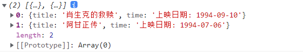

## ES5补充

### 1、严格模式

#### 1.1 作用

1.  消除 JavaScript 语法的一些不合理、不严谨之处，减少一些怪异行为
2.  消除代码运行的一些不安全之处，保证代码运行的安全
3.  为未来新版本的 JavaScript 做好铺垫

#### 1.2 使用

* 在全局或函数的第一条语句定义为: `'use strict'`
* 如果浏览器不支持，只解析为一条简单的语句, 没有任何副作用

#### 1.3 特性

* 不允许使用未声明的变量

* 直接调用时，函数内部的 this 不指向 window，指向**undefined**！

* 创建 eval 作用域

  * eval是一个函数，作用是 可以将字符串按照js的语法进行解析，==千万不用使用==

  * ```js
    eval('var a = 10;console.log(a);');//10
    ```

* 对象不能有重名的属性（Chrome 已经修复了这个 Bug，IE 还会出现）
* 函数不能有重复的形参
* 新增一些保留字, 如: implements interface private protected public

### 2、Object.create

Object.create 方法可以<font color='red'>以指定对象为原型创建新的对象</font>，同时可以为新的对象设置属性, 并对属性进行描述

`Object.create(prototype, [descriptors])`；

参数1：指定原型的对象；

参数2：描述属性；

**属性配置参数:** 

* value : 指定值
* writable : 标识当前属性值是否是可修改的, 默认为 false
* configurable：标识当前属性是否可以被删除 默认为 false
* enumerable：：表示属性是否可以通过`for-in`或者`Object.keys()`返回该属性 
  * 默认为 false(当我们通过属性描述符定义一个属性时)
  * 当我们直接在一个对象上定义某个属性时，这个属性的[[Enumerable]]为true

* get:   当获取当前属性时的回调函数 （不能与value属性同时使用）
* set:   当设置当前属性时(不能与value属性同时使用)

#### 2.1 添加属性

> 使用==类名调用==的方法：**静态方法** 

```js
//声明一个对象
var car = {
    name:'汽车',
    run:function(){
        console.log('i can run');
    }
}
//创建一个新对象 要以 car 作为原型对象，使用类名调用的方法：静态方法
var obj = Object.create(car);//以car为原型，创建obj对象
console.log(obj);//{}
obj.run();//i can run

//给obj添加属性；
var obj = Object.create(car,{
    color:{
        value:'white',
        //可写的
        writable:true,
        configurable:true,
        //可枚举
        enumerable:true
    }
})
```

#### 2.2 遍历

for... in 循环可以**遍历私有的属性和原型上的方法和属性**；

如果想遍历对象私有属性：`对象.hasOwnProperty(属性名)` ;

```js
for(var attr in obj){
    if(obj.hasOwnProperty(attr)){  //如果是私有属性为true ，不是私有属性 false
        console.log(attr);
    }
}
```

#### 2.3 get 和 set

有时需要返回对象的动态属性，或者你可能需要反映内部变量的状态，而不需要使用显式方法调用；可以使用getter；例如：我输入1，返回male，输入0，返回female；动态的返回，就需要用getter；

get : 读取属性时，自动执行

set：设置属性时，自动执行

**注**：getter  和 setter 不能与value 一起使用

```js
 var person = {
     school:'Peking'
 } 
var p1 = Object.create(person,{
     _sex:{
         value:null,
         writable:true
     },
     sex:{
         get:function(){
             return this._sex;
         },
         // set执行时机：改变sex属性值的时候，执行
         set:function(val){
             if(val === 1){
                 this._sex = 'male';
             }else if(val === 0){
                 this._sex = 'female';
             }else{
                 console.log('数据类型错误');
             }
         }
     }
 })
 //需求：输入 1，返回 male，  0 female
 p1.sex = '男';					  //(调用set方法)
 console.log(p1.sex);// 数据类型错误  (调用get方法)
```

解释：**set里不直接用sex**，因为在内部使用sex就会调用set方法，调用set方法就会修改sex属性，形成了死循环；所以要是用标记变量，不会改变


### 3、defineProperties

==Vue源码中会涉及到，记住！！== 

`Object.defineProperties(object, descriptors)` 

直接在一个对象上定义新的属性或修改现有属性，**并返回该对象**。

define 定义 ； Properties 属性

参数1：object       		要操作的对象

参数2：descriptors     属性描述

```js
// 定义对象
var star = {
    firstName: '刘',
    lastName : '德华'
};

// 为 star 定义额外的属性
Object.defineProperties(star, {
    fullName: {
        get: function(){
            return this.firstName + this.lastName;
        },
        set: function(name){
            // 按照 - 将名字拆分成数组
            var res = name.split('-');
            this.firstName = res[0];
            this.lastName = res[1];
        }
    }
});

// 修改 fullName 属性值
star.fullName = '张-学友';

// 打印属性
console.log(star.fullName);
```

### 4、call、apply 和 bind

* call 方法使用一个指定的 this 值和单独给出的一个或多个参数来调用一个函数
* apply 方法调用一个具有给定 this 值的函数，以及作为一个数组（或类似数组对象）提供的参数
* bind 同 call 相似，不过该方法会返回一个新的函数，而不会立即执行


## ES6

### 常见error
-  ReferenceError: a    is    not     defined
    Reference 引用             			声明、定义
-  Duplicate parameter name not allowed in this context
    重复的     参数     名字      允许             上下文
-  Unexpected strict mode reserved word  
   不被期待的  严格   模式   保留        字

- Invalid property descriptor. Cannot both specify accessors and a value or writable attribute
  不合法的  属性      描述器

- Identifier 'a' has already been declared
    标识符             已经    被    声明

- Cannot access 'a' before initialization
    不能   访问      在..前   初始化

### 1、let关键字

#### 特性

let 关键字用来声明变量，使用 let 声明的变量有几个特点：

- 不属于顶层对象window，属于一个代码块；

- 不允许重复声明；
- 是块级作用域（局部变量）；
- 不存在变量提升；(即不允许在变量创建之前使用)
- 不影响作用域链；

#### 案例

```js
for(let i = 0; i < divs.length; i++){
    divs[i].onclick = function(){
    	console.log(i); //0 1 2
	}
}
for(var i = 0; i < divs.length; i++){
    divs[i].onclick = function(){
    	console.log(i); //3 3 3
	}
}
```

解释：使用let声明时，每循环一次就会生成一个块级作用域；


### 2、const关键字

const 关键字用来**声明常量**，const 声明有以下特点：

> 常量：指的是值一般不会被修改的量，用const声明后，值如果被修改了，则会报错；
>
> `Uncaught TypeError: Assignment to constant variable.`
>
> 未捕获的类型错误:对常量变量的赋值								

#### 特性

- 声明必须赋初始值；
- 标识符一般为大写（习惯）；
- 不允许重复声明；
- 值不允许修改；
-  块儿级作用域（局部变量）；
-  ==对象内的属性可以修改==

注：对数组元素的修改和对对象内部的修改是可以的（数组和对象存的是引用地址）；

#### 应用场景：

声明对象类型使用 const，非对象类型声明选择 let；


### 3、变量和对象的解构赋值

ES6 允许按照一定模式，从数组和对象中==**提取值**==，对变量进行赋值，这被称为解构赋值；

```js
       //对象的解构 
		const zhao = {
            name:'赵本山',
            age:'不详',
            xiaopin:function(){
                console.log('我是老头子');
            }
        };
        let {name,age,xiaopin} = zhao;
        console.log(age);//不详
		xiaopin();//我是老头子
		
		//数组的解构 
        const F4 = ["大哥","二哥","三哥","四哥"];
        let [a,b,c,d] = F4;
        console.log(a);//大哥

		function fn(){
		    console.log(123);
		}
		//解构的默认值
		let arr = [];
		let [a=fn()] = arr;
		console.log(a);//undefined (没有返回值)
```

注：

- **对象的解构**赋值时，使用的变量名要和对象的属性一一对应；因为对象是无序数组;
- 解构时可以全部写，也可以写部分变量；
- 解构赋值时，对象要使用{}，数组要使用[]；
- 解构的默认值,默认值惰性，没有值则使用默认的值

#### 应用场景

频繁使用对象方法、数组元素，就可以使用解构赋值形式；


### 4、模板字符串

模板字符串（template string）是增强版的字符串，用反引号（`）标识，

#### 特性

- 字符串中可以出现换行符；
- 可以使用 ${xxx} 形式进行变量拼接；

#### 使用

```js
let str = `我是老大哥`
let str1 = '我是小老弟'
let str3 = `
<ul>
    <li>1</li>
    <li>2</li>
    <li>3</li>
</ul>
`
let a = '小储'
let king = `${a}是最棒的`
console.log(king);//小储是最棒的
```

### 5、简化对象和函数写法

#### 概述

ES6 允许在大括号里面，直接写入变量和函数，作为对象的属性和方法。这样的书写更加简洁；

#### 使用

```js
let name = '孙悟空';
let age = '18';
const SCHOOL = {
    name,   //等价于 name:name
    age,
    improve(){
        console.log('西游记');
    }
};
```

解释：

- 变量和对象的属性名相同时，可以直接简写变量名；
- 当对象的属性值是函数的时候，可以省略属性名后的 ` : ` 和 `function `；
- 箭头函数不可以省略`：`

### 数组扩展

#### 类数组转化成普通数组

> HTMLCollections    => 通过 document.getElementsByTagName() 得到
>
> NodeList				  => 通过  document.querySelectorAll() 得到；
>
> 函数中的arguments

- 通过遍历自身的所有元素，再将数据push到新数组中；
- `Array.prototype.slice.call(类数组)`  Array.prototype就是为了找到.slice方法
  - 简易写法：`[].slice.call(类数组)` 
-  `Array.from()` 
- `[...类数组]` 

#### ES5 中遍历数组的方式

- for

- forEach: 没有返回值，只是针对每一个元素执行回调函数

- map: **返回新的数组**，每个元素为调用回调函数的结果

- filter:返回符合回调条件的 **新数组**

  - ==表达式的值为真，返回当前遍历的元素==

- some: 返回 boolean，判断是否有元素符合func条件

  - 只要有一个符合就是 true
  - 全不符合 是false

- every: 返回 boolean, 判断每一个元素是否符合 func条件

  - 每一个都符合 true
  - 有一个为假就为false

- reduce : 接收一个函数作为累加器

  - 参数1:回调函数；参数2：初始值
  
  - ```js
    let arr = [1, 2, 3, 4, 5, 6, 7, 8, 9, 10];
    let result = arr.reduce(function(prev,cur,index,arr){
        return prev + cur;
    },0)
    console.log(result);//55
    ```

prev 上一次循环的回调函数返回值，第一次就是第二参数指定的初始值
cur: 当前循环的元素
index: 索引
arr: 原始数组

#### 数组的创建补充

用构造函数名调用的都是静态方法

`new Array()`

一个参数：代表数组的长度

多个参数：代表数组的元素；

`Array.of(元素)`   参数为数组的元素

```js
let arr = new Array(3)
console.log(arr);//[undefined,undefined,undefined]

let arr2 = new Array(1,2,3,4);// 数组的元素
console.log(arr2);//[1,2,3,4]

let arr3 = Array.of(1,2,3,4,5)
console.log(arr3);//[1,2,3,4,5]
```

#### 数组的方法补充

`fill(元素,start,end)` 数组填充 

- 参数1：要替换的数；
- 参数2：开始替换的索引
- 参数3：结束替换的索引

`includes`    查找数组是否有当前元素，有true 没有：false

```js
let arr = [1,2,3,4,NaN];
console.log(arr.indexOf(NaN)); // -1 无法检测NaN
console.log(arr.includes(NaN));//true 可以检测NaN
```


### 6、箭头函数

#### 概述

ES6允许使用箭头（=>）定义函数，箭头函数提供了一种更加简洁的函数书写方式，箭头函数多用于匿名函数的定义；

#### 特性

- 箭头函数的this是静态的，始终指向==函数声明==时所在作用域下的==this==的值；
- 不能作为构造实例化对象；
- 不能使用 arguments 变量

```js
	// 1、箭头函数的this是静态的，始终指向函数声明时所在作用域下的this的值

	// 传统函数
	function getName() {
	    console.log( this.name);
	}
	// 箭头函数
	let getName1 = () => console.log(this.name);

	window.name = "小储";
	const school = {
	    name: "大哥",
	}

	// 直接调用
	getName();//小储
	getName1();//小储

	// 使用call调用
	getName.call(school);//大哥
	getName1.call(school);//小储
	// 结论：箭头函数的this是静态的，始终指向函数声明时所在作用域下的this的值

	// 2、不能作为构造实例化对象
	let Persion = (name, age) => {
	    this.name = name;
	    this.age = age;
	}
	// let me = new Persion("小储", 24);
	// console.log(me);
	// 报错：Uncaught TypeError: Persion is not a constructor

	// 3、不能使用 arguments 变量
	// let fn = () => console.log(arguments);
	// fn(1, 2, 3);
	// 报错：Uncaught ReferenceError: arguments is not defined
```

#### 简写

- 如果形参只有一个，则小括号可以省略；

- 函数体如果只有一条语句，则花括号可以省略，有return 也必须省略；函数的返回值为该条语句的执行结果；

```js
        // 传统写法：一个参数
        var hello = function (name) {
            return "hello " + name;
        }
        console.log(hello("小储"));//hello 小储

        // ES6箭头函数：一个参数
        let hi = name =>"hi " + name;
        console.log(hi("小储"));//hi 小储  
```

#### 应用场景

箭头函数适合与 this 无关的回调. 如：定时器, 数组的方法回调，

箭头函数不适合与 this 有关的回调. 事件回调, 对象的方法

### 7、rest参数

ES6 引入 rest 参数，用于获取函数的实参，用来代替 arguments；

#### 语法

```js
function foo(a,b,...args){}
```

#### Rest参数和arguments对象的区别

- rest参数只包括那些没有给出名称的参数，arguments包含所有参数
- arguments 对象不是真正的数组，而rest 参数是数组实例，可以直接应用sort, map, forEach, pop等方法

#### 注意

- ES6的rest参数...args，rest参数必须放在最后面

```js
        function foo(a,b,...args){
            console.log(a);//1
            console.log(b);//2
            console.log(args);//[3, 4, 5, 6]
        }
        foo(1,2,3,4,5,6)
```

- ES6 允许给函数参数赋值初始值
  - 参数直接设置默认值  具有默认值的参数, 位置一般要靠后(潜规则)
  - 与解构赋值结合使用  解构赋值的形式先后顺序**不影响** 

```js
function fn(a,b,d,e,c=99){
    console.log(a,b,c);//1,2,5
}
fn(1,2,3,4,5);

function connect({host='localhost',port=80,headers,body,method}
    console.log(host,port,method,headers,body);
}
connect({
    host:'127.0.0.1',
    port:8080,
    body:'123123',
    headers:'cookie',
    method:'POST'
});
```


### 8、扩展运算符

`...数组` 扩展运算符能将==数组、对象==转换为逗号分隔的==参数序列==；

#### 语法

```js
const arr = ['易烊千玺', '王源', '王俊凯'];
// 声明一个函数：
function foo() {
    console.log(arguments);//'易烊千玺', '王源', '王俊凯'
}
foo(...arr);
//声明一个对象
let obj1 = {
    q:'金钟罩',
    w:'闪现',
    a:'冰雹啸'
}
let obj2 = {
    a:'惩戒',//同名属性会发生覆盖，谁在后面谁生效
    j:'催筋断骨'
}
let obj3 = {...obj1,...obj2};
console.log(obj3);//{q: '金钟罩', w: '闪现', a: '惩戒', j: '催筋断骨'}
```


#### 扩展运算符和rest的区别

rest：放在形参中，保存多余的实参

扩展运算符：放在函数的实参中

数组的.join() 方法，是将数组转化为以特定方式连接的字符串；

#### 应用

##### 数组的合并

```js
// 两个数组合并到一个数组
let arr1 = [1,2,3];
let arr2 = [4,5,6];
//ES6方式
let arr3 = [...arr1,...arr2];
console.log(arr3);
//ES5方式
const newArr = arr1.concat(arr2)
console.log(newArr);//[1, 2, 3, 4, 5, 6, 7, 8]

// 在原数组上合并
// ES6方式
arr1.push(...arr2);
// ES5方式
Array.prototype.push.apply(arr1,arr2);
```


##### 数组的克隆

```js
// 2、数组的克隆,克隆出来的数组和元素组没有关系
//修改新数组里的值，原数组不受影响；
const arr1 = [1,2,3,4];
const newArr = [...arr1,...arr1]
console.log(newArr);//[1, 2, 3, 4, 1, 2, 3, 4]

//数组.fill();传入数组是将数组当成一个元素传入的
const arr2 = new Array(2);
arr2.fill(arr1);
console.log(arr2);//[[1,2,3,4],[1,2,3,4]]
```

##### 将伪数组转为真正的数组

类数组：Node.childNodes；document.querySelectorAll()返回的都是*NodeList*实例对象。

```js
// 3、将伪数组转为真正的数组
const divs = document.querySelectorAll('div');
console.log(divs);//NodeList:伪数组
const divArr = [...divs];
console.log(divArr); 
```

运行结果：


### 9、Symbol

ES6 引入了一种新的原始数据类型 Symbol，表示独一无二的值。它是JavaScript 语言的第七种数据类 型，是一种类似于字符串的数据类型；

#### 特点

- Symbol 的值是唯一的，用来解决命名冲突的问题；
- Symbol 值==不能与其他数据进行运算==
- Symbol 定义的对象属性不能使用for…in循环遍历 ，但是可以使用Reflect.ownKeys 来获取对象的 所有键名；

**注:  Symbol类型唯一合理的用法是用变量存储 symbol的值，然后使用存储的值创建对象属性**

#### 创建

`Symbol()` 

```js
//创建Symbol 
let s = Symbol();
console.log(s,typeof s);//Symbol() symbol

//添加标识的 Symbol
let s2 = Symbol('小储');
let s3 = Symbol('小储');
console.log(s2 === s3);//false
```

`Symbol.for()` ：==全局标识缓存创建==，如果全局里有，则直接返回地址，不会再新创建

```js
// 全局缓存举例
let s4 = Symbol.for('小储');
let s5 = Symbol.for('小储');
console.log(s4 === s5);//true
```

**Symbol 不能进行运算**

```js
console.log(s1 + '5');
//TypeError: Cannot convert a Symbol value to a string
```


#### Symbol创建对象属性

原因：我们要往对象里面添加方法，但是怕对象里已经存在同名方法，所以我们这时使用到了Symbol，创建一个独一无二的；

**方法一：**新声明一个对象，自己写的肯定不会有重名的

```js
let game = {
    name:'俄罗斯方块',
    up:function(){},
    down:function(){}
}
// 向对象中添加方法 up
let method = {
    up:Symbol('up')
};
game[method.up] = function(){
    console.log('我可以改变形状');
};
game[method.up]()//我可以改变形状
//遍历获得键名
console.log(Reflect.ownKeys(game));//['name', 'up', 'down', Symbol(up)]
```

**方法二：**直接在对象里添加，用[]；因为Symbol是动态的变量；

```js
//需要先定义，才可以调用；
let say = Symbol('say')
let game1 = {
    name:'狼人杀',
    [say](){
        console.log('说话');
    },
    [Symbol('boom')](){
        console.log('自爆');
    }
};
game1[say]()
```


#### Symbol内置值(了解)

除了定义自己使用的 Symbol 值以外，ES6 还提供了11个内置的Symbol值，指向语言内部使用的方法。

- 以下为魔术方法函数
- 自动执行的场景
- 作用是扩展对象的功能（相当于是被动技能）

```js
let obj = {
    [Symbol.split]:function(){
        console.log('我运行了!');
    }
}
let str = 'atguigu';
str.split(obj);// 对象中的 Symbol.split方法会被执行。
```

| 内置Symbol的值            | 调用时机                                                     |
| ------------------------- | ------------------------------------------------------------ |
| Symbol.hasInstance        | 当其他对象使用instanceof运算符，判断是否为该对象的实例时，会调用这个方法 |
| Symbol.isConcatSpreadable | 对象的Symbol.isConcatSpreadable属性等于的是一个布尔值，表示该对象用于Array.prototype.concat()时，是否可以展开。 |
| Symbol.unscopables        | 该对象指定了使用with关键字时，哪些属性会被with环境排除。     |
| Symbol.match              | 当执行str.match(myObject) 时，如果该属性存在，会调用它，返回该方法的返回值。 |
| Symbol.replace            | 当该对象被str.replace(myObject)方法调用时，会返回该方法的返回值。 |
| Symbol.search             | 当该对象被str. search (myObject)方法调用时，会返回该方法的返回值。 |
| Symbol.split              | 当该对象被str. split (myObject)方法调用时，会返回该方法的返回值。 |
| `Symbol.iterator`         | 对象进行for...of循环时，会调用Symbol.iterator方法，返回该对象的默认遍历器 |
| Symbol.toPrimitive        | 该对象被转为原始类型的值时，会调用这个方法，返回该对象对应的原始类型值。 |
| Symbol. toStringTag       | 在该对象上面调用toString方法时，返回该方法的返回值           |
| Symbol.species            | 创建衍生对象时，会使用该属性                                 |


### 10、迭代器

遍历器（Iterator）就是一种机制。它是一种接口，为各种不同的数据结构提供统一的访问机制。任何数 据结构只要部署 Iterator 接口，就可以完成遍历操作；

#### 特性

ES6 创造了一种新的遍历命令 for...of 循环，Iterator 接口主要供 for...of 消费；

原生具备 iterator 接口的数据(可用 for of 遍历)：

- Array;
- Arguments;
- Set;
- Map;
- String;
- TypedArray;
- NodeList;

#### 工作原理

1. 创建一个指针**对象**，指向当前数据结构的起始位置；
2. 第一次调用对象的 next 方法，指针自动指向数据结构的第一个成员；
3. 接下来不断调用 next 方法，指针一直往后移动，直到指向最后一个成员；
4.  每调用 next 方法返回一个包含 value 和 done 属性的对象；(最后一个返回` value:undefined,done:true` )

> 注：==需要自定义遍历数据的时候，要想到迭代器==；

#### 可迭代协议

**可迭代协议**： `Symbol.iterator` 必须有这个属性，才能用for... of遍历；

**迭代器协议**：

- 必须返回一个对象
- 返回的对象要有next方法
- next方法也要返回一个对象，并且有value 和 done两个属性

```js
return {
    next(){
        return {
            value:xxx,
            done:boolean // true 结束遍历
        }
    }
}
```


**代码实例** 

```js
// 声明一个数组
const xiyou = ['唐僧', '孙悟空', '猪八戒', '沙僧'];
// 使用for...of 遍历数组
for (let v of xiyou){
    console.log(v);
}
// 数组原生具备Symbol.iterator方法
let iterator = xiyou[Symbol.iterator]();
// 调用对象的next方法
console.log(iterator.next());
console.log(iterator.next());
console.log(iterator.next());
console.log(iterator.next());
console.log(iterator.next());
```

运行结果：


#### 迭代器自定义遍历对象

```js
const obj = {
    name: '班级',
    menubars: [
        '孙悟空',
        '猪八戒',
        '唐僧',
        '沙僧'
    ],
    // 添加[Symbol.iterator方法
    [Symbol.iterator]() {
		let index = 0;
 		let done = false;
 		return {
     		next: () => {
                //this指向obj；
         		let value = this.menubars[index];
         		done = index >= this.menubars.length;
         		index++;
         		return {value, done}
    		 }
 		}
    }
}
// 遍历对象，得到'孙悟空'，'猪八戒'， '唐僧'，'沙僧'
for (let v of obj) {
    console.log(v);
}

//不符合面向对象的思想
//obj.menubars.forEach(item => console.log(item))
```

### 11、生成器

生成器函数是 ES6 提供的一种**==异步编程解决方案==**，语法行为与传统函数完全不同；其本质是一种特殊的函数；

#### 11.1 基本使用

和普通函数的区别：

- 声明时需要在function 和 函数名之间 加 * ；

- 调用时，需要借助next() 方法，直接输出不显示；每调用一次next，输出一次结果；

- `yield` :在生成器函数中代码的分隔符； 用next调用时不显示；

```js
    <script>
        function* gen() {
            console.log(111);
            yield 'ooooooo';
            console.log(222);
            yield 'ppppp'
            console.log(333);
            yield 'qqqqqqq';
            console.log(444);
        }
        let iterator = gen();
        console.log(iterator.next());
        console.log(iterator.next());
        console.log(iterator.next());
        console.log(iterator.next());

        console.log('直接调===================');
        // iterator.next();
        // iterator.next();
        // iterator.next();
        // iterator.next();

        console.log('遍历=====================');
        // 遍历
        for (const v of gen()) {
            console.log(v);
        }
    </script>
```

运行结果：


#### 11.2 生成器函数的参数传递

生成器函数整体是可以传参的；

==next()方法是可以传入参数的，传入的参数作为上一条语句yield的返回结果==

```js
<script>
    function* gen(arg) {
        console.log(arg);
        let one = yield 111;
        console.log(one);
        let two = yield 222;
        console.log(two);
        let three = yield 333;
        console.log(three);
    }
    let iterator = gen("AAA");
    console.log(iterator.next());//生成器函数传参；
    // next()方法是可以传入参数的，传入的参数作为上一条语句yield的返回结果
    console.log(iterator.next("BBB")); // 会执行yield 111;
    console.log(iterator.next("CCC")); // 会执行yield 222;
    console.log(iterator.next('DDD'));  // 会执行yield 333;
</script>
```


### 12、Promise

#### 12.1 概述

Promise 是 ES6 引入的异步编程的新解决方案。语法上 Promise 是一个构造函数，用来封装异步操作 并可以获取其成功或失败的结果；

Promise在使用过程中，我们可以将它划分为**三个状态**：

- 待定（`pending`）: 初始状态，既没有被兑现，也没有被拒绝
  - 当执行executor(回调函数)中的代码时，处于该状态；
- 已兑现（`fulfilled`）: 意味着操作成功完成；
  - 执行了resolve时，处于该状态
- 已拒绝（`rejected`）: 意味着操作失败
  - 执行了reject时，处于该状态；


#### 12.2 基本使用

实例化 Promise 对象，我们需要传入一个回调函数，我们称之为executor，

这个回调函数会被立即执行，并且给传入另外两个回调函数resolve、reject

值1：resolve  (这个参数是一个函数)

值2：reject   (这个参数是一个函数)

调用`resolve` ,会将promise的状态改为成功，通过传递参数改变成功的值；

`reject`,会将promise的状态改为失败，通过传递参数改变失败的值

修改完promise的状态后，就可以调用 Promise 对象的then方法，两个参数为函数，习惯写为`value` 和 `reason` 

promise的状态为==成功==时，会调用实例化对象的`then`方法，参数为==value==的函数；

promise的状态为==失败==时，会调用实例化对象的`then`方法，参数为==reason==的函数；

```js
//实例化 Promise 对象，接受一个函数类型的参数，
const p = new Promise(function(resolve,reject){
    setTimeout(function () {
        // let data = '数据'
        // resolve(data);
        let err = '失败了'
        reject(err);
    },1000)
})
// 调用 Promise 对象的then方法，两个参数为函数
p.then(function(value){
    console.log(value);
},function(reason){
    console.log(reason);
})
```

#### 12.3 promise.prototpe.then

调用then方法，then方法的返回结果是promise对象，对象的状态由回调函数的结果决定;

- 如果回调函数中返回的结果是 **非promise** 类型的数据，状态为**成功**，返回值为对象的成功值 (回调函数没有返回值时，状态也是成功)
- 如果回调函数中返回的结果是**promise类型**的数据，此Promise对象的状态决定上面Promise对象p的状态
- 抛出错误；状态为失败；

**代码及运行结果：** 

```js
<script>
    const p = new Promise((resolve,reject)=> {
        setTimeout(() => {
            resolve('用户数据')
            // reject('出错了~')
        }, 1000);
    })
    const result = p.then(value =>{
        console.log(value);
        return 123;
    },reason=>{
        console.warn(reason);
    })
    console.log(result);
</script>
```

运行结果：


```js
<script>
    const p = new Promise((resolve,reject)=> {
        setTimeout(() => {
            resolve('用户数据')
            // reject('出错了~')
        }, 1000);
    })
    const result = p.then(value =>{
        console.log(value);
        return new Promise((resolve,reject)=>{
        resolve('ok');
        });
    },reason=>{
        console.warn(reason);
    })
    console.log(result);
</script>
```

运行结果：


```js
<script>
    const p = new Promise((resolve,reject)=> {
        setTimeout(() => {
            resolve('用户数据')
            // reject('出错了~')
        }, 1000);
    })
    const result = p.then(value =>{
        console.log(value);
        throw new Error('失败啦~')
    },reason=>{
        console.warn(reason);
    })
    console.log(result);
</script>
```

运行结果：


#### 12.4 catch方法

每次调用我们都可以传入对应的reject回调；当Promise的状态变成reject的时候，这些回调函数都会被执行

catch(),可传入一个参数，

##### 12.4.1 catch方法的返回值

- catch方法也是会返回一个Promise对象的，所以catch方法后面我们可以继续调用then方法或者catch方法；
- 如果我们希望后续继续执行catch，那么需要抛出一个异常：

```js
let p = new Promise((resolve,reject)=>{
    setTimeout(() => {
        reject('失败了');
    }, 1000);
})
// p.then(value=>{
//     console.log('成功');
// },reason=>{
//     console.log(reason);
// })
// p.catch(reason=>{
//     console.warn(reason)
// })
p.catch(err => {
    console.log('err1',err);
}).catch(err => {
    console.log('err2',err);
}).then(res => {
    console.log('1111');
})
```

运行结果：


```js
p.catch(err => {
    console.log('err1',err);
    throw new Error('出错啦')
}).then(res => {
    console.log('1111');
}).catch(err => {
    console.log('err2',err);
})
//catch 和then调换顺序的话，then仍旧会执行，
```

运行结果：


### 13、set

#### 13.1 概述

ES6 提供了新的数据结构 Set（集合）。它类似于数组，但成员的值都是==无序的、唯一的==，集合实现了 iterator 接口，所以可以使用『扩展运算符』和『for…of…』进行遍历，

注：**Set中存放的元素不会重复，所以可实现自动去重**；(因为是无序的，所以想找到某个元素，集合就不可能有重复的)

#### 13.2 使用方法

创建Set我们需要通过**Set构造函数**（暂时没有字面量创建的方式）

传入的参数：可迭代数据，一般为数组；

**集合的属性和方法**：


```js
let s = new Set([1,2,3,2]);
console.log(s);
```

- add 添加元素,支持链式操作

```js
s.add('chu');
s.add('laozhou').add('zhangsan');
```

- delete 删除

```js
s.delete(2);
```

- clear 清空

```js
s.clear()
```

- size 返回元素个数

```js
s.size
```

- has 检查集合中是否包含某个元素，返回boolean

```js
s.has(2);
```

- set 的遍历

```js
// forEach
s.forEach(item=>{
    console.log(item);
})
// for of
for(let item of s){
    console.log(item);
}
for(let key of s.keys()){
    console.log(key)
}
for(let value of s.values()){
    console.log(value)
}
for(let item of s.entries()){
    console.log(item[0],item[1]);
}.
//Object.entries()方法返回一个给定对象自身可枚举属性的键值对数组，其排列与使用 for...in 循环遍历该对象时返回的顺序一致（区别在于 for-in 循环还会枚举原型链中的属性）。
```

#### 13.3 应用

将set 转化为数组

- `[...new Set(arr)]`
- `Array.from(new Set(arr));` 

将数组转成 Set

`new Set(数组)` 

```js
<script>
    let arr = [1, 2, 3, 4, 5, 4, 3, 2, 1];
    // 数组去重
	//... 为扩展运算符，将数组转化为逗号分隔的序列,外面添加[]，变为数组
    let s1 = [...new Set(arr)]
    console.log(s1);
    // 交集
    let arr2 = [3, 4, 5, 6, 5, 4, 3];
    let result = [...new Set(arr)].filter(item => new Set(arr2).has(item))
    console.log(result);
    // 并集
    let union = [...new Set([...arr,...arr2])]
    console.log(union);
    // arr 和 arr2 的差集
    let result1 = [...new Set(arr)].filter(item => !(new Set(arr2).has(item)))
    console.log(result1);
</script>
```

运行结果：


#### 13.4 set和数组的区别

- Api不同

- Set元素不能重复

- Set是无序结构，操作很快

  - ```js
    console.time('arr unshift');
    arr.unshift(0);
    console.timeEnd('arr unshift');
    ```

    

### 14、map

#### 14.1 概述

> ES6 提供了 Map 数据结构，用于存储映射关系。它类似于对象，也是键值对的集合。但是“键”的范围**不限于字符串**，各种类型的值（包括对象）都可以当作键。Map 也实现了iterator 接口，所以可以使用『扩展运算符』和 『for…of…』进行遍历；

一个 Map 对象在迭代时会根据对象中元素的插入顺序来进行； for...of 循环在每次迭代后会返回一个形式为 [key，value] 的数组

**使用构造函数创建** 

#### 14.2 map的常用方法

- Map常见的属性
  - size：返回Map中元素的个数
- Map常见的方法
  - set(key, value)：在Map中添加key、value，并且返回整个Map对象
  - get(key)：根据key获取Map中的value
  - has(key)：判断是否包括某一个key，返回Boolean类型；
  - delete(key)：根据key删除一个键值对，返回Boolean类型
  - clear()：清空所有的元素
  - forEach(callback, [, thisArg])：通过forEach遍历Map
- Map也可以通过for of进行遍历 (同set的遍历)

代码实现

```js
<script>
    // 创建一个空map
    let m = new Map();
    // set 增加一个新元素，返回当前 Map；
    m.set('name','刚果红');
    m.set('change',function () {
        console.log('我们是好朋友~');
    });
    let key = {
        address:'家'
    };
    m.set(key,['北京','上海']);
    console.log(m);
    // size 返回 Map 的元素个数
    console.log(m.size);
    // get 返回键名对象的键值
    console.log(m.get('name'));
    // has 检测 Map 中是否包含某个元素，返回 boolean 值
    console.log(m.has(key));
    // delete 用于删除某元素
    m.delete(key);
    console.log(m);
    // clear 清除
    m.clear()
    console.log(m);
</script>
```

运行结果：


#### 14.3 Map 和 对象的区别

- Map可以以任意类型为key,普通对象只能以字符串为属性名，不是字符串的会调用toString()方法将其转为字符串；
- ==Map是有序结构==（重要），**普通对象是无序**的； 

- Map操作同样很快

```js
// 任意类型为key
let m1 = new Map();
let obj = {name:'yuonly'}
m1.set(obj,'object key');
console.log(m1);

// 想让两个对象关联
obj1 obj2
obj1.xxx = obj2 // 这样做存在引用关系，不好
// 使用map
m.set(obj1,obj2); // 关联但又没有引用关系
m.get(obj1)// 获取 obj2  

// Object 无序
let obj1 = {3:30,4:40,1:10, 2:20};
obj1.keys();// 1,2,3,4  不管怎么调换，顺序都是一样的，object是无序的

// Map 是有序的
let m = new Map([
    ['key1','value1'],
    ['key3','value3'],
    ['key2','value2']
])
m.forEach((value,key)=>{
    console.log(value,key)
})//遍历的结果和写入的顺序有关；
```


### 15、class类

#### 概述

ES6 提供了更接近传统语言的写法，引入了 Class（类）这个概念，作为对象的模板。通过 class 关键 字，可以定义类。基本上，ES6 的 class 可以看作只是一个语法糖，它的绝大部分功能，ES5 都可以做 到，新的 class 写法只是让对象原型的写法更加清晰、更像面向对象编程的语法而已；

#### 知识点

- class 声明类；
- constructor 定义构造函数初始化
-  extends 继承父类
- super 调用父级构造方法
- static 定义静态方法和属性
- 父类方法可以重写

#### class类的写法：

```js
class Phone{
    constructor(brand,price){
        this.brand = brand
        this.price = price
    }
    // 添加方法,必须使用简写形式，不可以写成call:function(){}
    call(){
        console.log('我可以打电话');
    }
};
let HuaWei = new Phone('华为','5000');
HuaWei.call()
console.log(HuaWei);
```


#### class静态成员

实例对象的属性和函数对象的属性不相通，这种属性我们称之为静态成员；

静态属性属于类，用`static`修饰 

```js
class Phone {
    static name = '手机';
    static change() {
        console.log('我可以改变世界');
    }
}
let nokia = new Phone();
console.log(nokia.name);//undefined
console.log(Phone.name);//手机
Phone.change();//我可以改变世界
```

#### ES6继承

`extends` -- 继承父类

`super` --- 调用父类构造函数，不可以直接用来调用父类的方法；==必须使用在this之前==；如果不添加constructor，则可以不使用super也能调用父类的方法；

代码实现

```js
<script>
    class Phone {
        //构造函数
        constructor(brand, price) {
            this.brand = brand;
            this.price = price;
        }
        //添加方法
        call() {
            console.log('我可以打电话');
        }
        //添加静态方法
        static test(){
            console.log('test')
        }
    }
	//extends 继承
    class SmartPhone extends Phone {
        constructor(brand, price, color, size) {
            //super 调用父类构造函数
            super(brand, price);//等价于Phone.call(this,brand,price)
            this.color = color;
            this.size = size;
        }
        // 子类自己的方法
        photo() {
            console.log('我可以拍照');
        }
        game() {
            console.log('我可以打游戏');
        }
    }
    const xiaomi = new SmartPhone("小米", 1999, "黑色", "5.15inch")
    console.log(xiaomi);
    xiaomi.call()
    xiaomi.photo()
    xiaomi.game()
	SmartPhone.test()
</script>
```

#### 子类对父类方法重写

在子类中声明一个和父类相同的方法，就会对父类的方法进行覆盖，从而达到重写的目的；

注意：子类是无法调用父类的同名方法的；

#### class中的get和set设置

属性被读取时，get会执行

属性被修改是，set会执行,**set后面的函数必须要传入参数** 

```js
<script>
    class Phone{
        get price(){
            console.log('价格属性被读取了');
            return 111
        }
        set price(value){
            console.log('价格属性被修改了！');
        }
    }
    // 实例化对象
    let s = new Phone()
    console.log(s.price);
    s.price = 2999
</script>
```

运行结果：


应用场景：

==**get**== ：可以对对象的动态属性进行封装；数据是动态的，例如求和，平均数等，就可以封装一个函数，将计算结果返回；

==**set**== ：可以用来判断修改的属性是否合法，

### 16、数值扩展

#### 16.1 Number.EPSILON

Number.EPSILON 是 JavaScript 表示的最小精度；

EPSILON 属性的值接近于 2.2204460492503130808472633361816E-16；

应用场景：比较大小；如果两者之差的结果小于EPSILON ，则认为两者相等；

```js
定义函数：
function equal(a, b){
return Math.abs(a-b) < Number.EPSILON;
}
console.log(0.1 + 0.2);//0.300000000004
console.log(0.1 + 0.2 === 0.3); // false
console.log(equal(0.1 + 0.2, 0.3)); // true
```

#### 16.2 二进制和八进制

ES6 提供了二进制和八进制数值的新的写法，分别用前缀 0b 和 0o 表示；十六进制的前缀为0x;

#### 16.3 Number.isFinite()

Number.isFinite() 用来检查一个数值是否为有限的；

返回值：true  和  false;

#### 16.4 Number.isNaN()

Number.isNaN() 用来检查一个值是否为 NaN;此方法在es5中是单独存在的，在es6中作为了Number的一个方法；

返回值：true  和  false;

#### 16.5 Number.parseInt()与 Number.parseFloat()

ES6 将全局方法 parseInt 和 parseFloat，移植到 Number 对象上面，使用不变

#### 16.6 Math.trunc()

用于去除一个数的小数部分，返回整数部分

#### 16.7 Number.isInteger()

Number.isInteger() 用来判断一个数值是否为整数；

返回值：true  和  false;


### 17、对象的扩展

#### 17.1 Object.is()

Object.is 比较两个值是否严格相等，与『===』行为基本一致

与 === 的区别：

```js
console.log(Object.is(NaN, NaN)); //true
console.log(NaN === NaN);  //false
```

#### 17.2 Object.assign()

`Object.assign(target, ...sources)` 

参数1：目标对象，接收源对象属性的对象，也是修改后的返回值。

参数2：源对象，包含将被合并的属性

**注**：属性相同后面的会覆盖前面的

#### 17.3 对象的遍历

- for in

```js
for(let key in obj){
    console.log(key,obj[key])
}
```

- `Object.keys(obj)`   ==> **返回的是数组** 

```js
Object.keys(obj).forEach(key=>{
    console.log(key,obj[key])
})
```

- Object.getOwnPropertyNames(obj)

```js
Object.getOwnPropertyNames(obj).forEach(name=>{
    console.log(name, obj[name])
})
```

- Reflect.ownKeys(obj)

```js
Reflect.ownKeys(obj).forEach(key=>{
    console.log(key,obj[key])
})
```


#### 17.4 深拷贝与浅拷贝

> 拷贝就是复制
>
> 浅拷贝：复制新对象和原对象互相影响，(==属性值有嵌套时，修改复制后的值会影响原数据==)；
>
> 深拷贝：复制的新对象和原对象是绝对独立，不互相影响

- 浅拷贝

```js
let obj = {
    name:'coder',
    address:{
        city:'LF',
        street:'xh'
    }
}
let target = {}
let result = Object.assign(target,obj)
// 修改复制后的对象的属性
result.name = 'coderCR'
result.address.city = 'bj'
console.log('result',result,'obj',obj,);
```

运行结果：


- 深拷贝

```js
// 方式1： 
//步骤：1、先将对象转化为JSON字符串 ==>JSON.stringify
	// 2、再将JSON字符串转化为对象 ==>JSON.parse 
// 存在的问题：函数不能被复制

// 方式2
function deepClone(obj) {
    if (typeof obj !== 'object' && obj !== null) {
        // 进入这个if说明obj是值引用类型的数据或者函数，直接
        return obj;
    };
    // 代码执行到此处，说明obj是对象或者是数组
    let result = obj instanceof Array ? [] : {};
    // 无论数组还是对象都支持for in 循环
    for (let key in obj) {
        result[key] = deepClone(obj[key])//递归调用
    }
    return result;
}
```


#### 17.5 设置原型

设置原型 和 读取原型 ；

`setPrototypeOf()` 和 `getPrototypeOf() ` 

`setPrototypeOf()` 的使用方法

第一个参数：要设置原型的对象；

第二个参数：新设置的原型对象；

> 注：
>
> 不建议这么做！！！建议使用`Object.create()` 方法创建一个新对象，使用现有的对象来提供新创建的对象的 `__proto__ ` 


### 18、模块化

#### 概念

模块化是指将一个大的程序文件，拆分成许多小的文件，然后将小文件组合起来

#### 优点

- 防止命名冲突；
- 代码复用
- 高维护性

#### 模块化规范产品

ES5之前的模块化规范有：

CommonJS => NodeJS、Browserify；（nodejs使用的规范是CommonJS）

AMD => requireJS；

CMD => seaJS

#### ES6 模块化语法

模块功能主要由两个命令构成：export 和 import

- export 命令用于规定模块的对外接口（导出模块）
- import 命令用于输入其他模块提供的功能（导入模块）

#### ES6暴露数据语法汇总

- **逐个暴露**；在每个需要暴露的语句前面添加`export`

```js
export let school = '家里蹲'
export function teach() {
    console.log('我们可以开心的玩耍');
}
```

- **统一暴露**；在最下面添加`export{需要暴露的对象}`

```js
let school = '尚硅谷'
function findJob() {
    console.log('我们可以帮你找到工作');
}
export {school,findJob}
```

- **默认暴露**；使用`export default{}`

```js
export default {
    school:'尚硅谷',
    change(){
        console.log('我么可以帮你改变');
    }
}
```

引用和使用模块

```js
<script type="module">
    // 引入m1.js模块内容
    import * as m1 from './m1.js'
    console.log(m1);
    console.log(m1.school);
    m1.teach()
    // 引入m2.js模块
    import * as m2 from './m2.js'
    console.log(m2);
    console.log(m2.school);
    // 引入m3.js模块
    import * as m3 from './m3.js'
    console.log(m3);
    m3.default.change()
</script>
```

注意：

script标签的**type**类型，需要修改为**==module==**;

路径==必须==以`./` `../` `/` 开头；

调用默认暴露的属性或者方法时，要添加default；

#### ES6导入模块语法汇总

- 通用方法，`import * as 别名 from '路径'`

```js
import * as m1 from './m1.js'
```

- 解构赋值形式，`import {要暴露的名称} from '路径' `

```js
import { school, findJob } from './m2.js'
console.log(school);
findJob()
import { school as one, findJob } from './m2.js'
```

注：当要暴露的对象重名时，可使用别名,

​		可直接使用暴露的变量；

- 简便形式，只支持默认暴露；`import 别名 from '路径' `

```js
import one from './m3.js'
console.log(one);
one.change()
```

注：简便形式调用方法时，不需要添加default；

#### 使用模块化的另一种方式

将所有**暴露的接口**整合到一个文件app.js，然后通过script的src属性引入，并且将type类型改为module；

**引入**

```js
 <script src="./app.js" type="module"></script>
```

**app.js**

```js
import * as m1 from "./m1.js"
import * as m2 from "./m2.js"
import * as m3 from "./m3.js"

console.log(m1);
console.log(m2);
console.log(m3);
```


包管理工具


## ES7

### 1、includes

判断数组中是否包含某元素

语法：`arr.includes(元素值)；`

返回值：布尔值；

```js
let arr = [1,2,3,4,5]
console.log(arr.includes(1));//true;
```

注：与indexOf的区别，返回的是对应的索引值，没有则返回的是-1；

### 2、指数操作符

在 ES7 中引入指数运算符「**」，用来实现幂运算，功能与 Math.pow 结果相同；

```js
<script>
    console.log(Math.pow(2,10));//1024
    console.log(2 ** 10);//1024
</script>
```

## ES8

### 1、async函数

#### 1.1 概述

- async关键字用于声明一个异步函数
  - async是asynchronous单词的缩写，异步、非同步
  - sync是synchronous单词的缩写，同步、同时；

async 和 await 两种语法结合可以让异步代码看起来像同步代码一样

#### 1.2 返回值

- async函数的返回值为promise对象
- 返回的结果不是promise类型的对象，返回的结果就是成功的Promise对象
- 如果抛出错误，返回的结果是一个失败的Promise
- 如果返回的结果是一个Promise类型对象，则该Promise的状态决定async函数的返回状态

代码实现

```js
<script>
    async function fn() {
        // 返回非promise对象
        // return 111;
        // throw new Error('出错啦')
        return new Promise((resolve, reject) => {
            reject('出错啦~')
        })
    }
    let result = fn()
    result.then(value => {
        console.log(value);
    }, reason => {
        console.warn(result);
    })
    console.log(result);
</script>
```

运行结果：


### 2、await表达式

#### 2.1 概述

- await 必须写在 async 函数中
- await ==右侧的表达式为 promise 对象==
- await会等到Promise的状态变成==fulfilled状态==，之后继续执行异步函数
- await后面的表达式，返回的Promise是reject的状态，那么会将这个reject结果直接作为函数的Promise的 reject值
- await 的 promise 失败了, 就会抛出异常, 需要通过 try...catch 捕获处理

代码实现

```js
<script>
    const p = new Promise((resolve, reject) => {
        reject('出错啦');
    })
    async function main() {
        try {
            let result = await p;
            console.log(result);
        } catch (e) {
            console.warn(e);
        }
    }
    // 调用函数
    main();
</script>
```

运行结果：


#### 2.2 案例

async 和 await 结合发送ajax请求

代码实现

```js
<script>
        // http://www.tianqiapi.com/api?version=v9&appid=23035354&appsecret=8YvlPNrz
        function sendAJAX(url) {
            return new Promise((resolve,reject)=>{
                // 创建对象
                const xhr = new XMLHttpRequest();
                // 初始化
                xhr.open('GET',url);
                // 发送
                xhr.send()
                // 绑定事件
                xhr.onreadystatechange = function () {
                    if(xhr.readyState ===4){
                        if(xhr.status >= 200 && xhr.status <300){
                            // 发送成功
                            resolve(xhr.response);
                        }else {
                            reject(xhr.status)
                        }
                    }
                }
            })
        }

        // 使用promise 的then方法
        // let result = sendAJAX('http://www.tianqiapi.com/api?version=v9&appid=23035354&appsecret=8YvlPNrz');
        // result.then(value=>{
        //     console.log(value);
        // },reason=>{
        //     console.warn(reason);
        // })

        //使用async 和 await 
        async function main() {
            // sendAJAX()的返回值是promise，用await接收
            let result = await sendAJAX("http://www.tianqiapi.com/api?version=v9&appid=23035354&appsecret=8YvlPNrz")
            console.log(result);
        } 
        main()
</script>
```

运行结果：


### 3、对象方法扩展

#### 3.1 Object.values()

Object.values()方法：获取所有的value值，存放在==数组==中

#### 3.2 Object.entries()

Object.entries()方法：可以获取到一个==数组==，数组中会存放可枚举属性的键值对数组

#### 3.3 Object.getOwnPropertyDescriptors()

Object.getOwnPropertyDescriptors()该方法：返回指定对象所有自身属性的描述对象

> 注：该方法最后一位是s！！！否则是undefined

#### 3.4 String Padding

某些字符串我们需要对其进行前后的填充，来实现某种格式化效果，ES8中增加了 `padStart` 和 `padEnd` 方法，分 别是对字符串的首尾进行填充的

应用场景：比如需要对身份证、银行卡的前面位数进行隐藏


代码实现

```js
 const obj = {
     name: '刚果红',
     age: 18,
     height: 1.88
 }
 // 获取所有的键名
 console.log(Object.keys(obj));
 // 获取所有的键值
 console.log(Object.values(obj));
 // 获取可枚举属性的键值对数组
 console.log(Object.entries(obj));
 // 可用来创建map
 const map = new Map(Object.entries(obj))
 console.log(map);
 console.log(map.get('name'));
 // 对象属性的描述对象
 console.log(Object.getOwnPropertyDescriptors(obj));

// 字符串填充
const cardNum = '123456789876543210'
const lastFourNum = cardNum.slice(-4);
const finalCardNum = lastFourNum.padStart(cardNum.length,'*')
console.log(finalCardNum);
```

运行结果：


## ES9

### 1、正则扩展

#### 1.1 命名捕获分组

ES9 允许命名捕获组使用符号『?』,这样获取捕获结果可读性更强

```js
<script>
    //之前的写法
    let str = '<a href="http://www.baidu.com">百度</a>'
    // 需求：提取url和标签内文本 
    //. 匹配任意单个字符 ；* 匹配尽可能多的字符
    const reg = /<a href="(.*)">(.*)<\/a>/;
    // 执行
    const result = reg.exec(str)
    console.log(result);

    // 命名捕获分组 写法
    const reg1 = /<a href="(?<url>.*)">(?<text>.*)<\/a>/;
    const result1 = reg1.exec(str);
    console.log(result1);
    console.log(result1.groups.url);
    console.log(result1.groups.text);
</script>
```

运行结果：


#### 1.2 反向断言

通过对匹配结果前面的内容进行判断，对匹配进行筛选

代码实现：

```js
<script>
    // 正则扩展：反向断言
    // 字符串
    let str = "JS5201314你知道么555啦啦啦";
    // 需求：我们只想匹配到555
    // 正向断言
    const reg = /\d+(?=啦)/; // 前面是数字后面是啦
    const result = reg.exec(str);
    console.log(result);
    // 反向断言
    const reg1 = /(?<=么)\d+/; // 后面是数字前面是么
    const result1 = reg.exec(str);
    console.log(result1);
</script>
```

运行结果：


#### 1.3 dotAll 模式

正则表达式中点.匹配除回车外的任何单字符，标记『s』改变这种行为，允许行终止符出现

```js
<script>
    // 正则扩展：dotAll 模式
    // dot就是. 元字符，表示除换行符之外的任意单个字符
    let str = `
        <ul>
            <li>
                <a>肖生克的救赎</a>
                <p>上映日期: 1994-09-10</p>
            </li>
            <li>
                <a>阿甘正传</a>
                <p>上映日期: 1994-07-06</p>
            </li>
        </ul>
        `;
    // 需求：我们想要将其中的电影名称和对应上映时间提取出来，存到对象
    // 之前的写法,必须添加\s,换行符；
    // const reg = /<li>\s+<a>(.*?)<\/a>\s+<p>(.*?)<\/p>/;

    // dotAll 模式
    const reg = /<li>.*?<a>(.*?)<\/a>.*?<p>(.*?)<\/p>/gs;
    // const result = reg.exec(str);
    // console.log(result);
    let result;
    let data = [];
	//通过while循环，将所有结果添加到对象中；
    while (result = reg.exec(str)) {
        //console.log(result);
        data.push({ title: result[1], time: result[2] });
    }
    console.log(data);
</script>
```

运行结果：




## ES10

### 1、对象扩展

#### Object.fromEntries()

将二维数组或者map转换成对象

> 注：Object.entries() 是将对象转换成二维数组；

```js
// Object.fromEntries：将二维数组或者map转换成对象
const result = Object.fromEntries([
    ['name', '刚果红'], ['age', 18]
])
console.log(result);

const m = new Map()
m.set('name', '刚果红');
m.set('age', 18);
const result1 = Object.fromEntries(m)
console.log(m);
console.log(result1);
```


### 2、flat()和flatMap()

将多维数组转换成低维数组

`flat()`:

可传入一个数值型参数：代表深度；例如，将三维数组转化为一维数组，可传入数字2；

> 记忆方法：从三到一，降了两维；所以传入2

`flatMap()` ：是对数组的map方法进行降维；

代码实现：

```js
 const arr = [1, 2, 3, [4, 5], 6, 7];
 console.log(arr.flat());
 // 将三维数组转换成二维数组
 const arr2 = [1, 2, 3, [4, 5, [6, 7]], 8, 9];
 console.log(arr2.flat());
 // 将三维数组转换成一维数组
 console.log(arr2.flat(2));
 // flatMap
 const arr3 = [1, 2, 3, 4, 5];
 const result0 = arr3.map(item => item * 10);
 console.log(result0);
 const result = arr3.map(item => [item * 10]);
 console.log(result);
 const result1 = arr3.flatMap(item => [item * 10]);
 console.log(result1);
```


### 3、Symbol.prototype.description

获取Symbol的描述字符串

```js
let s = Symbol('刚果红')
console.log(s.description);//刚果红
```

## ES11

### 1、类的私有属性

私有属性在类的内部声明，==前面添加#==

私有属性外部不可访问直接；若要读取私有属性，需要将私有属性放在方法里，通过调用方法读取；

```js
<script>
    class Person {
        // 公有属性
        name;
        // 私有属性
        #age;
        #weight;
        // 构造方法
        constructor(name, age, weight) {
            this.name = name;
            this.#age = age;
            this.#weight = weight;
        }
        intro() {
            console.log(this.name);
            console.log(this.#age);
            console.log(this.#weight);
        }
    }
    // 实例化
    const girl = new Person("如花", 18, "90kg");
    console.log(girl);
    // 公有属性的访问
    console.log(girl.name);
    // 私有属性的访问
    // console.log(girl.#age); 
    // 报错Private field '#age' must be declared in an enclosing class
    girl.intro();
</script>
```


### 2、Promise.allSettled

获取多个promise执行的结果集；

`Promise.allSettled()` 

**参数**：

> 可迭代的对象，例如Array，，Map，Set等，其中每个成员都是Promise。

**返回值**：数组；

该数组包含原始 promises 中的**每个** promise 的结果；==返回值的状态都为成功== 

**使用场景**：总是想知道每个promise的结果时，通常使用它。


`Promise.all` 

**参数**：

> 一个可迭代对象，如 Array 或 String

返回值：数组；

- 如果传入的参数是一个空的可迭代对象，则返回一个已完成（already resolved）状态的Promise。
- 如果传入Promise，则所有的Promise状态都为成功时，返回值的状态才会成功(fulfilled) ；只要有失败，返回值的状态就是失败的(rejected),且返回的是第一个失败的值；

```js
<script>
    const p1 = new Promise((resolve, reject) => {
        setTimeout(() => {
            resolve("商品数据——1");
        }, 1000);
    });
    const p2 = new Promise((resolve, reject) => {
        setTimeout(() => {
            // resolve("商品数据——2");
            reject('出错啦')
        }, 1000);
    });
    // 调用Promise.allSettled方法
    const result = Promise.allSettled([p1, p2]);
    console.log(result);
    const result1 = Promise.all([p1, p2]); // 注意区别
    console.log(result1);
</script>
```


 

### 3、String.prototype.matchAll

用于获取正则批量匹配的结果，

> 注意：正则模式必须添加全局匹配模式 g ，否则会报错TypeError;

返回值：

- 一个迭代器（不可重用，结果耗尽需要再次调用方法，获取一个新的迭代器）
  - 可以用for...of 循环，或者用扩展运算符

```js
<script>
    let str = `
        <ul>
            <li>
                <a>肖生克的救赎</a>
                <p>上映日期: 1994-09-10</p>
            </li>
            <li>
                <a>阿甘正传</a>
                <p>上映日期: 1994-07-06</p>
            </li>
        </ul>
        `;
    const reg = /<li>.*?<a>(.*?)<\/a>.*?<p>(.*?)<\/p>/sg
    // 之前的写法 
    //     const result = reg.exec(str)
    // let result1 = null;
    // while(result1 = reg.exec(str)){
    //     console.log(result1);
    // }
    const result = str.matchAll(reg);
        // console.log(result);
    // for(let v of result){
    //     console.log(v);
    // }
    let arr = [...result]
    console.log(arr);
</script>
```

运算结果：


### 4、可选链操作符

`?.`  : 可用于判断该标识符前面的数值是否传入，如果传入，则继续向下判断；如果没有，则返回undefined；

```js
<script>
    function main(config) {
        // 传统写法
        // const dbHost = config && config.db && config.db.host;
        // 可选链操作符写法
        const dbHost = config?.db?.host;//192.168.1.100
        console.log(dbHost);
    }
    main({
        db: {
            host: "192.168.1.100",
            username: "root"
        },
        cache: {
            host: "192.168.1.200",
            username: "admin"
        }
    });
</script>
```

### 5、动态 import 导入

动态导入模块，即在使用的时候导入，而不是在接口文件全部导入；

做法：

- 引入接口文件(app.js) ，修改type为module
- 在接口文件中(app.js),使用import( '路径' )函数，import函数的返回值是一个promise类型的数据；可以调用then方法；

```html
<body>
    <button id="btn">点击</button>
    <script src="app.js" type="module"></script>
</body>
```

**app.js**

```js
// 原始做法
// import * as m1 from './hello.js';

// 获取元素
const btn = document.getElementById('btn');
btn.onclick = function () {
    //    m1.hello();
    // 动态导入
    import('./hello.js').then(value => {
        value.hello()
    })
}
```

**hello.js**

```js
export function hello() {
    alert('hello')
}
```

### 6、BigInt

更大的整数；

> 注：**BigInt类型的数据不能和其他类型的数据进行计算**；

```js
<script>
    let n = 100n;
    console.log(n,typeof n);//100n 'bigint'
    // 函数：普通整型转大整型
    let m = 123;
    console.log(BigInt(m));//123n
    // 用于最大数值的运算
    let max = Number.MAX_SAFE_INTEGER;
    console.log(max);
    console.log(max + 1);
    console.log(max + 2);

    console.log(BigInt(max));
    console.log(BigInt(max) + BigInt(1));
    console.log(BigInt(max) + BigInt(2));
</script>
```

运算结果：


### 7、globalThis 对象

无论在何种情况下，始终指向全局对象window；