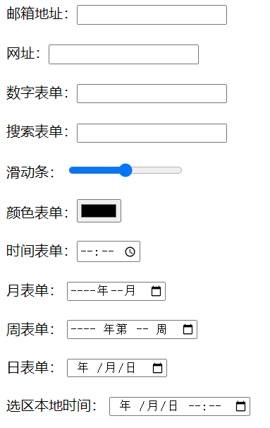
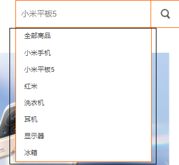
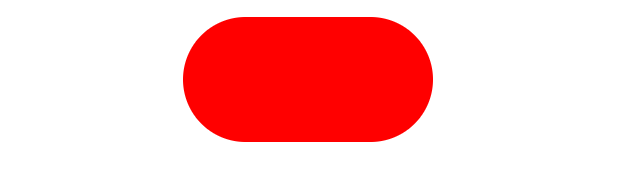
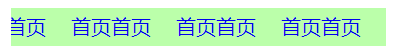
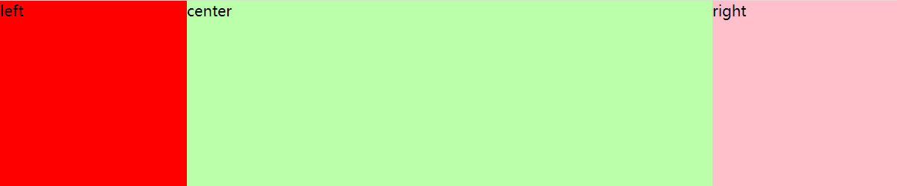

# HTML5

## 一、html5语法

> html5 是html的**第五次重大修改**；(不是新语法！)

+ 内容类型（ContentType）

  + HTML5的文件扩展符与内容类型保持不变，仍然为".html"或".htm"

+ DOCTYPE声明

  + <!DOCTYPE html>不区分大小写

+ 指定字符集编码
  
  ```html
  <meta charset="UTF-8">
  ```
  
+ 可省略结束标记的元素 \<br />
  
  + 不允许写结束标记的元素：br、col、embed、hr、img、input、、link、meta	  
  
+ 可以省略结束标记的元素：\<li>   \<p>
  
  + li、dt、dd、p、option、colgroup、thead、tbody、tfoot、tr、td、th
  
+ 可以省略全部标记的元素：html、head、body、colgroup、tbody

+ 属性值可以使用双引号，也可以使用单引号。


## 二、html5语义化标签

> * header   表示页面中一个内容区块或整个页面的标题区
> * main       表示页面中的主要的内容(ie不兼容) ；一个页面只能出现一个main标签；
> * section  表示页面中的一个区块(类似于div)
> * footer    表示页面中一个内容区块或整个页面的脚注
> * nav         表示页面中导航链接部分
> * article     表示一块与上下文无关的独立的内容
> * aside      在article之外的，与article内容相关的辅助信息 
> * figure元素 表示**一段独立的内容**，使用figcaption元素为其添加标题(第一个或最后一个子元素的位置)
>   * 可以理解为dt和dd的关系
> * hgroup标题的一个分组
>   * 例如hgroup里面有h1,h2; 如果设置了font-size:30px，是在原有基础上增加30px，不是都变成同样大小
> * mark定义高亮显示的文本(span)
>   * 有默认样式，是行内元素；


## 三、多媒体标签

### 3.1 视频标签

* **video标签**

```html
<video src=""> </video>  //添加一种视频格式的语法
```

属性：

> src="" 添加媒介资源路径**(必须要添加)**
>
> controls 显示操作控件**(必须要添加)**
>
> loop     循环播放
>
> autoplay 自动播放 （需要配合muted 静音播放）
>
> muted    静音播放
>
> poster="图片路径"   规定视频正在下载时显示的图像，直到用户点击播放按钮。
>
> * 该属性类似没播放时的封面，
> * 使用时，截取一张图，用poster添加截取的封面**路径**
>
> 常用的**视频格式**： ogg  mp4  webm

* **source 标签**

```html
<source>  //添加多种视频格式的语法 （注：视频是同一个视频，只是保存的格式不一样）
```

**\<source> 标签**为媒介元素（比如 \<video> 和 \<audio>）定义媒介资源。

属性：

> src="设置媒介资源路径"
>
> type="" 定义媒介资源类型（提示作用）
>
> * 属性值：
>   * 用于视频：video/ogg   video/mp4     video/webm
>   * 用于音频：audio/ogg   audio/mpeg    audio/mav  
>
> \<source> 标签允许您规定可替换的视频/音频文件供浏览器根据它对媒体类型或者编解码器的支持进行选择。

 注： **object-fit: cover;** 可以让视频覆盖整个父容器。从中间开始放大，直到撑满盒子，看到的画面会变小；(css属性；设置了宽高时可以用)

```css
 video{
            background:#f00;
            /* 设置视频大小把父元素盖满 ，视频不会变形*/
            object-fit: cover;
        }
```

* 用法

```html
     <!-- 添加一种视频格式的语法 -->
     <video src="mp4/movie.mp4" controls poster="images/fm.jpg" width="300" height="300" > 
         您当前的浏览器版本过低，请升级您的浏览器!!
     </video>

    <!-- 添加多种视频格式的语法 （注：视频是同一个视频，只是保存的格式不一样）-->
     <video controls>
        <source src="mp4/movie.mp4" type="video/mp4">
        <source src="mp4/movie.ogg" type="video/ogg">
        <source src="mp4/movie.webm" type="video/webm">
        您当前的浏览器版本过低，请升级您的浏览器!!
     </video>
```

注：添加多种格式的视频，浏览器会从上到下逐个寻找


### 3.2 音频标签

```html
<audio src=""> </audio>
```

用法 属性同视频标签


## 四、智能表单

（h5新增type类型）

### 4.12 新增表单类型

```html
<input type="">
```

type=""	定义表单类型；

属性值：

> email   邮箱类型表单
>
> url     网址类型表单 (主要识别http://) 
>
> number  数字表单
>
> search    搜索表单
>
> range     滑动条表单
>
> color   颜色表单
>
> time    时间类型表单
>
> month   月类型表单
>
> week    周类型表单
>
> date    日类型表单
>
> datetime-local 选取本地时间




### 4.2 新增表单属性

> required     监测是否为空；（不能为空）若为空，会弹警告框
>
> min      最小值
> max      最大值
> step     步幅  确定一个法定值(数字表单 每次增加的个数：step:5; 即每次增加5)
>
> autocomplete  是否显示提示信息(即能否看到历史记录) **需要元素有name属性**
> 属性值:  
>
> ​		on    开启提示 （默认值）
> ​        off   关闭提示
>
> placeholder   提示信息
>
> autofocus     自动聚焦。一个页面只能由一个。
>
> ==novalidate==    取消验证  要**加给form标签**
>
> multiple      选择（上传）多个   以 "**,**" 隔开的形式；
>
> readonly    把输入字段设置为只读。（只能看不能写）
>
> list        必须结合datalist标签，绑定datalist  id名称。
> 下拉菜单标签：
>
> ```html
> <input type="search" list="menu">
> <datalist id="menu">
> <option label="提示内容" value="显示的内容">
> ...
> </datalist>
> ```
> 注：datalist标签不能独立存在，必须配合其他表单元素一起只用；和该表单元素进行绑定;
> 通过 **list属性**和**datalist 的id名称**绑定。(不一定要用这个属性，可用其他标签代替！)
>
> 


案例：

```html
<form action="">
    文本框：<input type="text" placeholder="昵称" autofocus><br><br>
    邮箱地址：<input type="email" required placeholder="aa@qq.com" multiple><br><br>
    网址：<input type="url" value="http://www.baidu.com" readonly><br><br>
    搜索：<input type="search" name="sousuo" autocomplete="on"><br><br>
    数字:<input type="number" value="0" min="0" max="50" step="5"><br><br>
    滑动条：<input type="range"><br><br>
    颜色：<input type="color"><br><br>
    搜索内容：
    <input type="search" list="sousuo">
    <datalist id="sousuo">
        <option label="华为" value="电脑">
        <option label="戴森" value="吹风机">
        <option label="欧米茄" value="手表">
        <option label="华为" value="手机">
    </datalist>
    <br><br>
    <input type="submit">
</form>
```


# CSS3

## 一、CSS 3.0介绍

> css 3.0：
>
> 是css2.0 的升级版；
> css2.0 是css1.0的升级版
> CSS3语言开发是朝着模块化发展的。以前的规范作为一个模块实在是太庞大而且比较复杂，所以，把它分解为一些小的模块，更多新的模块也被加入进来。这些模块包括： 盒子模型、列表模块、超链接方式 、语言模块 、背景和边框 、文字特效 、多栏布局等。
>
> css2的内容在css3里是继续支持的；
>
> css3.0 简称c3：是完全向后兼容；
>
> 高版本浏览器可支持，低版本浏览器不支持怎么办？
> 解决方案：
>     让高版本浏览器以设计稿的显示；
>     让低版本的浏览器能保证网页的最基本的结构；
>
> * 渐进增强：
>           先保证低版本浏览器能够实现基本的功能；
>           再向高版本浏览器扩充功能；
> * 优雅降级：
>           先根据高版本浏览器实现完美的效果
>           在对低版本浏览器减少共能的供给；


## 二、属性选择器

>  1、选择器[attr]   根据属性找元素
>
>  2、选择器[attr="value"] 指定属性名，并指定了该属性的属性值,属性和属性值必须跟所给的条件是**完全一样**的；(有且仅有)
>
>  3、选择器[attr^="value"]：指定了属性名，并且有属性值，属性值是以value开头的
>  4、选择器[attr$="value"]：指定了属性名，并且有属性值，属性值是以value结尾的
>  5、选择器[attr*="value"]：指定了属性名，并且有属性值，而且属值中包含了value
>
>  6、选择器[attr~="value"]：指定属性名，并且具有属性值，此属性值是一个词列表，并且以空格隔开，其中词列表中包含了一个value词，而且等号前面的“〜”必须的
>
> ​	注：词列表就是多个标签名
>
>  7、选择器[attr|="value"]：指定了属性名，并且属性值仅是value或者以“value-”开头的值(只包含该属性值，或者以  属性值-  开头)
>
>  注：attr 表示属性
>          value  表示属性值

案例：**要写在[ ] 里面**

```css
    <style>
        div[title] {
            color: #f00;
        }

        div[class="aaa box"] {
            color: #0f0;
        }

        div[class^="box"] {
            color: #f0f;
        }

        div[class$="box"] {
            color: #0ff;
        }

        div[class*="box"] {
            color: #ff0;
        }

        div[class~="box"] {
            color: #00f;
        }

        div[class|="box"] {
            color: tomato;
        }
    </style>
```


## 三、伪类元素选择器

### 3.1 结构伪类选择器(1)

> 特点：会把父元素里的**所有的子元素**一起进行计算；(标签名和所在位置必须是匹配的)
> 1、 选择器:first-child   第一个子元素；
>
> 2、 选择器:last-child    最后一个子元素；
>
> 3、 选择器:nth-child(n)  用于匹配索引值为n的子元素。索引值从1开始
>
> 4、 选择器:nth-last-child(n)  用于匹配索引值为n的子元素。索引值从最后一个开始
>  n ： 数值  或者是 表达式(**必须写在数字前面**)
>  表达式： 2n 偶数；  2n+1 奇数 ；  3n 3的倍数 ； 5n; 
>           	  even偶数       奇数odd
>
> ​				-n+3:从第三个往前找(-n必须写在前面)
>
> 5、:only-child  这个伪类一般用的比较少，有且仅有一个的子元素；唯一的子元素；

案例：

```css
/*
		.list1 li:nth-child(2) {
            background: gray;
        }
 */  表示的是list1 下面的第二个li;
```


### 3.2 结构伪类选择器(2)

> 特点：找相同元素里的第几个；把**相同元素**提取出来单独计算；
>
> 1、:first-of-type 匹配同级兄弟元素中的第一个元素 
>
> 2、:last-of-type  匹配同级兄弟元素中的最后一个X元素
>
>  3、:nth-of-type(n)   匹配同类型中的第n个同级兄弟元素X
>
> 4、:nth-last-of-type(n) 匹配同类型中的倒数第n个同级兄弟元素X
>
> 5、:only-of-type     匹配属于同类型中唯一兄弟元素的X

案例：

```css
         .list li:first-of-type{
             background:#f00;
         }
```


### 3.3 其他伪类选择器

```css
:root   匹配文档的根元素。在HTML（标准通用标记语言下的一个应用）中，根元素永远是HTML
:empty  匹配没有任何子元素（包括包含文本）的元素X
```

注：如果前面不加选择器的限制，则指向的是全局

```css
/* 指向的是全局的无子元素标签 */        
		:empty{
             width:100px;
             height:100px;
             background:#f0f;
         }

 /* 没有子元素的li标签 */ 
         li:empty{
             width:100px;
             height:100px;
             background:#0f0;
         }
```

### 3.4 目标伪类选择器

```css
:target{ }
```

说明：

* 选中url(地址)所指向的元素；**配合锚点链接**使用；
* 意思是：当target前的元素被指向时的样式；

案例：

```html
    <style>
        /* 当点击html超链接时，#html盒子的变化 */
        #html:target {
            width: 100px;
            height: 100px;
            background-color: #bfa;
        }

        #css:target {
            width: 200px;
            height: 200px;
            background-color: #f00;
        }

        #javascript:target {
            width: 300px;
            height: 100px;
            background-color: pink;
        }
    </style>
</head>

<body>
    <a href="#html">html</a>
    <a href="#css">css</a>
    <a href="#javascript">javascript</a>

    <div id="html">html</div>
    <div id="css">css</div>
    <div id="javascript">javascript</div>
</body>
```


### 3.5 UI 元素状态伪类选择器（应用在表单元素内）

>  1、选择器:enabled  匹配所有用户界面（form表单）中处于可用状态的E元素  
>
>  2、选择器:disabled 匹配所有用户界面（form表单）中处于不可用状态的E元素
>
>  3、选择器:checked  匹配所有用户界面（form表单）中处于选中状态的元素E
>
>  4、选择器:read-only  选取不可被用户编辑的可输入表单
>
>  5、选择器:read-write  选取可以被用户编辑的表单元素
>
>  6、选择器:focus    匹配聚焦时的表单元素

写法：` input:enabled{background:#f00;}` 

注：默认情况下，复选框和单选框的样式只能修改宽高

清除复选框的默认样式：

```css
          -webkit-appearance: none;
          -moz-appearance:none;
          appearance: none;
```

修改复选框样式案例：

```css
    <style>
        input {
            width: 24px;
            height: 24px;
            background: url(./../images/icon_check.png) center;
            -webkit-appearance: none;
            -moz-appearance: none;
            appearance: none;
        }
        input:checked {
            background: url(./../images/icon_checked.png) center;
        }
    </style>
```

### 3.6 selection伪类选择器

匹配元素中被用户选中或处于高亮状态的部分 

```css
::selection{ }
```

> 注：
>
> * 要写双冒号；
> * 只能改变两个效果：背景色和文本颜色； 

案例 (当p 被选中时，文字颜色和背景色发生改变)

```css
    <style>
        p::selection{
            background:#fcc;
            color:#0f0;
        }
    </style>
```


## 四、浏览器前缀

(1) IE			 内核：Trident   	                         前缀    **-ms-**      (记忆：==M==icro==S==oft)


(2) firefox  	 内核：Gecko    	                         前缀    **-moz-**	

(3) Safari		 内核：webkit   	                         前缀    **-webkit-** 

(4) Chrome       内核：webkit–>blink                         前缀    **-webkit-** 

(5) opera	     Presto(Opera前内核) (已废弃)，现在是blink    前缀    **-o-**	 


## 五、c3新增属性

### 5.1 文本阴影属性

```css
text-shadow:x   y   blur  color;
```

> 属性值：
>     x   ： 设置阴影在x轴上的显示位置，支持负值 (必须写，负值表示向左移动)
>     y   ： 设置阴影在y轴上的显示位置，支持负值 (必须写，负值表示向上移动)
>     blur   ： 阴影的模糊程度； 默认值为0px;
>     color  ： 阴影的颜色; 默认是黑色；
>
> 注：
>     x和y的位置必须写在最前面，且不能互换位置；
>     同时可以设置多阴影效果；
>     多阴影效果语法：(用逗号隔开)
>          text-shadow:x  y  blur  color,x  y  blur  color,x  y  blur color
>     多阴影的层级：前面的层级高，后面的层级低

### 5.2 文本边框属性

```css
 -webkit-text-stroke :1px red  ;
```

了解即可~

### 5.3 文本换行属性

```css
word-wrap:;
```

属性值：

* normal       只在允许的断字点换行（浏览器保持默认处理）
* **break-word**   允许长单词或 URL 地址换行到下一行,在新的一行换行

注：

```css
word-break:;
```

属性值：

* normal  默认显示，根据浏览器自动换行     
* keep-all   文本不会换行，只能在半角空格或连字符处换行
* break-all  强制换行,比较粗暴；直接换行

### 5.4 字体图标

*  通过Unicode 引入

  * >     @font-face { 
    >         font-family: <YourWebFontName>;   设置字体名称
    >         src: <source> [<format>][, []]*;  引入字体路径 添加字体格式
    >     }

  * ```css
                @font-face {
                font-family: "iconfont"; 
                src: url('iconfont.ttf') format('truetype');
                }
    ```
    
  * 注：url注意修改路径。
  
  * 注：也可以直接用  **link,**引入**iconfont.css**文件
  
*  通过class 引用

   *  ```css
          <link rel="stylesheet" href="font/iconfont.css">
     ```

*  通过js引入(了解即可)

   *  （看文档声明）svg标签写在body里

### 5.5 背景图属性

#### 5.5.1背景图原点位置属性

```css
background-origin:;
```

属性：

> * padding-box	背景图像填充框的相对位置   默认值
> * border-box	背景图像边界框的相对位置
> * content-box	背景图像的相对位置的内容框

#### 5.5.2背景图裁切属性

``` css
 background-clip:;
```

属性：

> * padding-box	裁切至填充区
> * border-box	裁切至边框区 (默认值)
> * content-box	裁切至内容区
> * text  裁切至文本区 （非正式版,需要在属性前加前缀）了解
>   * 注：要将文字颜色设置为透明色

#### 5.5.3背景图大小属性

```css
background-size:;
```

属性：

> * 数值(如：10px) ，规定背景图的大小。第一个值宽度，第二个值高度。
> * 百分比(如：50%)，以百分比为值设置背景图大小
>   * 100%，**会变形**；但不会超出父元素显示（能看到全部），全部显示
> * cover：把背景图像扩展至足够大，以使背景图像完全覆盖背景区域。
>   * 等比缩放，**不会变形**，会超出父元素显示（只能看到部分），直到把元素**覆盖满**为止
> * contain：把图像扩展至最大尺寸，以使其宽度或高度完全适应内容区域。
>   * 等比缩放，**不会变形**，只要宽或者高跟元素有重合，就**停止扩展**了

注：

* 当属性值为数值或者百分比时，一个值代表的是背景图宽度，高度会等比例缩放 
* 当设置两个值的时候，第一个值表示宽度，第二个值表示的高度；
* 单位为px时，背景图就是固定大小
* 单位为%时，是相对元素大小显示的百分比

**复合写法：**

* background-size可以和其他背景属性复合式在一个background后，但是需要和背景图位置属性以斜杠的形式组成一组；
* **背景图位置必须要写**；且一般会设置为center；
* background-orign、background-clip需要单独写

```css
background: url(images/laoli.jpg) no-repeat center center/cover;
```

#### 5.5.4多背景设置(了解)

语法：

```css
background:url() no-repeat,url() ,url();
```

注：层级关系，先写的层级在上，后写的层级在下


### 5.6 滤镜属性

```css
filter:;
```

* 模糊滤镜：blur

  ```css
  filter : blur(value)  数值加单位
  ```

* 灰度滤镜(多用于制作**黑白网页**)

  ```css
  filter：grayscale(100%) 百分比（0% - 100%）
  ```

  整个页面灰白：给body加filter:grayscale(100%)


### 5.7 圆角属性

```css
border-radius:;
```

每个角的x和y的值是一样的；
border-radius:10px;           四个角的x和y值都一样

border-radius:10px 20px;      值1：左上和右下的x和y ; 值2：右上和左下的x和y;

border-radius:10px 20px 30px; 值1：左上的x和y ; 值2：右上和左下的x和y; 值3：右下的x和y;

border-radius:10px 20px 30px 40px;值：左上； 值2：右上 ；值3：右下； 值4：左下；

设置每个角的x和不一样；x/y  （了解）
border-radius:10px/20px; 四个的x是10px,y是20px;

border-radius:10px 20px/40px;  

border-radius:10px 20px 30px/40px;

border-radius:10px 20px 30px 40px/40px;

border-radius:10px 20px 30px 40px/40px 30px;

border-radius:10px 20px 30px 40px/40px 30px 20px;

border-radius:10px 20px 30px 40px/40px 30px 20px 10px;

注：斜杠前表示x轴的值，斜杠后是y轴的值；
    属性值是数值：px  、  %
    百分比：是相对元素宽高显示的百分比的值；

> border-radius:50%;		----		圆形(固定写法)
>
> border-radius:(高度的一半)；
>
> 


### 5.8 盒子阴影属性

```css
box-shadow:;
```

属性值：

* x	必需的。水平阴影的位置。允许负值（外阴影时，右为正值）
* y	必需的。垂直阴影的位置。允许负值（外阴影时，下为正值）
* blur	可选。模糊距离    默认值 0px
* spread	可选。阴影的大小  默认值 和元素一样大,支持负值（正值扩大，负值内缩）
* color	可选。阴影的颜色。默认黑色
* inset	可选。从外层的阴影（开始时）改变阴影内侧阴影(默认是外阴影)；

可以设置多个阴影，用逗号隔开的形式；如下：

```css
box-shadow: 0px 0px 0px 0px #0f0, 0px 0px 0px 0px #0f0; 
```

注：

* 多阴影时，会有层级关系，**先写的层级在上**，后写的层级在下；
* 两个值：x  y
* 三个值：x  y  blur 
* …… 以此类推；

### 5.9 图片边框属性(了解)

复合式写法 ：

```css
border-image:;
```

单一写法：

```css
border-image-source:url() ; 用在边框的图片的路径。

border-image-slice	图片边框向内偏移(不加单位)。
    10            上下左右
    10 20         上下 左右
    10 20 30      上   左右   下
    10 20 30 40   上   右  下  左

border-image-repeat	图像边框是否应平铺(repeat)、铺满(round)或 拉伸(stretch)
    默认值是拉伸；

border-image-outset	边框图像区域超出边框的量(值是一个倍数)
	border-image-outset:1;
/*表示超出边框一倍距离，例如边框为10px，则表示超出边框10px*/
```


### 5.10 width的属性值

```css
-webkit-max-content   和最大的内容同宽
-webkit-min-content   和最小的内容同宽
```

```html
<!DOCTYPE html>
<html lang="en">
<head>
    <meta charset="UTF-8">
    <meta http-equiv="X-UA-Compatible" content="IE=edge">
    <meta name="viewport" content="width=device-width, initial-scale=1.0">
    <title>Document</title>
    <style>
        * {
            padding: 0;
            margin: 0;
        }

        li {
            list-style: none;
        }

        a {
            text-decoration: none;
        }

        .nav {
            width: 300px;
            height: 30px;
            background-color: #bfa;
            margin: 100px auto;
            overflow: auto;
        }

        .nav ul {
            display: flex;
            justify-content: start;
            height: 30px;
            width: max-content;
        }
        .nav li {
            margin: 0 10px;
            line-height: 30px;
        }
    </style>
</head>
<body>
    <div class="nav">
        <ul>
            <li><a href="#">首页首页</a></li>
            <li><a href="#">首页首页</a></li>
            <li><a href="#">首页首页</a></li>
            <li><a href="#">首页首页</a></li>
            <li><a href="#">首页首页</a></li>
            <li><a href="#">首页首页</a></li>
            <li><a href="#">首页首页</a></li>
    </div>
</body>
</html>
```



**希望宽度根据内容的多少来显示**：例如 ：二级菜单……

浮动会影响布局，不灵活；

### 5.11 calc() 方法

可以计算不同单位的数值；

注：

* 常用的运算符 +  -  *  /;
* 运算符的前后要留有空格；
* 进行乘除运算时，都是和倍数相乘除的；` width:calc( 100% / 2);`

可用来做两栏、三栏布局

```css
     <style>
         * {
             padding: 0;
             margin: 0;
         }
         body {
             width: 100%;
         }
         .left {
             width: 200px;
             height: 200px;
             background-color: #f00;
             float: left;
         }
         .right {
            width: 200px;
            height: 200px;
            background-color: pink;
            float: right;
         }
         .center {
             width: calc(100% - 400px);
             height: 200px;
             background-color: #bfa;
             float: left;
         }
     </style>
```



### 5.12 pointer-events:none;

```css
pointer-events:none;
```

注：

* 穿透效果(例如：超链接被盒子盖住，无法点击，可以给盒子添加此属性)
* 防止多次提交（配合js使用）


