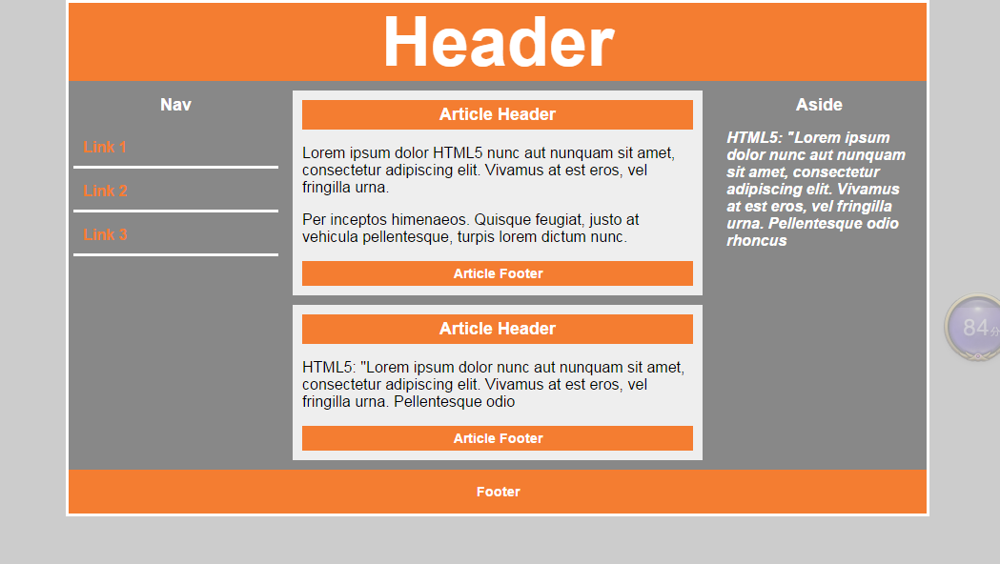

## 一、html5语法

> html5 是html的**第五次重大修改**；(不是新语法！)

+ 内容类型（ContentType）

  + HTML5的文件扩展符与内容类型保持不变，仍然为".html"或".htm"

+ DOCTYPE声明

  + <!DOCTYPE html>不区分大小写

+ 指定字符集编码
  
  ```html
  <meta charset="UTF-8">
  ```
  
+ 可省略结束标记的元素 \<br />
  
  + 不允许写结束标记的元素：br、col、embed、hr、img、input、、link、meta	  
  
+ 可以省略结束标记的元素：\<li>   \<p>
  
  + li、dt、dd、p、option、colgroup、thead、tbody、tfoot、tr、td、th
  
+ 可以省略全部标记的元素：html、head、body、colgroup、tbody

+ 属性值可以使用双引号，也可以使用单引号。


## 二、html5语义化标签

> * header   表示页面中一个内容区块或整个页面的标题区
> * main       表示页面中的主要的内容(ie不兼容) ；一个页面只能出现一个main标签；
> * section  表示页面中的一个区块(类似于div)
> * footer    表示页面中一个内容区块或整个页面的脚注
> * nav         表示页面中导航链接部分
> * article     表示一块与上下文无关的独立的内容
> * aside      在article之外的，与article内容相关的辅助信息 
> * figure元素 表示**一段独立的内容**，使用figcaption元素为其添加标题(第一个或最后一个子元素的位置)
>   * 可以理解为dt和dd的关系
> * hgroup标题的一个分组
>   * 例如hgroup里面有h1,h2; 如果设置了font-size:30px，是在原有基础上增加30px，不是都变成同样大小
> * mark定义高亮显示的文本(span)
>   * 有默认样式，是行内元素；




## 三、多媒体标签

### 3.1 视频标签

* **video标签**

```html
<video src=""> </video>  //添加一种视频格式的语法
```

属性：

> src="" 添加媒介资源路径**(必须要添加)**
>
> controls 显示操作控件**(必须要添加)**
>
> loop     循环播放
>
> autoplay 自动播放 （需要配合muted 静音播放）
>
> muted    静音播放
>
> poster="图片路径"   规定视频正在下载时显示的图像，直到用户点击播放按钮。
>
> * 该属性类似没播放时的封面，
> * 使用时，截取一张图，用poster添加截取的封面**路径**
>
> 常用的**视频格式**： ogg  mp4  webm

* **source 标签**

```html
<source>  //添加多种视频格式的语法 （注：视频是同一个视频，只是保存的格式不一样）
```

**\<source> 标签**为媒介元素（比如 \<video> 和 \<audio>）定义媒介资源。

属性：

> src="设置媒介资源路径"
>
> type="" 定义媒介资源类型（提示作用）
>
> * 属性值：
>   * 用于视频：video/ogg   video/mp4     video/webm
>   * 用于音频：audio/ogg   audio/mpeg    audio/mav  
>
> \<source> 标签允许您规定可替换的视频/音频文件供浏览器根据它对媒体类型或者编解码器的支持进行选择。

 注： **object-fit: cover;** 可以让视频覆盖整个父容器。从中间开始放大，直到撑满盒子，看到的画面会变小；(css属性；设置了宽高时可以用)

```css
 video{
            background:#f00;
            /* 设置视频大小把父元素盖满 ，视频不会变形*/
            object-fit: cover;
        }
```

* 用法

```html
     <!-- 添加一种视频格式的语法 -->
     <video src="mp4/movie.mp4" controls poster="images/fm.jpg" width="300" height="300" > 
         您当前的浏览器版本过低，请升级您的浏览器!!
     </video>

    <!-- 添加多种视频格式的语法 （注：视频是同一个视频，只是保存的格式不一样）-->
     <video controls>
        <source src="mp4/movie.mp4" type="video/mp4">
        <source src="mp4/movie.ogg" type="video/ogg">
        <source src="mp4/movie.webm" type="video/webm">
        您当前的浏览器版本过低，请升级您的浏览器!!
     </video>
```

注：添加多种格式的视频，浏览器会从上到下逐个寻找


### 3.2 音频标签

```html
<audio src=""> </audio>
```

用法 属性同视频标签


## 四、智能表单

（h5新增type类型）

```html
<input type="">
```

属性：

type=""	定义表单类型；

属性值：

> email   邮箱类型表单
>
> url     网址类型表单 (主要识别http://) 
>
> number  数字表单
>
> search    搜索表单
>
> range     滑动条表单
>
> color   颜色表单
>
> time    时间类型表单
>
> month   月类型表单
>
> week    周类型表单
>
> date    日类型表单
>
> datetime-local 选取本地时间


