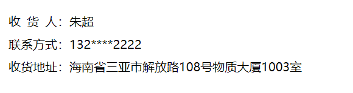

### 1、三个字和四个字两端对齐



```html
<!DOCTYPE html>
<html lang="en">
<head>
    <meta charset="UTF-8">

    <meta http-equiv="X-UA-Compatible" content="IE=edge">

    <meta name="viewport" content="width=device-width, initial-scale=1.0">
    <title>Document</title>
    <style>
        ul {
            list-style: none;
        }

        li {
            line-height: 30px;
        }

        i {
            display: inline-block;
            width: 0.5em;
        }
    </style>
</head>

<body>
    <ul>
        <li><span>收<i></i>货<i></i>人：</span>朱超</li>
        <li><span>联系方式：</span>132****2222</li>
        <li><span>收货地址：</span>海南省三亚市解放路108号物质大厦1003室</li>
    </ul>
</body>
</html>
```

> 关键：
>
> * 将三个字中间**插入空标签**用于占位
>
> * 字体大小用**em**
> * 也可以使用**text-align-last:justify;**     使其强制两端对齐


### 2、左浮动时不会贴边

> 解决办法：
>
> * 检查上一行的字体大小，查看是否超过容器大小
> * 给上方元素固定高度


### 3、缩小时乱版

> 原因：子元素的宽度占满了父元素的宽度，在缩小显示时，可能会出现乱码的状况
>
> 解决办法：
>
> 1. 给父元素增大宽度
> 2. 给父元素添加overflow:hidden; 使子元素溢出隐藏