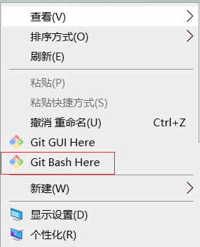

# Git 操作


## 版本控制系统

集中式与分布式的区别

| 项目 | 集中式版本控制系统 | 分布式版本控制系统 |
| ---- | ------------------ | ------------------ |
| 主要区别 | 每个开发者只有应用代码库的一个版本。 | 每个开发者都有整个代码库的所有版本。 |
|  | 在离线状态下开发者无法进行版本管理开发。 | 在离线状态下开发者可以进行版本管理开发, 等到有网时再push到仓库中。 |

> 同一个项目，所有代码必须要在同一个根目录下
>
> 每次更改代码后，之前的代码还要存在，不能更换文件夹进行操作，不然会报错


## 软件下载

下载：https://git-scm.com/   官网下载比较慢，

镜像下载：http://npm.taobao.org/mirrors/git-for-windows/

## 安装Git



出现以上图标则成功安装

> 卸载Git

* 首先检查环境变量：此电脑-->属性-->高级系统设置-->高级-->环境变量-->系统变量-->path-->双击打开，删除里面的Git
* 控制面板-->卸载Git


## 配置

1. 设置用户签名

` git config --global user.name "用户名"`

2. 设置用户邮箱

` git config --global user.email "邮箱"`

 检查是否配置成功

 ` git config --global --list`       出现name 和 email表明成功

说明：签名的作用是区分不同的操作者

（C:\Users\Administrator\.gitconfig这个路径中保存着我们自己设置的名字和邮箱）


## 常用的Linux命令

 ````lunix
mkdir xxx    #新建文件夹

vim x.xxx    #新建/编辑文件 ：有则编辑，无则新建
	输入 i 进入编辑模式
	Esc+ :wq +回车   保存并退出
	Esc+ :q! +回车   不保存退出
	dd               #删除当前行
	yy               #复制
	p                #粘贴

cd xxx   #进入xxx目录

cd ..     #返回上一级目录   **cd 和.. 之间有一个空格**

ls     #列出当前文件夹所有文件

pwd    #显示当前目录中所有文件

cat x.xxx  #显示文件x.xxx的内容

clear    #清屏

history   #查看历史记录

rm   #删除一个文件

rm-r    #删除一个文件夹
	（rm-rf/ 切勿在Linux中尝试！删除电脑中全部文件 ）

mv    #移动文件
 ````


## Git工作原理

> 工作区（working Directory）：简单的理解——你在电脑里能看到的目录。
>
> 暂存区（stage）：介于工作区和版本区中间，工作区到版本区的“必经之路” 
>
> 版本库（Repository）：工作区有一个隐藏目录.git，准确的来说这个不算工作区，而是Git的版本库。
>
> ​	第一步是用git add把文件添加进暂存区。（相当于复制到缓存区里面）
> ​	第二步是用git commit把暂存区的所有内容提交到当前版本库。（复制）
>
> 


## Git常用命令


###  1. 初始化本地库

 说明：初始化本地库即获取文件的管理权限

用法：新建一个文件夹--在文件夹右键 --   Git Bash here -- `git init`

查看 -- 隐藏目录  有一个.git文件


### 2. 查看本地库状态

`git status`

有==红色==的代表未被追踪的状态

有==绿色==的代表在暂存区

啥都没有代表已提交状态

### 3. 新增文件

`vim +添加文件的名称`

+ i  进入编辑
+ yy 复制    q粘贴
+ esc结束编辑
+ ` :wq 回车` 保存

### 4. 查看文件内容

` cat +文件内容`


### 5. 将文件添加到暂存区

` git add +文件名` 

> 注：1. 没有初始化执行git命令，会提示  fatal: Not a git repository (or any of the parent directories): .git
>
> ​	2.失败会提示    fatal: pathspec 'x.txt' did not match any files
>
> ​	3.可能会出现警告，由于linux和window的换行符不一致导致的	

` git diff         #当前做的哪些更新还没有暂存` 

` git diff --staged    #有哪些更新已经暂存起来准备好下次提交` 

` git ls-files -s       #查看暂存区里的文件`  


### 6. 将暂存区文件删除

` git rm --cached 文件名`

注：只会删除暂存区中的文件，不会删除工作区的文件（写的东西还在）


` git rm -f 文件名          #从git 仓库和工作区中同时移除xxx` 


` ll     #显示当前目录下的文件`


### 7. 提交本地库(版本区)

说明：将暂存区文件提交到本地库，形成历史版本

语法： ` git commit -m "版本信息" 提交的文件名 `

> git commit -m "first commit" hello.txt 
>
> 查看本地库 ` git status` 没有文件需要提交

遇到的问题：


解决方法：

> 1. 新建一个分支 ` git branch xxx`
> 2. 切换到新的分支  ` git checkout xxx` 
> 3. 将改动提交到新分支  ` git add .`   ` git commit -m "xxx" 文件名` 
> 4. 检查是否将改动提交到新分支   ` git status` 
> 5. 切回到主分支  ` git checkout master`
> 6. 新分支提交的改动合并到主分支  ` git merge xxx`  

 

### 8. 查看版本信息

语法： ` git reflog`     //查看简版的日志（版本）信息

` git log`     //查看详细的日志信息


### 9. 修改文件

（同上操作）

> ` git status`   查看本地库状态
>
> ` git add 文件名`     添加到暂存区
>
> ` git commit -m "second commit" 文件名`   提交到本地库
>
> 指针所指的版本就可以查看内容 
>
> ` cat hello.txt `      查看内容


### 10. 历史版本

` git reflog`

` git log`      查看版本信息


### 11. 版本穿梭

1. 先找到之前版本的版本号,复制 （复制：双击鼠标左键   粘贴：鼠标中键） ` git reflog`
2. ` git reset --hard 版本号`    选择需要回退的版本号
3. HEAD指针发生了变化   可以查看文件  ` cat x.xxx ` 

另一种查看方法

打开.git -- HEAD -- 查看指向哪个分支（以master为例） -- refs -- heads -- master --打开查看版本号

### 12. 配别名（相当于快捷键）

` git config --global alias.别名 +"要修改的命令"`

> 例如：git config --global alias.co checkout   ---->   当要输入git checkout 时，只需输入git co
>
> 当要修改的命令很长时，需要加引号,单个单词可不加

## Git分支

### 1.什么是分支

​	在版本控制过程中，同时推进多个任务，我们可以为每个任务创建单独的分支。使用分支意味着程序员可以把自己的工作从主线开发上分离开来，开发自己的分支时，不会影响主线的分支，一个分支就是一个单独的副本。（分支底层其实也是指针的引用）


### 2. 查看分支

* 查看分支的最后一次提交

  ` git branch -v`      

​                               


### 3. 创建分支

`git branch  分支名`   


### 4. 切换分支

==每次切换分支前，当前分支一定要是干净的  （已提交状态）== 

> 即 nothing to commit, working tree clean


` git checkout 分支名` 

` git checkout -b 分支名          #创建分支，并切换到该分支` 

==创建分支要在主分支上创建，不可以在当前正在使用的分支上创建== 


### 5. 合并分支

` git merge 分支名`

**合并分支只会修改 合并的分支，不会影响原来分支**


> 
>
> 将hot-fix 分支合并到 master 分支，hot-fix 分支的内容不会改变


### 6. 产生冲突

原因：合并分支时，两个分支在同一个文件的同一个位置有两套完全不同的修改。Git无法替代我们决定使用哪一个分支。必须人为决定新代码内容 

+ 合并冲突警告（可以看出在hello.txt产生了冲突）


+ vim修改文件，查看冲突的详细信息


解决方法：

1. 删除多余代码     

>  <<<< HEAD
>
> \-------
>
> \>>>>> xxxxx

2. 保留需要的代码，保存并退出

` dd   #删除当前行`

3. 添加到暂存区
4. 提交本地库


==注==： 提交本地库是不能带上文件名，会报错

### 7. 删除分支

` git branch -d xxx`            删除指定分支

` git branch -D xxx` 		强制删除分支


### 8. Git存储

有时，当你的项目还未完成，而这时你想要切换到另一个分支上做一点别的事，如果一直提交本地库，会导致本地库越来越大，这是你可以将为完成的工作存储起来

`git stash             #将未完成的修改保存到一个栈上` 

` git stash list      #查看存储`   **拿到一个分支首先就要检查是否有存储 **

` git stash apply          #应用这些修改` 如果不指定储藏，Git认为指定的是最近的储藏

` git stash pop     #应用存储然后立即从栈上删除它`

` git stash drop 加上要移除的储藏的名字来移除它`


## GitHub

> GitHub是一个Git项目托管网站


### 1. 本地库内容推送给远程仓库

1. 新建本地库

   + ` git init`

   + ` git add x.xxx`

   + ` git commit -m "first commit" x.xxx`

     

2. 新建远程仓库 （点击左上角头像，进入之后点击右上角的+号创建）


   + **GitHub** 上 **New repository**

注：远程仓库名和本地仓库名最好一致


3. 为远程库创建别名（为了好记）

``` 
git remote -v     #查询别名

git remote add xxx(最好和本地库名一致) 从远程仓库复制的链接  #新建别名
```


4. 本地库推送远程库

``` 
git push xxx(别名) 分支名
```


5. 拉取远程库代码

```java
git pull xxx(别名) 分支名
    每次工作第一件事就是pull线上最新版本
```

> 备注：若在成功推送过一次代码后，电脑不能够自动记住github的账户和密码，执行以下命令解决：git config --global credential.helper store


### 2. 克隆远程仓库到本地

``` 
git clone 远程的地址
```

* 获取地址
* 新建一个本地仓库，克隆


> 克隆会做如下操作：
>
> * 拉取代码
> * 初始化本地库
> * 创建别名  ：origin


> 注意：github里面有一个按钮code，里面有一个Clone with HTTPS，里面有地址，这个地址就是你的仓库的地址（一般使用克隆，而不是Download），clone之后的直接是一个关联了远程仓库的本地库（和远程库保持联系了），而下载下来是一锤子买卖，下载之后就和远程库没有任何联系了


### 3. 团队协作


> **==邀请成员==**： 打开GitHub当前使用的库-->settings-->managa access --> invite a collaborator --> 输入要邀请的成员 --> add xxx to this repository --> (最下面) 复制 pending invite --> 将复制的链接通过 钉钉等 发送给被邀请成员
>
> **==受邀成员==**： 登录自己的GitHub，在上方链接栏中粘贴链接，接受邀请。


### 4. 跨团队协作

**==fork==** 

> ​	将别人的项目clone一份，但是owner变成自己，这样你就可以在遵守open source license的前提下任意修改这个项目了。
>
> ​	相当于你在原项目的主分支上又建立了一个分支，你可以在该分支上任意修改如果想将你得修改的东西合并到原项目当中去，可以pull request，这样原项目的作者就可以将你修改的东西合并到原项目的主分支上去，这样你就为开源项目贡献了代码，开源项目就会在大家的努力下不断地壮大和完善。


## 忽略文件

场景：在项目目录下有很多不变的文件目录，或者几十有改动，我们也不想让其提交远程仓库的文档，此时我们可以使用"忽略文件"机制来实现需求。

忽略文件需要新建一个名为.gitigonre的文件，用于声明忽略文件或者不忽略文件的规则，改规则对当前目录极其子目录生效；

> 注意：该文件因为没有文件名，没办法直接在windows目录下直接创建，需要通过命令行Git Bash来touch 创建


``` javascript
常见规则写法
1） /mtk/               过滤整个文件夹
```


