## 版本控制系统

集中式与分布式的区别

| 项目     | 集中式版本控制系统                       | 分布式版本控制系统                                           |
| -------- | ---------------------------------------- | ------------------------------------------------------------ |
| 主要区别 | 每个开发者只有应用代码库的一个版本。     | 每个开发者都有整个代码库的所有版本。                         |
|          | 在离线状态下开发者无法进行版本管理开发。 | 在离线状态下开发者可以进行版本管理开发, 等到有网时再push到仓库中。 |

> 同一个项目，所有代码必须要在同一个根目录下
>
> 每次更改代码后，之前的代码还要存在，不能更换文件夹进行操作，不然会报错

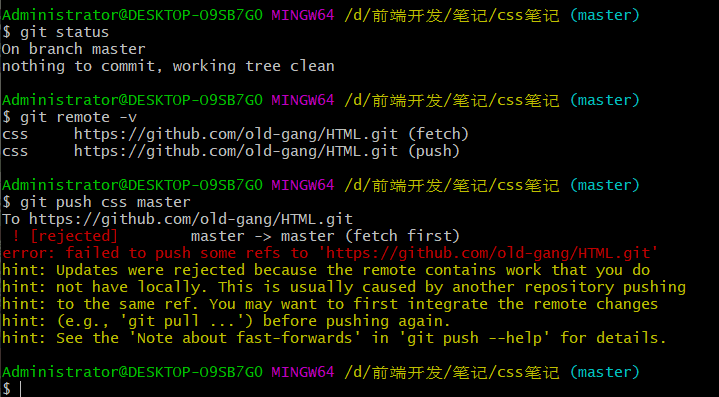


## Git 介绍

Git 是一款开源免费的版本控制系统，是一个应用程序


### Git 作用

版本控制系统在项目开发中作用重大，主要的功能有以下几点

- 代码备份
- 版本回退
- 协作开发
- 权限控制

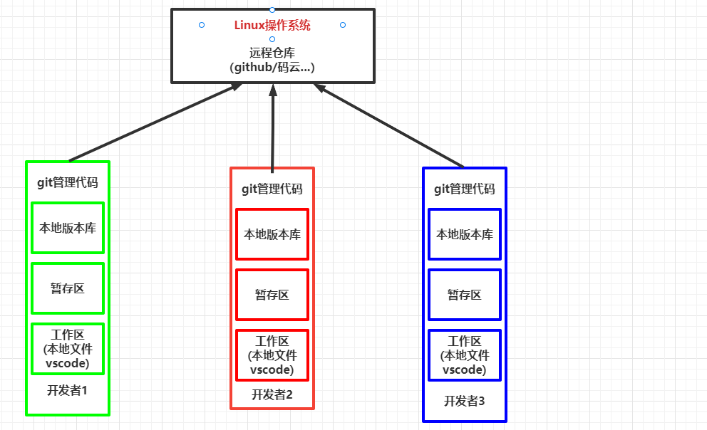

### 下载安装

下载地址 <https://git-scm.com/> ，安装方式与 QQ 安装相同，一路下一步，中间可以设置软件的安装路径

镜像下载：http://npm.taobao.org/mirrors/git-for-windows/

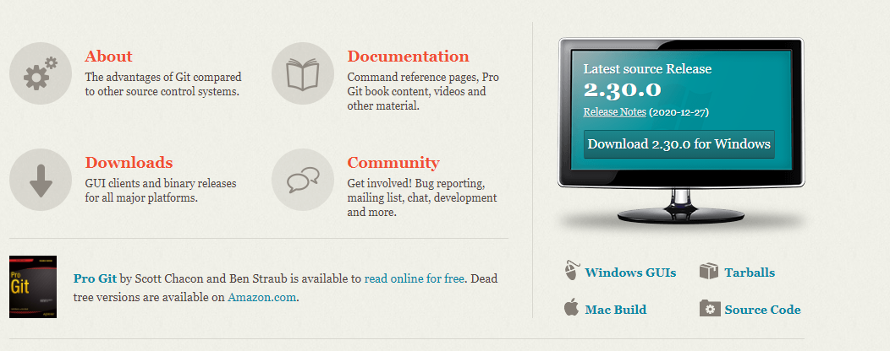

注意事项：

- **<font color='red'>Git 安装目录不要有中文</font>**

- 在资源管理器中右键，如果有 Git GUI Here / Git Bash Here菜单说明安装成功了


> 卸载Git

* 首先检查环境变量：此电脑-->属性-->高级系统设置-->高级-->环境变量-->系统变量-->path-->双击打开，删除里面的Git
* 控制面板-->卸载Git


## Linux 常用命令

Linux 是一套开源免费的操作系统，它与 Windows 属于同一类型的事物，但是操作方式却与 windows 不同。

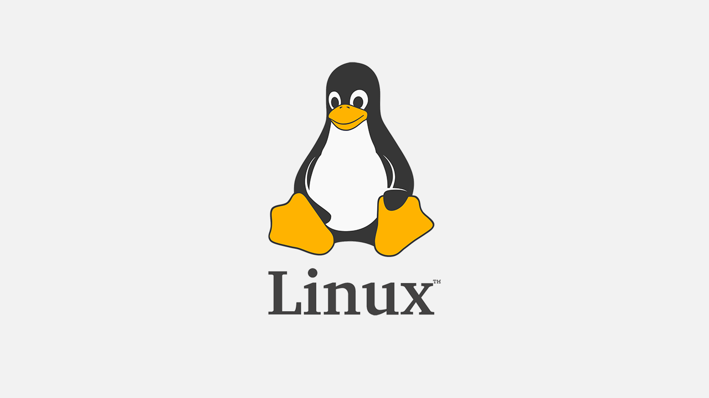

Windows 为图形化操作形式，Linux 一般使用命令与系统进行交互，常用的命令有：

| 命令                                      | 介绍                                                         |
| ----------------------------------------- | ------------------------------------------------------------ |
| touch                                     | 创建一个文件                                                 |
| mkdir                                     | 创建文件夹（make directory）                                 |
| <span style="color:red">ls</span>         | 查看文件夹下的文件 （list 单词的缩写）                       |
| <span style="color:red">cd</span>         | 改变工作目录，（change directory 缩写）                      |
| Tab                                       | 路径自动补全                                                 |
| clear                                     | 清屏（也可以使用 <span style="color:red">ctrl + l </span> 快捷键） |
| rm                                        | 删除文件                                                     |
| rm -rf                                    | 删除文件夹  (慎用！！！)                                     |
| rm-rf/                                    | 切勿在Linux中尝试！删除电脑中全部文件                        |
| cat                                       | 查看文件内容                                                 |
| <span style="color:red">ctrl + c</span>   | 取消命令                                                     |
| <span style="color:red">上下方向键</span> | 查看命令历史                                                 |

#### 练习

- 通过 Linux命令创建以下文件目录结构

```
project
	- css
		-app.css
	- js
		-app.js
	- images
		-logo.png
	- index.html
```

## Vim 基本使用

>  git 在写提交注释的时候，需要用到vim

Vim 是一款命令行下的文本编辑器，编辑方式跟图形化编辑器不同


Vim 编辑文件的步骤：

1. 命令行 `vim 文件名` 打开文件

2. 按『i』进入编辑模式

3. 编辑文件内容

4. `ESC` + `:wq` 保存并退出   w: write   q: quit

   `ESC` + `:q!` 不保存并退出


#### 练习：

- vim 创建一个文件 “ 孤勇者.md ”  目录位置：day01/02-vim/

```
去吗？配吗？这褴褛的披风
战吗？战啊！以最卑微的梦
致那黑夜中的呜咽与怒吼
谁说站在光里的才算英雄

```

#### 关于命令行中的复制粘贴

- 复制：ctrl + insert
- 粘贴：shift + insert / 右键 -> paste

## Git 使用

### git 初始化

``` shell
# 当前目录提交给git进行版本管理
git init # 在当前目录 右键git bash here ；出现一个隐藏的.git 文件
```


### 起始配置

第一次使用 Git 的时候，我们需要配置用户名和邮箱，记录开发者的信息

```shell

# 配置全局的账号和密码(全局目录)
git config --global user.name "用户名"
git config --global user.email "邮箱地址"

# 配置当前目录的账号和密码（当前目录使用）
git config user.name "用户名"
git config user.email "邮箱地址"

# 删除全局用户名、邮箱
git config --global --unset user.name
git config --global --unset user.email

# 删除当前目录用户名、邮箱
git config  --unset user.name
git config  --unset user.email

# 查看所有配置信息
git config --list / -l
# 查看全局配置信息
git config --global -l / --list
# 查看当前文件夹配置信息
git config --local -l / --list

#### 全局和当前文件夹都有，那么用当前文件夹的用户名和email提交。当前文件夹没有，用全局的用户名和email####
```

> 注意
>
> 1. 命令之间有空格
>2. 上面的两个命令只需要运行一次即可, 如果输入错误, 重新运行命令即可
> 3. 可以使用 `git config -l `命令来查看配置信息 (使用 <span style="color:red;font-weight: bold">q</span> 字母退出配置查看窗口)
>4. 这个命令以后不用自己手敲, 直接复制修改『名字』与『邮箱』即可

<font color='red'>注意：</font>linux命令如果没有输出内容，则表示执行成功，若执行失败会有报错信息。

为什么命令行输入git 可以执行呢？

- 实际上执行的是你安装git的目录中的 bin/git.ext
  - C:\Program Files\Git\bin\git.exe
- config --global user.name 都是 git 命令运行时的参数


### 基本操作

Git 的起始操作包括以下几个步骤

1. 创建并进入空文件夹

2. 右键 -> 点击 Git Bash Here 启动命令行

3. 仓库初始化 (一个仓库只运行一次 git init)

   ```shell
   git init
   ```

4. 创建一个初始化文件 index.html

5. 将文件加入到暂存区

   ```shell
   git add index.html
   ```

6. 提交到仓库

   ```shell
   git commit -m  文字说明
   ```


### <span style="color:red">版本库的三个区域</span>

* 工作区（代码编辑区）
* 暂存区（修改待提交区）
* 仓库区（代码保存区）

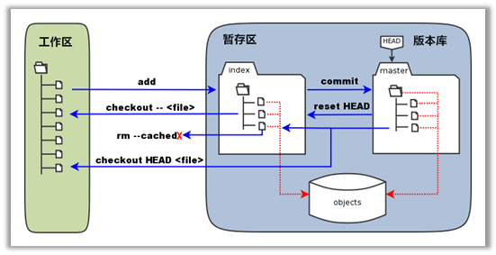


### 命令小结

| 命令                                      | 作用                                       |
| ----------------------------------------- | ------------------------------------------ |
| <span style="color:red">git status</span> | 查看版本库状态                             |
| ==git add .==                             | 添加所有修改到暂存区                       |
| ==git commit -m "注释"==                  | 建立存档并添加注释                         |
| git restore --staged 文件名               | 可以将该文件最新修改在暂存区中移除         |
| git diff                                  | 查看工作区与暂存区的差异（不显示新增文件） |
| git diff --cached                         | 查看暂存区与仓库的差异                     |

#### git status 结果

> 注：空目录不会被git发

- t工作区、暂存区、版本库<font color='red'>三者内容完全一样</font>时

```
nothing to commit, working tree clean
```

- 工作区新增内容

```shell
Untracked files: # 未跟踪的文件
(use "git add <file>..." to include in what will be committed)
	新增文件（红色字体）
nothing added to commit but untracked files present(use "git add to track")
```

- git add 后，加入暂存区

```shell
on branch master
Changes to be commited:(use "git restore --staged <file>..." to unstage)
	new file: 新文件 （绿色字体）
	
# git restore --staged 文件名 => 可以将该文件最新修改在暂存区中移除。
```

> `git ls-files`: 查看暂存区文件列表的命令
>
> `git rm --cached 文件名` ：删除暂存区中的文件

- git commit -m"注释" 
  - 工作区所有的修改，都已经在仓库里了。

```
nothing to commit, working tree clean
```

#### git status 显示的颜色意义

- ==红色==： 这些修改只存在于工作区      => 执行 git add . 和 git commit -m
- <span style='color:green'>绿色</span>：这些修改存在于工作区还有暂存区  => git commit -m

#### git add -A / git add .

- 作用： 将工作区的所有修改都添加到暂存区中

#### git commit

- <font color='red'>git commit -m"注释"</font>
- git commit

```shell
不写-m，直接回车；会弹出一个vim的编辑器。在编辑器中可以写复杂的注释。
注释写在"#"上面的第一行。

按 i 进入插入编辑模式。
Esc 进入命令模式
:wq 保存退出
```

#### 练习

- 新建一个空目录初始化 git
- 新建一个文件 index.html
- 使用 git commit 提交文件（注意：不加 -m选项提交），在vim窗口下编写提交注释

#### git diff

- 工作区与暂存区的差异（不显示新增文件）

- 如果窗口不够大，一屏显示不下，需要按 ↓ 显示后面的内容，按 q 退出。

#### git diff --cached 

- 查看暂存区和仓库的差异

### 小结

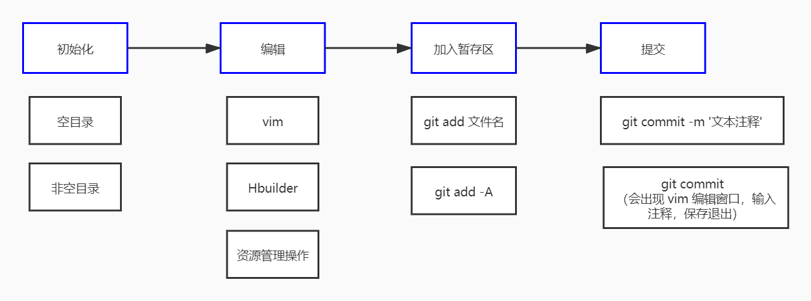

### 版本回滚

Git 可以将项目代码内容切换到历史的任何一个版本

#### 查看历史记录

借助于下面命令，可以查看

```shell
git log
git log --oneline
```

> 如果内容偏多， 需要使用方向键上下滚动， 按 `q` 退出

- git log
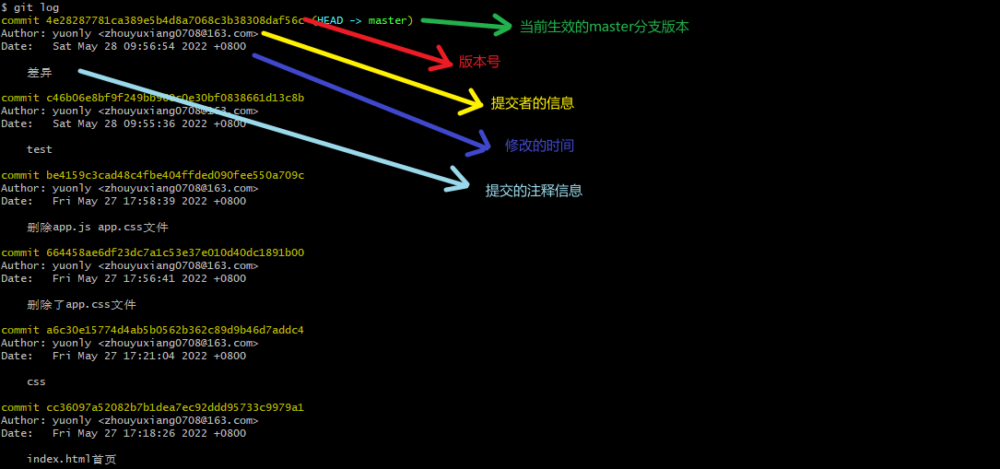

- git log --oneline

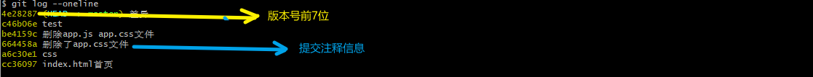

#### 版本回滚   

```shell
git reset --hard  b815fd5a6ae655b521a31a9
```

> <span style="color:red">进行版本回退时，不需要使用完整的哈希字符串，前七位即可</span>
>
> <span style="color:red">版本切换之前，要对工作区内容进行提交  add commit </span>

#### 找不到版本号的情况

> 切回历史版本的时候，该版本之后的版本通过 git log 都不可见了。需要使用 git reflog来查看

查看所有的操作记录

```sh
git reflog
```


### <span style="color:red">配置忽略文件</span>

项目开发过程中有些文件不应该存储到版本库中，这个时候配置忽略这些文件。常见情况有：

1. 临时文件   .swap
2. 多媒体文件，如音频，视频
3. 可执行文件，如 exe 文件
4. 编辑器生成的配置文件  (.idea:webstorm生成的) (.vscode)
5. npm 安装的第三方模块  node_modules


Git 中需要创建一个==文件== 『<font color='red'>.gitignore</font>』 设置忽略，一般与 .git 目录同级，常用规则如下：

```sh
# 以下为.gitignore 文件中的内容
# 忽略所有的 .idea 文件夹 （webstorm编辑器生成的文件夹）
.idea
# 忽略所有以 .test 结尾的文件
*.test
# 忽略 node_modules 文件和文件夹
/node_modules

# 之忽略当前文件夹下的文件（不包括当前目录的子目录，只管当前目录这一层），以斜杠开头
/test.mp4  #只忽略当前文件夹下的test.mp4,别的目录不管

# 通配符
*.mp3 # 忽略所有后缀是mp3的文件

# 让git 发现空文件的
在空文件夹下创建.gitkeep
```

#### 仓库中已经提交该文件

1. 对于已经加入到版本库的文件，可以在版本库中删除该文件

    ```sh
    git rm --cached .idea
    ```

2. 然后在 .gitignore 中配置忽略

    ```sh
    .idea
    ```

3. add  和 commit 提交即可


### <span style="color:red">分支</span>

分支是 Git 重要的功能特性之一，开发人员可以在主开发线的基础上分离出新的开发线。

#### 基本操作

| 命令                 | 作用         |
| -------------------- | ------------ |
| git branch name      | 创建分支     |
| git branch           | 查看所有分支 |
| git checkout name    | 切换分支     |
| git merge name       | 合并分支     |
| git branch -d name   | 删除分支     |
| git checkout -b name | 创建并切换   |

> 注意:  <span style="color:red;font-weight:bold">每次在切换分支前 提交工作区的修改</span>
>
> <font color='red'>练习分支前，务必先创建一个文件，并做一次提交。否则会出现问题。</font>

> ==**切换分支之前，一定要提交到本地库！！！**==


#### <span style="color:red">分支冲突</span>

当多个分支修改同一个文件后，合并分支的时候就会产生冲突，冲突的解决非常简单，『<font color='red'>将内容修改为最终想要的结果</font>』，步骤如下：

1. 定位产生冲突的文件 （git status命令     both modified 标识的文件为有冲突的文件）
2. 修改冲突文件的内容为最终正确的结果
3. git add -A  和 git commit 提交即可

### 关于仓库嵌套

不要在仓库中在建仓库。否则会导致未知的错误。


### 关于git对文件夹的管理

> 如果新建一个文件夹，但没有在文件夹中添加文件。那么git认为工作目录并没有改变。git是不会管理这个空文件夹的。
>
> 解决办法是，在空目录中创建一个文件。
>
> 如果即不想创建文件，又想让git管理这个空目录，可以创建一个 .gitkeep的文件

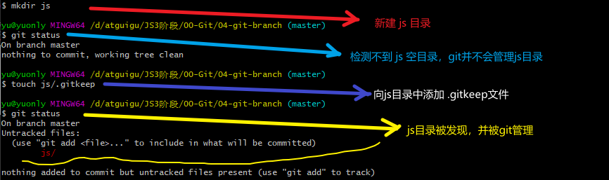


### 码云

> 国内的代码仓库，是一个 Git 仓库管理网站。可以创建远程中心仓库，为多人合作开发提供便利。 

#### 注册码云账号

- 网址：https://gitee.com/signup

- 注册后，绑定邮箱。
  - 设置-》邮箱管理-》新增邮箱-》手机验证后绑定成功


#### 本地有仓库，将本地仓库推送到远程

1. 注册并绑定邮箱

2. 创建仓库

3. 获取仓库地址

4. 本地配置远程仓库的地址

```shell
git remote add origin https://gitee.com/yuonly0528/test01.git

# 地址先使用https://的地址，必须要提供用户名和密码
# 不要使用SSH（后面会介绍），免密的方式。
#git remote 给远端仓库（https://gitee.com/yuonly0528/test01.git）在本地起别名 origin
# origin 就对应着远端仓库的地址了。

#add  添加
#origin 远端仓库的别名
#https://gitee.com/yuonly0528/test01.git    仓库地址
# 如果要删除 origin 别名
git remote remove origin
# 查看都有哪些别名
git remote

# 查看别名对应的仓库地址
git remote -v
```

5. 本地提交（确认代码已经提交到本地仓库）

6. 将本地仓库内容推送到远程仓库

```
git push -u origin master
//
push 推送
-u   关联, 加上以后,后续提交时可以直接使用 git push
origin 远端仓库的别名
master 本地仓库的分支
```


#### git remote

```shell
git remote add origin https://gitee.com/yuonly0528/test01.git
```

- remote 遥远的意思
  - 作用：对远程中心仓库 url 别名的管理
  - 会将远程在库的路径，在本地起一个别名
  - add 添加
  - origin 本地别名
  - https://gitee.com/yuonly0528/test01.git 远程仓库的 URL 地址
- 查看本地所有别名

```shell
git remote
```

- 删除本地别名

```shell
# 删除 origin 别名
git remote remove origin
```

#### 关于 Linux 命令的使用技巧

> 命令后 -h 或者 --help 可以看到命令的帮助信息
>
> git remote -h

#### git push

- 将本地的某个分支推送到某个远端仓库上

```shell
git push -u origin master
# 将本地的master分支，推送到 origin别名对应的远端仓库上
# -u 将本地master分支和 origin别名对应的远端仓库做关联，以后推送只需要直接执行 git push即可
# origin 本地的中心仓库别名，代表的是该别名代表的远程仓库。
# master 本地的分支名称
```

- 创建其他别名推送

```shell
git remote add yuonly https://gitee.com/yuonly0528/test01.git
# 创建一个 yuonly 别名，对应中心仓库 https://gitee.com/yuonly0528/test01.git
touch yuonly.txt
git add .
git commit -m yuonly分支
git push yuonly master # 将本地master分支 推送到 yuonly别名对应的远程仓库
```

- 创建其他分支，推送到远程仓库

```shell
# 创建 atguigu分支
git checkout -b atguigu
# 创建文件
touch atguigu.txt
# 加入版本库
git add .
git commit -m branch-atguigu
git push origin atguigu #将本地atguigu分支，推送到origin别名对应的远程仓库
```

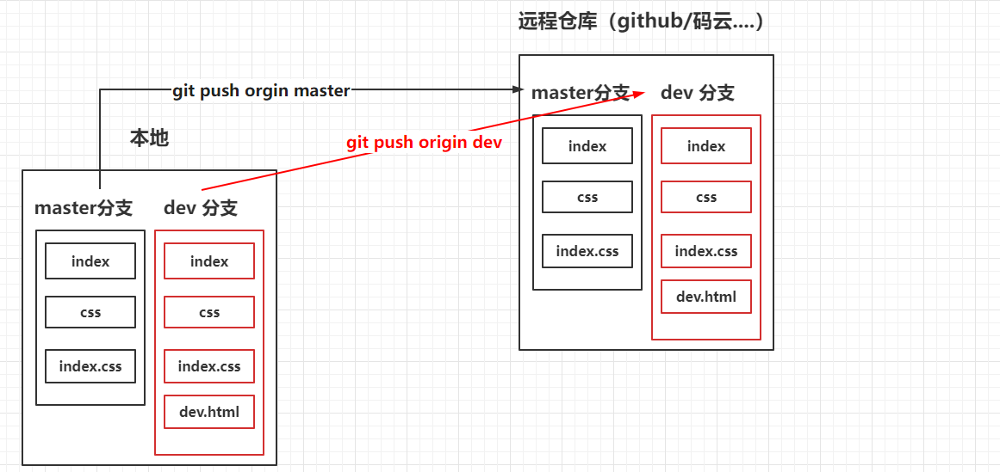

##### 练习

- 要求
  1. 在本地创建一个 Git 仓库，创建master.html 初始化提交
  2. 创建新的dev分支，创建dev.html 并提交
  3. 在码云创建两个仓库，分别为 one 和 two
  4. 将本地的master分支推送到 one仓库，将本地的dev分支推送到 two仓库

#### 本地没有仓库

1. 注册并绑定邮箱
2. 克隆仓库

```shell
git clone https://gitee.com/yuonly0528/test-two.git
```

3. 增加和修改代码
4. 本地提交

```shell
git add .
git commit -m "注释"
```

5. 推送到远程

```shell
git push origin master  (一般直接git push即可，clone的时候会自动关联)
```

> 克隆代码之后，本地仓库会默认有一个远程地址的配置，名字为origin

<font color='red'>注意：不要克隆空仓库，因为空仓库没有重合的地方。多人协作开发时会出问题。</font>


#### <font color='red'>多人合作</font>

##### 账号仓库配置

> 在码云上创建一个组织，为组织添加成员。那么组织的成员就拥有了操作仓库的权利

- 首页 -> 右上角 + 号 --> 创建组织
- 填写组织名
- 组织 -> 设置 -> 成员管理 -> 添加成员 -> 分享链接/二维码 -> 邀请加入

- 可以给组织的成员设置权限（开发者、管理者等）
- 在组织内创建仓库
- 仓库成员管理
- 为当前仓库添加开发者

##### 协作流程

第一次提交

1. 得到 Git 远程仓库的地址和账号密码

2. 将代码克隆到本地（地址换成自己的）

    ```shell
    git clone https://github.com/yuonly/test.git
    ```

3. 切换分支

    ```
    git checkout -b 新分支名
    ```

4. 开发代码

5. 本地提交

    ```shell
    git add -A
    git commit -m '注释内容'
    ```

6. 合并分支

    ```shell
    git checkout master
    git merge 新分支名
    ```

7. 更新本地代码

    ```shell
    git pull
    ```

8. 提交代码

    ```shell
    git push 
    ```

##### 工作流程

第 N 次流程

1. 更新代码

   ```
   git pull
   ```
   
2. 创建并切换分支

   ```
   git checkout -b 新分支名
   ```
   
3. 开发功能

4. 提交

   ```
   git add -A
   git commit -m '注释'
   ```

5. 合并分支

   ```
   git checkout master
   git merge 新分支名
   ```

6. 更新代码

   ```
   git pull
   ```

7. 推送代码

   ```
   git push
   ```

##### 冲突解决

同分支冲突一样的处理，将代码调整成最终的样式，提交代码即可。

- 定位冲突位置  git status
- 改成最终想要的为止；
- git add    git commit -m''


##### ssh 链接仓库（免密提交）

- 生成 ssh-key

```shell
# 任意位置打开git bash终端执行
ssh-keygen
# 默认路径 /c/Users/yu/.ssh/id_rsa
```

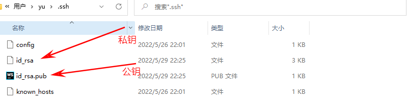

- 将 公钥内的字符串复制

- 码云右上角头像-》设置-》SSH公钥-》添加公钥-》将id_rsa.pub复制到这里

- 克隆仓库

```shell
git clone ssh的克隆地址
```

- 免密对仓库进行操作


### GitFlow

GitFlow 是团队开发的一种最佳实践，将代码划分为以下几个分支

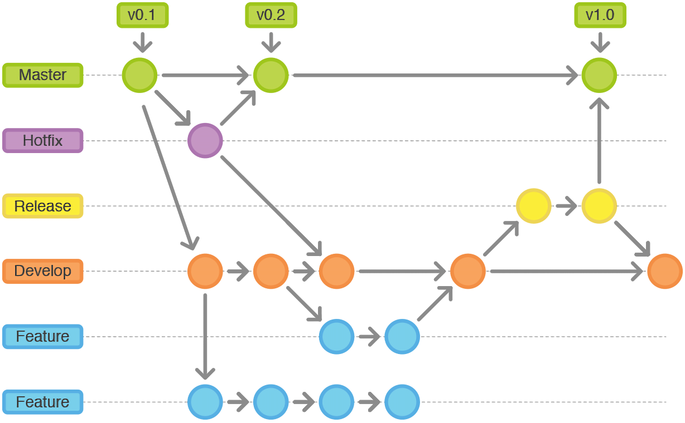

- Master 主分支。上面只保存正式发布的版本
- Hotfix  线上代码 Bug 修复分支。开发完后需要合并回Master和Develop分支，同时在Master上打一个tag
- Feather 功能分支。当开发某个功能时，创建一个单独的分支，开发完毕后再合并到 dev 分支
- Release 分支。待发布分支，Release分支基于Develop分支创建，在这个Release分支上测试，修改Bug
- Develop 开发分支。开发者都在这个分支上提交代码

### 语义化版本

> 版本格式： 主版本号.次版本号.修订号，版本号递增规则如下：

- 主版本号：当你做了不兼容的API修改
- 次版本号：当你做了向下兼容的功能性新增
- 修订号：当你做了向下兼容的问题修正

先行版本号及版本编译元数据可以加到“主版本号.次版本号.修订号”的后面，作为延伸

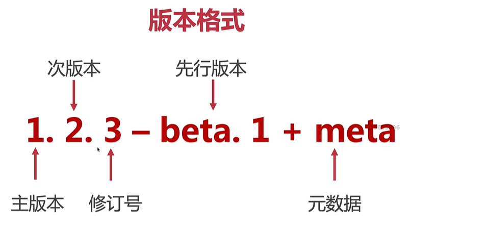

#### 版本名称释义

- alpha：内部测试版本，除非是内部测试人员，否则不推荐使用，有很多Bug
- beta：公测版本，消除了严重错误，还是会有缺陷，这个阶段还会持续加入新的功能
- ```rc```：Release Candidate，发行后选版本。这个版本不会加入新的功能，主要是排错，修改Bug。

- release：发布版本


## 附录

### GitHub

[GitHub](https://github.com/) 是一个 Git 仓库管理网站。可以创建远程中心仓库，为多人合作开发提供便利。 

#### 注册账号

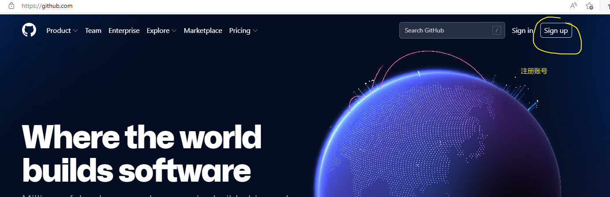

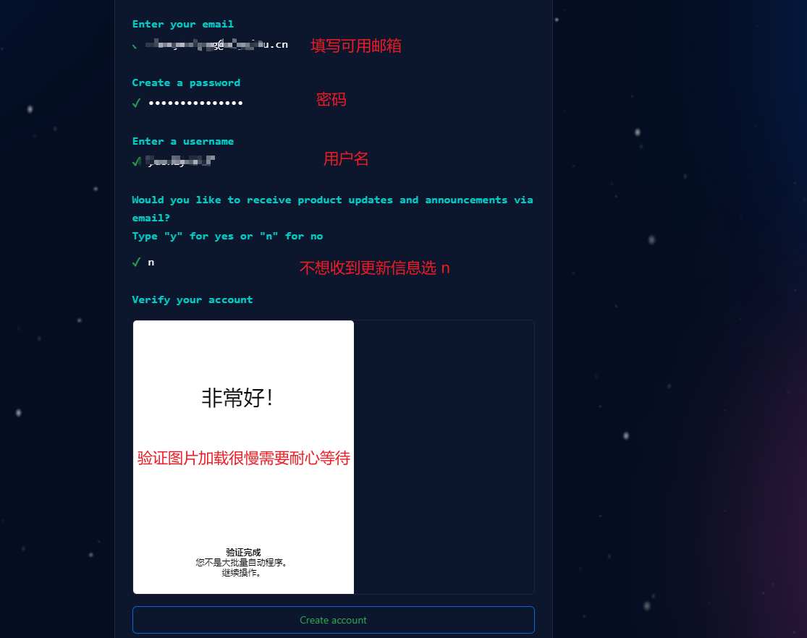

#### 使用流程

GitHub 远程仓库使用流程较为简单，主要有以下几种场景：

##### <span style="color:red">本地有仓库</span>

1. 注册并激活账号

2. 创建仓库

3. 获取仓库的地址

4. 本地配置远程仓库的地址
  
   ```shell
   git remote add origin https://github.com/xiaohigh/test2.git  
   //远端仓库管理   弗拉基米尔·伊里奇·乌里扬诺夫   
   add  添加
   origin 远端仓库的别名
   https://github.com/xiaohigh/test2.git    仓库地址
   ```
   
5. 本地提交（确认代码已经提交到本地仓库）

6. 将本地仓库内容推送到远程仓库
  
   ```shell
   git push -u origin master
   //
   push 推送
   -u   关联, 加上以后,后续提交时可以直接使用 git push
   origin 远端仓库的别名
   master 本地仓库的分支
   ```

##### <span style="color:red">本地没有仓库</span>

1. 注册并激活账号

3. 克隆仓库
  
   ```shell
   git clone https://github.com/xiaohigh/test2.git 
   ```
   
3. 增加和修改代码

4. 本地提交

   ```shell
   git add -A
   git commit -m 'message'
   ```

5. 推送到远程

   ```shell
   git push origin master
   ```

> 克隆代码之后， 本地仓库会默认有一个远程地址的配置， 名字为 origin
#### <span style="color:red">多人合作</span>

##### 账号仓库配置

GitHub 团队协作开发也比较容易管理，可以创建一个组织

- 首页 -> 右上角 `+` 号-> new Organization
- 免费计划
- 填写组织名称和联系方式（不用使用中文名称）
- 邀请其他开发者进入组织（会有邮件邀请）

* 点击组织右侧的 settings 设置
* 左侧 Member privileges
* 右侧 Base permissions 设置 write 👌

##### 协作流程

第一次提交

1. 得到 Git 远程仓库的地址和账号密码

2. 将代码克隆到本地（地址换成自己的）

    ```shell
    git clone https://github.com/xiaohigh/test.git
    ```

3. 切换分支

    ```
    git checkout -b 新分支名
    ```

4. 开发代码

5. 本地提交

    ```shell
    git add -A
    git commit -m '注释内容'
    ```

6. 合并分支

    ```shell
    git checkout master
    git merge 新分支名
    ```

7. 更新本地代码

    ```shell
    git pull
    ```

8. 提交代码

    ```shell
    git push 
    ```

##### 工作流程

第 N 次流程

1. 更新代码

   ```
   git pull
   ```
   
2. 创建并切换分支

   ```
   git checkout -b 新分支名
   ```
   
3. 开发功能

4. 提交

   ```
   git add -A
   git commit -m '注释'
   ```

5. 合并分支

   ```
   git checkout master
   git merge 新分支名
   ```

6. 更新代码

   ```
   git pull
   ```

7. 推送代码

   ```
   git push
   ```

##### 冲突解决

同分支冲突一样的处理，将代码调整成最终的样式，提交代码即可。

### Git 官方书籍

[https://git-scm.com/book/zh/v2/](https://git-scm.com/book/zh/v2/起步-关于版本控制)

### .git 目录

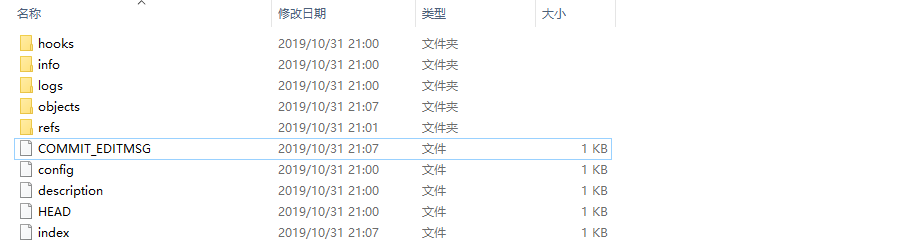

* hooks 目录包含客户端或服务端的钩子脚本，在特定操作下自动执行
* info 信息文件夹. 包含一个全局性排除文件，可以配置文件忽略
* logs 保存日志信息
* objects <span style='color:red'>目录存储所有数据内容</span>,本地的版本库存放位置
* refs 目录存储指向数据的提交对象的指针（分支）
* config 文件包含项目特有的配置选项
* description 用来显示对仓库的描述信息
* HEAD 文件指示目前被检出的分支
* index 暂存区文件，是一个二进制文件  (git ls-files)

> 切记： <span style="color:red">不要手动去修改 .git 文件夹中的内容</span>

### CRLF

CRLF 是Carriage-Return Line-Feed 的缩写。

CR 表示的是 ASCII 码的第 13 个符号 \r 回车，LF 表示的是 ASCII 码表的第 10 个符号 \n 换行。

每个操作系统对回车换行的存储方式不同

* windows 下用 CRLF（\r\n）表示
* linux 和 unix 下用 LF（\n）表示
* mac 系统下用 CR（\r）表示


### 

### 常见错误

#### 合并分支错误（没有相同的历史）

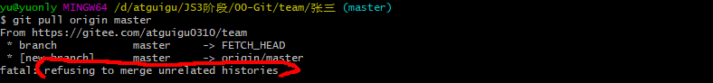

- 原因是两个仓库不同而导致的，需要在后面加上--allow-unrelated-histories进行允许合并，即可解决问题

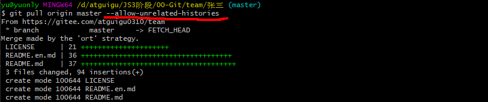

#### 回车换行转换问题

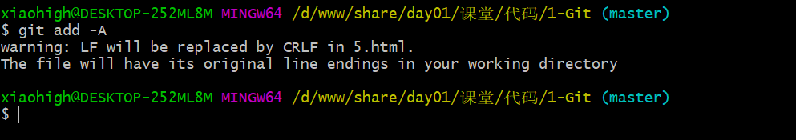

这个问题主要是 Git 在你提交时自动地把回车（CR）和换行（LF）转换成换行（LF），没有影响，<span style="color:red">这里建议大家保留这个状态</span>。可以通过下面的命令设置不转换，但是不推荐

```sh
git config --global core.autocrlf false // 不推荐
```

#### 提交报错

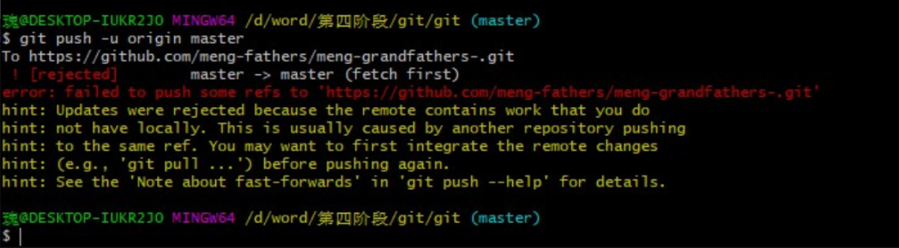

其他人已经提交过，本地代码需要更新，首先运行 `git pull` 命令

#### 冲突提醒

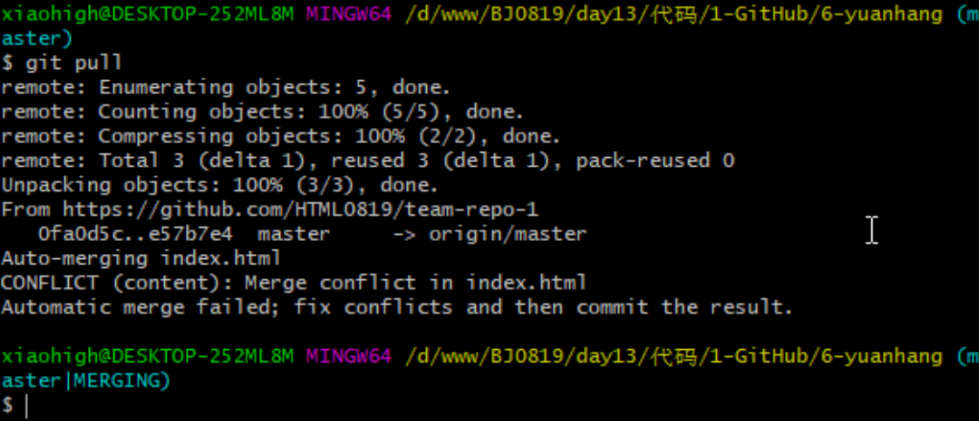

#### 提交错误

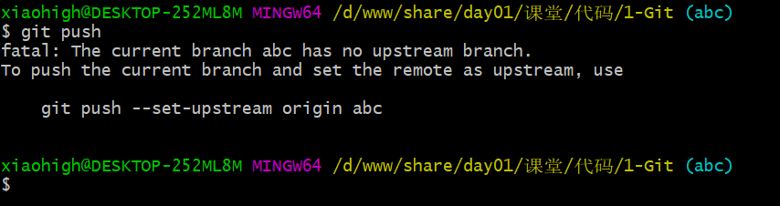

如果第一次将本地仓库分支提交到远程时，直接使用 `git push` 可能会报这个错误，解决方法

```sh
git push -u origin master
```

#### 提交错误

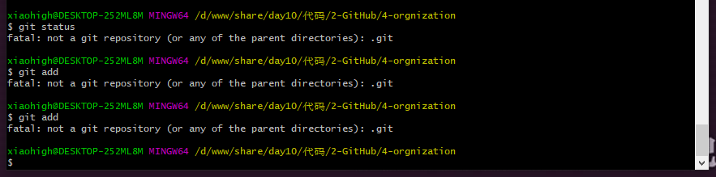

当前所在文件夹不是一个 git 仓库目录，切换目录工作

#### 没有重合，无法拉取无法推送

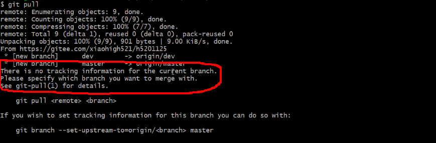

###### 解决方式一：强行推送本地的覆盖远端的

- <font color='red'>确定只保留本地仓库，覆盖远端仓库的情况，可以强推</font>

```shell
git push origin master -f
# -f force 强制
# 注意：强制推送会用本地的完全覆盖远端仓库内容。（请确保远端没有重要数据执行）
```

######  解决方式二：拉取远端的合并本地分支

- 远端和本地数据都想要，可以拉取远端数据合并到本地分支后在推送

```shell
git pull origin master --allow-unrelated-histories
# --allow-unrelated-histories 允许没有相同历史的合并
# 这里的origin 是别名 必要时可以更改；
git push origin master
```


### 找不到 .git 的方法

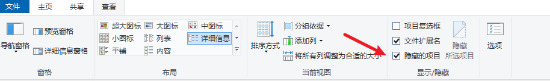


### 记住密码和每次输入密码

- 记住密码：输过一次以后不用在输了

```shell
git config --global credential.helper store
```

- 不记住密码，每次都要输入

```shell
git config --global credential.helper unstore
```

### 删除全局及当前目录 用户名和邮箱

```shell
# 删除全局用户名、邮箱
git config --global --unset user.name
git config --global --unset user.email

# 删除当前目录用户名、邮箱
git config --unset user.name
git config --unset user.email
```

工作的时候git的账号和密码用的是公司发的，第一次要卸载记住密码的配置，输入一次之后再设置记住密码；