# HTML

### 一、先导知识

#### 1、计算机概念

> 硬件：看得见，摸得着的，如：CPU，显卡
>
> 软件：
>
> 		系统软件
> 	
> 		应用软件


#### 2、b/s 结构和c/s结构

* b/s：(浏览器/服务器):对用户操作更加友好；不需要安装

  	B:browser

    	S:server

* c/s：(客户机/服务器)：安全性更高；需要安装

  	C:client

    	 S:server

#### 3、建站流程


l	

```
网站制作流程：
1. 注册域名（网址）：http://www.baidu.com
2. 租用服务器：服务器其实就是一台电脑，里面会储存很多数据
3. 网站制作：
   	-> 产品经理：整理资料，部署网站，提需求
   	-> UI ：网页设计
   	-> 前端：用代码的形式把设计稿还原在浏览器上
   	-> 后台（端）：数据处理，功能实现
	-> 测试：检查有没有bug
	-> 上线
	
	-> 新的开发方式：前后端分离（UI、前端、后端同时进行）：大大节省时间成本
	
4. 推广：
	-> 付费的：效率高，同事也很烧钱
	-> 免费的：通过代码对网页进行优化（SEO）；提升网站的搜索率
	
5. 运维：（网站维护）
	->网站升级
	->更新，修改……
```


什么是前端和后端？

前端和后台的关系：

		**前端：**客户端，离用户比较近，所以称之为前端，前端做的事用户可以直接看的到的；
	
				实现前端页面的技术：
	
						html
	
						css
	
						javascript


		**服务端**：主要操控服务器，后台做的事，用户一般不能直接看的到


		通过前端发出请求给后台，后台接收到请求之后，在服务器中找到相关的数据，返回给前端（客户端）并显示在前端页面上；


### 二. 网页及浏览器

web : world wide web  

		万维网 or互联网or广域网
	
		简称：web 、3w  、www
	
		在软件开发中，可以把web理解为是无数个网站的集合，构成了一个互联网；


#### 1 、网站及网页

1. 网站是由多个网页组成的，也可以理解为网站是很多个网页的组合。

   

2. **==网页==**是由多文本、图片及超链接等组成的。

   

3. 网页要通过**浏览器**来阅读

   

#### 2、 常见浏览器

	浏览器是网页运行的平台，常见的浏览器有` IE` 、`火狐（Firefox）`,`谷歌（Chrome）`,`Safari`和`Opera`等，我们平时称为五大浏览器，第六个是`Edge`浏览器，是微软改进IE新出的内置浏览器


**主流浏览器**


#### 3 、全球浏览器 市场占有率


五大浏览器都有各自的内核,国产浏览器使用的都是五大厂商中的一个或者两个浏览器内核

#### 4、 浏览器内核

浏览器内核(引擎):  将代码渲染成效果

| 内核                |                  特点                   | 代表作品 |
| :------------------ | :-------------------------------------: | -------- |
| Trident             |               不能跨平台                | IE浏览器 |
| Gecko               |                  开源                   | firefox  |
| webkit              |                  开源                   | safari   |
| webkit ->blink      |           blink基于webkit开发           | Chrome   |
| presto(Opera前内核) | Opera现已改用Google Chrome的Blink内核。 | Opera    |

开发时的作用：浏览器是为了看运行结果和代码调试

因为浏览器使用的内核不同，开发商不同，技术不同，为了自身利益，还会设计一些技术壁垒，这些都会导致代码在页面上显示不一致的情况；但是我们得克服这个问题，要让代码在浏览器上显示一致，所以我们得做浏览器兼容

		兼容主流浏览器：IE，dege，谷歌，欧朋，火狐

**页面图例**


### 三、网页的组成


* 网页的结构：


   		html是结构的统称(xml,xhtml,html),扩展名是以.htm 或者 .html;

   		是标志性语言，是用来显示页面信息的；

   * 网页的表现：

   		css  主要就是来修饰html结构标签的，让他们显示的更加美观好看，装饰用的；

   		css的扩展名：.css

   - 网页的行为：

   		javascript:  主要用来设置用户与网页的互动，标志着是否有吸引人的行为，主要是实现数据处理和交互效果；

   		javascript扩展名：.js

### 四、WEB标准

* 结构标准：xml、xhtml、html  最新的html标准是html5；结构统称为html，结构文件扩展名为:html  或者 .htm
* 表现标准：css  层叠样式表                                脚本语言
* 行为标准：DOM,ECMAScript(主要是js)           脚本语言

脚本语言：不能独立运行，必须依附于某一个文件，比如html;


```txt
WEB标准是网页制作的标准，是根据网页的不同组成部分生成的一系列标准。这些标准大部分由W3C起草发布，也有部分标准由ECMA起草发布
```


							                                HTML5

```txt
1、W3C（了解即可）全称:World Wide Web Consortium 万维网联盟，创建于1994年是Web技术领域最具权威和影响力的国际中立性技术标准机构；是专门负责网络标准制定的非赢利组织。制定了结构标准和样式标准；
2、ECMA（了解即可）全称： European Computer Manufacturers Association,欧洲计算机制造商协会，是一个开发计算机硬件、通信和程序语言标准的非盈利组织；制定了行为标准；
```


### 五、编辑器


#### **vscode的安装**

1. 双击：

   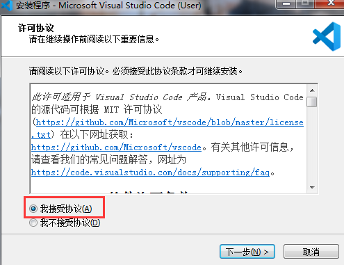

   

2. 选择安装位置：

   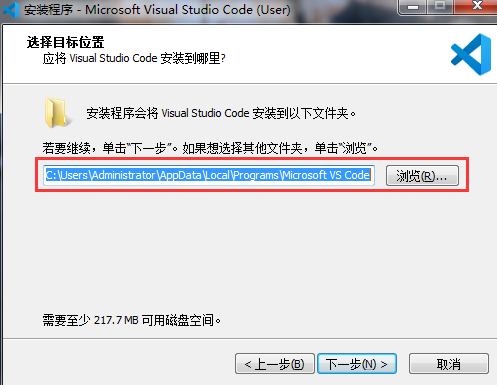

3. 默认名字即可

   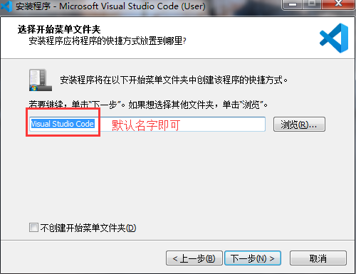

4. 其他任务要注意：

   

   ①将“通过code 打开“操作添加到windows资源管理器文件上下文菜单

   ②将“通过code 打开”操作添加到windows资源管理器目录上下文菜单

   说明：①②勾选上，可以对文件，目录点击鼠标右键，选择使用 VScode 打开。

   ③将code注册为受支持的文件类型的编辑器

   说明：默认使用 VScode 打开诸如 txt,py 等文本类型的文件，一般建议不勾选。

   让 VScode 支持的代码文件全部变成 VScode 默认打开，文件图标也会随之更改，很好辨认。

   ④添加到PATH（重启后生效）

   说明：这步骤默认的，勾选上，不用配置环境变量，可以直接使用。

5. 最后一步：

   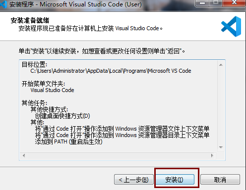

6. 打开编辑器：

   

#### 使用vscode编译器

> 使用vscode打开html文件的时候必须要把文件存储到文件夹中，然后通过vscode打开文件夹才可以访问文件夹下的文件，不可以直接通过vscode打开文件。

使用vscode打开文件的三种方式：

+ 在文件夹上鼠标右键，打开方式选择vscode
+ 点击vscode文件选项卡，然后点击打开文件夹，选择对应文件夹
+ 拖拽文件夹到vscode

#### 插件

7.vscode需要安装的插件 :


> live server(右击html启动一个本机服务)：**(会自动更新，会另外生成一段js代码)**
>
> 如果代码没错但是页面显示不正确，可以试试open in browser

	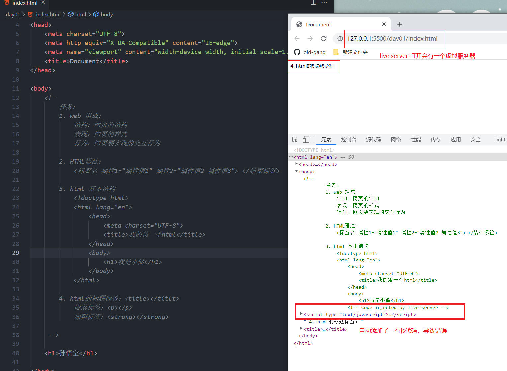

~~~
Live Server：一个具有实时加载功能的小型服务器，可以使用它来破解html/css/javascript，但是不能用于部署最终站点。也就是说我们可以在项目中实时用live-server作为一个实时服务器实时查看开发的网页或项目效果。
~~~

	open in browser(右击html文件在浏览器打开)  ： 不会自动更新，不生成额外的代码
	
	chinese(中文)
	
	vscode-icons（图标插件）


​	  

#### 常用快捷键

		Ctrl+N  新建   Ctrl+C  复制   Ctrl+V  粘贴  Ctrl+A  全选    Ctrl+Z  撤销     <u>Ctrl+Y  撤回（取消撤回）</u>   Ctrl+S  保存   
	
		Ctrl+/  添加/删除注释 


 关闭最大的文件夹：文件--> 新建窗口-->然后关闭  


#### 创建站点：

~~~
规划网站的所有内容和代码
整合资源
~~~

* images文件夹：存放页面要用到的图片

* css文件夹：存储css文件

* js文件夹：存储js文件

* html文件夹：存储其他html文件（除了首页的index）

* index.html文件：网站首页


### 六、文件的命名规范

+ 小写英文字母，或者英文字母、数字、连接符、下划线的组合；
+ 其中不得包含汉字(传到服务器会报错)、空格和特殊字符；
+ 必须以英文字母开头；
+ 不可以数字开头

  注：只要是语法上的标点符号，都要使用英文输入法的符号


### 七、HTML

```txt
超文本指用超链接的方法，将各种不同空间的文字信息组织在一起的网状文本，也指页面内可以包含图片、链接，甚至音乐、程序等非文字元素

标记语言是一种将文本以及文本相关的其他信息结合起来，展现出关于文档结构和数据处理细节的电脑文字编码

	HTML 指的是超文本标记语言 (Hyper Text Markup Language) www万维网的描述性语言(标记语言)。它包括一系列标签．通过这些标签可以将网络上的文档格式统一，使分散的Internet资源连接为一个逻辑整体。HTML文本是由HTML命令组成的描述性文本，HTML命令可以说明文字，图形、动画、表格、链接等。展现出关于文档结构和数据处理细节的电脑文字编码

	XHTML指可扩展超文本标记语言（EXtensible HyperText Markup Language）是一种置标语言，表现方式与超文本标记语言（HTML）类似，不过语法上更加严格。算是HTML和XML的结合体。

	HTML5指的是HTML的第五次重大修改（第5个版本）
```

#### 1、HTML发展


~~~
1、IETF（了解即可）全称：Internet Engineering Task Force（国际互联网工程任务组），成立于1985年底，是全球互联网最具权威的技术标准化组织，主要任务是负责互联网相关技术规范的研发和制定，当前绝大多数国际互联网技术标准出自IETF
2、WHATWG（了解即可）全称：Web Hypertext Application Technology Working Group（网页超文本应用技术工作小组）网页超文本应用技术工作小组是一个以推动网络HTML 5 标准为目的而成立的组织。在2004年，由Opera、Mozilla基金会和苹果这些浏览器厂商组成。
~~~

W3School（一个知名学习网站）：https://www.w3school.com.cn/

### 八、HTML5基本结构

#### 1、HTML的基本结构


#### 2、HTML的文档结构

<!DOCTYPE html> 告诉浏览器应该以什么方式来解释这个文档。

~~~
在HTML5中使用：`<!DOCTYPE html>`，因为HTML5是向前兼容的，所以现在就直接使用这种方式。
注意：
    1. 必须放在第一行。
    2. 不区分大小写
      <!DOCTYPE html>
      <!doctype html>
      <!DOCTYPE HTML>
~~~


lang=""  定义语言

		en：英语
	
		zh：中文


####  3、Meta 元信息 

		meta 关于当前网页的信息，我们可以使用 `<meta>` 标签定义 HTML 页面的元信息。

##### 3.1、Meta 标签属性的使用

- content 属性定义与 http-equiv 属性或 name 属性相关的元信息。

- name 属性把 content 属性关联到一个名称。

  > name 属性常见的值：
  >
  > 	author  规定文档的作者的名字。
  > 	
  > 	description  规定页面的描述。搜索引擎会把这个描述显示在搜索结果中。
  > 	
  > 	keywords  规定一个逗号分隔的关键词列表 - 相关的网页（告诉搜索引擎页面是与什么相关的）。
  > 	
  > 	generator  规定用于生成文档的一个软件包（不用于手写页面）。
  > 	
  > 	revised  该属性表示该网页文档最后修改的时间。
  > 	
  > 	others

  ```html
  <meta name="description" content="我是小储">
  ```

  

- http-equiv 把 content 属性关联到 HTTP 头部信息。

  > http-equiv 属性常见的值：文件头作用，它可以向浏览器传回一些有用的信息，以帮助正确和精确地显示网页内容。
  >
  > content-type     规定文档的字符编码。
  >
  > expires  设定网页的到期时间。一旦网页过期，必须到服务器上重新传输
  >
  > refresh         定义文档自动刷新的时间间隔。
  >
  > set-cookie    如果网页过期，那么存盘的cookie将被删除。

- charset 属性定义字符集编码。

  > 常见字符集编码：
  >
  > gb2312 简单中文  包括6763个汉字
  >
  > BIG5      繁体中文 港澳台等用
  >
  > GBK       包含全部中文字符，是GB2312的扩展，加入对繁体字的支持，兼容GB2312
  >
  > UTF-8     万国码，包含全世界所有国家需要用到的字符，以后我们统统使用UTF-8 字符集这样就避免出现字符集不统一而引起乱码的情况了

##### 3.2 、案例

~~~html
	告诉IE浏览器，IE8/9及以后的版本都会以最高版本IE来渲染页面。
	<meta http-equiv="X-UA-Compatible" content="IE=edge">
    
    编码字符集
    <meta charset="utf-8">  HTML5 支持 HTML5向下兼容
    <meta http-equiv="content-type" content="text/html;charset=utf-8" /> HTML 4支持

    网页关键字：
    <meta name="keywords" content="8-12个以英文逗号隔开的单词/词语">

    网页描述信息
    <meta name="description" content="80字以内的一段话，与网站内容相关">

    所有搜索引擎，抓取这个页面、爬行链接、禁止快照：  
    <meta name="robots" content="index,follow,noarchive">
      all：文件将被检索，且页面上的链接可以被查询；
      none：文件将不被检索，且页面上的链接不可以被查询；
      index：文件将被检索；
      follow：页面上的链接可以被查询；
      noindex：文件将不被检索，但页面上的链接可以被查询；
      nofollow：文件将被检索，但页面上的链接不可以被查询；
      noarchive：文件将被检索，但禁止保存快照；

    网页作者：
    <meta name="author" content="obama">

    网页网页生成工具 
    <meta name="generator" content="Sublime Text3">

    定义页面最新版本 
    <meta name="revised" content="David, 2008/8/8/" />

    网页版权信息：
    <meta name="copyright" content="2009-2014©版权所有">

    网页刷新信息：(10秒后跳转到百度页面)
    <meta http-equiv="refresh" content="10;url=http://www.baidu.com">   

    注：一个页面可以有多个meta标签
~~~

#### 4、HTML书写规范及语法

+ **HTML语言组成**

  + 标签

    + ```txt
      写在尖角号<>里的第一个单词，叫做标记，也叫做标签，也称作元素；
      ```

  + 属性

    + ```
      标记和属性用空格隔开，属性和属性值用等号连接，属性值必须放在双引号内
      一个标记可以有多个属性，属性和属性之间用空格隔开，属性不分先后顺序
      ```

+ **HTML语法**

  html标签分为两种
  
  + 常规标记(双标记)：有开始标签，也有结束标签
    <标记名称 属性1="属性值"  属性2="属性值" ………… ></标记名>
    
  + 空标记（单标记）：只有开始标签，没有结束标签
    
    <标记名 属性1="属性值  属性2="属性值2" >
    
    + \<br>   or   \<br />都可以
  
  html语法：
  
  			<标记 属性="属性值" 属性="属性值1 属性值2"> </标记>
  
  说明：
  
  1. 只要是<>里的第一个单词，我们称之为 标签、标记、元素；
  2. 标记可以没有属性，也可以有多个属性；
  3. **标记**和**属性**之间要用空格隔开；  ` <input type="radio" name="gender" value="male">`
  4. 当一个标记有多个属性的时候，**属性**和**属性**之间要用空格隔开；
  5. 属性和属性值之间要用等号连接；
  6. 属性值必须要写在双引号（或单引号）里；
  7. 当一个属性有多个属性值的时候，属性值和属性值之间要用空格隔开；` border="1px solid red"` 
  


==注==：

	**属性：**指的是标签所具有的属性，都是规定好的，直接使用即可
	
				写在标签上面属性都属于html（结构）的属性，很少用，大部分都是用css属性
	
				写html属性值时可以带单位，也可以不带单位
	
	**属性值：**法定属性值，已经规定好的属性值，直接使用即可；
	
					数值加单位，200px  或  %  在html里数值也可以不加单位；
	
					颜色值，英文单词（red,yellow,blue,green……），十六进制，rgb();


+ **HTML标签之间的关系**

  - 嵌套关系
  - 并列元素（同辈关系、兄弟关系）


注：常规标签可以嵌套，但不能交叉嵌套

```html
错误嵌套：
<b><i></b></i>
正确嵌套
<b>
	<i></i>
</b>
```

==注：== p标签 和 h1~h6 不能嵌套自己，也不能嵌套其他块元素


### 九、常用标签

#### 1、文本标签

##### **1-1、文本标题标签**

文本标题标签和title不一样~

```html
文本标题共有6个（h1-h6）
<h1>一级标题</h1>(唯一性,一般放网站LOGO)   //可以将文字大小设置为0，隐藏文字，SEO
<h2>二级标题</h2>
...
<h6>六级标题</h6> 
```

##### **1-2、字体倾斜&加粗标记**

```html
文本倾斜:
	<i></i>
	<em></em> 语义化（更加强调）
	
文本加粗：
	<b></b>    普通加粗
	<strong></strong>  语义化（更加强调）
注：显示效果一样，但是strong更具强调作用，是语义化标签，浏览器更喜欢哦~	
```

##### **1-3、下划线&删除线**

```html
下划线：
    <u></u>    
    <ins></ins>语义化（更加强调）

删除线：(可用于划除价格等……)
    <s></s> 
    <del></del> 语义化（更加强调）
```

##### **1-4 、 换行&水平线**

```html
<br>  换行
<hr>  水平线 (！！！是块状元素)
```

##### **1-5 、段落标记**

```html
<p></p>
```
**注：p标签自带段间距** 


##### **1-6、字符 （ 小段文本 ） 文本节点**  

```html
<span></span>
```

>  注：没有默认样式；


##### **1-7、 常用转义字符** 

```html
&nbsp;      不换行空格
&gt;        > 右尖括号
&lt;        < 左尖括号
&copy;      © 版权符号
```

注：

		浏览器会忽略网页上的空格(键盘上敲得) 和 回车
	
		如果空格和回车是在文本中间或者是行内元素之间出现的，浏览器会保留一个空格的位置显示出来。


> 块状元素：独占一行，自上而下排列
>
> 行内元素：和文本一样，自左向右排列


##### 1-8、 上标，下标

```html
下标：
        <sub></sub>
上标：
        <sup></sup>
  （看肚子在哪儿）
```


#### 2、列表

使用场景：当页面布局有规律的时候，或者每一个都长得一样的时候，就可以使用列表标签

		（1） 无序列表

```html	
	<ul>
          <li>列表项内容</li>
          <li>列表项内容</li>
          <li>列表项内容</li>
			   ........   
    </ul>
```

		（2）有序列表

```html
	<ol>
          <li>列表项内容</li>
          <li>列表项内容</li>
          <li>列表项内容</li>
			   ........   
    </ol>
```

		（3）自定义列表

```html	
	<dl>
		<dt>名词</dt>    //大哥
		<dd>解释</dd>    //小弟
        <dd>解释</dd>
           ......
	</dl>
```

#### 3 、超链接

```html
语法：
	<a href="要跳转到的地址"></a>
	
属性：
	(1)	href = '属性值'

		 "#" 或者""  代表空连接；不会跳转会刷新当前页面
		    
		 相对路径     实现本地的页面和页面之间跳转，
			
          #id名      还可以是指向HTML文件中的某一个位置。（锚点链接）
            	给跳转对象父元素添加id属性， href="#id名"
            	
            url          还可以是Email地址。
            
	(2)	target = '_blank  新窗口打开  /  _self'  当前窗口打开（默认值）; 
        
打开方式:target=" ";
			_blank ： 将链接内容在新的浏览窗口中打开。 
            _self  ： 将链接的内容，显示在目前的窗口中。 (默认)
            _parent ：将链接的内容，当成文件的上一个画面。需要在框架集中使用 （了解即可）
            _top ： 这个参数可以解决新内容被旧框窗包围的困扰，使用这参数，会将整个画面重新显示成链接的画面内容。你的网页在框架内，这个网页上有一个链接target设成_top，点击此链接时，目标网页就会在当前浏览器中打开，而框架会消失；（了解即可）
    注：当target=""的属性值为空是，在当前窗口打开
            
	(3)	title = '文本提示'
		
	(4)	download='下载文件的名称' 属性用来设置下载文件的名称(firefox/chrome支持) ；h5新增属性
	

使用场景：
	连接地址：
		<a href="http://www.atguigu.com/">尚硅谷</a>
	下载文件：
		<a href="atguigu.zip">下载一个zip压缩文件</a>
		
		<a href="atguigu.zip" download="自己起名字.扩展名">下载一个zip压缩文件</a>
		
		注：如果href里添加的是 txt, png, jpg等这些浏览器支持直接打开的文件是不会执行下载任务的，而是会直接打开文件，这个时候就需要给a标签添加一个属性“download”；
		

	拓展：		
		 网站链接       <a href="http://www.atguigu.com">尚硅谷</a>
         电子邮件       <a href="mailto:chenyanqiu@atguigu.cn">写信给我</a>
         			   电脑要安装有:foxmail或outlook等电子邮件发送软件,并设置为默认为首选.
         手机电话       <a href="tel:10086">10086</a>
         短信信息       <a href="sms:10086">发短息给我</a>
         
         <base />   标签为页面上的所有链接规定默认地址或默认目标。	 
             例：<base href="相对基准地址" target="_blank" />	 
             注：
             	1、<base> 标签必须位于 head 元素内部。
             	
             	2、base里的href地址是一个相对基准地址，使用了之后，在页面的内的所有相对路径前就都会添加上base里的地址，然后咱们所调用的图片、超链接、音乐什么的，就不用填写完整的文件夹地址，写上图片名、歌名就行了，他会在你的地址前添加上base里面的地址；（一般不会设置href属性，对绝对路径不影响）
                3、target="_blank" 一般是设置超链接的打开方式
                     
```


#### 4 、图片

```html

	属性：
		src = 'url'; 图片路径
		
		alt = ""  提示作用，提示用户、提示浏览器
        注：alt里的属性值，是在图片因某种情况加载不出来的时候，显示在图片所在位置(在seo优化角度，必须要有)
        
        title = '文本提示'：
        标题属性，提示作用，所有标签都可以添加的属性；(超链接和图片用的比较多)鼠标经过时会显示title的属性值；
        
		width = '' 宽度
		height = '' 高度
		border = ''  边框  (已废弃)
		
```

#### 5、路径

* 绝对路径：从根源出发，寻找目标文件

  	网页上的绝对路径：https://www.mi.com/

    	本地的绝对路径：D:\前端开发\笔记\html笔记

* 相对路径：当前文件和目标文件的相对关系

```txt
	/   :   写在路径中间，代表的是里面的，被包含的意思
			写在最前面表示从根目录出发
	./  :  从当前位置出发   和不写的效果是一样的
	../ :  返回上一层
```

#### 6、div  作用：区域划分

~~~html
<div class="header"></div>
<div class="main">
	<div class="main-left"></div>
	<div class="main-center"></div>
	<div class="main-right"></div>
</div>
<div class="footer"></div>
~~~

#### 7 、 HTML注释 

```html
<!-- 注释语句 -->
作用：1、隐藏代码
	 2、提示作用
	 3、条件注释：条件注释只能在IE下使用，IE5~IE9可以使用
        <!--[if IE 8]>
            如果你是IE8的浏览器才可以访问。
        <![endif]-->
```

#### 8、文本标签（了解）

以下这些标签不常用，甚至有的已经在`HTML5`中已经移出了，我们 **了解** 即可：

1. `cite`标签：用于引证、举例等，通常为斜体字。

   ```html
   <div>
   	故事里的小黄花<cite>《周杰伦》</cite>从出生那年就飘着。
   </div>
   ```

2. `dfn`标签：用于标记特殊术语或定义新名词。

   ```html
   <div>
   	给大家说一个新的网络词汇：<dfn>年轻人不讲武德，耗子尾汁</dfn>
   </div>
   ```

3. `code`标签：用于包裹一段代码。

   ```html
   <div>
   	15天之后，学习了JavaScript了，我就会写出下面这句代码了：<code> console.log(220314) </code>
   </div>
   ```

4. `samp`标签：用于从正常的上下文中，将某些短字符序列提取出来，例如：标识计算机程序输出。

   ```html
   <div>
     那天我好奇，看了个有意思的网站，随后我的电脑就弹出了：<samp>恭喜，喜提病毒一枚！</samp>
   </div>
   ```

5. `kbd`标签：用于定义键盘文本，表示文本是从键盘上键入的，经常用在与计算机相关的手册中。

   ```html
   <div>
   	最后一步，我们在密码框中输入：<kbd>123456</kbd>就可以了。
   </div>
   ```

6. `abbr`标签：用于定义缩写，要配合`title`属性。

   ```html
   <div>
     有一次我玩 <abbr title="League of Legends">LOL</abbr>输了，我把键盘砸了！
   </div>
   ```

7. `bdo`标签：更改文本方向，要配合`dir`属性，可选值: `rtl` 、 `ltr`（默认值）。

   ```html
   <div>
   	“你是年少的欢喜”，这句话反过来念就是：<bdo dir="rtl">“你是年少的欢喜”</bdo>
   </div>
   ```

8. `var` 标签：用于定义变量，可以与`pre`标签、 `code` 标 配合使用。

   ```html
   <div>
   	等学了JavaScript后，我第一件事就是去定义一个女朋友，存在<var>a</var>变量中。
   </div>
   ```

9. `small`标签：标签呈现小号字体效果。

   ```html
   这是一个
       <small>
            小字号
       </small>
   的字体。
   ```


10. `q`标签定义短的引用,浏览器经常在引用的内容周围添加引号

```html
这是一个
       <q>
         带双引号的
       </q>
的字体。
```

11.`blockquote`标签定义块引用,浏览器在 blockquote 元素前后添加了换行，并增加了外边距。

```html
这是一个
       <blockquote>
         引用块
       </blockquote>
的字体。
```

12.`address` 标签定义文档或文章的作者/拥有者的联系信息

```html
这是一个
       <address>
          lijing@atguigu.cn
       </address>
的字体。
```

13、marquee 滚动字幕标签

~~~html
<marquee width="200" height="150" bgcolor="skyblue" behavior="slide" direction="left">
    欢迎光临尚硅谷
</marquee>

属性：
    behavior 设置文本在 marquee 元素内如何滚动
        scroll         卷轴（默认）     
        slide          滑落（滑到左边停止）
        alternate      交替（左右滑动）
    loop  设置滚动的次数。如果未指定值，默认值为 −1，表示 marquee 将连续滚动
    direction 设置 marquee 内文本滚动的方向。
         left  (默认值) 向左
         right  向右
         up     向上
         down   向下
~~~

14.被删除的字体

```html
<font>     H5已删除 字体标签，可以通过标签的属性指定文字的大小、颜色及字体等信息
<tt>       H5已删除 打字机文字
<big>      H5已删除 大型字体标签
<strike>   H5已删除 添加删除线
<acronym>  H5已删除 首字母缩写 请使用<abbr>代替
```


#### 9、框架标签

iframe 元素会创建包含另外一个文档的内联框架(即行内框架).

 iframe 内联框架(默认情况下和行内元素在一排显示，是内联块元素)

      作用：可以把其他页面引入到本地页面
    
      说明：iframe 是一个内联块元素，有默认宽高

+ **基本使用**

  ```html
  <iframe>
  </iframe>
  ```

+ **ifame嵌套网页**

  ```html
  <iframe src="http://www.taobao.com"></iframe>
  ```

+ **iframe的属性**

  | 属性名      | 属性值                                                      |
  | ----------- | ----------------------------------------------------------- |
  | src         | 内框架的地址，可以使页面地址，也可以是图片的地址。          |
  | frameborder | 是否显示边框，1(yes),0(no)                                  |
  | height      | 框架作为一个普通元素的高度，建议在使用css设置。             |
  | width       | 框架作为一个普通元素的宽度，建议使用css设置。               |
  | scrolling   | 框架的是否滚动。yes,no,auto。                               |
  |             | 给框架定义一个name 名字，名字是自定义的；所有标签都可以添加 |

+ **iframe引入广告地址**

  ```html
  <iframe src="https://pos.baidu.com/ccqm?conwid=300&conhei=250&rdid=5841072&dc=3&exps=110261,110254,110011&psi=3258852170225e4989d40d519d8b742a&di=u5841072&dri=0&dis=0&dai=11&ps=2504x974&enu=encoding&ant=0&dcb=___adblockplus_&dtm=HTML_POST&dvi=0.0&dci=-1&dpt=none&tsr=0&tpr=1607149227398&ti=%E7%BD%91%E6%98%93%E6%96%B0%E9%97%BB&ari=2&ver=1203&dbv=2&drs=3&pcs=1349x657&pss=1349x12669&cfv=0&cpl=3&chi=5&cce=true&cec=GBK&tlm=1607149141&prot=2&rw=657&ltu=https%3A%2F%2Fnews.163.com%2F&ecd=1&uc=1366x728&pis=-1x-1&sr=1366x768&tcn=1607149229&qn=6259fe0d01e126a3&tt=1607149229303.44.44.44" width="300" height="250" frameborder="0"></iframe>
  ```

+ **iframe引入其他文件**

  ```html
  <iframe src="../02-表单/02-表单控件.html" width="1000"></iframe>
  ```

+ **iframe引入其他图片**

  ```html
  <iframe src="https://timgsa.baidu.com/timg?image&quality=80&size=b9999_10000&sec=1607159809041&di=59522e266c4472c45eb6ba2d238c5624&imgtype=0&src=http%3A%2F%2Fpic31.nipic.com%2F20130720%2F11030706_103335594159_2.jpg"></iframe>
  ```

+ **iframe指定a标签打开的位置** 

  >  iframe 的 name 的属性值 和 超链接的 target 属性值一致即可
  >
  >  超链接要写在a里，iframe 的 src 属性不需要写链接！！！

  ```html
  <!doctype html>
  <html>
  	<head>
  		<meta charset="utf-8">
  		<title>iframe</title>
  	</head>
  	<body>
  		<a href="http://www.atguigu.com" target="atguigu">尚硅谷</a>
  		<br>	
  		<hr>
        <iframe name="atguigu" width="100%" height="600"></iframe>
  	</body>
  </html>
  ```

+ **iframe指定提交表单的位置**

  ```html
  <!doctype html>
  <html>
  	<head>
  		<meta charset="utf-8">
  		<title>iframe</title>
  	</head>
  	<body>
  		<form action="http://www.baidu.com/s" target="atguigu">
  			<input type="text" name="wd">
  			<button>搜素</button>
  		</form>
  		<hr>
  		<iframe name="atguigu" width="100%" height="600"></iframe>
  	
  	</body>
  </html>
  ```


### 十、表格 （作用：展示数据）


#### 1、 表格基本结构

> 作用：展示数据

```html
<table>
	<tr>
		<td></td>
		<td></td>
	</tr>
</table>
	
<!-- 
	table 为表格
	tr 行
	td 列（每一个单元格）
	th 表头标题（行标题或者列标题）
	caption  表格标题
-->
```

#### 2、表格常用标签

##### **2.1 表格标题标签**

```html
<caption></caption>
```

##### **2.2 表格列、行标题**

```html
<th></th>
```

##### **2.3 表格行分组标签**(长表格，特殊情况才会使用)

>  **设置了分组标签之后，就不要进行合并单元格了！！！** 

```html
<thead></thead>   表头
<tbody></tbody>   表体
<tfoot></tfoot>   表尾

说明：一个Table中，只能包含一个thead,一个tfoot,但可包含多个tbody。
```

#### 3、表格的html属性

```html
1）width="表格的宽度"
2）height="表格的高度"  
3）border="表格的边框"
4）bordercolor="边框色"
5）bgcolor="背景色"
6）cellspacing="单元格与单元格之间的间距"  写给table
7）cellpadding=“单元格与内容之间的距离"   写给table
8）align="表格水平对齐方式"
   取值：left 左、right  右、center  居中、
   valign=“垂直对齐” top 顶\bottom 底\middle 居中

9） rules="rows/cols/all/none/groups"  添加分隔线
	说明：

		rows:位于行之间的线条

		cols:位于列之间的线条

		all：位于行和列之间的线条

		none:没有线条

		groups:位于行组和列组之间的线条  

```
```html
合并属性:
    合并列(左右合并)：colspan="合并的单元格个数"
    合并行（上下合并）：rowspan="合并的单元格个数"
    注：合并的时候一般都是给td或者th添加
        合并的属性要添加给开始合并的单元格；
        合并有合并就会有删除，要把被合并的单元格删除
```


> **表格的宽高主要靠td撑开的，或者table的宽高** 
>
> 	**height给tr时，并不会生效** 

#### 4、表格的其他标签

``` html
 表格的其他标签：
    1、表格的大标题标签：
        <caption></caption>
         注：写在table的第一个子元素位置上
    2、表格的表头(表格行标题或列标题)
        <th></th>
        注：自带水平居中和加粗效果，可以写在列标题的位置上或者行标题的位置上；
            跟td是一个级别
    3、表格的行分组
        <thead></thead>  表格的头部区域，表头区域
        <tbody></tbody>  表格的主体区域，主体区域
        <tfoot></tfoot>  表格的尾部区域，表尾区域
                
     注：浏览器会自动在table里添加一个tbody标签，把所有内容部分都放在tbody里面；
        一个table里面只能有一个thead和一个tfoot可以有多个tbody
```


#### 5、 表格的对齐属性

``` html

    水平对齐属性：
        align=""
            属性值：
                left    左对齐
                center  居中对齐
                right   右对齐
    注：如果给table添加align，是设置整个table的水平对齐位置(相对于
    垂直对齐属性：
        valign=""
            属性值：
                top     顶对齐
                middle  居中对齐（默认值）
                bottom  底对齐
```


#### 5、表格的css属性

```html
1) 单元格间距：border-spacing:值;
	说明：单元格间距(该属性必须给table添加) 表示单元格边框之间的距离， 不可取负值

2) 合并相邻单元格边框：border-collapse:separate/collapse;
	说明：合并相邻单元格边框 (该属性必须给table添加) separate(边框分开)默认值； collapse(边框合并)
```


### PS的基本操作

> 打开文件：
>
> 	1、ctrl+o
> 	
> 	2、找到文件--拖到ps标尺以上的区域后松开鼠标
>
> 测量大小：
>
> 	选区工具（M）-- 查看信息大小（f8）
> 	
> 	改变选区大小：右键 -- 变换选区 -- 回车   （alt+s+t）（看情况：取消链接宽高的关联）
> 	
> 	改变单位：打开标尺（Ctrl+r） -- 右键选择像素
>
> 放大或缩小当前画面：Ctrl +“+” 放大 或Ctrl + “-” 缩小      或者首选项里修改 -- 用滚轮缩放
>
> 移动画面：按住空格 -- 移动左键


### 十一、 表单(收集用户信息)


#### 一、 表单域

```html
<form></form>
	属性 ： 
		action = '接口地址' （用于指定接受并处理表单数据的服务器程序的url地址）		
		method = 'get / post' （请求方式，用于设置表单的提交方式）
		name = '表单名称'（用于指定表单的名称，以便于区分同一个页面的不同的表单域）
```

> **写在表单域里，浏览器才会将他当做表单处理**

post和get的区别（扩展知识，了解即可）；  **post前端用的更多**

- GET在浏览器回退时是无害的，而POST会再次提交请求。 
- GET产生的URL地址可以被Bookmark，而POST不可以。
- GET请求会被浏览器主动cache，而POST不会，除非手动设置。
- GET请求只能进行url编码，而POST支持多种编码方式。
- GET请求参数会被完整保留在浏览器历史记录里，而POST中的参数不会被保留。 
- GET请求在URL中传送的参数是有长度限制的，而POST么有。
- 对参数的数据类型，GET只接受ASCII字符，而POST没有限制。
- GET比POST更不安全，因为参数直接暴露在URL上，所以不能用来传递敏感信息。

**iframe指定提交表单的位置**

```html
<form action="http://www.baidu.com" target="atguigu">
    <input type="text" name="wd">
    <button>搜素</button>
</form>

<iframe name="atguigu" width="100%" height="600"></iframe>
```

#### 二、 表单控件

	       作用：收集信息

```html
<input>
	属性：
<!--		
		type = '控件类型'
		name：属性标识表单域的名称；
		Value：属性定义表单域的默认值，其他属性根据type的不同而有所变化。
		maxlength：	控制最多输入的字符数，
		Size：		控制框的宽度（以字符为单位）(单行文本框：文本框、密码	框……)，默认是20，（用得少）

    	disabled		(禁用) 给form设置无效

    	cols="" 		宽度（字符为单位）
    	rows="" 		高度（字符为单位）
		placeholder=""  提示信息效果

		selected		下拉菜单的默认选中
		checked			单选/多选框的默认选中

		 id=""   所有标签都可以添加的属性，属性的值是自定义的(唯一性)
-->
```


表单控件也叫表单元素

```html
1）文本框
	<input type="text" value="默认值"/>
	
2)密码框
	<input type="password" />
	
3)提交按钮
	<input type="submit" value="按钮内容" />
	
4)重置按钮
	<input type="reset" value="按钮内容" />
	
5)空按钮
	<input type="button" value="按钮内容" />
	
6）单选按钮组
    <input type="radio" name="ral" />男
    <input type="radio" name="ral">女
<!-- 单选按钮,需要配合name 属性，通过name属性对单选框进行分组，属于一组的只能有一个选中状态； -->
 
7）复选框组
    <input type="checkbox" name="" />
    <input type="checkbox" name="" />
    
 8）下拉列表（菜单）：
     <select>
         <option>下拉选项1</option>
         <option>下拉选项2</option>
         …………
     </select>
     
     下拉列表分组：
	 <optgroup lable="标题"></optgroup>
	 label属性：添加组标题
	 
     注： 默认选中用selected属性；
    	 
9）多行文本定义：
     <textarea></textarea>
     
     rows属性和cols属性用来设置文本输入窗口的高度和宽度，单位是字符。
     阻止浏览器对窗口的拖动设置:{resize:none;}（css属性）
     
10)上传文件：
     语法：<input type="file">

11)隐藏表单，一般用作数据存储
	<input type="hidden" value="订单编号" /> 
	这是隐藏表单,一般用来传递参数,而又不想显示在客户端。	


```

```html
<!-- 单选按钮：像这种选择框，必须要指定一个value属性，value属性最终会作为用户的填写的值传递给服务器 -->
```

#### 三、其他表单按钮

```html
	(1)按钮标签
	<button type=""></button> 
            type=""
                属性值：
                    submit      提交按钮
                    reset       重置按钮
                    button      普通按钮
                    不写type     默认是submit
                注：文字写在标签之间

    (2)多行文本框
        <textarea></textarea>
           属性：
                cols=""     列数(显示的宽度) 以字符为单位
                rows=""     行数(显示的高度) 以字符为单位
           注：多行文本框里的文字和回车会被浏览器解析出来(所以需要贴着标签写)
            通过css属性:resize:none;取消多行文本框的可拖拽效果
                       outline:none;取消表单元素聚焦是显示边框
    (3)下拉菜单：
    <select >
        <option value="">选项1</option>
        <option value="">选项1</option>
        <option value="">选项1</option>
        ……
    </select>

        注：value=""用于提交后台的，不显示；
            默认情况下显示的是第一个option里的内容；

    给option分组
        <optgroup label=""></optgroup>
        lable=""是组标题 给分的组添加标题

    默认选择属性：
        selected
    使用方法：
	 <option value="" selected>中国</option>

        selected="selected"
        selected=""
        selected  (用的较多)

```

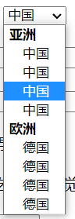


#### 四、其他表单常用标签

```html
1）提示信息标签：（将点击范围扩大，增加用户体验；也可以当做普通行内元素使用，如设置css样式）
	语法：<label for="绑定控件id名"></label>
	说明：label元素用来定义标签，为页面上的其他元素指定提示信息。要将label元素绑定到其他的控件上，可以将label元素的for属性设置为与该控件的id属性值相同。
	
	绑定方法
		可以直接绑定：能识别第一个空格
		<label><input type="radio" name="gender"> 男</label>

		通过label里的for属性，与控件id相匹配：（用margin等控制字和按钮距离）
		<input type="radio" name="gender" id="femal"> 
		<label for="femal">女</label>
	
2）表单字段集（！！！块元素）
	语法：<fieldset></fieldset>
    说明：1、给表单划分区域，或者对表单元素进行分组
          2、fieldset可以嵌套自己，或者其他元素
          3、fieldset自带边框
		  4、只能在表单元素中使用；

3）字段集标题：
	语法：<legend></legend>
	说明：legend元素可以在fieldset对象绘制的方框内插入一个标题。
		 legend元素必须是fieldset内的第一个元素。 
	align=""可设置水平对齐方式，已废弃；
```

表单字段集：

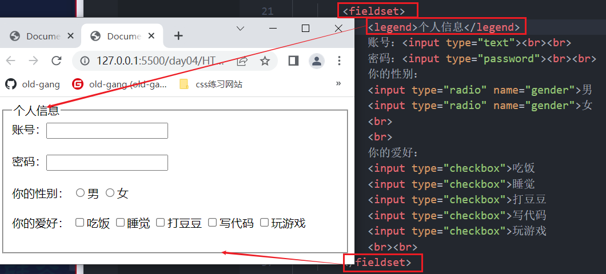


#### 五、案例


# css基础

## 一、CSS基础

### 1、什么是CSS？


​	CSS 是**层叠样式表** ( Cascading Style Sheets ) 的简称. 有时我们也会称之为 **CSS 样式表**或**级联样式表**。 CSS 是也是一种标记语言 CSS 主要用于设置 HTML 页面中的文本内容（字体、大小、对齐方式等）、图片的外形（宽高、边框样式、边距等）以及版面的布局和外观显示样式。 CSS 让我们的网页更加丰富多彩，布局更加灵活自如。简单理解：CSS 可以美化 HTML , 让HTML更漂亮， 让页面布局更简单。

CSS 最大价值: 由 HTML 专注去做结构呈现，样式交给 CSS，即 **结构** ( HTML ) 与**样式**( CSS ) **相分离**。

### 2、CSS语法规范
```css
css语法：
    选择器{
        属性：属性值;
        属性：属性值1 属性值2;
    }
    说明：
        1、css是由两部分组成：
            选择器：指的是要定义的样式；
            声明：包括属性和属性值；指的是要定义成什么样子；
                属性：标签所具有的属性，是规定好的，直接使用即可
                属性值：
					->数值单位：px , % , em , rem ,vw
					->法定属性值，指定属性所具有的属性值(固定搭配)
					->颜色值：英文单词
          					十六进制
         					 rgb
		2、声明必须写在大括号里面；
		3、一个声明写完之后要用分号结束；
		4、属性和属性值之间要用冒号连接；
		5、一个属性有多个属性值的时候，属性值之间要用空格隔开；
style {
    width:10px;
	border:1px solid red;
}
```
​	使用 HTML 时，需要遵从一定的规范，CSS 也是如此。要想熟练地使用 CSS 对网页进行修饰，首先需要了解CSS 样式规则。

+ CSS 规则由两个主要的部分构成：选择器以及一条或多条声明。
  + 选择器是用于指定 CSS 样式的 HTML标签（现阶段如此）
  + 花括号内是对该对象设置的具体样式
  + 属性和属性值以“键值对”的形式出现
  + 属性是对指定的对象设置的样式属性，例如字体大小、文本颜色等
  + 属性和属性值之间用英文“:”分开 5.多个“键值对”之间用英文“;”进行区分


​	

```css
选择器{
    属性1:值1;
    属性2:值2;
    属性3:值3;
    ...
    属性n:值n;
}
```

例如： 所有的样式，都包含在 `<style>` 标签内，表示是样式表。`<style>`一般写到`</head>` 上方

```html
<head>
    <style>
        h4 {
            color: blue;
            font-size: 100px;
        }
    </style>
  	<body>
      <h4>
        苍茫的天涯是我的爱
      </h4>
  	</body>
</head>
```

### 3、CSS的使用方式

#### 3.1、行内样式表

+ 也叫做**内联样式表**，是在元素标签内部的 style 属性中设定 CSS 样式。适合于修改简单样式。


+ 特点：仅作用于本标签
+ 语法：

```html
<p style="color:red;">故事里的小黄花</p>
```

+ 说明
  + style 其实就是标签的属性 在双引号中间，写法要符合 CSS 规范
  + 可以控制当前的标签设置样式
  + 由于书写繁琐，并且没有体现出结构与样式相分离的思想，所以不推荐大量使用，只有对当前元素添加简单样式的时候，可以考虑使用
  + 使用行内样式表设定 CSS，通常也被称为行内式引入


```html
<!-- 
    css样式表-行内样式表(内联样式表)
    语法：
        <标签 style="css语句"></标签>
        注：style属性时定义行内样式表的属性，所有标签都可以添加的属性
        说明：
            1、行内样式直接在标签上定义的，结构和表现没有分离
            2、耦合性高，不易维护；
            3、不推荐使用，在需要的时候使用；
            4、作用域：只针对当前标签起作用；
            5、使用方便；
-->
```


#### 3.2、内部样式表

+ 也叫做**内嵌样式表**，是写到html页面内部. 是将所有的 CSS 代码抽取出来，单独放到一个 `<style>` 标签中
+ 特点：作用于当前整个页面
+ 语法：

```html
<style>
    p {
        color:red
    }
</style>
```

+ 说明：
  + `<style>` 标签理论上可以放在 HTML 文档的任何地方，但一般会放在文档的`<head>`标签中
  + 通过此种方式，可以方便控制当前整个页面中的元素样式设置
  + 代码结构清晰，但是并没有实现结构与样式完全分离
  + 使用内部样式表设定 CSS，通常也被称为嵌入式引入，这种方式是我们练习时常用的方式


```html
<!-- 
    css样式表-行内样式表(内嵌样式表)
    语法：
        <style type="text/css">
            css语句
        </style>
        注：建议把style标签创建在head区域内
        说明：
            1、type="text/css" 定义文本类型为css，可写可不写
            2、实现了结构和表现相分离，但是分离的不够彻底；
            3、耦合性相对较低；
            4、作用域：对当前页面的所有标签起作用；
            5、不推荐使用，代码少时可以使用；
 -->
```


#### 2.3、外部样式表

+ 实际开发都是外部样式表. 适合于样式比较多的情况. 核心是:样式单独写到CSS 文件中，之后把CSS文件引入到 HTML 页面中使用。
+ 特点：可以被多个页面引入并且使用
+ 语法：
  + 新建一个后缀名为 .css 的样式文件，把所有 CSS 代码都放入此文件中
  + 在html文件中引入css文件

```html
<link rel="stylesheet" type="text/css" href="./style.css">
```

+ 说明：使用link元素导入外部样式表时，需将该元素写在文档头部，即\<head>与\</head>之间。
+ href：链接的文档来自于哪里。
+ rel：（relation：关系）当前文档与被链接文档之间的关系。
+ type：加载的数据的类型


 **引入外部样式的方法** 

```html
<!--
方法一：常用的，也是推荐使用的：
    <link rel="stylesheet" type="text/css" href="">
    注：link是单标记，是html提供的方法
        建议link写在head区域内
    说明：
        1、	rel="stylesheet" 	关联样式表(必须要有的)
             rel="" 			是relation(关联) 的缩写，
             stylesheet 		是样式表
        2、type="text/css" 定义文本类型为css，可写可不写
        3、href="" 添加目标文件，css文件；(必须要有的)
        4、推荐使用
        5、真正实现了结构和表现相分离
        6、耦合性极低
        7、作用域：可以应用在多页面上

方法二：了解即可
    语法：
         <style>
            @import url(目标文件路径);
         </style>
         说明：
           1、@import方法是属于css提供的一种方法；
           2、@import只能链接css文件，不能做其他事
           3、@import的加载顺序，是在结构加载完成之后在加载的(可能会出现打开文件的前几秒没有样式的情况)
           4、如果想通过js改变css样式表里的样式，就只能通过link去修改,@import方法不能修改
           5、@import是css2.1版本提出的，低版本不兼容
-->
```


#### 2.4、样式表优先级

+ 内联样式表的优先级别最高
+ 内部样式表与外部样式表的优先级和书写的顺序有关，后书写的优先级别高。
+ 同在一个样式表中的优先级和书写的顺序也有关，后书写的优先级别高。(被覆盖的只是相同属性的样式)

| 样式表   | 优点          | 缺点     | 使用情况 | 控制范围 |
| ----- | ----------- | ------ | ---- | ---- |
| 行内样式表 | 书写方便，权重高    | 结构样式混写 | 少    | 一个标签 |
| 内部样式表 | 部分结构和样式分离   | 没有彻底分离 | 较多   | 一个页面 |
| 外部样式表 | 完全实现结构和表现分离 | 需要引入   | 最多   | 多个页面 |


### 4、CSS代码风格

#### 4.1、样式格式书写

+ **紧凑格式**

  ```css
  h3 { color: skyblue;font-size: 20px;}
  ```

+ **展开格式**

  ```css
  h3 {
          color: skyblue;
          font-size: 20px;    
       }
  ```

> 推荐第二种格式， 因为更直观。

#### 4.2、样式大小写书写

+ **小写格式**

  ```css
  h3 {
   	color: skyblue;
  }
  ```

+ **大写格式**

  ```css
  H3 {
   	COLOR: PINK;   
  } 
  ```

> 推荐第一种全部使用小写字母的风格。

### 5、CSS注释

```css
/*注释的内容*/
```

快捷键（与html注释一样）：`ctrl+/`或者`shift+Alt+A`

## 二、CSS选择器

### 1、CSS选择器是什么

CSS选择器是CSS规则的一部分。它是元素和其他部分组合起来告诉浏览器哪个HTML元素应当是被选为应用规则中的CSS属性值的方式。选择器所选择的元素，叫做“选择器的对象”。

```html
<html>
  <head>
  	<style>
      h1{
        color:skyblue;
      }
    </style>
  </head>
  <body>
    <h1>我是CSS选择器</h1>
  </body>
</html>
```

### 2、CSS选择器的作用

选择器(选择符)就是根据不同需求把不同的标签选出来这就是选择器的作用。

简单来说，就是选择标签用的。找到所有的 h1 标签。 选择器（选对人） 设置这些标签的样式，比如颜色为红色（做对事）。


### 3、CSS基本选择器

> 基础选择器包括：标签选择器、类选择器、ID选择器和通配符选择器

#### 3.1、标签选择器

+ 概念：标签选择器（元素选择器）是指用 HTML 标签名称作为选择器，按标签名称分类，为页面中某一类标签指定统一的 CSS 样式。
+ 语法：标签选择器{ 属性：属性值 ... } 
+ 作用：标签选择器（元素选择器）是指用 HTML 标签名称作为选择器，按标签名称分类，

> 作用：当统一某一类标签的样式，会使用类选择器
>      	   当改变页面内某一类标签的默认样式时；
>      	   一般在控制全局样式时会使用；

+ 案例：

  ```css
  div {

   }
  ```

#### 3.2、ID选择器

+ 概念：ID选择器可以为标有特定 id 的 HTML 元素指定特定的样式。 HTML 元素以 id 属性来设置 id 选择器，CSS 中 id 选择器以“#" 来定义。

```css
语法：
    #id名{属性：属性值}
    要配合html的id属性一起使用；
    id属性的特点：唯一性；一个元素只能有一个唯一的id名字；
作用：正常来说使用外围结构时使用id；
      我们id其实很少用于写页面样式，或者布局使用
      一般会配合js使用；或者是设置一些功能性的效果使用；
```


+ 案例：


  ```css
#nav {
    width: 1000px;
    height: 58px;
    background-color: #323232;
}
  ```

#### 3.3、类选择器

+ 概念：如果想要差异化选择不同的标签，单独选一个或者某几个标签，可以使用类选择器。

+ 语法：.类名 { 属性1: 属性值1;... }

+ 注意：

  + 如果想要差异化选择不同的标签，单独选一个或者某几个标签，可以使用类选择器。
  + 类选择器在 HTML 中以 class 属性表示，在 CSS 中，类选择器以一个点“.”号显示。
  + 类选择器使用“.”（英文点号）进行标识，后面紧跟类名（自定义，我们自己命名的）。
  + 不要使用纯数字、中文等命名，尽量使用英文字母来表示。
  + 命名要有意义，尽量使别人一眼就知道这个类名的目的。

+ 分类：

  + 单类名选择器

    ```css
    <!DOCTYPE html>
    <html>
        <head>
            <meta charset="UTF-8" />
            <title>test</title>
            <style>
                .demo{
                    color: aqua;
                }
            </style>
        </head>
        <body>
            <div class="demo">
                传说中你为爱甘心被搁浅
            </div>
        </body>
    </html>
    ```

  + 多类名选择器

    ```css
    <!DOCTYPE html>
    <html>
        <head>
            <meta charset="UTF-8" />
            <title>test</title>
            <style>
                .demo{
                    color: aqua;
                }
    		   .demo1{
                    font-size:90px;
                }
            </style>
        </head>
        <body>
            <div class="demo demo1">
                传说中你为爱甘心被搁浅
            </div>
        </body>
    </html>
    ```

    > 在标签class 属性中写 多个类名 ,多个类名中间必须用空格分开,这个标签就可以分别具有这些类名的样式
    >
    > 相同的属性会层叠，下面的会覆盖上面的！

#### 3.4、通配符选择器

+ 概念：通配符选择器不需要调用， 自动就给所有的元素使用样式 特殊情况才使用
+ 语法：* {    属性1: 属性值1;      ...}

> 说明：*代表的是页面所有的标签；
>
> 作用：设置全局样式的时候使用；

+ 案例：

  ```css
  * {
      margin: 0;
      padding: 0;
  }
  ```

#### 3.5、选择器总结

| 基础选择器  | 作用              | 特点                   | 使用情况      | 用法                   |
| ------ | --------------- | -------------------- | --------- | -------------------- |
| 元素选择器  | 可以选出所有相同的标签，比如p | 不能差异化选择              | 较多        | p{color:skyblue}     |
| 类选择器   | 可以选出1个或者多个标签    | 可以根据需求选择             | 非常多       | .nav{color:skyblue}  |
| ID选择器  | 一次只能选择一个标签      | id属性只能在每个HTML文档中出现一次 | 一般和js一起使用 | \#nav{color:skyblue} |
| 通配符选择器 | 选择所有的标签         | 选择的太多                | 样式初始化使用   | *{color:skyblue}     |

引用样式时：(防止被覆盖)

> **1、全局样式 -- >  2、 页面样式**


### 4、CSS复合选择器

> 在 CSS 中，可以根据选择器的类型把选择器分为**基础选择器**和**复合选择器**，复合选择器是建立在基础选择器之上，对基本选择器进行组合形成的。 复合选择器是由两个或多个基础选择器，通过不同的方式组合而成的，可以更准确、更高效的选择目标元素（标签） 常用的复合选择器包括：**后代选择器、子元素选择器、交集选择器、并集选择器、属性选择器、伪类选择器、链接伪类选择器**等等

#### 4.1、后代选择器(包含选择器)

+ 概念：后代选择器又称为包含选择器，可以选择父元素里面子元素。其写法就是把外层标签写在前面，内层标签写在后面，中间**用空格分隔**。当标签发生嵌套时，内层标签就成为外层标签的后代,**通过父元素找后代元素 (子孙后代都会改变) ；** 

+ 语法：

  ```css
  元素1 元素2{样式声明}
  ```

  > 上述语法表示选择元素 1 里面的所有元素 2 (后代元素)。

+ 语法说明：

  + 元素1 和 元素2 中间用空格隔开
  + 元素1 是父级，元素2 是子级，最终选择的是元素2
  + 元素2 可以是儿子，也可以是孙子等，只要是元素1 的后代即可
  + 元素1 和 元素2 可以是任意基础选择器

+ 案例：

  

  ```css
  .cla h3{
    color:red;
  }
  ```


#### 4.2、子代选择器(亲儿子选择器)

+ 概念：子元素选择器（子选择器）只能选择作为某元素的最近一级子元素，（简单理解就是选**亲儿子**元素）

+ 语法：

  ```css
  元素1 > 元素2{样式声明}
  ```

  > 上述语法表示选择元素1 里面的所有直接后代(子元素) 元素2。

+ 语法说明：

  + 元素1 和 元素2 中间用 大于号 隔开
  + 元素1 是父级，元素2 是子级，最终选择的是元素2
  + 元素2 必须是亲儿子，其孙子、重孙之类都不归他管. 你也可以叫他 亲儿子选择器

+ 案例：

  ```css
  div > p{
    color:red;
  }
  选择div里面所有最近一级的p标签
  ```


#### 4.3、交集选择器

+ 概念：交集选择器由两个选择器构成，其中第一个为标签选择器，第二个为class选择器或id选择器，两个选择器之间不能有空格，交集选择器是**并且**的意思。 即...又...的意思。

> **交集选择器选的是同一个标签！！！**
>
> 即：**选择器1和选择器2是针对同一个标签的** 
>
> **作用**：更加强调的作用(多个标签具有相同的类名时)；
>    		如：类型选择器、标签选择器可以使用
> **注：**如果交集选择器里有标签选择器时，**标签选择器**要写在最前面

+ 语法：

  ```css
  h3.class{color:red font-size:100px;}
  ```

  

+ 案例：

  ```css
  p.one {} /* 选择的是： 类名为 .one的段落标签。*/
  p#two {} /* 选择的是： id为two的段落标签。*/
  ```
  
  

#### 4.4、并集选择器 (群组选择器)

+ 概念：并集选择器可以选择多组标签, 同时为他们定义相同的样式，通常用于集体声明。并集选择器是各选择器通过英文逗号（,）连接而成，任何形式的选择器都可以作为并集选择器的一部分。

+ 语法：

  ```css
  元素1，元素2{
    样式声明
  }
  ```

  > 上述语法表示选择元素1 和 元素2。


+ **作用：提取相同分类项；把具有相同属性的代码提取出来**

**vscode :查找、替换快捷键：Ctrl + F** 

+ 语法说明：

  + 元素1 和 元素2 中间用逗号隔开
  + 逗号可以理解为和的意思
  + 并集选择器通常用于集体声明

+ 案例：

  ```css
  ul,div{
    样式声明
  }
  选择ul和div标签元素
  ```

#### 4.5、兄弟选择器

> **同一个父元素之下，才是兄弟元素！！！** 

```html
<div class="box">
    <ul>
        <li>
            <a href="#">1</a>
            <a href="#">2</a>
        </li>
        <li>
            <a href="#">3</a>
            <a href="#">4</a>
        </li>
    </ul>
</div>

<!--1和2,3和4是兄弟；1、2和3、4不是兄弟元素-->
```


+ **‘+’选择器**
  
  + 概念：“+”选择器则表示**某元素后**相邻的兄弟元素，**紧挨着的**，**是单个的**
+ 案例：
  
  ```html
  <!DOCTYPE html>
  <html lang="en">
  	<head>
      	<meta charset="UTF-8">
      	<title>Document</title>
      	<style>
          	.h3 + p{
              	color: red;
          	}
      	</style>
  	</head>
    	<body>
        <p>起来</p>
        <p>不愿做奴隶的人民</p>
        <p>把我们的血肉筑成我们新的长城</p>
        <h3 class="h3">中华民族到了</h3>
        <p>最危险的时候</p>
        <p>2022</p>
        <p>中国加油</p>
       </body>
  </html>
  ```

+ **'~'选择器** (通用选择器)

  + 概念：作用是查找某一个指定元素的后面的**所有兄弟节点**

  + 案例：

```html
    <!DOCTYPE html>
    <html lang="en">
    	<head>
        	<meta charset="UTF-8">
        	<title>Document</title>
        	<style>
            	.h3 ~ p{
                	color: red;
            	}
        	</style>
    	</head>
      	<body>
          <p>起来</p>
          <p>不愿做奴隶的人民</p>
          <p>把我们的血肉筑成我们新的长城</p>
          <h3 class="h3">中华民族到了</h3>
          <p>最危险的时候</p>
          <p>2022</p>
          <p>中国加油</p>
         </body>
    </html>
```


#### 4.6、伪类选择器

+ 概念：伪类选择器（简称：伪类）通过冒号来定义，它定义了元素的状态，如点击按下，点击完成等，通过伪类可以为元素的状态修改样式

  > 到底何为伪类?
  >
  > 就是css内置类css内部本身赋予它一些特性和功能，也就是你不用再class=...或id=...你就可以直接拿来使用，当然你也可以改变它的部分属性比如：a:link{color:red;}


+ **基本使用**

  ```html
  <!DOCTYPE html>
  <html>
  	<head>
  		<meta charset="utf-8">
  		<title></title>
  		<style type="text/css">
  			p {
  				color: red;
  			}

  			p.c1:hover {
  				color: green;
  			}
  		</style>
  	</head>
  	<body>
  		<span>s-0</span>
  		<p class="c1">p-1</p>
  		<p>p-2</p>
  		<p>p-3</p>
  		<p>p-4</p>
  		<p>p-5</p>
  	</body>
  </html>
  ```

+ **伪类选择器**

  + **E:link**：设置超链接a在未被访问前的样式。
  + **E:visited**：设置超链接a在其链接地址已被访问过时的样式。
  + **E:hover**：设置元素在其鼠标悬停时的样式。
  + **E:active**：设置元素在被用户激活（在鼠标点击与释放之间发生的事件）时的样式。

  > **:link和:visited是超链接独有的**
  > **:hover和:active所有标签都可以设置** 

  > **链接伪类选择器注意事项**
  >
  > 为了确保生效，请按照 LVHA 的循顺序声明 :link－:visited－:hover－:active。
  >
  >  记忆法：**l**o**v**e **ha**te。

  

  > **当直接给a{属性：属性值；}时，这里的样式包含了这四个状态效果；**

  ```css
  style{
      a {color: gray;}
  }
    
   /*需要鼠标划过时，在后面添加即可；*/
  ```

  

  ```html
  <!DOCTYPE html>
  <html>
  	<head>
  		<meta charset="utf-8">
  		<title></title>
  		<style type="text/css">
  			a:link{
  				color: green;
  			}
  		
  			a:visited {
  				color: yellow;
  			}
  			
  			a:hover{
  				color: hotpink;
  			}
  			a:active{
  				color: red;
  			}
  		</style>
  	</head>
  	<body>
  		<a href="#">点我，点我</a>
  	</body>
  </html>
  
  ```

+ **:focus 伪类选择器**

  **定义**

   :focus 伪类选择器用于选取获得焦点的**表单元素。**

   焦点就是光标，一般情况 `<input>` 类表单元素才能获取

  ```html
  <!DOCTYPE html>
  <html>
  	<head>
  		<meta charset="utf-8">
  		<title></title>
  		<style type="text/css">
  			/* 
  				当我们写一个输入框，点一下这个输入框，有光标在闪动，这叫获得焦点的状态。
  				如果要在这种状态下设置样式，就需要用到focus伪类选择器
  				当我们的鼠标点击了页面其他地方的时候，光标不再在输入框里闪动，这叫失去焦点的状态。
  			*/
  		  input:focus{
  			   width: 200px;
  			   background-color: #00FFFF;
  		   }
  		   input{
  			   background-color: #FF0000;
  		   }
  		</style>
  	</head>
  	<body>
  		<input type="text">
  	</body>
  </html>

  ```


#### 4.7、复合选择器总结

| 选择器       | 作用          | 特征       | 使用情况 | 隔开符号及用法                 |
| --------- | ----------- | -------- | ---- | ----------------------- |
| 后代选择器     | 用来选择后代元素    | 可以是子孙后代  | 多    | 符号是空格.nav a             |
| 子代选择器     | 选择最近一级元素    | 只选择亲儿子   | 少    | 符号是大于 .nav > p          |
| 并集选择器     | 选择某些相同样式的元素 | 可以用于集体声明 | 多    | 符号是逗号 .nav,.header      |
| 链接伪类选择器   | 选择不同状态的链接   | 跟链接相关    | 多    | 重点记住a{}和a:hover 实际开发的写法 |
| :focus选择器 | 选择获得光标的表单   | 跟表单相关    | 少    | input:focus             |

> 注意：属性选择器和部分伪类选择器都是CSS3的时候出现的。

### 5、CSS的三大特性

#### 5.1、层叠性

相同选择器给设置相同的样式，此时一个样式就会覆盖（层叠）另一个冲突的样式。层叠性主要解决样式冲突的问题

 层叠性原则:

- 样式冲突，遵循的原则是就近原则，哪个样式离结构近，就执行哪个样式
- 样式不冲突，不会层叠


#### 5.2、继承性

CSS中的继承: 子标签会继承父标签的某些样式，如文本颜色和字号。恰当地使用继承可以简化代码，降低 CSS 样式的复杂性。


子元素可以继承父元素的样式：

 **（text-，font-，line-这些元素开头的可以继承，以及color属性）**

继承性口诀：龙生龙，凤生凤，老鼠生的孩子会打洞

#### 5.3、优先级

当同一个元素指定多个选择器，就会有优先级的产生。

- 选择器相同，则执行层叠性
- 选择器不同，则根据选择器权重执行

选择器优先级计算表格：

| 选择器           | 权重      |
| ------------- | ------- |
| !important    | 最大      |
| 行内样式 style="" | 1,0,0,0 |
| ID选择器         | 0,1,0,0 |
| 类选择器，伪类选择器    | 0,0,1,0 |
| 元素选择器         | 0,0,0,1 |
| *             | 0,0,0,0 |
| 继承选择器         | 无       |

优先级注意点:

1. 权重是有4组数字组成,但是不会有进位。
2. 可以理解为类选择器永远大于元素选择器, id选择器永远大于类选择器,以此类推..
3. 等级判断从左向右，如果某一位数值相同，则判断下一位数值。
4. 可以简单记忆法: 通配符和继承权重为0, 标签选择器为1,类(伪类)选择器为 10, id选择器 100, 行内样式表为 1000, !important 无穷大.
5. 继承的权重是0， 如果该元素没有直接选中，不管父元素权重多高，子元素得到的权重都是 0。

权重叠加：如果是复合选择器，则会有权重叠加，需要计算权重。

- div ul li ------> 0,0,0,3
- .nav ul li ------> 0,0,1,2
- a:hover -----—> 0,0,1,1
- .nav a ------> 0,0,1,1

## 三、CSS常用属性

> 一些常识：
>
> **css属性值**：
>  	数值加单位： 100px  100%   100em
>      px：固定单位
>      %： 相对单位    相对于父元素显示
>          **注：只要相对窗口显示高度，单位是%的时候，就要先给html和body设置height：100%;**
>      em：相对单位    相对于当前文字的字号大小
>          注：默认情况下，浏览器的文本大小是16px,所以1em=16px(默认情况下)
>          1em=当前元素一个文字的大小
>  法定的属性值：属性所具有的属性，是规定好的，直接使用即可
>
>  **颜色值：**
>      英文单词：red green……
>      十六进制：
>          十进制：0,1,2,3,4,5,6,7,8,9
>          二进制：0,1
>          十六进制：0,1,2,3,4,5,6,7,8,9，a,b,c,d,e,f
>          注：用十六进制表示颜色值的时候，前面要加#；
>              0-f：颜色越来越前，0黑色，f白色；
>              用6个数值表示颜色值
>              R(red)  G(green)  B(blue)
>          \#   00       00       00    黑色
>          \#   ff         ff       ff    	白色
>         \#   33        33       33    深灰色
>         \#   ff         00       00    红色
>         \#   00       ff       00    绿色
>         \#   00       00       ff    蓝色
>         \#   ff         ff       00    黄色    #ff0
>         \#   ff        00       ff    紫色    #f0f
>          **注：两两一样的可以缩写**
>
> ​     **rgb(r,g,b);**
> ​     r,g,b取值范围：0-255
>
> ​     **rgba(r,g,b,a)**
> ​     r:red
> ​     g:green
> ​     b:blue
> ​     a:alpha  透明度 (0-1) 可以写小数，小数点前面的0可以省略
> ​         0：完全透明
> ​         1：完全不透明
> ​     hsl：色调、亮度、饱和度(了解即可，基本不用)
>
> 

### 1、CSS字体属性

#### 1.1、字体大小

+ 概念：CSS 使用 font-size 属性定义字体大小。

+ 语法：

  ```css
  p {  
      font-size: 20px; 
  }
  ```

+ 说明：

  + px（像素）大小是我们网页的最常用的单位
  + 谷歌浏览器支持的最小文字大小为12px，默认的文字大小为16px ，0px会隐藏字体 **(例如在h1标签里可以将字号设置为0，SEO优化)** 
  + 不同浏览器可能默认显示的字号大小不一致，我们尽量给一个明确值大小，不要默认大小
  + 可以给 body 指定整个页面文字的大小

#### 1.2、字体粗细

+ 概念：CSS 使用 font-weight 属性设置文本字体的粗细

+ 语法：

  ```css
  p {  
      font-weight: bold; 
  }
  ```

  | 属性值  | 描述                                                   |
  | ------- | ------------------------------------------------------ |
  | lighter | 极细的(100 - 300)                                      |
  | normal  | 默认值（不加粗）                                       |
  | bold    | 定义粗体（加粗）                                       |
  | bolder  | 更粗的(800 - 900)                                      |
  | 100~900 | 400等同于normal，而700等同于bold，注意数字后面不跟单位 |

+ 说明：

  + 学会让加粗标签（比如 h 和 strong 等) 不加粗，或者其他标签加粗
  + 实际开发时，我们更喜欢用数字表示粗细

#### 1.3、字体样式

+ 概念：CSS 使用 font-style 属性设置文本的风格

+ 语法：

  ```css
  p {  
      font-style: normal;
  }
  ```

  | 属性值     | 作用                                    |
  | ------- | ------------------------------------- |
  | normal  | 默认值，浏览器会显示标准的字体样式  font-style:normal； |
  | italic  | 浏览器会显示斜体的字体样式                         |
  | oblique | 斜体                                    |

#### 1.4、字体变形

+ 概念：CSS 使用 font-variant属性设置文本的变形

+ 语法：

  ```css
  p{
  	font-variant: small-caps;
  }
  ```

  | 属性值     |          作用           |
  | ---------- | :---------------------: |
  | normal     |         默认值          |
  | small-caps | 小写转大写 (但是字体小) |

> 注：一般英文网站或者是中英文混排是会使用；用的少；
>     	只针对小写字母起作用

#### 1.5、字体族

+ 概念： 我们认为的"字体"可能不是单纯的一个字体，而是由许多字体变形组成，分别用来描述粗体、斜 体、正常字体等等每种变体都有一个具体的字体风格。所以我们电脑中安装的字体有可能是一个字体系列(字体族)，而不是单纯的字体。

+ 语法：

  ```css
  p{
    font-family:"Arial","Helvetica",sans-serif;
  }
  ```

+ 说明：

  + 我们在写的时候一般使用的是字体的英文名字，为了规避乱码的风险。
  + 用**逗号隔开** 
  + 设定的字体如果名字包含**汉字、多个英文单词、Unicode编码**，则应该使用单引号包裹起来。
  + 可以定义多个字体，多个字体将按照列表中列出来顺序逐个查找，只要找到了一个就去应用如果到最后都没有找到name将会使用浏览器的默认字体（windows系统中，默认的字体就是微软雅黑）。
  
+ 注：

  + 中文字体对英文字体也是起作用的；
  + 英文字体对中文字体不起作用；
  + 有英文字体时，写在前面

>  一些小常识：
>
> serif:	衬线字体
>
> sans-serif：无衬线字体，笔画结尾是平滑的字体
>
> monospace：等宽字体

#### 1.6、字体的综合写法

字体属性可以把以上文字样式综合来写, 这样可以更节约代码:

```css
body {font: font-style  font-weight  font-size/line-height  font-family;}
```

**注意：** 

> 1、必须同时具有size和family的时候才能使用复合式属性font;
> 2、size和family必须要写在所有属性值的后面，并且要先写size，后写family；
>
> 3、也可以将行高写在font-size后，用 / 隔开，可以写具体数值，也可以写倍数(写倍数不加单位)
>
> 4、最常用的就是通过font属性一起设置字号和字体，一般在全局样式的时候使用；
>
> 5、复合式属性中，没写的属性是默认值
>
> 6、**当复合属性和单个属性在一起使用时，要先写复合式属性**

#### 1.7、字体总结

| 属性           | 表示   | 注视点                                  |
| ------------ | ---- | ------------------------------------ |
| font-size    | 字号   | 通常用的单位是px像素，一定要跟上单位                  |
| font-family  | 字体   | 实际企业级研发中按照团队约定来写字体                   |
| font-weight  | 字体粗细 | 加粗是700或者bold， 不加粗是400或者normal，数字不跟单位 |
| font-style   | 字体样式 | italic是倾斜，normal是不倾斜，常用normal        |
| font-variant | 字体变形 | small-caps大写转小写                      |
| font         | 字体连写 | 字体连写有顺序，位置不能随意更改，字号和字体需同时书写。         |

### 2、CSS文本属性

#### 2.1、文本颜色

+ 概念：color 属性用于定义文本的颜色

+ 语法：

  ```css
  div { 
      color: red;
  }
  ```

  | 标识方式    | 属性值                           |
  | ------- | ----------------------------- |
  | 预定义的颜色值 | red，green，blue。。              |
  | 十六进制    | \#FF000，#FF6600,#29d794       |
  | RGB代码   | rgb(255,0,0)或者rgb(100%,0%,0%) |

+ 说明：

  + 开发中最常用的是十六进制
  + rgba，格式`rgba(红,绿,蓝,透明度)`，多了一个透明度，透明度是0~1之间的值，0为完全透明，值越大越不透明。可以直接用`.n`的形式来表示，如：`.5`

#### 2.2、水平对齐

+ 概念：text-align 属性用于设置元素内文本内容的水平对齐方式

+ 语法：

  ```css
  div { 
    text-align: center; 
  }
  ```

  | 属性值                  | 描述                     |
  | ----------------------- | ------------------------ |
  | left                    | 左对齐（默认值）         |
  | right                   | 右对齐                   |
  | center                  | 居中对齐                 |
  | justify                 | 两端对齐(最后一行不生效) |
  | text-align-last:justify | 强制最后一行两端对齐     |

#### 2.3、垂直对齐

+ 概念：vertical-align属性用于设置元素内文本内容的垂直对齐方式(没有继承性，**写给谁谁生效)**

+ 语法：

  ```css
  img{
    vertical-align：middle；
  }
  ```

  | 属性值         | 描述                                       |
  | ----------- | ---------------------------------------- |
  | top         | 将支持valign特性的对象的内容与对象顶端对齐                 |
  | middle      | 将支持valign特性的对象的内容与对象中部对齐                 |
  | bottom      | 将支持valign特性的对象的文本与对象底端对齐                 |
  | text-top    | 将支持valign特性的对象的文本与对象顶端对齐                 |
  | text-bottom | 将支持valign特性的对象的文本与对象顶端对齐                 |
  | sub         | 垂直对齐文本的下标                                |
  | super       | 垂直对齐文本的上标                                |
  | baseline    | 将支持valign特性的对象的内容与基线对齐， **基线**“baseline”并不是汉字文字的下端沿，而是英文字母的下端沿。 |

> **注：**
>
> ​		  1、不是所有的元素都可以应用垂直对齐属性；可以对一些特殊的元素起作用：td img input,textarea select 
>
> ​          2、有**文字时插入图片**后，**下端有空白**，可以将图片的垂直对齐属性设置为除了基线对齐都可以
>
> ​          3、这个属性没有继承性；写给谁谁生效

#### 2.4、修饰文本

+ 概念：text-decoration属性用于设置文本的修饰的属性(这是一个复合属性)

+ 语法：

  ```css
  div { 
      text-decoration：underline pink dashed;
  }
  ```

  | 属性值          | 描述               |
  | ------------ | ---------------- |
  | none         | 默认，没有装饰线（常用）     |
  | underline    | 下划线，链接a自带下划线（常用） |
  | overline     | 上划线，（几乎不用）       |
  | line-through | 删除线，（不常用）        |


> 重点记住如何添加下划线 ? 如何删除下划线 ? 其余了解即可.

```css
text-decoration-color: ;
<!--默认和文本颜色一样-->

text-decoration-style: ;
<！--solid、dashed、dotted、double……-->
```


#### 2.5、文本缩进

+ 概念：text-indent属性用于设置文本的缩进的属性

> **注：只有块级元素才能生效，内联元素不生效！！！** 

+ 语法：

  ```css
  p { 
  	text-indent:200px;
  }
  ```


#### 2.6、字符间距

+ 概念：定义字母/汉字之间的距离

+ 语法：

  ```css
  letter-spacing:value; 
	/*
  		1、设置字和字、字母和字母之间的间距
    		2、支持负值，绝对值越大，越紧凑
	*/
  
  word-spacing:value; 
  	/*
  		1、定义英文单词之间的间隔
  		2、对中文不生效！
  		3、支持负值
  	*/
  ```
  
  - normal，相当于`letter-spacing:0`
  - px，像素

#### 2.7、剩余空间显示

+ 概念：**white-space**属性用于设置文本的换行的属性(**设置页面的换行和空格是否被浏览器解析**)
+ 属性值：

```css
normal：	 默认值，多余空白会被浏览器忽略只保留一个；
pre：	 空白会被浏览器保留，不换行；
pre-wrap：保留一部分空白符序列，但是正常的进行换行；
pre-line：合并空格，但是保留换行符；
nowrap：	 文本不会换行，文本会在同一行上继续，直到遇到<br/>标签为止;(记住)  
```

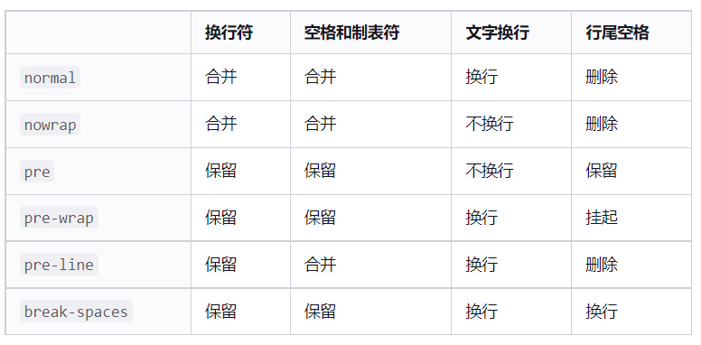

**换行属性：word-break** **(可以继承)**

```css
word-break:;
    normal      根据浏览器默认显示是否换行
    break-all   只要超出了就换行，允许在单词内换行
    keep-all    允许在半角、连接符、空格位置换行
```


#### 2.8、溢出属性

+ 概念：overflow属性用于设置文本的隐藏的属性
+ 属性值：

```css
visible，溢出时显示。(默认值)
hidden，溢出时内容隐藏。
scroll，溢出的内容滚动条显示。
    注：
        scroll属性不管文本有没有溢出横向、竖向都有滚动条
        滚动条会影响文字显示位置，(滚动条会占据空间)
auto，浏览器自己决定。（通常具有不确定性）

overflow-x:;    设置横向的溢出显示效果(一般在全局设置，让body没有横向滚动条)
overflow-y:;    设置纵向的溢出显示效果
```


#### 2.9、行间距(行高)

+ 概念：line-height 属性用于设置行间的距离（行高），可以控制文字行与行之间的距离
  + **行高测量方法**：从上一行顶部到下一行顶部
  + **字体大小测量方法**：按大的来(做项目的时候会有)

> 注：
>
> 确定了高度，行高不会对下面的内容产生影响,当行高超出父元素高度后，会**溢出显示**；
>
> 行高越大，文字中间的空隙越大，当**行高等于文字大小**时，多行文字会贴在一起显示，上下行之间的空隙会消失；
>
> 文本是由**默认行高**决定的，默认行高不是固定的，而是根据字体大小显示的

+ 语法：

  ```css
  p { 
      line-height: 26px;
  }
  ```

  + `normal`，默认值，跟随用户的浏览器走，且与字体相关联。

  - `px`像素值。
  - 数值，为数值时根据`font-size`来计算，计算的是当前的font-size的多少倍，必须大于0，可以为小数。

+ 作用：

  + 使**单行文字**在垂直区域居中--->**让文字的行高等于盒子的高度**。

    ```html
    <!DOCTYPE html>
    <html>
    	<head>
    		<meta charset="utf-8">
    		<title></title>
    		<style type="text/css">
    			div { 
    				width: 220px;
    				height: 220px;
    				border: black solid 1px;
    				line-height: 220px;
    			}
    		</style>
    	</head>
    	<body>
    		<div>细节决定成败</div>
    	</body>
    </html>
    ```

    + 行高的上空隙和下空隙把文字挤到中间了
    + 如果行高**小于**盒子高度,文字会**偏上**
    + 如果行高**大于**盒子高度,则文字**偏下**

  + 使多行文字的间隔改变

    

    - 顶线：绿色的线。
    - 中线：蓝色的线。
    - 基线：红色的线。
    - 底线：紫红色的线。


#### 2.10、单行文本溢出显示省略号

* 语法：

```css
text-overflow:;
 	ellipsis    溢出时进行裁切并且显示省略号
	 clip       溢出只能进行裁切，不显示省略号
```

* 显示省略号方法：

```css
<style>{
    .list li {
    width: 212px;
    font-size: 12px;
    line-height: 25px;
    white-space: nowrap;
    overflow: hidden;
    text-overflow: ellipsis;
}
</style>
```

* **说明：**

> 1、 text-overflow: ellipsis;只有显示省略号的功能，没有其他效果
> 2、如果想实现溢出显示省略号的话，需要以下几个属性：
>  -> width    设置宽度的显示范围
>  -> white-space: nowrap; 强制显示在一行
>  -> overflow: hidden;    溢出的文字隐藏
>  -> text-overflow: ellipsis;溢出显示省略号


### 3、CSS列表属性

#### 3.1、列表类型

格式：`list-style-type:value`

- none：不显示前面的标识，当为none时不会阻断有序列表的计算。
- square：实心方块。
- disc：实心圆形(默认)
- circle:空心圆
- decimal：数字
- lower-roman：小写罗马字
- upper-roman：大写罗马字
- lower-alpha：小写字母
- upper-alpha：大写字母

#### 3.2、列表图像

格式：`list-style-image:url(图像地址)`

#### 3.3、列表标识的位置

格式：`list-style-position:value`

- outside：标示在li外面
- inside：   标示在li里面

#### 3.4、列表复合属性

格式：`list-style:type image position` 

> 最常见的列表属性设置：**list-style: none;**
>
> 如果我们需要使用列表符号，我们会通过背景图的形式添加；
>
> 我们在写列表的时候都不会用列表自身的列表符号，都会给取消掉。

顺序可以颠倒

### 4、CSS背景属性

通过 CSS 背景属性，可以给页面元素添加背景样式。 背景属性可以设置背景颜色、背景图片、背景平铺、背景图片位置、背景图像固定等。

#### 4.1、背景颜色

+ 概念：background-color 定义元素的背景颜色

+ 语法：

  ```css
  background-color：颜色值；
  ```

+ 扩展：

  + 元素背景颜色默认值是 transparent（透明）

    ```css
    background-color：transparent；
    ```

  + `transparent`，默认值（透明）。元素的默认背景色是透明的包括html和body标签。

解释为什么整个页面看起来是白色的，不是transparent吗？

> 1. body和html并不是整个页面，body由内容撑开，html由body撑开。
> 2. 整个的层次：body -> html -> 页面画布
> 3. 最终整体的背景颜色是由**页面画布**决定的。
> 4. 画布颜色的决定规则：有html的颜色就使用html的颜色，html没有就使用body的颜色，如果都没有则使用画布本身的颜色透明（页面画布的最终颜色由浏览器自己决定，但一般的浏览器都将默认颜色设置成白色。）


#### 4.2、背景图片

+ 概念： background-image 定义元素的**背景**图片(**必须要有宽高**才能显示)

+ 语法：

  ```css
  background-image：none|url（url）
  ```

  | 参数值  | 描述               |
  | ---- | ---------------- |
  | none | 无背景图（默认）         |
  | url  | 使用绝对或者相对地址指定背景图像 |

> 注意：背景图片后面的地址，千万不要忘记加 URL， 同时里面的路径**不要加引号**。
>
> **网页的图片形式：**
>
> ​	-> 插入图片：是结构里的标签，是占位置的，默认情况下插入图片的上面不可以插入其他内容
> ​	->  背景图：是属于css的一种修饰性的存在，主要是为了修饰用的，不占html结构的位置，在背景图上可以放其他东西
>
> **背景图显示规则：**
>     -> 当背景图的尺寸小于于元素大小时，背景图会平铺，直到把元素铺满为止
>     -> 当背景图的尺寸等于元素大小时，背景图会完全显示，且只有一张
>     -> 当背景图的尺寸大于元素大小时，只能看到元素大小范围内的背景图
>     -> 背景图片默认显示在元素左上角；

#### 4.3、背景平铺

+ 概念：background-repeat 设置元素背景图像的平铺

+ 语法：

  ```css
  background-repeat：repeat | no-repeat | repeat-x | repeat-y
  ```

  | 参数值    | 描述                                       |
  | --------- | ------------------------------------------ |
  | repeat    | 背景图像在纵向和横向上平铺（默认）铺满为止 |
  | no-repeat | 背景图像不平铺                             |
  | repeat-x  | 背景图像在横向上平铺                       |
  | repeat-y  | 背景图像在纵向上平铺                       |

> 注：repeat-x可以做背景图的**渐变**效果
>     1、用ps截出 等高、一个像素宽的图片
>     2、设置为背景图，x轴平铺

#### 4.4、背景图片位置

+ 概念：background-position 属性可以改变图片在背景中的位置

+ 语法：

  ```css
  background-position：x y;
  ```

  参数代表的意思是：x 坐标和 y 坐标。 可以使用 方位名词 或者 精确单位

  | 参数值      | 描述                                       |
  | -------- | ---------------------------------------- |
  | length   | 百分数\|由浮点数和单位标识符组成的长度值                    |
  | position | top \| center \| bottom \| left \| center \| right |


> 复合式属性：
>     background-position:x y;
>
> ​    **注：**x和y的位置不能互换；
> ​    		如果只写一个，第二个默认居中；
> ​    		负值是向左/向上；
>
> 单一设置：
>     background-position-x:;
>     background-position-y:;
>
> x   背景图在x轴上的显示位置
>     属性值：
>         1、数值+单位： px   支持负值；
>         2、法定属性值：left right center
>         3、默认值：left或0
>
> y   背景图在y轴上的显示位置
>     属性值：
>         1、数值+单位： px   支持负值；
>         2、法定属性值：top bottom center
>         3、默认值：top或0


  **其他说明：**

  1、参数是方位名词

   如果指定的两个值都是方位名词，则两个值前后顺序无关，比如 left top 和 top left 效果一致

   如果只指定了一个方位名词，另一个值省略，则第二个值默认居中对齐

  2、参数是精确单位

   如果参数值是精确坐标，那么第一个肯定是 x 坐标，第二个一定是 y 坐标。

   如果只指定一个数值，那该数值一定是 x 坐标，另一个默认垂直居中。

   如果是正数背景图将会往右、下移动，如果是负数背景图将会往左、上移动。

  3、参数是混合单位

   如果指定的两个值是精确单位和方位名词混合使用，则第一个值是 x 坐标，第二个值是 y 坐标

#### 4.5、背景图片固定

+ 概念：background-attachment 属性设置背景图像是否固定或者随着页面的其余部分滚动，这个是css3的样式。

+ 语法：

  ```css
  background-attachment：scroll | fixed
  ```

  | 参数     | 描述            |
  | ------ | ------------- |
  | scroll | 背景图像是随着对象内容滚动 |
  | fixed  | 背景图像固定        |

  > 其他说明：
>
  >  background-attachment 后期可以制作视差滚动的效果。
  >
  > -> 设置背景图是否跟随滚动条滚动
  > -> 当设置了fixed之后，背景图片的参照物就发生了变化，就相对浏览器的可视窗口显示图片的位置了；

  

#### 4.6、背景样式合写

+ 概念：background: 背景颜色 背景图片地址 背景平铺 背景图像滚动 背景图片位置;

+ 语法：

  ```css
  background：transparent url（image.jpg） repeat-y fixed top;
  ```

#### 4.7、背景色半透明

+ 概念：CSS3 提供了背景颜色半透明的效果。

+ 语法：

  ```css
  background：rgba（0,0,0,0.3）;
  ```

  - 最后一个参数是 alpha 透明度，取值范围在 0~1之间
  - 我们习惯把 0.3 的 0 省略掉，写为 background: rgba(0, 0, 0, .3);

  **注意**：

  - 背景半透明是指盒子背景半透明，盒子里面的内容不受影响

#### 4.8、背景总结

| 属性                    | 作用      | 值                                  |
| --------------------- | ------- | ---------------------------------- |
| background-color      | 背景颜色    | 预定义的颜色值/十六进制/RGB代码                 |
| background-image      | 背景图片    | url（图片路径）                          |
| background-repeat     | 是否平铺    | repeat/no-repeat/repeat-x/repeat-y |
| background-position   | 背景位置    | length/position 分别是x和y坐标           |
| background-attachment | 背景附着    | scroll（背景滚动）/fixed（背景固定）           |
| 背景简写                  | 书写更加简单  | 背景颜色 背景图片地址 背景平铺 背景滚动 背景位置         |
| 背景色半透明                | 背景颜色半透明 | background：rgba（0,0,0,0.3）；后面是四个值  |


### 5、CSS表格属性

| CSS 属性名          | 功能                     | 属性值                                                       |
| ------------------- | ------------------------ | ------------------------------------------------------------ |
| table-layout        | 定义列宽度               | auto：自动，列宽根据内容计算。<br>fixed：固定列宽（不指定宽平均分） |
| **border-collapse** | 合并单元格边框           | collapse：合并                                               |
| **border-spacing**  | 单元格间距               | 长度<br>生效的前提：单元格边框不能合并                       |
| empty-cells         | 用于隐藏没有内容的单元格 | show：显示，默认<br>hide：隐藏<br>生效前提：单元格不能合并   |
| caption-side        | 设置表格标题位置         | top：在表格上面，默认<br>bottom：在表格下面                  |

> **注意：**
>
> 以上 5 个 css 属性设置给 table 元素才有用，给其他元素无效。
>
> border-spacing    设置单元格和单元格之间的间距	等同于html里的cellspacing;
>
> padding				 设置单元格和内容之间的间距		等同于html里的cellpadding;

### 6、CSS鼠标属性

| CSS 属性名 | 功能               | 属性值                                                       |
| ---------- | ------------------ | ------------------------------------------------------------ |
| cursor     | 设置鼠标光标的样式 | pointer：   小手<br>move：      移动图标<br>text:            文字选择器 <br>crosshair:   十字架  <br>wait:            等待  <br> help            帮助<br>default         默认 |

```css
 /* 自定义鼠标光标 */
 cursor: url(images/arrow.ico),pointer;
```

> cursor:
>     auto(默认值)
>     pointer
>     text
>     ……
>     url() 设置图片地址，自定义指针样式
>     注：
>         自定义的图片的格式尽量使用.ico;(.cur , .ani);
>         图片的尺寸最好是32 * 32
>         制作ico网址：https://www.bitbug.net/
>         在url(),auto; 在自定义指针样式后，要添加一个样式备用，这是必须要有的

**使用方式：**

```css
<style>
     img {
         cursor: wait;
     }
 </style>
```


### 7、透明度属性

> opacity:number;
>     **注：**属性值不加单位
>         	取值范围：0 - 1 ，0代表完全透明；1代表完全不透明
>         	小数点的前面的0可以省略； 0.5   .5
>
> ​			该属性**不兼容**低版本浏览器；IE8及一下；
> ​	解决办法：
> ​			添加代码： filter:alpha(opacity=number);
> ​			number取值范围：0-100，
>
> opacity 和 rgba()的**区别**；
>         opacity：里面所有的元素都会显示透明
>         rgba():  是设置谁就透明

兼容性案例：

```css
<style>
    .box {
        width: 500px;
        height: 300px;
        background: url(./../../images/1.jpg) no-repeat center red;
        opacity: .5;
        /* opacity兼容ie低版本浏览器 */
        filter:alpha(opacity=50);
    }
```


### 8、隐藏元素属性

> 隐藏元素属性：
>  visibility:;
>      visible     显示(默认值)
>      hidden      隐藏 (效果和opacity:0; 的效果一样)
>  **注：元素隐藏，但保留位置；**
>
> overflow:hidden;
>
> **注：这个是溢出隐藏，内容溢出才会隐藏**
>
> display:none;
>
> **注：元素隐藏，位置不保留；** 


### 9、 属性的继承性

```css
不可继承的：display、margin、border、padding、background、height、min-height、max-height、min-width、max-width、overflow、position、left、right、top、 bottom、z-index、float、clear、table-layout、vertical-align

所有元素可继承：visibility和cursor。

内联元素可继承：letter-spacing、word-spacing、line-height、color、font、 font-family、font-size、font-style、font-variant、font-weight、text-decoration、text-transform。

块状元素可继承：text-indent和text-align

列表元素可继承：list-style、list-style-type、list-style-position、list-style-image。

表格元素可继承：border-collapse、border-spacing
```

总结：

> 一般设置**结构样式**的属性都**不能**继承
> 一般设置**文本样式**的属性都**可以**继承

**text-indent示范**

```css
<style>
    div {
        width: 300px;
        background-color: pink;
        text-indent: 30px;
    }
    p {
        background-color: red;
    }
    span {
        background-color: #bfa;
    }
</style>
```

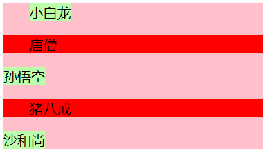

> **注：**只有块元素可以继承，行内元素不可以继承，所有只有第一个span 可以首行缩进


### 10、 最大/小高度，最大/小宽度

```css
 min-height  设置元素的最小高度
 max-height  设置元素的最大高度
 min-width   设置元素的最小宽度
 max-width   设置元素的最大宽度
 注：一般使用以上属性的时候不会跟width和height一起使用；
```


### 11、 设置英文字母大小写

```css
text-transform:;
    capitalize   设置首字母为大写
    uppercase    显示为大写字母
    lowercase    显示为小写字母
```


### 12、 换行属性


> word-break:;
>     	normal      根据浏览器默认显示是否换行
>    	 break-all   只要超出了就换行，允许在单词内换行
>    	 keep-all    允许在半角、连接符、空格位置换行


### 14、 PS切图

> 网页上使用的图片，都是储存为web所用格式；会自动优化图片体积
> ps切图
>  1、保存单张图的方法：
>      	先用**选框工具**把图片框选起来
>         	 -> ctrl + c  复制
>         	 -> ctrl + n  新建(新建一个一样大小的文件)  
>        	  -> ctrl + v  粘贴
>          存储为web所用格式
>              -> ctrl + alt + shift + s
>              -> 文件=>导出=>储存为web格式
>          储存 - 选保存的位置 - 改名字
>  2、保存多张图片的方法    
>     	 用**切片工具**把图片框选上
>     	 然后 储存为web所用格式
>         	 -> ctrl + alt + shift + s
>         	 -> 文件=>导出=>储存为web格式
>      	按住shift进行多选切片
>      	保存
>        	  ->  把切片改为选中的切片
>        	  ->  改名字
>     	 如果保存的位置有images文件，就会自动保存在这个文件里
>     	 如果没有，就会自动生成一个images文件夹；
>
> 3、 消除内容的方法：
>
> ​			找个空白的地方选区框选 --> 自由变换(ctrl + t ) --> 盖住即可 


## 四、CSS的显示模式

### 1、什么是元素的显示模式

#### 1.1、定义

元素显示模式就是元素（标签）以什么方式进行显示，比如自己占一行，比如一行可以放多个`<span>`。

#### 1.2、作用

网页的标签非常多，在不同地方会用到不同类型的标签，了解他们的特点可以更好的布局我们的网页。

### 2、元素显示模式的分类

#### 2.1、块元素

+ **常见的块元素**：

  ```css
  div  p  table caption tr thead tbody tfoot hr  ul li ol dl dt dd fieldset form body ..
  ```

  `<div>` 标签是最典型的块元素。

+ **块级元素的特点**：

  - 可以直接定义宽高( 默认宽度时100% )
  - 默认独占一行，自上而下排列
  - 块元素是严格遵循盒模型的显示规则显示的，可以定义padding\margin\border等属性；
  - 是一个容器及盒子，里面可以放行内或者块级元素。

+ **注意：**

  文字类的元素内不能放块级元素

  ```css
  <p> 标签主要用于存放文字，因此 <p> 里面不能放块级元素，特别是不能放<div> 
  同理， <h1>~<h6>等都是文字类块级标签，里面也不能放其他块级元素
  ```

#### 2.2、行内元素

+ **常见的行内元素：**

  ```css
  <a>、<strong>、<b>、<em>、<i>、(删除线)<del>、<s>、(下划线)<ins>、<u>、<span> sub sup br img(置换元素)
  ```

  `<span>` 标签是最典型的行内元素。有的地方也将行内元素称为内联元素。

+ **行内元素的特点：**

  - 相邻行内元素在一行上，一行可以显示多个，直到一行排列不下，才会换行。
  - 默认不能定义宽高，他的宽高是根据内容显示的；
  - 行内元素只能容纳文本或其他行内元素。
  - 行内元素也遵循盒模型的显示规则，但是有一些属性不能正确显示，如：padding-top/bottom,margin-top/bototm,border-top/bottom;

+ **注意：**

  链接里面不能再放链接 特殊情况链接 `<a>`里面可以放块级元素，但是给 `<a>`转换一下块级模式最安全

#### 2.3、行内块元素

+ **常见的行内块标签**：

  ```css
  input button select textarea td...
  ```

   它们同时具有块元素和行内元素的特点。有些资料称它们为内联块元素。

+ **行内块元素的特点**：

  - 和相邻行内元素（行内块）在一行上，但是他们之间会**有空白缝隙**。
  - 可以直接定义宽高，默认宽度就是它本身内容的宽度
  - 行内块元素是严格遵循盒模型的显示规则显示的，可以定义padding\margin\border等属性；


#### 2.4、元素显示模式总结

| 元素模式   | 元素排列               | 设置样式               | 默认高度       | 包含                     |
| ---------- | ---------------------- | ---------------------- | -------------- | ------------------------ |
| 块级元素   | 一行只能放一个块级元素 | 可以设置宽度高度       | 容器的100%     | 容器级可以包含任何标签   |
| 行内元素   | 一行可以放多个行内元素 | 不可以直接设置宽度高度 | 本身内容的宽度 | 容纳文本或者其他行内元素 |
| 行内块元素 | 一行放多个行内块元素   | 可以设置宽度高度       | 本身内容的宽度 |                          |

学习元素显示模式的主要目的就是分清它们各自的特点，当我们网页布局的时候，在合适的地方用合适的标签元素。

### 3、元素显示模式的转换

#### 3.1、概念

一个模式的元素需要另外一种模式的特性 比如想要增加链接 `<a>` 的触发范围。

#### 3.2、转换方式

- 转换为块元素：    display:block;
- 转换为行内元素：display:inline;
- 转换为行内块：    display: inline-block;
- 隐藏元素：            display：none;   (元素隐藏，并且不占位置)
- list-item  显示为列表的元素类型(了解)


## 五、盒子模型

### 1、盒子模型是什么

> 盒模型是css布局的基石，是用来设置元素之间的**位置关系**；

网页布局的核心本质： 就是利用 CSS 摆盒子

网页布局过程：

1. 先准备好相关的网页元素，网页元素基本都是盒子 Box 。
2. 利用 CSS 设置好盒子样式，然后摆放到相应位置。
3. 往盒子里面装内容

### 2、盒子模型的组成

**盒子模型**：是css布局的基石，它规定了网页元素如何显示以及元素间相互关系。css定义所有的元素都可以拥有像盒子一样的外形和平面空间。即都包含内容区、补白（填充）、边框、边界(外边距)这就是盒模型。

CSS 盒子模型本质上是一个盒子，封装周围的 HTML 元素，它包括：**宽度**、**高度**、**边框**、**外边距**、**内边距**、和 **实际内容**


一个盒子模型有以下四部分组成：

- **Margin(外边距)** 清除边框外的区域，外边距是透明的。
- **Border(边框)** 围绕在内边距和内容外的边框。
- **Padding(内边距)** 清除内容周围的区域，内边距是透明的。
- **Content(内容)** 盒子的内容，显示文本和图像。

**注意：**

> 一个盒子实际的大小 = 内容的大小 + padding + border宽度。

外边距不计入盒子的大小。


### 3、盒子模型的内容

#### 3.1、设置内容区域的宽高

内容区（content）是盒子模型的中心，它呈现了盒子的主要信息内容。

| CSS 属性名    | 功能          | 属性值  |
| ---------- | ----------- | ---- |
| width      | 设置内容区域宽度    | 长度   |
| max-width  | 设置内容区域的最大宽度 | 长度   |
| min-width  | 设置内容区域的最小宽度 | 长度   |
| height     | 设置内容区域的高度   | 长度   |
| max-height | 设置内容区域的最大高度 | 长度   |
| min-height | 设置内容区域的最小高度 | 长度   |

> **注意：**
>
> max-width / min-width 一般不与 width 一起使用。
>
> max-height / min-height 一般不与 height 一起使用。 


#### 3.2、块级元素默认内容宽度

> 块级元素的默认**总宽度** = 父元素内容区域的宽度 - 该块级元素的左右外边距 
>
> 块级元素**内容区域**的默认宽度 =  父元素内容区域的宽度 - 该块级元素的左右外边距 - 该块级元素的左右边框宽度 - 该块级元素的左右内边距。


### 4、盒子模型的内边距

#### 4.1、基本使用

+ 概念:内边距 padding 也叫补白或填充，是**边框和内容之间**的空间

> 填充区 (padding) :显示在内容区和边框区之间的空白
>  1、作用：设置**父子元素之间**的位置关系；
>
> ​    2、说明：
> ​        -> 是显示在盒子内部，在边框和内容区之间的空白
>
> ​        -> padding对**背景的位置不产生影响**(背景图的位置要靠背景的位置属性来设置)
>
> ​        -> **padding区会显示背景色和背景图**
>
> ​        -> padding区的大小会把元素原本的宽高撑大
>
> ​        -> 如果想保证盒子的原本显示的位置大小不变，需要在原本的宽高上减去相应的padding值
>
> 注：如果元素没有添加宽度时，此时了padding和margin不用减，浏览器默认计算
>
> ​		==如果直接量了文字大小，然后添加margin 占据上部空间，之后要将line-height设置为和文字大小一样,即line-height:1;== (如果不设置，文字有默认行高，和量出来的会有区别)


+ 语法：

  + 复合写法(**顺时针的顺序**)

  | 值的个数                          | 描述                                       |
  | ----------------------------- | ---------------------------------------- |
  | padding: 10px;                | 1个值，表示四个方向内边距都是 10 px。                   |
  | padding: 10px 20px;           | 2个值，表示上下内边距是10px，左右内边距是20px;             |
  | padding: 10px 20px 30px;      | 3个值，表示上内边距10px，左右内边距20px，下内边距30px        |
  | padding: 10px 20px 30px 40px; | 4个值，表示上内边距10px，右内边距是20px，下内边距30px，左内边距40px。上 右 下 左 |

  + 分写写法

  | CSS 属性名        | 功能   |
  | -------------- | ---- |
  | padding-top    | 上内边距 |
  | padding-right  | 右内边距 |
  | padding-bottom | 下内边距 |
  | padding-left   | 左内边距 |

> **padding 值的规则：**
>
> padding 的值不能是负数，也不能是 `auto`


#### 4.2、行内元素设置内边距

> 行内元素可以完美地设置左右内边距，上下内边距不能完美设置。
>
> 块级元素和行内块元素四个方向内边距都可以完美设置。
>
> 注：行内元素设置上下内边距==不能==改变元素上下的位置，只能撑大元素的大小，
>
> ​		设置左右内边距可以改变元素左右的距离


### 5、盒子模型的边框

#### 5.1、基本使用

+ 概念：border可以设置元素的边框。边框有三部分组成：边框宽度(粗细)、边框样式、边框颜色；
+ **作用：**可以用做网页上的一些装饰性的线条，还有分割线

> **说明**：
>
> 1.border会把元素原本的宽高**撑大**，如果想保留原本的大小不变，需要减去相应的border值
>
> 2.边框默认三像素宽，颜色默认黑色，线性默认none.所以写边框时一定要写线型！

+ 语法：

  + 复合写法

    ```css
            宽度  样式   颜色
    border: 1px  solid   red;
    ```

  + 分写写法

  ```css
  border : border-width || border-style || border-color;
  ```

  | 属性           | 描述            |
  | ------------ | ------------- |
  | border-width | 定义边框的粗细，单位是px |
  | border-style | 边框的样式         |
  | border-color | 边框的颜色         |

  > 外边距border-width的取值，谷歌浏览器默认为3px

   + 边框样式border-style可以设置如下值：
     + none：    边框没有样式，此时看不到边框（默认值）
     + solid：     边框为单实线(最为常用的)
     + dashed：边框为虚线
     + dotted： 边框为点线
     + double： 双实线
     + outset:      凸边框     (右下颜色深)
     
     + inset：      凹边框      (左上颜色深)
  
  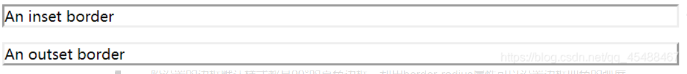
  
  > 边框颜色border-color：默认的是元素本身的文本的颜色。没有文本时，默认黑色


#### 5.2、分写的多种组合

+ border-width
  + border-top-width：       10px；
  + border-right-width：     10px；
  + border-bottom-width：10px；
  + border-left-width：        10px；
  + border-width:top/right/bottom/left;设置一个值
  + border-width:top/bottom left/right;设置两个值
  + border-width:top right/left bottom;设置三个值
  + border-width:top right bottom left;设置四个值
+ border-style
  + border-top-style：         solid；
  + border-right-style：       solid；
  + border-bottom-style：  solid；
  + border-left-style：          solid；
  + border-style:top/right/bottom/left;设置一个值
  + border-style:top/bottom left/right;设置两个值
  + border-style:top right/left bottom;设置三个值
  + border-style:top right bottom left;设置四个值
+ border-color
  + border-top-color：         red；
  + border-right-color：       red；
  + border-bottom-color：  red；
  + border-left-color：          red；
  + border-color:top/right/bottom/left;设置一个值
  + border-color:top/bottom left/right;设置两个值
  + border-color:top right/left bottom;设置三个值
  + border-color:top right bottom left;设置四个值

#### 5.3、 边框写三角形

```css
.box {
    width: 0;
    height: 0;
    border: 20px solid  transparent;
    border-top-color: red;
    border-left-color: red;
    margin: 0 auto;
}
```

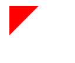

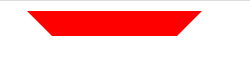

**写法说明：**

> 1. 写个盒子，宽高设置为0     (设置了宽度变成梯形！)
> 2. 四个边框设置**宽度**和颜色
> 3. 看情况，需要留哪个


### 6、盒子模型的外边距

margin 属性用于设置外边距，即控制同辈元素之间的距离。

> **说明：**margin不会把元素的原本大小撑大，但是会增加元素的显示位置；
>
> **作用：**设置==同辈==元素的位置关系；(padding设置==父子==元素的位置)


#### 6.1、基本使用

| 属性                           | 描述                |
| ---------------------------- | ----------------- |
| margin-left                  | 左外边距              |
| margin-right                 | 右外边距              |
| margin-top                   | 上外边距              |
| margin-bottom                | 下外边距              |
| margin:10px;                 | 一个值  上下左右         |
| margin:10px 20px;            | 两个值   上下   左右     |
| margin:10px 20px 30px;       | 三个值  上  左右  下     |
| margin: 10px 20px 30px 40px; | 四个值 上  右    下   左 |

**margin 属性值的规则：**

1. 复合属性可以设置 1 ~ 4 个值，规则同 padding 相同
2. 外边距的值**可以是负值**。
3. 外边距的值也**可以设置为 auto**。如果left和right设置为auto，则**块元素**居中。

> **使用外边距让块级水平居中**
>
> **条件**
>
> + ==**盒子必须指定了宽度**==（width）
> + 盒子左右的外边距都设置为 auto 

**写法**

```css
margin-left: auto;   margin-right: auto;
margin: auto;
margin: 0 auto;
```

> **注意：**以上方法是让块级元素水平居中，行内元素或者行内块元素水平居中给其父元素添加 text-align:center 即可。


+ 行内元素设置外边距

  对于块级元素和行内块元素，可以完美地设置四个方向的外边距； ==**对于行内元素，左右外边距可以完美设置，上下外边距设置无效**。**! ! !**==

  
  

#### 6.2、margin的bug

##### 6.2.1 上边距塌陷

定义：在一个元素里，第一个子元素的 margin-top 会塌陷给父级；最后一个子元素的 margin-bottom 会塌陷给父级。(父元素和子元素之间)

**解决margin塌陷**

- 方案一： 给父元素设置不为 0 的内边距。
- 方案二： 给父元素设置宽度不为 0 的边框。
- 方案三：给父元素设置 css 样式 `overflow:hidden`。(推荐)
- 方案四：给父元素或者子元素添加float:left;


##### 6.2.2、margin合并

当上下相邻的两个块元素（兄弟关系）相遇时，如果上面的元素有下外边距 margin-bottom，下面的元素有上外边距 margin-top ，则他们之间的垂直间距不是 margin-bottom 与 margin-top 之和。取两个值中的较大者这种现象被称为相邻块元素垂直外边距的合并。


> **解决方案：** 
>
> -> 尽量只给一个盒子添加 margin 值。
>
> -> 给后面的元素添加浮动；（不推荐）
>
> -> 一般不需要解决


### 盒模型的计算方式：

> 标准盒模型的占位的计算方式：
>
> ​    实际显示的大小 = content（width/height） + padding + border + margin
>
> 怪异盒模型的占位的计算方式：
>
> ​    实际显示的大小 = width/height(content + padding + border) + margin
>
> ​    注：怪异盒模型的padding和border不会把元素撑大，而是会把元素的内容区挤小；
>    ​		 遵循怪异盒模型显示的元素，表单的按钮（input的**按钮**和button**按钮**）、table
>
> ​    **统一方法：**设置元素的显示模式；
> ​        **box-sizing:;**
> ​            content-box   遵循标准盒模型的显示规则显示
> ​            border-box    遵循怪异盒模型的显示规则显示


### 7、盒子模型相关

#### 7.1、水平方向布局

默认情况下块级元素各组成部分的横向尺寸始终等于容纳块（离的最近的祖辈块状元素）的宽度。容纳块的宽度=子margin-left + 子border-left + 子padding-left + 子width + 子元素的padding-right + 子元素的border-right + 子元素的margin-right

七个属性中，只有子元素的width、子元素的margin-left和子元素的margin-right可以设置为auto。其他的属性的值只能设置为具体的值或默认值（默认值为0）。

- 情况一：width、margin-left、margin-right其中两个设置为具体指，一个为auto的时候。

  在这种情况下设置的auto的值必须满足上面的容纳块的公式，你可以理解为auto为补全总和所缺少的尺寸。

  ```html
  <!DOCTYPE html>
  <html>
      <head>
          <style>
              html,body{
                  margin:0;
              }
              #f{
                  width:300px;
                  height:300px;
                  border:1px solid green;
              }
              #z{
                  width:auto;
                  height:100px;
                  margin-left:10px;
                  margin-right:20px;
                  border:1px solid blue;
              }
          </style>
      </head>

      <body>
         <div id="f">
             <div id="z"></div>
         </div>

      </body>

  </html>
  ```

- 情况二：width、margin-left、margin-right其中两个设置为auto的情况

  - 如果是margin-left和margin-right设置为auto，那么剩下的空间将会被他们两个平分造成了元素居中的结果。

    ```html
    <!DOCTYPE html>
    <html>

        <head>
            <style>
                html,body{
                    margin:0;
                }
                #f{
                    width:300px;
                    height:300px;
                    border:1px solid green;
                }
                #z{
                    width:200px;
                    height:100px;
                    margin-left:auto;
                    margin-right:auto;
                    border:1px solid blue;
                }
            </style>
        </head>

        <body>
           <div id="f">
               <div id="z"></div>
           </div>

        </body>

    </html>
    ```

  - 宽度和左、右任意一边设置为auto时，这个时候设置为auto那边运算结果为0，width被设置为填满容纳块所需要的值。

    ```html
    <!DOCTYPE html>
    <html>
        <head>
            <style>
                html,body{
                    margin:0;
                }
                #f{
                    width:300px;
                    height:300px;
                    border:1px solid green;
                }
                #z{
                    width:auto;
                    height:100px;
                    margin-left:10px;
                    margin-right:auto;
                    border:1px solid blue;
                }
            </style>
        </head>

        <body>
            <div id="f">
            <div id="z"></div>
            </div>
        </body>

    </html>
    ```

- 情况三：width、marign-left、margin-right三个设置为auto时

  这个时候margin-left和margin-right将会设置为0，width将会要多宽有多宽。

  ```html
  <!DOCTYPE html>
  <html>

  <head>
      <style>
          html,body{
              margin:0;
          }
          #f{
              width:300px;
              height:300px;
              border:1px solid green;
          }
          #z{
              width:auto;
              height:100px;
              margin-left:auto;
              margin-right:auto;
              border:1px solid blue;
          }
      </style>
  </head>

  <body>
     <div id="f">
         <div id="z"></div>
     </div>

  </body>

  </html>
  ```

- 情况四：width、margin-left、margin-right都设置具体的值。这种情况叫过度约束。

#### 7.2、内容溢出

| CSS 属性名    | 功能             | 属性值                                      |
| ---------- | -------------- | ---------------------------------------- |
| overflow   | 溢出内容的处理方式      | visible：显示，默认值<br>hidden：隐藏<br>scroll：显示滚动条，不论内容是否溢出<br>auto：自动显示滚动条，内容不溢出不显示 |
| overflow-x | 水平方向溢出内容的处理方式  | 同 overflow                               |
| overflow-y | 垂直方向溢出内容给的处理方式 | 同 overflow                               |

> **注意：**
>
> 1. 如果通过 overflow-x 或者 overflow-y 只设置一个方向上内容溢出处理方式，另一个会调整为 auto （不论是否设置），不好使也不常用。
> 2. overflow 常用的值是 hidden 和 auto，处了能够处理溢出内容的显示方式，还可以解决很多疑难杂症。

```html
<!DOCTYPE html>
<html lang="en">
<head>
    <meta charset="UTF-8">
    <title>Document</title>
    <style>
        .box {
            border: 2px solid red;
            padding: 20px;
            width: 400px;
            height: 300px;

            /* 设置内容溢出的处理方式 */
            /* overflow: visible; */
            /* 隐藏 */
            /* overflow: hidden; */
            /* 显示滚动条 不论内容是否溢出 */
            /* overflow: scroll; */
            /* 自动显示滚动条 */
            /* overflow: auto; */


            overflow-x: visible;
            overflow-y: hidden;
        }
        .box p {
            width: 2000px;
            background-color: green;
        }
    </style>
</head>
<body>
    <div class="box">
        Lorem ipsum dolor, sit amet consectetur adipisicing elit. Autem praesentium sed nam in non, eius fuga consequuntur iure et dolores minus. Accusantium dicta, illo quibusdam aspernatur magnam explicabo rem est!
        Lorem ipsum dolor, sit amet consectetur adipisicing elit. Autem praesentium sed nam in non, eius fuga consequuntur iure et dolores minus. Accusantium dicta, illo quibusdam aspernatur magnam explicabo rem est!
        
        <p>Lorem ipsum dolor sit amet consectetur, adipisicing elit. A dolorem assumenda nulla incidunt quibusdam sit? Voluptates aliquam, cum doloribus delectus impedit aspernatur odio fugiat dicta, architecto quas similique neque ea.</p>
        Lorem ipsum dolor, sit amet consectetur adipisicing elit. Autem praesentium sed nam in non, eius fuga consequuntur iure et dolores minus. Accusantium dicta, illo quibusdam aspernatur magnam explicabo rem est!
        Lorem ipsum dolor, sit amet consectetur adipisicing elit. Autem praesentium sed nam in non, eius fuga consequuntur iure et dolores minus. Accusantium dicta, illo quibusdam aspernatur magnam explicabo rem est!
        Lorem ipsum dolor, sit amet consectetur adipisicing elit. Autem praesentium sed nam in non, eius fuga consequuntur iure et dolores minus. Accusantium dicta, illo quibusdam aspernatur magnam explicabo rem est!
    </div>
    <hr>
</body>
</html>
```

#### 7.3、垂直方向布局

块级元素的内容决定元素的默认高度：

- 如果块级元素设定具体的高度并且指定的高度大于显示内容所需要的高度，多出来的高度看起来像是内边距。
- 如果块级元素设定具体的高度并且指定的高度小于显示内容所需要的高度，具体的行为将取决于overflow属性的值。

容纳块的高度=子margin-top+子border-top+子padding-top+子height+子padding-bottom+子border-bottom+子margin-bottom

高度、上、下外边距可以设置为auto。其他的必须为具体的值。

- margin-top和margin-bottom设置为auto，这个时候自动计算为0。
- margin-top、margin-bottom设置为具体的值，height的值为auto时高度不会被自动拉开（会为0）。
- 某一边和height设置为auto，外边距为auto的那个会被设置为0。
- 上、下和height都设置为具体的值，设置的多少就是多少。
- 都设置为auto时都会设置为0。

#### 7.4、隐藏元素

① 方案一： visibility 属性

visibility 属性默认值是 `show`，如果设置为 `hidden`，元素会隐藏。

元素看不见了，还占有原来的位置（元素的大小依然保持）。

② 方案二： display 属性

设置 `display:none`，就可以让元素隐藏。

彻底地隐藏，不但看不见也不占用任何位置，没有大小宽高。

```html
<!DOCTYPE html>
<html lang="en">
<head>
    <meta charset="UTF-8">
    <title>Document</title>
    <style>
        .box {
            width: 400px;
            height:300px;
            border: 2px solid red;
            background-color:#ccc;
        }

        .box1 {
            /* 隐藏 */
            /* visibility: hidden; */

            /* 隐藏 */
            display: none;
        }
    </style>
</head>
<body>
    <div class="box box1">box1</div>
    <div class="box box2">box2</div>
</body>
</html>
```

#### 7.5、样式继承

有些样式会继承，一个元素如果本身设置了某个样式就使用本身设置的样式；但是如果本身没有设置某个样式，会从父元素开始一级一级继承（优先继承离得近的祖先元素）。

① 会继承 css 属性

```
字体属性、文本属性（除了vertical-align）、文字颜色、鼠标样式
```

② 不会继承的 css 属性

```
边框、背景、内边距、外边距、宽高、溢出方式 等
```

```html
<!DOCTYPE html>
<html lang="en">
<head>
    <meta charset="UTF-8">
    <title>Document</title>
    <style>
         html {
            font-size: 20px;
            font-weight: 700;
            color: blue;
            background-color: #ccc;
            cursor: pointer;
        }
        .wrapper {
            width: 600px;
            height: 400px;
            padding: 20px;
            border: 2px solid red;
            color: red;
        }
        .box {
            margin-top: 100px;
            border: 2px solid green;
            padding: 20px;
            height: 200px;
        }
        p {
            border: 2px solid orange;
            /* padding: 20px; */
            font-size: 40px;
            
        }
    </style>
</head>
<body>
    <div class="wrapper">
        <div class="box">
            <p>
                Lorem ipsum dolor sit amet consectetur adipisicing elit. Maiores dolores natus accusamus minus fuga illum dolore illo quo placeat sit autem, officiis provident nisi aut laborum veniam quas nesciunt id.
            </p>
        </div>
    </div>
</body>
</html>
```

#### 7.6、默认样式

有些元素有默认的样式：

```
超链接默认: 下划线、字体颜色、鼠标小手
标题 h1~h6： 加粗 字体大小、上下外边距
段落 p：上下外边距
ul、ol：左内边距
body： 8px外边距（4个方向）
```

**元素的默认样式优先级大于继承的样式**， 如果要重置元素的默认样式，选择器一定要直接选择器到元素。

```html
<!DOCTYPE html>
<html lang="en">
<head>
    <meta charset="UTF-8">
    <title>Document</title>
    <style>
        .box {
            width: 600px;
            height: 200px;
            padding: 20px;
            border: 2px solid red;

            color: red;
            font-weight: bold;
            text-decoration: none;

        }

        a {
            text-decoration: none;
            color: #333;
            border: 1px solid #ccc;
        }

        .box a {
            display: inline;
        }

    </style>
</head>
<body>
    
    <div class="box">
        <a href="#" style="overflow:hidden">我是超链接</a>
        <span>我是普通文字</span>

        <h1>朦朦你好啊</h1>
    </div>

</body>
</html>
```

#### 7.7、行内元素或行内块布局

+ 文本属性作用于行内元素和行内块元素

  行内元素和行内块元素可以被父元素当做文本处理，给父元素设置文本属性，会被里面的行内或行内块元素起作用

##### 让行内块元素或行内元素水平居中（在父元素中）

  ```css
  给它的父元素设置 text-align: center;
  ```


  ##### 让行内元素或行内块元素垂直居中（在父元素中）

  ```css
  给它的父元素设置 line-height 跟父元素高度一致。
  行内块元素本身还要再设置一 vertical-align: middle。
  ```


  ##### 行内元素或行内块元素之间的空白问题

  行内块元素以及行内元素会被当做文本去处理，由于换行或者沿文字基线对齐会产生一些空白。

==之间的空白==

  **产生的原因：**

  敲代码的时候，为了代码具有良好的可读性，写一个标签就换个行。 行内块元素或行内元素之间的换行会被浏览器解析为一个空白字符。

> **解决方案：**
>
> 方案一： 去掉行内或行内块元素之间的换行和空格。（不推荐）
>
> 方案二： 在父元素中设置 `font-size:0`；如果行内块或行内元素内有文字再单独给元素设置字体大小。（推荐）

 ==底部的空白==（图片的幽灵空白）

  **产生原因：**

  行内块元素或行内元素与文本的基线对齐，**幽灵空白**就是基线与底线之间的距离。

>   **解决方案：**
>
> **方案一：** 给行内元素或行内块元素设置`vertical` 的值不为 `baseline` 即可，设置为 `middel`、`bottom`、`top` 都可以。
>
> **方案二：** 给父元素设置 `font-size: 0`。如果该行内元素或行内块元素内部还有文本内容需单独设置`font-size`。
>
> **方案三：** 主要针对图片，设置图片为 `display:block`。


## 六、浮动前提

### 1、传统网页布局的三种方式

 CSS 提供了三种传统网页布局方式(简单说,就是盒子如何进行排列顺序)：

- 标准文档流（文档、标准文档流（文档流）：标签默认排列的顺序；上下排列的布局；
- 浮动流（float）: 主要实现并列显示的布局
- 定位流（position）：主要实现层叠布局

注意：实际开发中，一个页面基本都包含了这三种布局方式（后面移动端学习新的布局方式） 。

### 2、标准流

所谓的标准流也叫做普通流/文档流。

指HTML中元素在计算布局、排版的过程中的机制。文档源代码书写时有正常的顺序，是从上到下从左到右的。解释代码的时候也是从上到下、从左到右来解释，如果是行内元素就在一行、如果是块状元素就会自己独占一行。

1. 块级元素会独占一行，从上向下顺序排列。常用元素：div、hr、p、h1~h6、ul、ol、dl、form、table
2. 行内元素会按照顺序，从左到右顺序排列，碰到父元素边缘则自动换行。常用元素：span、a、i、em 等

以上都是标准流布局，我们前面学习的就是标准流，标准流是最基本的布局方式。


### 3、为什么需要浮动

+ 以前的布局

  浮动设计的最初想法是为了实现**文字环绕**图片的效果。

  

  后来浮动代替表格布局成为了主流的布局方式。

+ 现在的布局

  有很多的布局效果，标准流没有办法完成，此时就可以利用浮动完成布局。 因为浮动可以改变元素标签默认的排列方式.

   浮动最典型的应用：**可以让多个块级元素一行内排列显示**。

   网页布局第一准则：**多个块级元素纵向排列找标准流，多个块级元素横向排列找浮动**。

## 七、浮动基础

### 1、浮动的基本使用

float 属性用于创建浮动框，将其移动到一边，直到左边缘或右边缘触及包含块或另一个浮动框的边缘。

#### 1.1、基本语法

```css
 选择器 { float: 属性值; }
```

| 属性值 | 描述               |
| ------ | ------------------ |
| none   | 元素不浮动（默认） |
| left   | 元素向左浮动       |
| right  | 元素向右浮动       |


#### 1.2、案例练习

+ 解决行内块空白问题

  


+ 文字环绕图片

  **浮动元素不会盖住文字**，文字会自动环绕在浮动元素的周围，所以我们可以利用浮动来设置文字环绕图片的效果。(所以是**给图片添加浮动**)

  
  
+ 文字环绕单词

  ```css
  <!DOCTYPE html>
  <html lang="en">
  <head>
      <meta charset="UTF-8">
      <title>Document</title>
      <style>
          p {
              width: 400px;
          }
          p span {
              font-size: 40px;
              font-weight: bold;
              float: left;
              margin-right: 20px;
          }
      </style>
  </head>
  <body>
      <p>
          <span>L</span>orem ipsum dolor sit amet consectetur adipisicing elit. Accusamus ducimus dolorem vitae error, quis at saepe blanditiis, est, ut minima natus! Vel accusamus nemo pariatur, culpa similique perspiciatis exercitationem nam?
      </p>
  </body>
  </html>
  ```

### 2、浮动的特点

#### 2.1脱离文档流

浮动元素会脱离文档流；不占据文档流的位置，后面的元素会把位置补上去


#### 2.2、行内顶部对齐

浮动的元素会一行内显示并且元素顶部对齐


注意：

 浮动的元素是互相贴靠在一起的（不会有缝隙），如果父级宽度装不下这些浮动的盒子，多出的盒子会另起一行对齐。


#### 2.3、浮动盒子没有缝隙

浮动的元素会具有行内块元素的特性，区别是浮动的盒子中间是没有缝隙的


#### 2.4、浮动导致高度塌陷

子元素浮动将会导致父元素高度塌陷

```html
<!DOCTYPE html>
<html>
	<head>
		<meta charset="utf-8">
		<title></title>
		<style type="text/css">
			/* 
				浮动的盒子会导致父盒子高度塌陷：
				在不给父盒子设置高度的情况下，
				父盒子的高度不会由浮动的子盒子撑开。
			 */
			.box{
				border: 5px solid red;
				/* height: 100px; */
			}
			.box>div {
				float: left;
				width: 100px;
				height: 100px;
				border: black solid 1px;
				background-color: #00FFFF;
			}
		</style>
	</head>
	<body>
		<div class="box">
			<div>1</div>
			<div>2</div>
			你说他塌陷不塌陷
		</div>
	</body>
</html>
```

#### 2.5、外边距不合并

**==浮动元素四周的外边距不会合并==**


#### 2.6、边界问题

+ 左浮动的元素不能超过容纳块的左边界
+ 右浮动的元素不能超过容纳块的右边界
+ 浮动元素的顶边不能比父元素的顶边高


#### 2.7、顺序问题

+ 文档中的前面的元素向左浮动，那么后面的浮动元素的左边界在前一个元素右外边界的右侧
+ 文档中的前面的元素向右浮动，那么后面的浮动元素的右边界在前一个元素左外边界的左侧


#### 2.8、不规则浮动

新起一行的元素的上边界，不能超过前一个浮动元素的下边界。

#### 2.9、总结

> -> 浮动元素会脱离文档流；不占据文档流的位置，后面的元素会把位置补上去；
>
> -> 浮动元素不会把后面的文本覆盖，**文本会围绕着浮动元素显示**；
>
> -> 要并列显示的元素，都要添加浮动属性；
>
> -> 浮动元素，始终都是在父元素的宽度范围内进行浮动，如果父元素的宽度不够，那么浮动元素会折到下一	行显示；如果浮动元素在浮动的时候遇到了padding或者margin或者另一个元素或者到了父元素边缘，就	停在这个位置上了；
>
> -> 浮动元素都为右浮动的时候，元素的顺序会颠倒；
>
> -> 块状元素在**添加了浮动属性**之后，**宽高就和==内容==一样大**了。但是依然可以定义宽高；
>
> -> 当行内元素添加了浮动属性之后，就可以定义宽高的，同时可以**解决中间的空隙**问题；
>
> -> 浮动元素对后面 的元素会产生影响，会把后面的元素覆盖，但是对浮动前面的元素不产生任何影响；
>
> -> **添加浮动属性之后，元素对margin的auto属性值就无效了**

### 3、浮动效果

+ 当把框 1 向右浮动时，它脱离文档流并且向右移动，直到它的右边缘碰到包含框的右边缘：

  

+ 当框 1 向左浮动时，它脱离文档流并且向左移动，直到它的左边缘碰到包含框的左边缘。因为它不再处于文档流中，所以它不占据空间，实际上覆盖住了框 2，使框 2 从视图中消失。

  

+ 如果把所有三个框都向左移动，那么框 1 向左浮动直到碰到包含框，另外两个框向左浮动直到碰到前一个浮动框。

  

+ 如果包含框太窄，无法容纳水平排列的三个浮动元素，那么其它浮动块向下移动，直到有足够的空间。

  

+ 如果浮动元素的高度不同，那么当它们向下移动时可能被其它浮动元素“卡住”：

  


### 4、浮动的影响

#### 4.1、后面兄弟元素

后面的兄弟元素会占据浮动元素的位置，在浮动元素的下面。（浮动的元素对前面的兄弟元素没有影响）


#### 4.2、父元素影响

不能撑起父元素的高度，元素高度塌陷。（父元素的宽度依然束缚浮动的子元素）

> 高度塌陷：
>
> 当父元素没设置高度，同时子元素浮动了，父元素就会高度塌陷
>
> 一般不想固定元素高度时会出现这个问题；

### 5、清除浮动

#### 5.1 方法

1. 方案一： 给父元素指定高度。解决父元素高度塌陷。（不推荐）

2. 方案二： 给父元素也设置浮动，带来其他影响（不推荐）。

3. 方案三： 给父元素设置 **overflow:hidden;** (推荐)

4. 方案四： 在所有浮动元素的最后面，添加一个块级元素，并给该块级元素设置 `clear:both`

5. **方案五**： 给浮动元素的父元素，设置伪类，通过伪类清除浮动，原理与方案四相同。(推荐)

   ```css
   .parent::after {
       content: "";
       display: block;
       clear:both;
   }
   ```


```css
1、设置高度（看情况使用）
    优点：简单直接
    缺点：高度会固定，显示不灵活；
2、给父元素开启bfc;
    -> overflow:hidden;（推荐）
        优点：简单方便
        缺点：溢出时会被隐藏；
    -> float:left; (不建议使用)
        优点:简单；
        确定：会带来其他的问题，会脱离文档流，影响页面布局
    -> display:inline-block;(不建议使用)
    -> position:absolute(fixed) （不建议使用，会带来新的问题）
    ...
3、在浮动元素的后面添加空的div,并且给这个div设置css属性clear:both;
    如：div{
        clear:both;
    }
        优点：能解决问题
        缺点：会增加结构标签
        不建议使用
4、万能清除法：（通过伪元素实现的方法）：(最推荐使用的)
    伪元素选择器实现万能清除法：
    伪：假的
    元素：元素、标签
    伪元素：假的标签
    ::after 在...之后添加一个假的元素；
    在...之后：在当前元素内部的最后面添加一个假的元素；
    通过伪元素添加的这个标签，是一个行内元素；
    语法：
        父元素::after{
            content:'';
            display:block;  <!--display:table;也是同样的效果-->
            clear:both;
            /* 兼容低版本浏览器*/
            height:0;
            overflow:hidden;
            visibility:hidden;
        }
        父元素{
            /* 解决ie6\7的高度塌陷问题 */
            zoom:1;
        }
    content:''; 是::after 里必须要添加的属性，是给该元素添加内容用的；
```

#### 5.2 清除浮动属性：

```css
clear:;
    left    清除左浮动，不允许左侧有浮动元素
    right   清除右浮动，不允许右侧有浮动元素
    both    清除两侧浮动，不允许左右有浮动元素
    none    不清除，允许左右有浮动元素

注：清除浮动，并不是给浮动元素添加，而是给受到浮动影响的元素添加clear属性，
    clear:right;只清除右侧的浮动，但是如果是float:left;仍然会受到影响
    谁受影响，给谁添加！！！  
```

#### 5.3 伪元素选择器：

```css
语法：
    ::after{ content:'';} 在...之后添加伪元素
    ::before{ content:'';} 在...之前添加伪元素
    ::first-line{ }  伪元素里的第一行的内容 (了解即可)
    ::first-letter{ } 伪元素里第一个字符； (了解即可)
说明：伪元素前面的冒号，可以写单冒号，也可以写双冒号；
      在...之前/之后：指的是在元素内部的前面或者后面
      添加的伪元素的元素类型是行内元素
      这个伪元素是通过css添加的，不是在结构里面添加的标签；
      伪元素：假的元素，但是是可以真正显示效果的元素；
      after和before在使用的时候，都必须要配合content属性使用；
      content: 添加内容的属性；
      一个元素只能添加一个before和after; 
```


### 6、开发须知

#### 6.1、浮动注意点

1. 浮动和标准流的父盒子搭配。

   先用标准流的父元素排列上下位置, 之后内部子元素采取浮动排列左右位置

2. 一个元素浮动了，理论上其余的兄弟元素也要浮动。

   一个盒子里面有多个子盒子，如果其中一个盒子浮动了，其他兄弟也应该浮动，以防止引起问题。

3. 浮动的盒子只会影响浮动盒子后面的标准流,不会影响前面的标准流。

#### 6.2、属性书写顺序

**建议遵循以下顺序：**

1. **布局定位属性**：display / position / float / clear / visibility / overflow（建议 display 第一个写，毕竟关系到模式）
2. **自身属性**：width / height / margin / padding / border / background
3. **文本属性**：color / font / text-decoration / text-align / vertical-align / white- space /
4. **其他属性（CSS3）**：content / cursor / border-radius / box-shadow / text-shadow

```css
.atguigu {
    display: block;
    position: relative;
    float: left;
    width: 100px;
    height: 100px;
    margin: 0 10px;
    padding: 20px 0;
    font-family: Arial, 'Helvetica Neue', Helvetica, sans-serif;
    color: #333;
    background: rgba(0,0,0,.5);
    border-radius: 50%;
 }
```


## 八、BFC

### 1、BFC定义

1. BFC（Block Formatting Content），块级格式化上下文

2. 是页面可视化css渲染的一部分，是块盒子布局的一块区域

3. 这个区域是相对外界独立的

### 2、BFC的布局规则

> 1、内部的Box会在垂直方向，一个接一个地放置。
>
> 2、Box垂直方向的距离由margin决定。属于同一个BFC的两个相邻Box的margin会发生重叠（按照最大margin值设置）
>
> 3、每个元素的margin box的左边， 与包含块border box的左边相接触
>
> 4、BFC的区域不会与浮动元素重叠。
>
> 5、**BFC就是页面上的一个隔离的独立容器，容器里面的子元素不会影响到外面的元素**。
>
> 6、计算BFC的高度时，浮动元素也参与计算(=>**就不会高度塌陷**)


### 3、触发BFC的条件

> 1、默认情况下：html标签(根标签) 就是一个大的bfc
>
> 2、float属性不为none;  可以是left; right; 
>
> 3、position为**absolute或fixed**
>
> 4、display为inline-block, table-cell, table-caption, flex, inline-flex
>
> 5、overflow不为visible; 可以是auto; scroll ; hidden
>
> 注：在合适的情况下，使用合适的属性开启BFC；


### 4、BFC的应用

> 1、**自适应两栏布局**
>
> ​		一个固定宽度，另一个宽度随着可视窗口的变化而变化
>
> ​	    两边固定宽度，中间可变
>
> 2、清除内部浮动（高度塌陷）
>
> 3、防止margin上下重叠: （margin-top 向上传递给父元素的问题）

**自适应两栏**布局案例

```html
<!DOCTYPE html>
<html lang="en">
<head>
    <meta charset="UTF-8">
    <meta http-equiv="X-UA-Compatible" content="IE=edge">
    <meta name="viewport" content="width=device-width, initial-scale=1.0">
    <title>Document</title>
    <style>
        *{
            margin:0;
            padding:0;
        }
        .left{
            width:200px;
            height:300px;
            background:#f00;
            float:left;
        }
        .right{
            height:350px;
            background:#0f0;
            /* 开启BFC防止被左边元素覆盖 */
            overflow:hidden;
        }
    </style>
</head>
<body>
    <div class="left">left</div>
    <div class="right">right</div>
</body>
</html>
```


**自适应三栏**布局案例

关键：

* 将中间盒子和右边盒子的顺序调换一下；
* 左边盒子左浮动，右边盒子右浮动，中间盒子开启BFC

```html
<!DOCTYPE html>
<html lang="en">
<head>
    <meta charset="UTF-8">
    <meta http-equiv="X-UA-Compatible" content="IE=edge">
    <meta name="viewport" content="width=device-width, initial-scale=1.0">
    <title>Document</title>
    <style>
        *{
            margin:0;
            padding:0;
        }
        html,body{
            height:100%;
        }
        body{
            min-width: 1000px;
            min-height:500px;
        }
        .left{
            width:200px;
            height:100%;
            background:#f00;
            float:left;
        }
        .center{
            height:100%;
            background:#0f0;
            overflow:hidden;
        }
        .right{
            width:200px;
            height:100%;
            background:#f0f;
            float:right;
        }
    </style>
</head>
<body>
    <div class="left">left</div> 
    <div class="right">right</div>
    <div class="center">center</div>
</body>
</html>
```


## 九、定位

### 1、为什么要学习定位

> **标准流**是从上到下，从左到右执行，正常展示
>
> **浮动**是多个块级盒子一行横向排列
>
> **定位流**: 主要实现层叠布局；（position）

### 2、什么时候用定位

* 层叠布局
* 显示版心区以外的内容，一般也要定位实现；

### 3、定位的形式

* 无特殊定位（静态定位）
* 相对定位
* 绝对定位
* 固定定位
* 粘性定位

属性：

```css
定位的属性：position
    1、静态定位     static
    2、相对定位     relative
    3、绝对定位     absolute
    4、固定定位     fixed
    5、粘性定位     sticky
```

**偏移量的设置：**

> 偏移量的属性：
>     left
>     right
>     top
>     bottom
>
> 属性值：px  % ；
>   注：当top和bottom同时使用时，优先识别top,
>
> ​		  当left和right同时使用时，优先识别left;
>
> ​		  要**配合定位使用**，单独使用无效


### 4、定位模式

#### 4.1 无特殊定位

```css
position: static;
```

> 无特殊定位：静态定位
> 注：没有定位效果，在当前位置不动；
>
> ​		可用作取消定位
>
> ​		当设置了偏移量之后，也不会发生位移


#### 4.2 相对定位

```css
position:relative;
```

> * 当添加了相对定位之后，元素的效果跟static的效果一样；但是**会产生层级的变化**；
> * 当设置了偏移量之后，会发生位移；
> * 相对定位的位移是，相对该元素初始的位置进行位移的；也就是说，它自己原本的位置是他的参照物；
> * 相对定位元素的原本的位置是保留的，也就是说位置**不脱离标准文档流**，所有就**不会对页面布局产生影响**；
> * 一般用相对定位设置包含块
>
> 案例：见图片放大效果！

#### 4.3 绝对定位

```css
position:absolute;
```

> 注：
>
> * 绝对定位元素，对margin的auto失效，对float也失效；
> * 绝对定位元素，**会脱离文档流**，显示在上一层；
> * 绝对定位元素，脱离文档流后，在标准文档流里的位置就不占有了，后面的元素就会把位置补上去；
> * 在**没有设置偏移量**的时候，他是**显示在默认位置**上不动，但是会出现层及变化；
> * 当给绝对定位元素添加了偏移量之后，他就相对**可视窗口的第一屏**显示偏移量了；也就可以理解可视窗口的第一屏是绝对定位元素的**参照物（包含块）**；
> * 默认情况下，可视窗口的第一屏是绝对定位元素的参照物;但是也可以修改绝对定位的参照物；给绝对定位元素祖先级元素添加定位属性,并且定位属性的值是==**relative**==(建议使用) / absolute / fixed; 为了减小对页面的影响，一般会给最近的父元素设置为参照物（主要还是根据页面情况而定）；
> * 绝对定位元素，会相对离他最近的并且**具有定位属性**的**祖先元素**进行绝对定位；
> * 绝对定位元素的层级关系，跟书写顺序有关，后面的层级在上面，会把前面的元素覆盖；

**绝对定位对元素的影响：**

> * 块元素添加了绝对定位之后，他的宽高就和内容一样大的，但是依然可以定义宽高；
> * 行内元素添加了绝对定位之后，他就可以定义宽高了，像定了位的块元素的效果一样了；


#### 4.4 固定定位

##### 4.4.1语法

```css
position:fixed;
```

> 说明：
>
> * 会脱离文档流，不占据原本文档流的位置，后面的元素会把位置补上去；
> * 固定定位元素对margin的auto和浮动失效；
> * 当没有设置偏移量的时候,固定定位元素在当前位置不动;但脱离文档流
> * 固定定位的参照物，始终都是可视窗口；
> * 固定定位元素不会跟随滚动条滚动；
> * 固定定位对元素本身的影响：
>   * 块元素添加了固定定位之后，宽高就根据内容显示，但是依然可以定义宽高；
>   * 行内元素添加固定定位之后，就可以定义宽高了，就像定义固定定位的块元素一样；
>
> 使用场景：
>
> * 当不想让元素跟随滚动条滚动时，使用固定定位
> * 始终相对可视窗口定位的时候，使用固定定位；

##### 4.4.2右侧导航栏做法

**案例：将工具栏固定在版心区右边10像素**

重点：

1. 固定定位；
2. 偏移量：left:50%;  margin-left:(版心宽度的一半) + 10px

```html
<!DOCTYPE html>
<html lang="en">
<head>
    <meta charset="UTF-8">
    <meta http-equiv="X-UA-Compatible" content="IE=edge">
    <meta name="viewport" content="width=device-width, initial-scale=1.0">
    <title>Document</title>
    <style>
        *{
            margin:0;
            padding:0;
        }
        .content{
            width:1200px;
            height:500px;
            background:#fcc;
            margin:0 auto 10px;
        }
        .sub{
            width:30px;
            background:#0cc;
            position: fixed;
            bottom:50px;
            /* 重点！ */
            left:50%;
            margin-left:610px;
        }
        .sub li{
            height:30px;
            background:#ccc;
            margin-bottom:2px;
            font-size:12px;
            text-align: center;
            line-height: 30px;
            list-style: none;
        }
    </style>
</head>
<body id="back">
    <div class="content" id="content1">content1</div>
    <div class="content" id="content2">content2</div>
    <div class="content" id="content3">content3</div>
    <div class="content" id="content4">content4</div>
    <div class="content" id="content5">content5</div>
    <ul class="sub">
        <li><a href="#content1">1</a></li>
        <li><a href="#content2">2</a></li>
        <li><a href="#content3">3</a></li>
        <li><a href="#content4">4</a></li>
        <li><a href="#content5">5</a></li>
        <li><a href="#back">返回</a></li>
    </ul>
</body>
</html>
```

##### 4.4.3水平垂直居中（1）

方法：top：50%，left：50%

```css
 /* 水平垂直居中 */
        .box{
            width:200px;
            height:200px;
            background:#f00;
            position:fixed;
            top:50%;
            left:50%;
             /* 左移盒子宽度的一半，上移盒子高度的一半 */
            margin-top:-100px;
            margin-left:-100px;
        }
```

##### 4.4.4水平垂直居中（2）

方法：开启绝对定位或固定定位，同时使用top、bottom，或者left、right的时候，margin：auto；可以生效；

* 开启绝对定位或固定定位；
* 四个偏移量设置为0
* margin:auto;

```css
    <style>
        .box{
            width:200px;
            height:200px;
            background:#f00;
            /* 四马分尸 */
            position: fixed;
            top:100px;
            bottom:0px;
            left:0px;
            right:0px;
            margin:auto;
        }
    </style>
```

>  注：若四个偏移量有一个不为零，可以**实现在某一个方向上居中**
>
> 例如：button不为0，则会在顶部居中

##### 4.4.5宽高自适应窗口

自适应两栏布局：

关键：

* **固定定位 / 绝对定位**
* **设置偏移量(全部为0时，铺满全屏)**

```html
<!DOCTYPE html>
<html lang="en">

<head>
    <meta charset="UTF-8">
    <meta http-equiv="X-UA-Compatible" content="IE=edge">
    <meta name="viewport" content="width=device-width, initial-scale=1.0">
    <title>Document</title>
    <style>
        /* 宽度自适应 */
        * {
            padding: 0;
            margin: 0;
        }
        .box {
            height: 500px;
            border: 1px solid #000;
        }

        .box1 {
            width: 100px;
            height: 100px;
            background-color: #f00;
        }

        .box2 {
            height: 100px;
            position: fixed;
            top: 0;
            left: 100px;
            right: 0;
            background-color: #0f0;
        }
    </style>
</head>

<body>
        <div class="box1">1</div>
        <div class="box2">2</div>

</body>

</html>
```

**自适应三栏布局：**

```css
<!DOCTYPE html>
<html lang="en">

<head>
    <meta charset="UTF-8">
    <meta http-equiv="X-UA-Compatible" content="IE=edge">
    <meta name="viewport" content="width=device-width, initial-scale=1.0">
    <title>Document</title>
    <style>
        * {
            padding: 0;
            margin: 0;
        }

        .box {
            width: 100%;
            height: 100px;
            margin: 50px auto;
            position: relative;
            border: 1px solid #ccc;
        }

        .box1 {
            height: 100px;
            width: 100px;
            background-color: #00f;
        }

        .box2 {
            height: 100px;
            position: absolute;
            top: 0;
            left: 100px;
            right: 100px;
            background-color: #f00;
        }

        .box3 {
            height: 100px;
            width: 100px;
            background-color: #0f0;
            position: absolute;
            right: 0;
            top: 0;
        }
    </style>
</head>

<body>
    <div class="box">
        <div class="box1"></div>
        <div class="box2"></div>
        <div class="box3"></div>
    </div>
</body>

</html>
```


#### 4.5 粘性定位

```css
position:sticky;
```

> 说明：
>
> * css3.0新增的定位方法；
> * 主要实现吸顶效果；
> * 一般配合top或者left使用；
> * 是static和fixed的结合体，当这个元素在窗口范围内时，显示的是无特殊定位效果；然后在超出窗口的瞬间就显示为固定定位的效果了；


### 5、定位元素层级属性

1. 概念：在使用**定位**布局时，可能会**出现盒子重叠的情况**。此时，可以使用 **z-index** 来控制盒子的前后次序 (z轴)
2. 语法：

```css
z-index:;
```

3. 属性值：

```css
auto : 自由显示（默认值，等同于0），根据html里的书写顺序显示；
number : 数值不加单位，number值越大，层级就越高，支持负值；

如：z-index:999;
```

> 注：
>
> * 该属性必须要配合定位属性一起使用（除了无特殊定位）；
> * 当number值一样的时候，依然遵循html的书写顺序显示层级关系；


### 6、 定位总结

> 相对定位（relative）、绝对定位（absolute），固定定位（fixed）的**区别：**
>
> * 是否脱离文档流
>   * 相对定位（relative）：不脱离文档流
>   * 绝对定位（absolute）：脱离文档流 
>   *  固定定位（fixed）：   脱离文档流 
> * 参照物的不同
>   * 相对定位（relative）：参照自身原本所在位置
>   * 绝对定位（absolute）：参照物是包含块（是具有定位属性的父元素，默认时，给偏移量后可视窗口的第一屏是一个大的包含块，绝对定位元素都会相对可视窗口的第一屏进行绝对定位）
>   * 固定定位（fixed）：参照物始终是可视窗口
> * 是否跟随滚动条滚动
>   * 相对定位（relative）： 跟随滚动条滚动
>   * 绝对定位（absolute）： 跟随滚动条滚动 
>   * 固定定位（fixed）：    不跟随滚动条滚动 
>
> 注：不能直接使用定位布局，不能整个页面都用定位，只能在需要的时候使用；
>
> ​		页面内的定位越少越好；


## 十、图片整合

图片整合：又叫精灵图、css sprites、css精灵、雪碧图

**为什么要图片整合**：

> 优点：
>
> * CSS Sprites能很好地减少网页的http请求，从而大大的提高页面的性能，这是CSS Sprites最大的优点，也是其被广泛传播和应用的主要原因；
> * CSS Sprites能减少图片的字节(大小)；
> * CSS Sprites解决了网页设计师在图片命名上的困扰，只需对一张集合的图片命名，不需要对每一个小图片进行命名，从而提高了网页制作效率。
> * CSS Sprites只需要修改一张或少张图片的颜色或样式来改变整个网页的风格。
>
> 缺点：
>
> * 图片合并麻烦：图片合并时，需要把多张图片有序的合理的合并成一张图片，并留好足够的空间防止版块出现不必要的背景。
> * 图片适应性差：在高分辨的屏幕下自适应页面，若图片不够宽会出现背景断裂。
> * 图片定位繁琐：开发时需要通过工具测量计算每个背景单元的精确位置。
> * 可维护性差：页面背景需要少许改动，可能要修改部分或整张已合并的图片，进而要改动css。在避免改动图片的前提下，又只能（最好）往下追加图片，但这样增加了图片字节。


使用方法：利用背景图位置属性（**background-position**）来设置图片的显示位置；

**图片整合原则**

> * 边切图边整合。
> * 定位时避免使用bottom,right等，用具体的数值，为了避免当你的宽度或高度上扩展sprites图时出现位置的错误。
> * 将小图标预留足够的空间，因为使用这些图标元素通常会有大量的内容而且可能需要扩展的间距，以至于其它的图片可能会意外出现在本区域内。一般的情况下，会将这些小图标整合到文件的最右侧。
> * 单张整合好的sprite图片在200KB以内。
> * 按分类整合图片
> * 为了方便计算尺寸，一般情况会将sprites图的坐标计算成整数倍。
> * 整合好的图片必须是背景透明的图片png或者gif。


## 十一、添加网站小图标

https://www.bitbug.net/ 	

icon图标在线转换

title标题前的小图标：

> 注：
>
> * 建议把.ico的小图标存在跟目录下；
> * 通过：\<**link**   rel="**shortcut  icon**"   href="favicon.ico" /> 引入到网页；


## 十二、蓝湖的应用

1. 先下载蓝湖Photoshop插件
2. 安装
3. 重启photosh - 窗口 - 扩展功能 - 蓝湖
4. 必须使用.psd 格式的图
5. 要先给图层解锁（点击图层后面的小锁图标）


# H5+C3

## H5

### 一、html5语法

> html5 是html的**第五次重大修改**；(不是新语法！)

+ 内容类型（ContentType）

  + HTML5的文件扩展符与内容类型保持不变，仍然为".html"或".htm"

+ DOCTYPE声明

  + <!DOCTYPE html>不区分大小写

+ 指定字符集编码
  
  ```html
  <meta charset="UTF-8">
  ```
  
+ 可省略结束标记的元素 \<br />
  
  + 不允许写结束标记的元素：br、col、embed、hr、img、input、、link、meta	  
  
+ 可以省略结束标记的元素：\<li>   \<p>
  
  + li、dt、dd、p、option、colgroup、thead、tbody、tfoot、tr、td、th
  
+ 可以省略全部标记的元素：html、head、body、colgroup、tbody

+ 属性值可以使用双引号，也可以使用单引号。


### 二、html5语义化标签

> * header   表示页面中一个内容区块或整个页面的标题区
> * main       表示页面中的主要的内容(ie不兼容) ；一个页面只能出现一个main标签；
> * section  表示页面中的一个区块(类似于div)
> * footer    表示页面中一个内容区块或整个页面的脚注
> * nav         表示页面中导航链接部分
> * article     表示一块与上下文无关的独立的内容
> * aside      在article之外的，与article内容相关的辅助信息 
> * figure元素 表示**一段独立的内容**，使用figcaption元素为其添加标题(第一个或最后一个子元素的位置)
>   * 可以理解为dt和dd的关系
> * hgroup标题的一个分组
>   * 例如hgroup里面有h1,h2; 如果设置了font-size:30px，是在原有基础上增加30px，不是都变成同样大小
> * mark定义高亮显示的文本(span)
>   * 有默认样式，是行内元素；


### 三、多媒体标签

### 3.1 视频标签

* **video标签**

```html
<video src=""> </video>  //添加一种视频格式的语法
```

属性：

> src="" 添加媒介资源路径**(必须要添加)**
>
> controls 显示操作控件**(必须要添加)**
>
> loop     循环播放
>
> autoplay 自动播放 （需要配合muted 静音播放）
>
> muted    静音播放
>
> poster="图片路径"   规定视频正在下载时显示的图像，直到用户点击播放按钮。
>
> * 该属性类似没播放时的封面，
> * 使用时，截取一张图，用poster添加截取的封面**路径**
>
> 常用的**视频格式**： ogg  mp4  webm

* **source 标签**

```html
<source>  //添加多种视频格式的语法 （注：视频是同一个视频，只是保存的格式不一样）
```

**\<source> 标签**为媒介元素（比如 \<video> 和 \<audio>）定义媒介资源。

属性：

> src="设置媒介资源路径"
>
> type="" 定义媒介资源类型（提示作用）
>
> * 属性值：
>   * 用于视频：video/ogg   video/mp4     video/webm
>   * 用于音频：audio/ogg   audio/mpeg    audio/mav  
>
> \<source> 标签允许您规定可替换的视频/音频文件供浏览器根据它对媒体类型或者编解码器的支持进行选择。

 注： **object-fit: cover;** 可以让视频覆盖整个父容器。从中间开始放大，直到撑满盒子，看到的画面会变小；(css属性；设置了宽高时可以用)

```css
 video{
            background:#f00;
            /* 设置视频大小把父元素盖满 ，视频不会变形*/
            object-fit: cover;
        }
```

* 用法

```html
     <!-- 添加一种视频格式的语法 -->
     <video src="mp4/movie.mp4" controls poster="images/fm.jpg" width="300" height="300" > 
         您当前的浏览器版本过低，请升级您的浏览器!!
     </video>

    <!-- 添加多种视频格式的语法 （注：视频是同一个视频，只是保存的格式不一样）-->
     <video controls>
        <source src="mp4/movie.mp4" type="video/mp4">
        <source src="mp4/movie.ogg" type="video/ogg">
        <source src="mp4/movie.webm" type="video/webm">
        您当前的浏览器版本过低，请升级您的浏览器!!
     </video>
```

注：添加多种格式的视频，浏览器会从上到下逐个寻找


#### 3.2 音频标签

```html
<audio src=""> </audio>
```

用法 属性同视频标签


### 四、智能表单

（h5新增type类型）

#### 4.12 新增表单类型

```html
<input type="">
```

type=""	定义表单类型；

属性值：

> email   邮箱类型表单
>
> url     网址类型表单 (主要识别http://) 
>
> number  数字表单
>
> search    搜索表单
>
> range     滑动条表单
>
> color   颜色表单
>
> time    时间类型表单
>
> month   月类型表单
>
> week    周类型表单
>
> date    日类型表单
>
> datetime-local 选取本地时间

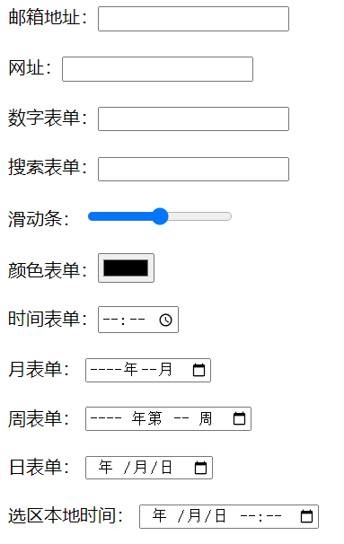


#### 4.2 新增表单属性

> required     监测是否为空；（不能为空）若为空，会弹警告框
>
> min      最小值
> max      最大值
> step     步幅  确定一个法定值(数字表单 每次增加的个数：step:5; 即每次增加5)
>
> autocomplete  是否显示提示信息(即能否看到历史记录) **需要元素有name属性**
> 属性值:  
>
> ​		on    开启提示 （默认值）
> ​        off   关闭提示
>
> placeholder   提示信息
>
> autofocus     自动聚焦。一个页面只能由一个。
>
> ==novalidate==    取消验证  要**加给form标签**
>
> multiple      选择（上传）多个   以 "**,**" 隔开的形式；
>
> readonly    把输入字段设置为只读。（只能看不能写）
>
> list        必须结合datalist标签，绑定datalist  id名称。
> 下拉菜单标签：
>
> ```html
> <input type="search" list="menu">
> <datalist id="menu">
> <option label="提示内容" value="显示的内容">
> ...
> </datalist>
> ```
> 注：datalist标签不能独立存在，必须配合其他表单元素一起只用；和该表单元素进行绑定;
> 通过 **list属性**和**datalist 的id名称**绑定。(不一定要用这个属性，可用其他标签代替！)
>
> 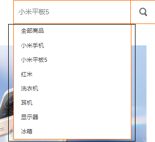


案例：

```html
<form action="">
    文本框：<input type="text" placeholder="昵称" autofocus><br><br>
    邮箱地址：<input type="email" required placeholder="aa@qq.com" multiple><br><br>
    网址：<input type="url" value="http://www.baidu.com" readonly><br><br>
    搜索：<input type="search" name="sousuo" autocomplete="on"><br><br>
    数字:<input type="number" value="0" min="0" max="50" step="5"><br><br>
    滑动条：<input type="range"><br><br>
    颜色：<input type="color"><br><br>
    搜索内容：
    <input type="search" list="sousuo">
    <datalist id="sousuo">
        <option label="华为" value="电脑">
        <option label="戴森" value="吹风机">
        <option label="欧米茄" value="手表">
        <option label="华为" value="手机">
    </datalist>
    <br><br>
    <input type="submit">
</form>
```


## C3

### 一、CSS 3.0介绍

> css 3.0：
>
> 是css2.0 的升级版；
> css2.0 是css1.0的升级版
> CSS3语言开发是朝着模块化发展的。以前的规范作为一个模块实在是太庞大而且比较复杂，所以，把它分解为一些小的模块，更多新的模块也被加入进来。这些模块包括： 盒子模型、列表模块、超链接方式 、语言模块 、背景和边框 、文字特效 、多栏布局等。
>
> css2的内容在css3里是继续支持的；
>
> css3.0 简称c3：是完全向后兼容；
>
> 高版本浏览器可支持，低版本浏览器不支持怎么办？
> 解决方案：
>     让高版本浏览器以设计稿的显示；
>     让低版本的浏览器能保证网页的最基本的结构；
>
> * 渐进增强：
>           先保证低版本浏览器能够实现基本的功能；
>           再向高版本浏览器扩充功能；
> * 优雅降级：
>           先根据高版本浏览器实现完美的效果
>           在对低版本浏览器减少共能的供给；


### 二、属性选择器

>  1、选择器[attr]   根据属性找元素
>
>  2、选择器[attr="value"] 指定属性名，并指定了该属性的属性值,属性和属性值必须跟所给的条件是**完全一样**的；(有且仅有)
>
>  3、选择器[attr^="value"]：指定了属性名，并且有属性值，属性值是以value开头的
>  4、选择器[attr$="value"]：指定了属性名，并且有属性值，属性值是以value结尾的
>  5、选择器[attr*="value"]：指定了属性名，并且有属性值，而且属值中包含了value
>
>  6、选择器[attr~="value"]：指定属性名，并且具有属性值，此属性值是一个词列表，并且以空格隔开，其中词列表中包含了一个value词，而且等号前面的“〜”必须的
>
> ​	注：词列表就是多个标签名
>
>  7、选择器[attr|="value"]：指定了属性名，并且属性值仅是value或者以“value-”开头的值(只包含该属性值，或者以  属性值-  开头)
>
>  注：attr 表示属性
>          value  表示属性值

案例：**要写在[ ] 里面**

```css
    <style>
        div[title] {
            color: #f00;
        }

        div[class="aaa box"] {
            color: #0f0;
        }

        div[class^="box"] {
            color: #f0f;
        }

        div[class$="box"] {
            color: #0ff;
        }

        div[class*="box"] {
            color: #ff0;
        }

        div[class~="box"] {
            color: #00f;
        }

        div[class|="box"] {
            color: tomato;
        }
    </style>
```


### 三、伪类元素选择器

#### 3.1 结构伪类选择器(1)

> 特点：会把父元素里的**所有的子元素**一起进行计算；(标签名和所在位置必须是匹配的)
> 1、 选择器:first-child   第一个子元素；
>
> 2、 选择器:last-child    最后一个子元素；
>
> 3、 选择器:nth-child(n)  用于匹配索引值为n的子元素。索引值从1开始
>
> 4、 选择器:nth-last-child(n)  用于匹配索引值为n的子元素。索引值从最后一个开始
>  n ： 数值  或者是 表达式(**必须写在数字前面**)
>  表达式： 2n 偶数；  2n+1 奇数 ；  3n 3的倍数 ； 5n; 
>           	  even偶数       奇数odd
>
> ​				-n+3:从第三个往前找(-n必须写在前面)
>
> 5、:only-child  这个伪类一般用的比较少，有且仅有一个的子元素；唯一的子元素；

案例：

```css
/*
		.list1 li:nth-child(2) {
            background: gray;
        }
 */  表示的是list1 下面的第二个li;
```


#### 3.2 结构伪类选择器(2)

> 特点：找相同元素里的第几个；把**相同元素**提取出来单独计算；
>
> 1、:first-of-type 匹配同级兄弟元素中的第一个元素 
>
> 2、:last-of-type  匹配同级兄弟元素中的最后一个X元素
>
>  3、:nth-of-type(n)   匹配同类型中的第n个同级兄弟元素X
>
> 4、:nth-last-of-type(n) 匹配同类型中的倒数第n个同级兄弟元素X
>
> 5、:only-of-type     匹配属于同类型中唯一兄弟元素的X

案例：

```css
         .list li:first-of-type{
             background:#f00;
         }
```


#### 3.3 其他伪类选择器

```css
:root   匹配文档的根元素。在HTML（标准通用标记语言下的一个应用）中，根元素永远是HTML
:empty  匹配没有任何子元素（包括包含文本）的元素X
```

注：如果前面不加选择器的限制，则指向的是全局

```css
/* 指向的是全局的无子元素标签 */        
		:empty{
             width:100px;
             height:100px;
             background:#f0f;
         }

 /* 没有子元素的li标签 */ 
         li:empty{
             width:100px;
             height:100px;
             background:#0f0;
         }
```

#### 3.4 目标伪类选择器

```css
:target{ }
```

说明：

* 选中url(地址)所指向的元素；**配合锚点链接**使用；
* 意思是：当target前的元素被指向时的样式；

案例：

```html
    <style>
        /* 当点击html超链接时，#html盒子的变化 */
        #html:target {
            width: 100px;
            height: 100px;
            background-color: #bfa;
        }

        #css:target {
            width: 200px;
            height: 200px;
            background-color: #f00;
        }

        #javascript:target {
            width: 300px;
            height: 100px;
            background-color: pink;
        }
    </style>
</head>

<body>
    <a href="#html">html</a>
    <a href="#css">css</a>
    <a href="#javascript">javascript</a>

    <div id="html">html</div>
    <div id="css">css</div>
    <div id="javascript">javascript</div>
</body>
```


#### 3.5 UI 元素状态伪类选择器（应用在表单元素内）

>  1、选择器:enabled  匹配所有用户界面（form表单）中处于可用状态的E元素  
>
>  2、选择器:disabled 匹配所有用户界面（form表单）中处于不可用状态的E元素
>
>  3、选择器:checked  匹配所有用户界面（form表单）中处于选中状态的元素E
>
>  4、选择器:read-only  选取不可被用户编辑的可输入表单
>
>  5、选择器:read-write  选取可以被用户编辑的表单元素
>
>  6、选择器:focus    匹配聚焦时的表单元素

写法：` input:enabled{background:#f00;}` 

注：默认情况下，复选框和单选框的样式只能修改宽高

清除复选框的默认样式：

```css
          -webkit-appearance: none;
          -moz-appearance:none;
          appearance: none;
```

修改复选框样式案例：

```css
    <style>
        input {
            width: 24px;
            height: 24px;
            background: url(./../images/icon_check.png) center;
            -webkit-appearance: none;
            -moz-appearance: none;
            appearance: none;
        }
        input:checked {
            background: url(./../images/icon_checked.png) center;
        }
    </style>
```

#### 3.6 selection伪类选择器

匹配元素中被用户选中或处于高亮状态的部分 

```css
::selection{ }
```

> 注：
>
> * 要写双冒号；
> * 只能改变两个效果：背景色和文本颜色； 

案例 (当p 被选中时，文字颜色和背景色发生改变)

```css
    <style>
        p::selection{
            background:#fcc;
            color:#0f0;
        }
    </style>
```


### 四、浏览器前缀

(1) IE			 内核：Trident   	                         前缀    **-ms-**      (记忆：==M==icro==S==oft)


(2) firefox  	 内核：Gecko    	                         前缀    **-moz-**	

(3) Safari		 内核：webkit   	                         前缀    **-webkit-** 

(4) Chrome       内核：webkit–>blink                         前缀    **-webkit-** 

(5) opera	     Presto(Opera前内核) (已废弃)，现在是blink    前缀    **-o-**	 


### 五、c3新增属性

#### 5.1 文本阴影属性

```css
text-shadow:x   y   blur  color;
```

> 属性值：
>     x   ： 设置阴影在x轴上的显示位置，支持负值 (必须写，负值表示向左移动)
>     y   ： 设置阴影在y轴上的显示位置，支持负值 (必须写，负值表示向上移动)
>     blur   ： 阴影的模糊程度； 默认值为0px;
>     color  ： 阴影的颜色; 默认是黑色；
>
> 注：
>     x和y的位置必须写在最前面，且不能互换位置；
>     同时可以设置多阴影效果；
>     多阴影效果语法：(用逗号隔开)
>          text-shadow:x  y  blur  color,x  y  blur  color,x  y  blur color
>     多阴影的层级：前面的层级高，后面的层级低

#### 5.2 文本边框属性

```css
 -webkit-text-stroke :1px red  ;
```

了解即可~

#### 5.3 文本换行属性

```css
word-wrap:;
```

属性值：

* normal       只在允许的断字点换行（浏览器保持默认处理）
* **break-word**   允许长单词或 URL 地址换行到下一行,在新的一行换行

注：

```css
word-break:;
```

属性值：

* normal  默认显示，根据浏览器自动换行     
* keep-all   文本不会换行，只能在半角空格或连字符处换行
* break-all  强制换行,比较粗暴；直接换行

#### 5.4 字体图标

*  通过Unicode 引入

  * >     @font-face { 
    >         font-family: <YourWebFontName>;   设置字体名称
    >         src: <source> [<format>][, []]*;  引入字体路径 添加字体格式
    >     }

  * ```css
                @font-face {
                font-family: "iconfont"; 
                src: url('iconfont.ttf') format('truetype');
                }
    ```
    
  * 注：url注意修改路径。
  
  * 注：也可以直接用  **link,**引入**iconfont.css**文件
  
*  通过class 引用

   *  ```css
          <link rel="stylesheet" href="font/iconfont.css">
     ```

*  通过js引入(了解即可)

   *  （看文档声明）svg标签写在body里

#### 5.5 背景图属性

##### 5.5.1背景图原点位置属性

```css
background-origin:;
```

属性：

> * padding-box	背景图像填充框的相对位置   默认值
> * border-box	背景图像边界框的相对位置
> * content-box	背景图像的相对位置的内容框

##### 5.5.2背景图裁切属性

``` css
 background-clip:;
```

属性：

> * padding-box	裁切至填充区
> * border-box	裁切至边框区 (默认值)
> * content-box	裁切至内容区
> * text  裁切至文本区 （非正式版,需要在属性前加前缀）了解
>   * 注：要将文字颜色设置为透明色

##### 5.5.3背景图大小属性

```css
background-size:;
```

属性：

> * 数值(如：10px) ，规定背景图的大小。第一个值宽度，第二个值高度。
> * 百分比(如：50%)，以百分比为值设置背景图大小
>   * 100%，**会变形**；但不会超出父元素显示（能看到全部），全部显示
> * cover：把背景图像扩展至足够大，以使背景图像完全覆盖背景区域。
>   * 等比缩放，**不会变形**，会超出父元素显示（只能看到部分），直到把元素**覆盖满**为止
> * contain：把图像扩展至最大尺寸，以使其宽度或高度完全适应内容区域。
>   * 等比缩放，**不会变形**，只要宽或者高跟元素有重合，就**停止扩展**了

注：

* 当属性值为数值或者百分比时，一个值代表的是背景图宽度，高度会等比例缩放 
* 当设置两个值的时候，第一个值表示宽度，第二个值表示的高度；
* 单位为px时，背景图就是固定大小
* 单位为%时，是相对元素大小显示的百分比,写一个100%，和cover类似

**复合写法：**

* background-size可以和其他背景属性复合式在一个background后，但是需要和背景图位置属性以斜杠的形式组成一组；
* **背景图位置必须要写**；且一般会设置为center；
* background-orign、background-clip需要单独写

```css
background: url(images/laoli.jpg) no-repeat center center/cover;
```

##### 5.5.4多背景设置(了解)

语法：

```css
background:url() no-repeat,url() ,url();
```

注：层级关系，先写的层级在上，后写的层级在下


##### 5.6 滤镜属性

```css
filter:;
```

* 模糊滤镜：blur

  ```css
  filter : blur(value)  数值加单位
  ```

* 灰度滤镜(多用于制作**黑白网页**)

  ```css
  filter：grayscale(100%) 百分比（0% - 100%）
  ```

  整个页面灰白：给body加filter:grayscale(100%)


##### 5.7 圆角属性

```css
border-radius:;
```

每个角的x和y的值是一样的；
border-radius:10px;           四个角的x和y值都一样

border-radius:10px 20px;      值1：左上和右下的x和y ; 值2：右上和左下的x和y;

border-radius:10px 20px 30px; 值1：左上的x和y ; 值2：右上和左下的x和y; 值3：右下的x和y;

border-radius:10px 20px 30px 40px;值：左上； 值2：右上 ；值3：右下； 值4：左下；

设置每个角的x和不一样；x/y  （了解）
border-radius:10px/20px; 四个的x是10px,y是20px;

border-radius:10px 20px/40px;  

border-radius:10px 20px 30px/40px;

border-radius:10px 20px 30px 40px/40px;

border-radius:10px 20px 30px 40px/40px 30px;

border-radius:10px 20px 30px 40px/40px 30px 20px;

border-radius:10px 20px 30px 40px/40px 30px 20px 10px;

注：斜杠前表示x轴的值，斜杠后是y轴的值；
    属性值是数值：px  、  %
    百分比：是相对元素宽高显示的百分比的值；

> border-radius:50%;		----		圆形(固定写法)
>
> border-radius:(高度的一半)；
>
> 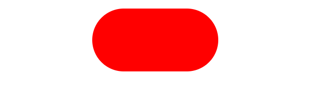


##### 5.8 盒子阴影属性

```css
box-shadow:;
```

属性值：

* x	必需的。水平阴影的位置。允许负值（外阴影时，右为正值）
* y	必需的。垂直阴影的位置。允许负值（外阴影时，下为正值）
* blur	可选。模糊距离    默认值 0px
* spread	可选。阴影的大小  默认值 和元素一样大,支持负值（正值扩大，负值内缩）
* color	可选。阴影的颜色。默认黑色
* inset	可选。从外层的阴影（开始时）改变阴影内侧阴影(默认是外阴影)；

可以设置多个阴影，用逗号隔开的形式；如下：

```css
box-shadow: 0px 0px 0px 0px #0f0, 0px 0px 0px 0px #0f0; 
```

注：

* 多阴影时，会有层级关系，**先写的层级在上**，后写的层级在下；
* 两个值：x  y
* 三个值：x  y  blur 
* …… 以此类推；

##### 5.9 图片边框属性(了解)

复合式写法 ：

```css
border-image:;
```

单一写法：

```css
border-image-source:url() ; 用在边框的图片的路径。

border-image-slice	图片边框向内偏移(不加单位)。
    10            上下左右
    10 20         上下 左右
    10 20 30      上   左右   下
    10 20 30 40   上   右  下  左

border-image-repeat	图像边框是否应平铺(repeat)、铺满(round)或 拉伸(stretch)
    默认值是拉伸；

border-image-outset	边框图像区域超出边框的量(值是一个倍数)
	border-image-outset:1;
/*表示超出边框一倍距离，例如边框为10px，则表示超出边框10px*/
```


##### 5.10 width的属性值

```css
-webkit-max-content   和最大的内容同宽
-webkit-min-content   和最小的内容同宽
```

```html
<!DOCTYPE html>
<html lang="en">
<head>
    <meta charset="UTF-8">
    <meta http-equiv="X-UA-Compatible" content="IE=edge">
    <meta name="viewport" content="width=device-width, initial-scale=1.0">
    <title>Document</title>
    <style>
        * {
            padding: 0;
            margin: 0;
        }

        li {
            list-style: none;
        }

        a {
            text-decoration: none;
        }

        .nav {
            width: 300px;
            height: 30px;
            background-color: #bfa;
            margin: 100px auto;
            overflow: auto;
        }

        .nav ul {
            display: flex;
            justify-content: start;
            height: 30px;
            width: max-content;
        }
        .nav li {
            margin: 0 10px;
            line-height: 30px;
        }
    </style>
</head>
<body>
    <div class="nav">
        <ul>
            <li><a href="#">首页首页</a></li>
            <li><a href="#">首页首页</a></li>
            <li><a href="#">首页首页</a></li>
            <li><a href="#">首页首页</a></li>
            <li><a href="#">首页首页</a></li>
            <li><a href="#">首页首页</a></li>
            <li><a href="#">首页首页</a></li>
    </div>
</body>
</html>
```

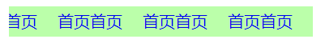

**希望宽度根据内容的多少来显示**：例如 ：二级菜单……

浮动会影响布局，不灵活；

##### 5.11 calc() 方法

可以计算不同单位的数值；

注：

* 常用的运算符 +  -  *  /;
* 运算符的前后要留有空格；
* 进行乘除运算时，都是和倍数相乘除的；` width:calc( 100% / 2);`

可用来做两栏、三栏布局

```css
     <style>
         * {
             padding: 0;
             margin: 0;
         }
         body {
             width: 100%;
         }
         .left {
             width: 200px;
             height: 200px;
             background-color: #f00;
             float: left;
         }
         .right {
            width: 200px;
            height: 200px;
            background-color: pink;
            float: right;
         }
         .center {
             width: calc(100% - 400px);
             height: 200px;
             background-color: #bfa;
             float: left;
         }
     </style>
```

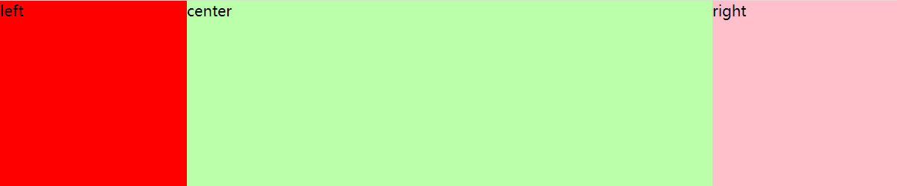

##### 5.12 pointer-events:none;

```css
pointer-events:none;
```

注：

* 穿透效果(例如：超链接被盒子盖住，无法点击，可以给盒子添加此属性)
* 防止多次提交（配合js使用）

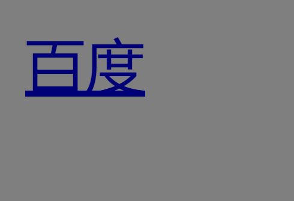

 

### 六、渐变

线性渐变：从一个点到另一个点之间的过渡；

径向渐变：从一个点到四周的过渡；

#### 6.1 线性渐变

```css
background-image: linear-gradient(direction, color stop1, color stop2, ...);
```

* linear-gradient： 表示线性渐变；
* direction 渐变的方向
  * to top    从下向上
    to bottom 从上向下 （默认值）
    to left   从右向左
    to right  从左向右
    to left top     到左上
    to left bottom  到左下
    to right top    到右上
    to right bottom 到右下
  * 根据角度改变渐变的方向 角度的单位： **deg** ;
    * y轴方向为0度，x轴方向为90度
* color  颜色 ：
  * 十六进制、英文单词、rgb()、rgba()
*  stop   颜色的分布位置，**默认均匀分布**；
  * 数值： px   % ;
  * 写**数值，渐变就是实的**，不虚；


重复显示：repeating 

```css
background-image: repeating-linear-gradient{ }
```

注：渐变可以同时设置多个；用逗号隔开；先写的渐变层级高

案例：

```css
background-image: linear-gradient(red 10%, green 30%, yellow 50%);
/*10%-30%，红到绿渐变，30%-50%绿到黄渐变，50%以后由黄色填充*/
```

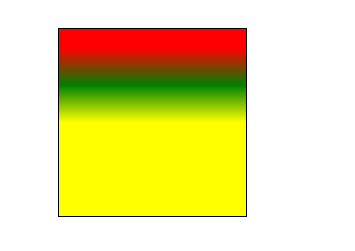

```css
background-image: linear-gradient(90deg, red, green);
```

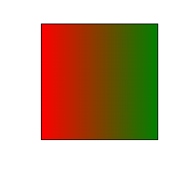

```css
background-image: repeating-linear-gradient(red 0px 20px,yellow 20px 40px);
/*直接写数值，渐变就是实的*/
```

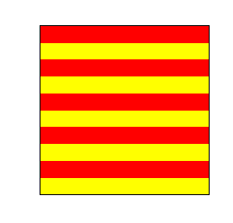

**案例**

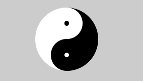

#### 6.2 径向渐变

语法：

* ```css
  background-image: -webkit-radial-gradient(position, shape size, start-color stop1, ..., last-color stop2);
  ```

* ```css
   background-image: radial-gradient(shape size at position, start-color stop1, ..., last-color stop1);
  ```

说明：

1. position  渐变的起始位置,默认在元素的中心点位置；
   1. 可以使用数值：px  %
   2. 法定属性值： left right  top  bottom center 
   3. 默认值：center center；  50%  50%；
2. shape  渐变的形状
   1. ellipse 椭圆 （默认值）
   2. circle  正圆
3. size   渐变大小（渐变的结束点）
   1. closest-side    最近边
   2. farthest-side   最远边
   3. closest-corner  最近角
   4. farthest-corner 最远角（默认值）
4. color  渐变颜色
5.  stop   颜色分布  默认是平均分布

注：渐变可以同时设置多个；用逗号隔开；先写的渐变层级高

案例：

```css
background-image: -webkit-radial-gradient(30% 30%, circle farthest-corner,red,yellow, green);
```

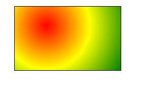

注：

* 这个语法要写**-webkit-**
* 位置写在前面，就==不需要at==

```css
background-image: radial-gradient(closest-side circle at 30% 30%,red ,yellow ,green);
```

注：

* 先写形状和大小，写位置要加上==at==

```css
background-image: repeating-radial-gradient(circle ,red 0px 20px,green 20px 40px, yellow 40px 60px);
```

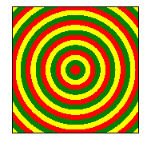


### 七、过渡

```css
transition:;
```

> css3的transition允许css的属性值在一定的时间区间内平滑地过渡。这种效果可以在**鼠标单击**、**获得焦点**、**被点击**或对元素任何改变中触发，并圆滑地以动画效果改变CSS的属性值

注：

* 必须依附触发某个事件时，显示过渡效果；
* 只能设置起始点和结束之间的过渡；中间不能添加别的效果；
* display:none;  -->  display:block;   ==无法实现过渡效果==，
* 谁改变属性，就给谁加过渡属性；==！！！==
* transition 复合式属性；注意 动画持续时间和延迟时间的顺序不能互换，前面的持续时间，后面的是延迟时间；如下：

```css
transition:all 5s linear 2s;
```


单一属性：

> * transition-property:;  检测参与过渡的属性；
>   * 当设置多个属性时，属性和属性之间用逗号隔开；
>     * transition-property:height,background;
>   * 默认值：all  所有发生变化的属性都参与过渡；
> * transition-duration:;  检测过渡的持续时间；**（必须的）** 
>   * 单位 s（秒）  \  ms（毫秒）    1s = 1000ms
> * transition-delay:;  检索动画的延迟时间；
>   * 单位 s（秒）  \  ms（毫秒）    1s = 1000ms
>   * 支持负值；提前执行了2s；
>     * 解释：transition: 5s -2s;   表示一共执行5s，提前执行了2s
> * transition-timing-function:; 检索动画的过渡类型
>   * linear	匀速
>   * ease       逐渐慢下来(默认值)
>   * ease-in   加速
>   * ease-out 减速
>   * ease-in-out  先加速后减速
>   * 自定义动画类型：贝塞尔曲线  http://cubic-bezier.com/  ()
>     * 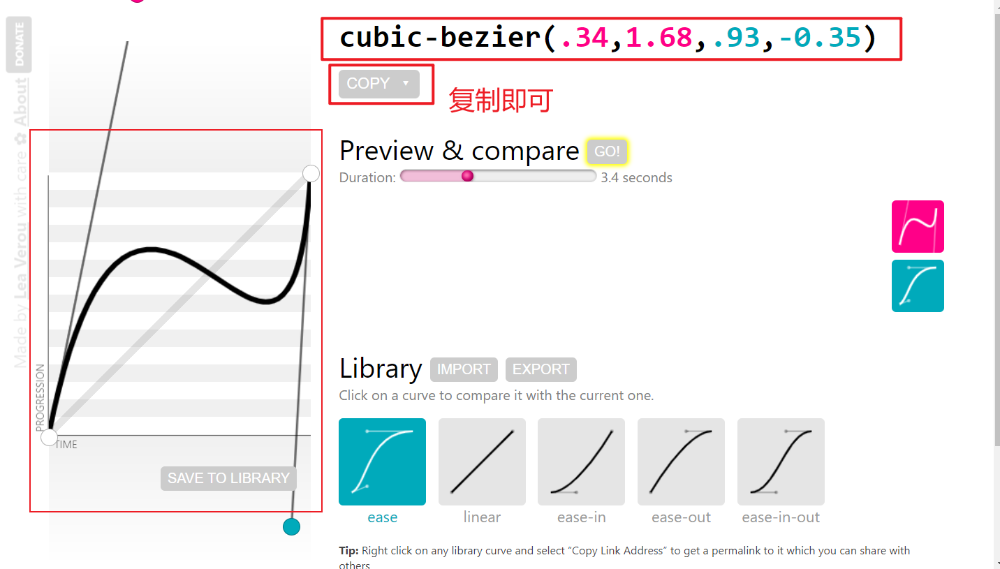


### 八、变形属性(2D)

2d: 平面空间 ，只涉及到两个轴：x轴和y轴；
3d: 立体空间 ，涉及到三个轴：  x轴和y轴z轴；
网页的默认状态都是呈现在2d空间的；
x轴： 向右为正，向左为负
y轴： 向下为正，向上为负

```css
transform:;
```

可以实现位移、旋转、缩放、倾斜等效果，在3d里会呈现呈现出更加炫酷的效果；

#### 8.0 注意事项

* 当同时给transform设置多个功能函数的时候；要用空格隔开；
  * 如： transform: translate(500px) rotate(-90deg);
  * 一个选择器下只能写一个transform，后面的会覆盖掉前面写的；
* 有位移和旋转时，尽量先写位移；
  * 元素旋转的同时，**自身的x轴和y轴也在跟着发生旋转**；始终和元素自身保持静止的关系；

#### 8.1 2d-位移

```css
transform:translate();
```

单位：px,	% 

translate(...px);  沿x轴的位移（**只写一个值，是x轴**）

translate(x , y) 沿x轴的位移,沿y轴的位移

translateX(x)  沿x轴的位移 

translateY(y)  沿y轴的位移           

说明：

  1、元素位移之后，**原本的位置是保留的**；跟相对定位的效果类似，是==相对自身==所在的位置进行位移的；

  2、发生位移之后会出现**层级变化**；

  3、值为百分比的时候，是**相对自身**宽高显示位移的值的；


#### 8.2 2d-旋转

```css
transform:rotate();
```

单位：deg （度）

rotate(Zdeg)  沿中心点旋转; 左右旋转；

rotateX(Xdeg) 沿x轴旋转 

rotateY(Ydeg) 沿y轴旋转

注:

  1、==正值==：沿顺时针旋转，==负值==：沿逆时针旋转

  2、元素旋转之后，原本的位置是保留的；

  3、发生旋转之后会出现层级变化；

##### 8.2.1背面是否可见

```css
backface-visibility:;
```

visible   可见 (默认值)

hidden    不可见

==使用场景==：两张图片一起旋转时，会被上面的图片盖住，所以需要设置旋转元素背面不可见

#### 8.3 2d-缩放

==**倍数，不加单位**==

```css
transform:scale();
```

 scale(m)  x和y都缩放 （**只写一个值，x和y都缩放**）

 scale(x , y)   x轴的缩放 ， y轴的缩放

 scaleX(x)     x轴的缩放

 scaleY(y) 	y轴的缩放

 注：

  支持负值；

  1 ： 不缩放

  大于1 ： 放大

  0 - 1之间 ： 缩小

  小于0 ：**==反向缩放==**

#### 8.4 2d-倾斜

单位：deg度

```css
transform:skew();
```

skew(x)  沿X轴倾斜  

skew(x , y) 沿X轴倾斜,沿Y轴倾斜

skewX(x) 沿X轴倾斜  **正值向左**，负值向右

skewY(y) 沿Y轴倾斜  **正值向上**，负值向下

#### 8.5 变形原点属性

```css
transform-origin:x y;
```

属性值：

  数值：px  %

  法定属性值： top right left bottom center

  默认值是：center center;(默认是中心为轴旋转)

### 九、变形属性3D

3D:可以呈现出空间感  (想象成电脑屏幕，原点在左上角)

> x轴 ： 水平方向    正值向右，负值向左
y轴 ： 垂直方向    正值向下，负值向上
z轴 ： 前后（里外）方向    正值向前（外），负值向后（里）

#### 9.1 开启3d空间

```css
transform-style:;
```

属性值：

* flat    呈现为2d空间 （默认值）
* preserve-3d   呈现为3d空间

注：添加给**父元素**，让子元素呈现在3d或者2d的空间里；

#### 9.2 位移

translate(x ,y)
translateX();
translateY();
translateZ(); 	默认时,z 轴的位置为0；
translate3d(X,Y,Z)
注：==z轴不能设置百分比；==

#### 9.3 旋转

rotate()
rotateX()
rotateY()
rotateZ() 和 rotate() 的效果一样
rotate3D(x,y,z,a);
    x ： 0 —— 1 ; 		0 表示不旋转，1 表示旋转
    y ： 0 —— 1 ; 		0 表示不旋转，1 表示旋转
    z ： 0 —— 1 ; 		0 表示不旋转，1 表示旋转
    a ：旋转角度

判断旋转为正值还是负值：

**左手定则**：

> 大拇指指向当前整个轴的正值方向，然后剩余四指和大摩指保持垂直关系；然后四指弯曲的方向就位正，相反为负

#### 9.4 缩放

scale()
scaleX()
scaleY()
scaleZ()
scale3d(x , y ,z)

#### 9.5 变形原点属性

x : px  %  left right  center 
y : px  %  top  bottom  center
z ：px 
                
注：==z轴不能设置百分比；==
    3d元素默认的原点位置是： center   center   0;
                               							x        y     	 z


#### 9.6 景深效果

```css
perspective:value;
```

作用：

* 设置观察元素的远近距离；
* 出现透视，近大远小的效果；

注:

* 建议**==添加给父元素==**；父元素指的是被观察物体最近的父元素；
* 属性值：建议在800px--1200px之间，
* 值越大，离的距离越远，近大远小的效果就不明显；
* 值越小，离得距离越斤，近大远小的效果就越明显

#### 9.7 观察元素原点的位置

```css
perspective-origin:x y;
```

x : px   %   left  cente  	right
y : px   %   top   center  f bottom
默认值是： center center；

==注：==配合景深使用

### 十、动画

#### 10.1 animation  VS  transition

相同点：就是都可以实现动画效果；

不同点：
    -> transition实现动画效果的时
        必须依附于某个事件，当触发了这个事件之后，才会触发过渡效果；
        只能设置从初始状态到结束状态的变化；

​    -> animation 实现动画效果的时
​        不需要触发任何事件，直接就可以显示动画效果；
​        可以在初始状态到结束状态之间添加很多状态；

#### 10.2 动画属性

```css
animation:;  复合式（常用）
```

单一式属性：

* ```css
  animation-name:;  检索或设置采用的动画名称；/*（必须的）*/
  ```

==注==：需要配合关键帧使用;

```css
关键帧：
    @keyframes name{
       from{ } 
       to{ }
    }
    或者：
    @keyframes name{
       0%{ } 
       50%{ }
        ……(可以写多个)
       100%{ }
    }```
    name ： 代表动画名称，名字是自定义的；
    animation-name：name；
    from {}  代表的是初始状态； 相当于0%的状态
    to{}  结束状态；相当于100%的状态
    关键帧可以实现比较复杂的动画效果；
```

* ```css
  animation-duration:;  检索或设置动画的持续时间； s / ms /*（必须的）*/
  ```


说明：animation-duration:3s;    动画完成使用的时间为3s


* ```css
  animation-timing-function:;  检索或设置对象动画的过渡类型
  ```

  属性值
  - linear：线性过渡。等同于贝塞尔曲线(0.0, 0.0, 1.0, 1.0)
  - ease：平滑过渡。等同于贝塞尔曲线(0.25, 0.1, 0.25, 1.0)
  - ease-in：由慢到快。等同于贝塞尔曲线(0.42, 0, 1.0, 1.0)
  - ease-out：由快到慢。等同于贝塞尔曲线(0, 0, 0.58, 1.0)
  - ease-in-out：由慢到快再到慢。等同于贝塞尔曲线(0.42, 0, 0.58, 1.0)
  - steps():  每一桢动画分几步完成
  - 贝塞尔曲线
  
  - steps(n,start/end):  每一帧动画分几步完成
    - n ： 分几步完成，是一个数值不加单位；
    - strat : 下一帧的开始状态 （可选的）
    -  end   : 上一帧的结束状态 （可选的）
    - step-start :  steps(1,start)
    - step-end   :  steps(1,end)
      
  
* ```css
  animation-delay:;  检索或设置的延迟时间； s/ms ;支持负值；
  ```

* ```css
  animation-iteration-count:;  检索或设置动画的循环次数；
  ```

  *  infinite     无限循环
  *  number   不加单位，写几就执行几次；

* ```css
  animation-direction:;  检索或设置动画循环中的运动方向；
  ```

  * normal  正常方向
  * reverse  反方向运行
  * alternate  动画先正常运行再反方向运行，并持续交替运行
  * alternate-reverse  动画先反运行再正方向运行，并持续交替运行

* ```css
  animation-fill-mode:;   动画播放之前或之后，其动画效果是否可见。
  ```

  * none 在运动结束之后**回到初始位置**，在延迟的情况下，让0%在延迟后生效(**默认值**)
  * backwards  在延迟的情况下，让0%在延迟前生效
  * forwards   在运动结束的之后，停到结束位置
  * both     backwards和forwards同时生效

* ```css
  animation-play-state:;  检索或设置动画的运动状态；
  ```

  * running  运动 (默认值)
  * paused  暂停
  * **注:**一般在触发事件时添加此属性；比如鼠标滑过，单击等;

#### 10.3 动画库的使用

网址：https://www.jq22.com/yanshi819

* 通过class名称；
  * 基础名字：animated
  * 动画的名称：用什么效果，就添加相应的动画名称

如下：

```css

```


* 通过css自定义动画效果

如下：选好动画名称，用css写效果

```css
		pic{
            animation: tada 1s infinite linear;
        }
```


### 十一、多列

* column-count:;  显示的列数 
* column-width:;  显示的列宽
  * 注：列数和列宽一起使用时，分别表示**最多的列数**和**最小的列宽**；
  * 如果宽度即将小于所设置的值时，就减少列数来保证每列的宽度不小于所设置的列宽；(列宽优先级高！！！)
  * 复合式写法：columns:列数  列宽；
* column-gap:;  设置列与列之间的间隔大小
* column-rule:;  设置列与列之间的边框
* column-fill:;  设置所有列的高度是否统一
  *  -> auto     列高度自适应内容
  * -> balance  所有列的高度以其中最高的一列统一(默认值)
* column-span:;  是否跨列（不能指定跨几列）
  * -> none  不跨列（默认值）
  *  -> all   横跨所有列
* break-inside:avoid;  避免元素内部发生中断


### 十二、弹性盒模型

是c3新增的一种布局方式；
当开启弹性盒之后，就会有两个轴，弹性布局是根据这两个轴进行布局的，分别叫做**主轴**和**侧轴**；
默认情况下：
    主轴的起始位置在左，结束位置在右；
    侧轴的起始位置在上，结束位置在下；

####  12.1 ==**添加给父元素的属性**==

##### 12.1.1开启弹性盒子；

``` css
display:;
```

​        flex  块级的弹性盒 (常用)
​        inline-flex  行内块级的弹性盒

注：

当开启弹性盒之后，子元素就根据弹性盒子的主轴进行排列（并列显示）

设为 Flex 布局以后，子元素的**float、clear和vertical-align属性将失效。**

当行内元素在弹性盒里显示时，就可以设置宽高了

##### 12.1.2设置主轴的方向：

```css
    flex-direction:;
```

​        row（默认值）: 自左向右
​        row-reverse : 自右向左
​        column : 自上而下  (常用)
​        column-reverse : 自下而上

##### 12.1.3设置沿主轴的对齐方式：

```css
    justify-content:;
```

​        flex-start （默认值）: 沿起始点对齐
​        flex-end  ：沿终点对齐
​        center    : 居中对齐
​        space-between ：两端对齐
​        space-around  ：设置每个元素的左和右的空余空间相等
​        space-evenly  ：设置每个元素之间的空余空间相等

##### 12.1.4设置沿侧轴的对齐方式：

```css
align-items:;			/*控制元素间的对齐*/
```

​        flex-start : 沿起始点对齐
​        flex-end   ： 沿终点对齐
​        center     ： 居中对齐
​        baseline   ： 基线对齐
​        stretch（默认值）: 让元素拉伸至侧轴的高度

stretch 默认值，将元素的长度设置为相同的值（每一行高度相等，不同行高度可能不同，下面的留白区域是一样的，会伸展，当元素的高度没有设置，则元素的高度会拉伸至容器高度一致）

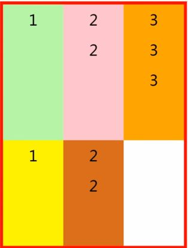

flex-start 元素不会拉伸，沿着辅轴起边对齐

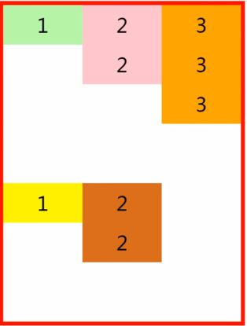

flex-end 沿着辅轴的终边对齐

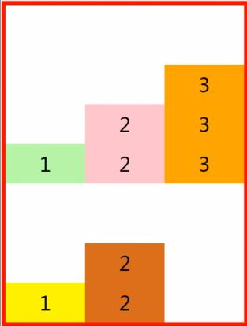

center 居中对齐

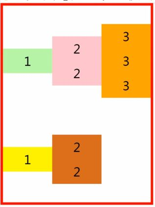

##### 12.1.5设置子元素是否折行：

```css
flex-wrap:;
```

​		nowrap   不折行（默认值）
​		wrap     折行（父元素放不下了之后，把超出折行显示）；
​		wrap-reverse  反向折行
注：
   	 复合式属性 ，如：flex-flow:row nowrap;(了解)
​                    flex-direction 设置主轴方向
​                    flex-wrap   折行
​                     默认值为row nowrap;

##### 12.1.6设置多行的对齐方式：

```css
 align-content:;	/*行与行之间对齐*/
```

```css
	flex-start : 沿侧轴的顶端对齐
	flex-end   ：沿侧轴的终点对齐
	center     ：居中对齐
	space-between  ： 两端对齐
	space-around   ： 每一行的上和下的空余空间相等
	space-evenly   ： 每行之间的间距相等
	stretch (默认值) ；默认拉伸元素的高度；
```
注：==必须要配合==flex-wrap:wrap/wrap-reverse;使用；即使宽度不足以折行，也可以生效；

#### 12.2 ==添加给子元素的属性==

##### 12.2.1设置子元素的对齐方式：

```css
align-self:;
```

```css
auto 		默认值。元素继承了它的父容器的 align-items 属性。
        	如果没有父容器则为 "stretch"。
stretch		元素被拉伸以适应容器。
center		元素位于容器的中心。
flex-start	元素位于容器的开头。
flex-end	元素位于容器的结尾。
```
##### 12.2.2设置子元素的排列顺序：

```css
order:number;		/*不加单位的数值；*/
```

注：

> 默认值：0；
>
> 值越大，排列的顺序就越靠后，支持负值

##### 12.2.2flex  复合属性。

> 设置或检索弹性盒模型对象的子元素如何分配空间
>
> flex的优先级高于width属性
>
> ​	即使设置了宽度，也会按照flex扩展

```css
单一设置的属性：
    flex-grow   默认值：0；不扩展；可用来做三栏布局；
        子元素扩展的量；一个数字，不加单位；

    flex-shrink 默认值：1；
        子元素收缩的量；一个数字，不加单位 
    默认值：1 ； 收缩；
    0  :  不收缩；
    注：子元素的宽度超出父元素后才会出现收缩的现象

    flex-basis  默认值：auto;
        项目的长度（子元素的宽度）
    	数值：px  %;
    注：flex-basis的优先级高于width
```
收缩的计算方式：（了解）
1、每个元素的宽度相等：把超出的量按照每个元素的收缩的比例平均分配；
2、每个元素的宽度不等：把超出的量 ，按照收缩比例乘以他们自身比例 ，再按照比例缩减


### 三栏布局--圣杯布局(了解)

* center在布局时写在最前面
* 三个盒子都左浮动
* center宽度100%，和父盒子同宽

```html
<!DOCTYPE html>
<html lang="en">
<head>
    <meta charset="UTF-8">
    <meta http-equiv="X-UA-Compatible" content="IE=edge">
    <meta name="viewport" content="width=device-width, initial-scale=1.0">
    <title>Document</title>
    <style>
        *{
            margin:0;
            padding:0;
        }
        .box{
            height:200px;
            margin:0 150px 0 200px;
            min-width:300px;
        }
        .left{
            width:200px;
            height:200px;
            background:#f00;
            float:left;
            /*相当于在浏览器外面，移到浏览器的最前面，要用margin-left*/
            margin-left:-100%;
            position: relative;
            left:-200px;
        }
        .center{
            width:100%;
            height:200px;
            background:#0f0;
            float:left;
        }
        .right{
            width:150px;
            height:200px;
            background:#f0f;
            float:left;
 	/*因为浮动了，距离不够所以下来了，可以看成是在浏览器外面150px*/
            margin-left:-150px;
            position: relative;
            right:-150px;
        }
    </style>
</head>
<body>
    <div class="box">
        <div class="center">center</div>
        <div class="left">left</div>      
        <div class="right">right</div>
    </div>
</body>
</html>
```


### 三栏布局--双飞翼布局

* center在布局时写在最前面，且嵌套在一个父盒子里面
* 用margin空出左右距离；

```html
<!DOCTYPE html>
<html lang="en">
<head>
    <meta charset="UTF-8">
    <meta http-equiv="X-UA-Compatible" content="IE=edge">
    <meta name="viewport" content="width=device-width, initial-scale=1.0">
    <title>Document</title>
    <style>
        *{
            margin:0;
            padding:0;
        }
        .box{
            height:200px;
        }
        .middle{
            width:100%;
            height:200px;
            background:#ff0;
            float: left;
        }
        .middle .center{
            height:200px;
            background:#0f0;
            margin:0 150px 0 200px;
        }
        .left{
            width:200px;
            height:200px;
            background:#f00;
            float: left;
            margin-left:-100%;
        }
        .right{
            width:150px;
            height:200px;
            background:#f0f;
            float: left;
            margin-lefT:-150px;
        }
    </style>
</head>
<body>
    <div class="box">
        <div class="middle">
            <div class="center">center</div>
        </div>
        <div class="left">left</div>      
        <div class="right">right</div>
    </div>
</body>
</html>
```


### 十三、响应式布局

* 设计特点：

  * 面对不同分辨率设备灵活性强 
  * 能够快捷解决多设备显示适应问题

* 缺点：
  * 	兼容各种设备工作量大，效率低下
  * 	代码累赘，会出现隐藏无用的元素，加载时间加长
  * 	其实这是一种折中性质的设计解决方案，多方面因素影响而达不到最佳效果
  * 	一定程度上改变了网站原有的布局结构，会出现用户混淆的情况

媒体查询：

```css
@media :
```

-> 可以让我们根据设备显示器的特性（如视口宽度、屏幕比例、设备方向：横向或纵向）为其设定CSS样式; 
-> 媒体查询中可用于检测的媒体特性有 width 、 height 和 color （等）
-> 使用媒体查询，可以在不改变页面内容的情况下，为特定的一些输出设备定制显示效果。
-> 媒体查询由媒体类型、条件表达式和关键字组成；
    ==媒体类型==：
        all(默认值) : 所有设备
        screen: 显示器，笔记本，移动端等设备
        ...
    ==条件表达式：== 必须要写在括号里
        (min-width: value;)   最小宽度
        (max-width: value;)   最大宽度
        (orientation:portrait)   竖屏
        (orientation:landscape)  横屏
    ==关键字==：
        and   和、一起
        not   排除某种设备 
        only  限定某种设备 
-> 语法：
    内嵌式：（代码较少的时候使用，常用）               
        @media all and (min-width:320px) { 
            body { background-color:blue;}
            .box{ }
        }
   外链式：(一般代码比较多的情况下使用)，如：

```css
<link rel="stylesheet" media="screen and (max-width:960px)" href="style.css">
```

**加上  media=""**


### 十四、移动端

#### 14.1 视口：

viewport : 可视窗口，视口
移动端中必须添加的

```css
<meta name="viewport" content="width=device-width, initial-scale=1.0">
```


移动端：
    移动端设备出厂时设定了可视窗口的宽度为980px;
    需要设置可视窗口的尺寸和当前设备的宽度相等；需要添加以下代码：

```css
<meta name="viewport" content="width=device-width, initial-scale=1.0">
```

meta标签里可设置的属性：

width = device-width：宽度等于当前设备的宽度

initial-scale： 初始的缩放比例（默认设置为1.0）

minimum-scale：允许用户缩放到的最小比例（默认设置为1.0）

maximum-scale：允许用户缩放到的最大比例（默认设置为1.0）

user-scalable：用户是否可以手动缩放（默认设置为no，因为我们不希望用户放大缩小页面） 

  

#### 14.2 单位

px ：  固定单位

%  ：  相对单位（根据父元素的大小发生变化）

em :   相对单位 (是相对当前文本的大小显示的) 默认时： 1em = 16px; 

rem :  相对单位 (始终相对html根元素的font-size显示)  默认： 1rem = 16px;

vw  :  相对单位 （相对视口宽度显示） 主要是控制宽度；
       固定算法： 100vw = 100%(可视窗口的100%)
       以**iPhone6 为标准** （视口宽度375px）：
         100vw = 100% = 375px
         1vw = 1% = 3.75px
         100px = ?vw  
         **100px/3.75px = 26.67vw**

vh  :  相对单位 （相对视口高度显示）

用插件修改单位：

"px to rem" 使用时**==注意事项：==**

* 修改小数点长度；

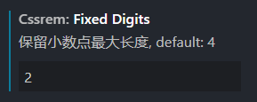

* 修改基准单位；

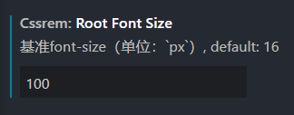

* 快捷键：alt + z,(全选之后操作，)

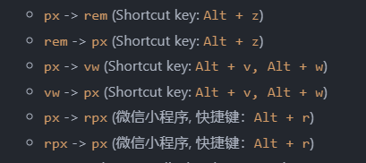

#### 14.3 移动端适配

> 修改html的字体大小：
>
> 1. ```css
>    html{
>    font-size:26.67vw;
>    }
>    ```
>
> 2. 设置body的字体大小，防止继承html字体，导致错误
>
> ```
> body {
>  font-size:.12rem;
> }
> ```
>
> 解释：
>
> 因为px是定值，不能变化，为了适配，需要改为动态的单位，为了方便计算，将html的字体设置为了100px，即100px = 1 rem ，后面的代码只需将xx px，改为xx (将px缩小100倍) rem，
>
> 而为了适配所有的屏幕宽度，所以需要将单位设置为vw，100vw，就是视口宽度的100%，一般写移动端都是以iPhone6 为标准 （视口宽度375px），100vw = 100% = 375px，
>
> 所以100px = 26.67vw；记住即可；

