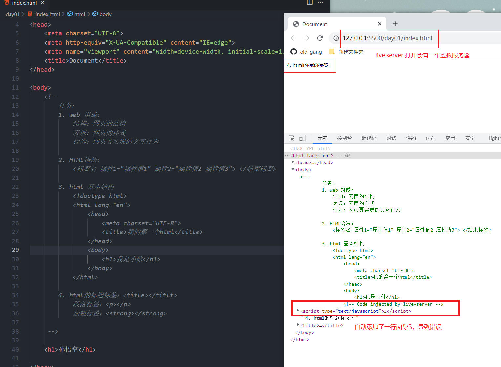
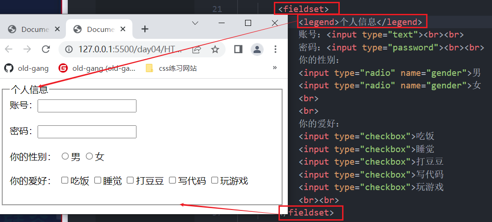

## HTML

### 一、先导知识

#### 1、计算机概念

> 硬件：看得见，摸得着的，如：CPU，显卡
>
> 软件：
>
> ​		系统软件
>
> ​		应用软件


#### 2、b/s 结构和c/s结构

* b/s：(浏览器/服务器):对用户操作更加友好；不需要安装

  ​	B:browser

  ​	S:server

* c/s：(客户机/服务器)：安全性更高；需要安装

  ​	C:client

  ​	 S:server

#### 3、建站流程


l	

```
网站制作流程：
1. 注册域名（网址）：http://www.baidu.com
2. 租用服务器：服务器其实就是一台电脑，里面会储存很多数据
3. 网站制作：
   	-> 产品经理：整理资料，部署网站，提需求
   	-> UI ：网页设计
   	-> 前端：用代码的形式把设计稿还原在浏览器上
   	-> 后台（端）：数据处理，功能实现
	-> 测试：检查有没有bug
	-> 上线
	
	-> 新的开发方式：前后端分离（UI、前端、后端同时进行）：大大节省时间成本
	
4. 推广：
	-> 付费的：效率高，同事也很烧钱
	-> 免费的：通过代码对网页进行优化（SEO）；提升网站的搜索率
	
5. 运维：（网站维护）
	->网站升级
	->更新，修改……
```


什么是前端和后端？

前端和后台的关系：

​		**前端：**客户端，离用户比较近，所以称之为前端，前端做的事用户可以直接看的到的；

​				实现前端页面的技术：

​						html

​						css

​						javascript


​		**服务端**：主要操控服务器，后台做的事，用户一般不能直接看的到


​		通过前端发出请求给后台，后台接收到请求之后，在服务器中找到相关的数据，返回给前端（客户端）并显示在前端页面上；


### 二. 网页及浏览器

web : world wide web  

​		万维网 or互联网or广域网

​		简称：web 、3w  、www

​		在软件开发中，可以把web理解为是无数个网站的集合，构成了一个互联网；


#### 1 、网站及网页

1. 网站是由多个网页组成的，也可以理解为网站是很多个网页的组合。

   

2. **==网页==**是由多文本、图片及超链接等组成的。

   

3. 网页要通过**浏览器**来阅读

   

#### 2、 常见浏览器

​	浏览器是网页运行的平台，常见的浏览器有` IE` 、`火狐（Firefox）`,`谷歌（Chrome）`,`Safari`和`Opera`等，我们平时称为五大浏览器，第六个是`Edge`浏览器，是微软改进IE新出的内置浏览器


**主流浏览器**


#### 3 、全球浏览器 市场占有率


五大浏览器都有各自的内核,国产浏览器使用的都是五大厂商中的一个或者两个浏览器内核

#### 4、 浏览器内核

浏览器内核(引擎):  将代码渲染成效果

| 内核                |                  特点                   | 代表作品 |
| :------------------ | :-------------------------------------: | -------- |
| Trident             |               不能跨平台                | IE浏览器 |
| Gecko               |                  开源                   | firefox  |
| webkit              |                  开源                   | safari   |
| webkit ->blink      |           blink基于webkit开发           | Chrome   |
| presto(Opera前内核) | Opera现已改用Google Chrome的Blink内核。 | Opera    |

开发时的作用：浏览器是为了看运行结果和代码调试

因为浏览器使用的内核不同，开发商不同，技术不同，为了自身利益，还会设计一些技术壁垒，这些都会导致代码在页面上显示不一致的情况；但是我们得克服这个问题，要让代码在浏览器上显示一致，所以我们得做浏览器兼容

​		兼容主流浏览器：IE，dege，谷歌，欧朋，火狐

**页面图例**


### 三、网页的组成


* 网页的结构：


   ​		html是结构的统称(xml,xhtml,html),扩展名是以.htm 或者 .html;

   ​		是标志性语言，是用来显示页面信息的；

   * 网页的表现：

   ​		css  主要就是来修饰html结构标签的，让他们显示的更加美观好看，装饰用的；

   ​		css的扩展名：.css

   - 网页的行为：

   ​		javascript:  主要用来设置用户与网页的互动，标志着是否有吸引人的行为，主要是实现数据处理和交互效果；

   ​		javascript扩展名：.js

### 四、WEB标准

* 结构标准：xml、xhtml、html  最新的html标准是html5；结构统称为html，结构文件扩展名为:html  或者 .htm
* 表现标准：css  层叠样式表                                脚本语言
* 行为标准：DOM,ECMAScript(主要是js)           脚本语言

脚本语言：不能独立运行，必须依附于某一个文件，比如html;


```txt
WEB标准是网页制作的标准，是根据网页的不同组成部分生成的一系列标准。这些标准大部分由W3C起草发布，也有部分标准由ECMA起草发布
```


​							                                HTML5

```txt
1、W3C（了解即可）全称:World Wide Web Consortium 万维网联盟，创建于1994年是Web技术领域最具权威和影响力的国际中立性技术标准机构；是专门负责网络标准制定的非赢利组织。制定了结构标准和样式标准；
2、ECMA（了解即可）全称： European Computer Manufacturers Association,欧洲计算机制造商协会，是一个开发计算机硬件、通信和程序语言标准的非盈利组织；制定了行为标准；
```


### 五、编辑器


#### **vscode的安装**

1. 双击：

   

   

2. 选择安装位置：

   

3. 默认名字即可

   

4. 其他任务要注意：

   

   ①将“通过code 打开“操作添加到windows资源管理器文件上下文菜单

   ②将“通过code 打开”操作添加到windows资源管理器目录上下文菜单

   说明：①②勾选上，可以对文件，目录点击鼠标右键，选择使用 VScode 打开。

   ③将code注册为受支持的文件类型的编辑器

   说明：默认使用 VScode 打开诸如 txt,py 等文本类型的文件，一般建议不勾选。

   让 VScode 支持的代码文件全部变成 VScode 默认打开，文件图标也会随之更改，很好辨认。

   ④添加到PATH（重启后生效）

   说明：这步骤默认的，勾选上，不用配置环境变量，可以直接使用。

5. 最后一步：

   

6. 打开编辑器：

   

#### 使用vscode编译器

> 使用vscode打开html文件的时候必须要把文件存储到文件夹中，然后通过vscode打开文件夹才可以访问文件夹下的文件，不可以直接通过vscode打开文件。

使用vscode打开文件的三种方式：

+ 在文件夹上鼠标右键，打开方式选择vscode
+ 点击vscode文件选项卡，然后点击打开文件夹，选择对应文件夹
+ 拖拽文件夹到vscode

#### 插件

7.vscode需要安装的插件 :


> live server(右击html启动一个本机服务)：**(会自动更新，会另外生成一段js代码)**
>
> 如果代码没错但是页面显示不正确，可以试试open in browser

​	

~~~
Live Server：一个具有实时加载功能的小型服务器，可以使用它来破解html/css/javascript，但是不能用于部署最终站点。也就是说我们可以在项目中实时用live-server作为一个实时服务器实时查看开发的网页或项目效果。
~~~

​	open in browser(右击html文件在浏览器打开)  ： 不会自动更新，不生成额外的代码

​    chinese(中文)

​    vscode-icons（图标插件）

​	  

#### 常用快捷键

​		Ctrl+N  新建   Ctrl+C  复制   Ctrl+V  粘贴  Ctrl+A  全选    Ctrl+Z  撤销     <u>Ctrl+Y  撤回（取消撤回）</u>   Ctrl+S  保存   

​		Ctrl+/  添加/删除注释 


 关闭最大的文件夹：文件--> 新建窗口-->然后关闭  


#### 创建站点：

~~~
规划网站的所有内容和代码
整合资源
~~~

* images文件夹：存放页面要用到的图片

* css文件夹：存储css文件

* js文件夹：存储js文件

* html文件夹：存储其他html文件（除了首页的index）

* index.html文件：网站首页


### 六、文件的命名规范

+ 小写英文字母，或者英文字母、数字、连接符、下划线的组合；
+ 其中不得包含汉字(传到服务器会报错)、空格和特殊字符；
+ 必须以英文字母开头；
+ 不可以数字开头

  注：只要是语法上的标点符号，都要使用英文输入法的符号


### 七、HTML

```txt
超文本指用超链接的方法，将各种不同空间的文字信息组织在一起的网状文本，也指页面内可以包含图片、链接，甚至音乐、程序等非文字元素

标记语言是一种将文本以及文本相关的其他信息结合起来，展现出关于文档结构和数据处理细节的电脑文字编码

	HTML 指的是超文本标记语言 (Hyper Text Markup Language) www万维网的描述性语言(标记语言)。它包括一系列标签．通过这些标签可以将网络上的文档格式统一，使分散的Internet资源连接为一个逻辑整体。HTML文本是由HTML命令组成的描述性文本，HTML命令可以说明文字，图形、动画、表格、链接等。展现出关于文档结构和数据处理细节的电脑文字编码

	XHTML指可扩展超文本标记语言（EXtensible HyperText Markup Language）是一种置标语言，表现方式与超文本标记语言（HTML）类似，不过语法上更加严格。算是HTML和XML的结合体。

	HTML5指的是HTML的第五次重大修改（第5个版本）
```

#### 1、HTML发展


~~~
1、IETF（了解即可）全称：Internet Engineering Task Force（国际互联网工程任务组），成立于1985年底，是全球互联网最具权威的技术标准化组织，主要任务是负责互联网相关技术规范的研发和制定，当前绝大多数国际互联网技术标准出自IETF
2、WHATWG（了解即可）全称：Web Hypertext Application Technology Working Group（网页超文本应用技术工作小组）网页超文本应用技术工作小组是一个以推动网络HTML 5 标准为目的而成立的组织。在2004年，由Opera、Mozilla基金会和苹果这些浏览器厂商组成。
~~~

W3School（一个知名学习网站）：https://www.w3school.com.cn/

### 八、HTML5基本结构

#### 1、HTML的基本结构


#### 2、HTML的文档结构

<!DOCTYPE html> 告诉浏览器应该以什么方式来解释这个文档。

~~~
在HTML5中使用：`<!DOCTYPE html>`，因为HTML5是向前兼容的，所以现在就直接使用这种方式。
注意：
    1. 必须放在第一行。
    2. 不区分大小写
      <!DOCTYPE html>
      <!doctype html>
      <!DOCTYPE HTML>
~~~


lang=""  定义语言

​		en：英语

​		zh：中文


####  3、Meta 元信息 

​		meta 关于当前网页的信息，我们可以使用 `<meta>` 标签定义 HTML 页面的元信息。

##### 3.1、Meta 标签属性的使用

- content 属性定义与 http-equiv 属性或 name 属性相关的元信息。

- name 属性把 content 属性关联到一个名称。

  > name 属性常见的值：
  >
  > ​	author  规定文档的作者的名字。
  >
  > ​	description  规定页面的描述。搜索引擎会把这个描述显示在搜索结果中。
  >
  > ​	keywords  规定一个逗号分隔的关键词列表 - 相关的网页（告诉搜索引擎页面是与什么相关的）。
  >
  > ​	generator  规定用于生成文档的一个软件包（不用于手写页面）。
  >
  > ​	revised  该属性表示该网页文档最后修改的时间。
  >
  > ​	others

  ```html
  <meta name="description" content="我是小储">
  ```

  

- http-equiv 把 content 属性关联到 HTTP 头部信息。

  > http-equiv 属性常见的值：文件头作用，它可以向浏览器传回一些有用的信息，以帮助正确和精确地显示网页内容。
  >
  > content-type     规定文档的字符编码。
  >
  > expires  设定网页的到期时间。一旦网页过期，必须到服务器上重新传输
  >
  > refresh         定义文档自动刷新的时间间隔。
  >
  > set-cookie    如果网页过期，那么存盘的cookie将被删除。

- charset 属性定义字符集编码。

  > 常见字符集编码：
  >
  >  gb2312 简单中文  包括6763个汉字
  >
  >  BIG5      繁体中文 港澳台等用
  >
  >  GBK       包含全部中文字符，是GB2312的扩展，加入对繁体字的支持，兼容GB2312
  >
  >  UTF-8     万国码，包含全世界所有国家需要用到的字符，以后我们统统使用UTF-8 字符集这样就避免出现字符集不统一而引起乱码的情况了

##### 3.2 、案例

~~~html
	告诉IE浏览器，IE8/9及以后的版本都会以最高版本IE来渲染页面。
	<meta http-equiv="X-UA-Compatible" content="IE=edge">
    
    编码字符集
    <meta charset="utf-8">  HTML5 支持 HTML5向下兼容
    <meta http-equiv="content-type" content="text/html;charset=utf-8" /> HTML 4支持

    网页关键字：
    <meta name="keywords" content="8-12个以英文逗号隔开的单词/词语">

    网页描述信息
    <meta name="description" content="80字以内的一段话，与网站内容相关">

    所有搜索引擎，抓取这个页面、爬行链接、禁止快照：  
    <meta name="robots" content="index,follow,noarchive">
      all：文件将被检索，且页面上的链接可以被查询；
      none：文件将不被检索，且页面上的链接不可以被查询；
      index：文件将被检索；
      follow：页面上的链接可以被查询；
      noindex：文件将不被检索，但页面上的链接可以被查询；
      nofollow：文件将被检索，但页面上的链接不可以被查询；
      noarchive：文件将被检索，但禁止保存快照；

    网页作者：
    <meta name="author" content="obama">

    网页网页生成工具 
    <meta name="generator" content="Sublime Text3">

    定义页面最新版本 
    <meta name="revised" content="David, 2008/8/8/" />

    网页版权信息：
    <meta name="copyright" content="2009-2014©版权所有">

    网页刷新信息：(10秒后跳转到百度页面)
    <meta http-equiv="refresh" content="10;url=http://www.baidu.com">   

    注：一个页面可以有多个meta标签
~~~

#### 4、HTML书写规范及语法

+ **HTML语言组成**

  + 标签

    + ```txt
      写在尖角号<>里的第一个单词，叫做标记，也叫做标签，也称作元素；
      ```

  + 属性

    + ```
      标记和属性用空格隔开，属性和属性值用等号连接，属性值必须放在双引号内
      一个标记可以有多个属性，属性和属性之间用空格隔开，属性不分先后顺序
      ```

+ **HTML语法**

  html标签分为两种
  
  + 常规标记(双标记)：有开始标签，也有结束标签
    <标记名称 属性1="属性值"  属性2="属性值" ………… ></标记名>
    
  + 空标记（单标记）：只有开始标签，没有结束标签
    
    <标记名 属性1="属性值  属性2="属性值2" >
    
    + \<br>   or   \<br />都可以
  
  html语法：
  
  ​			<标记 属性="属性值" 属性="属性值1 属性值2"> </标记>
  
  说明：
  
  1. 只要是<>里的第一个单词，我们称之为 标签、标记、元素；
  2. 标记可以没有属性，也可以有多个属性；
  3. **标记**和**属性**之间要用空格隔开；  ` <input type="radio" name="gender" value="male">`
  4. 当一个标记有多个属性的时候，**属性**和**属性**之间要用空格隔开；
  5. 属性和属性值之间要用等号连接；
  6. 属性值必须要写在双引号（或单引号）里；
  7. 当一个属性有多个属性值的时候，属性值和属性值之间要用空格隔开；` border="1px solid red"` 
  


==注==：

​	**属性：**指的是标签所具有的属性，都是规定好的，直接使用即可

​				写在标签上面属性都属于html（结构）的属性，很少用，大部分都是用css属性

​				写html属性值时可以带单位，也可以不带单位

​	**属性值：**法定属性值，已经规定好的属性值，直接使用即可；

​					数值加单位，200px  或  %  在html里数值也可以不加单位；

​					颜色值，英文单词（red,yellow,blue,green……），十六进制，rgb();


+ **HTML标签之间的关系**

  - 嵌套关系
  - 并列元素（同辈关系、兄弟关系）


注：常规标签可以嵌套，但不能交叉嵌套

```html
错误嵌套：
<b><i></b></i>
正确嵌套
<b>
	<i></i>
</b>
```

==注：== p标签 和 h1~h6 不能嵌套自己，也不能嵌套其他块元素


### 九、常用标签

#### 1、文本标签

##### **1-1、文本标题标签**

文本标题标签和title不一样~

```html
文本标题共有6个（h1-h6）
<h1>一级标题</h1>(唯一性,一般放网站LOGO)   //可以将文字大小设置为0，隐藏文字，SEO
<h2>二级标题</h2>
...
<h6>六级标题</h6> 
```

##### **1-2、字体倾斜&加粗标记**

```html
文本倾斜:
	<i></i>
	<em></em> 语义化（更加强调）
	
文本加粗：
	<b></b>    普通加粗
	<strong></strong>  语义化（更加强调）
注：显示效果一样，但是strong更具强调作用，是语义化标签，浏览器更喜欢哦~	
```

##### **1-3、下划线&删除线**

```html
下划线：
    <u></u>    
    <ins></ins>语义化（更加强调）

删除线：(可用于划除价格等……)
    <s></s> 
    <del></del> 语义化（更加强调）
```

##### **1-4 、 换行&水平线**

```html
<br>  换行
<hr>  水平线 (！！！是块状元素)
```

##### **1-5 、段落标记**

```html
<p></p>
```
**注：p标签自带段间距** 


##### **1-6、字符 （ 小段文本 ） 文本节点**  

```html
<span></span>
```

>  注：没有默认样式；


##### **1-7、 常用转义字符** 

```html
&nbsp;      不换行空格
&gt;        > 右尖括号
&lt;        < 左尖括号
&copy;      © 版权符号
```

注：

​		浏览器会忽略网页上的空格(键盘上敲得) 和 回车

​		如果空格和回车是在文本中间或者是行内元素之间出现的，浏览器会保留一个空格的位置显示出来。


> 块状元素：独占一行，自上而下排列
>
> 行内元素：和文本一样，自左向右排列


##### 1-8、 上标，下标

```html
下标：
        <sub></sub>
上标：
        <sup></sup>
  （看肚子在哪儿）
```


#### 2、列表

使用场景：当页面布局有规律的时候，或者每一个都长得一样的时候，就可以使用列表标签

​		（1） 无序列表

```html	
	<ul>
          <li>列表项内容</li>
          <li>列表项内容</li>
          <li>列表项内容</li>
			   ........   
    </ul>
```

​		（2）有序列表

```html
	<ol>
          <li>列表项内容</li>
          <li>列表项内容</li>
          <li>列表项内容</li>
			   ........   
    </ol>
```

​		（3）自定义列表

```html	
	<dl>
		<dt>名词</dt>    //大哥
		<dd>解释</dd>    //小弟
        <dd>解释</dd>
           ......
	</dl>
```

#### 3 、超链接

```html
语法：
	<a href="要跳转到的地址"></a>
	
属性：
	(1)	href = '属性值'

		 "#" 或者""  代表空连接；不会跳转会刷新当前页面
		    
		 相对路径     实现本地的页面和页面之间跳转，
			
          #id名      还可以是指向HTML文件中的某一个位置。（锚点链接）
            	给跳转对象父元素添加id属性， href="#id名"
            	
            url          还可以是Email地址。
            
	(2)	target = '_blank  新窗口打开  /  _self'  当前窗口打开（默认值）; 
        
打开方式:target=" ";
			_blank ： 将链接内容在新的浏览窗口中打开。 
            _self  ： 将链接的内容，显示在目前的窗口中。 (默认)
            _parent ：将链接的内容，当成文件的上一个画面。需要在框架集中使用 （了解即可）
            _top ： 这个参数可以解决新内容被旧框窗包围的困扰，使用这参数，会将整个画面重新显示成链接的画面内容。你的网页在框架内，这个网页上有一个链接target设成_top，点击此链接时，目标网页就会在当前浏览器中打开，而框架会消失；（了解即可）
    注：当target=""的属性值为空是，在当前窗口打开
            
	(3)	title = '文本提示'
		
	(4)	download='下载文件的名称' 属性用来设置下载文件的名称(firefox/chrome支持) ；h5新增属性
	

使用场景：
	连接地址：
		<a href="http://www.atguigu.com/">尚硅谷</a>
	下载文件：
		<a href="atguigu.zip">下载一个zip压缩文件</a>
		
		<a href="atguigu.zip" download="自己起名字.扩展名">下载一个zip压缩文件</a>
		
		注：如果href里添加的是 txt, png, jpg等这些浏览器支持直接打开的文件是不会执行下载任务的，而是会直接打开文件，这个时候就需要给a标签添加一个属性“download”；
		

	拓展：		
		 网站链接       <a href="http://www.atguigu.com">尚硅谷</a>
         电子邮件       <a href="mailto:chenyanqiu@atguigu.cn">写信给我</a>
         			   电脑要安装有:foxmail或outlook等电子邮件发送软件,并设置为默认为首选.
         手机电话       <a href="tel:10086">10086</a>
         短信信息       <a href="sms:10086">发短息给我</a>
         
         <base />   标签为页面上的所有链接规定默认地址或默认目标。	 
             例：<base href="相对基准地址" target="_blank" />	 
             注：
             	1、<base> 标签必须位于 head 元素内部。
             	
             	2、base里的href地址是一个相对基准地址，使用了之后，在页面的内的所有相对路径前就都会添加上base里的地址，然后咱们所调用的图片、超链接、音乐什么的，就不用填写完整的文件夹地址，写上图片名、歌名就行了，他会在你的地址前添加上base里面的地址；（一般不会设置href属性，对绝对路径不影响）
                3、target="_blank" 一般是设置超链接的打开方式
                     
```


#### 4 、图片

```html

	属性：
		src = 'url'; 图片路径
		
		alt = ""  提示作用，提示用户、提示浏览器
        注：alt里的属性值，是在图片因某种情况加载不出来的时候，显示在图片所在位置(在seo优化角度，必须要有)
        
        title = '文本提示'：
        标题属性，提示作用，所有标签都可以添加的属性；(超链接和图片用的比较多)鼠标经过时会显示title的属性值；
        
		width = '' 宽度
		height = '' 高度
		border = ''  边框  (已废弃)
		
```

#### 5、路径

* 绝对路径：从根源出发，寻找目标文件

  ​	网页上的绝对路径：https://www.mi.com/

  ​	本地的绝对路径：D:\前端开发\笔记\html笔记

* 相对路径：当前文件和目标文件的相对关系

```txt
	/   :   写在路径中间，代表的是里面的，被包含的意思
			写在最前面表示从根目录出发
	./  :  从当前位置出发   和不写的效果是一样的
	../ :  返回上一层
```

#### 6、div  作用：区域划分

~~~html
<div class="header"></div>
<div class="main">
	<div class="main-left"></div>
	<div class="main-center"></div>
	<div class="main-right"></div>
</div>
<div class="footer"></div>
~~~

#### 7 、 HTML注释 

```html
<!-- 注释语句 -->
作用：1、隐藏代码
	 2、提示作用
	 3、条件注释：条件注释只能在IE下使用，IE5~IE9可以使用
        <!--[if IE 8]>
            如果你是IE8的浏览器才可以访问。
        <![endif]-->
```

#### 8、文本标签（了解）

以下这些标签不常用，甚至有的已经在`HTML5`中已经移出了，我们 **了解** 即可：

1. `cite`标签：用于引证、举例等，通常为斜体字。

   ```html
   <div>
   	故事里的小黄花<cite>《周杰伦》</cite>从出生那年就飘着。
   </div>
   ```

2. `dfn`标签：用于标记特殊术语或定义新名词。

   ```html
   <div>
   	给大家说一个新的网络词汇：<dfn>年轻人不讲武德，耗子尾汁</dfn>
   </div>
   ```

3. `code`标签：用于包裹一段代码。

   ```html
   <div>
   	15天之后，学习了JavaScript了，我就会写出下面这句代码了：<code> console.log(220314) </code>
   </div>
   ```

4. `samp`标签：用于从正常的上下文中，将某些短字符序列提取出来，例如：标识计算机程序输出。

   ```html
   <div>
     那天我好奇，看了个有意思的网站，随后我的电脑就弹出了：<samp>恭喜，喜提病毒一枚！</samp>
   </div>
   ```

5. `kbd`标签：用于定义键盘文本，表示文本是从键盘上键入的，经常用在与计算机相关的手册中。

   ```html
   <div>
   	最后一步，我们在密码框中输入：<kbd>123456</kbd>就可以了。
   </div>
   ```

6. `abbr`标签：用于定义缩写，要配合`title`属性。

   ```html
   <div>
     有一次我玩 <abbr title="League of Legends">LOL</abbr>输了，我把键盘砸了！
   </div>
   ```

7. `bdo`标签：更改文本方向，要配合`dir`属性，可选值: `rtl` 、 `ltr`（默认值）。

   ```html
   <div>
   	“你是年少的欢喜”，这句话反过来念就是：<bdo dir="rtl">“你是年少的欢喜”</bdo>
   </div>
   ```

8. `var` 标签：用于定义变量，可以与`pre`标签、 `code` 标 配合使用。

   ```html
   <div>
   	等学了JavaScript后，我第一件事就是去定义一个女朋友，存在<var>a</var>变量中。
   </div>
   ```

9. `small`标签：标签呈现小号字体效果。

   ```html
   这是一个
       <small>
            小字号
       </small>
   的字体。
   ```


10. `q`标签定义短的引用,浏览器经常在引用的内容周围添加引号

```html
这是一个
       <q>
         带双引号的
       </q>
的字体。
```

11.`blockquote`标签定义块引用,浏览器在 blockquote 元素前后添加了换行，并增加了外边距。

```html
这是一个
       <blockquote>
         引用块
       </blockquote>
的字体。
```

12.`address` 标签定义文档或文章的作者/拥有者的联系信息

```html
这是一个
       <address>
          lijing@atguigu.cn
       </address>
的字体。
```

13、marquee 滚动字幕标签

~~~html
<marquee width="200" height="150" bgcolor="skyblue" behavior="slide" direction="left">
    欢迎光临尚硅谷
</marquee>

属性：
    behavior 设置文本在 marquee 元素内如何滚动
        scroll         卷轴（默认）     
        slide          滑落（滑到左边停止）
        alternate      交替（左右滑动）
    loop  设置滚动的次数。如果未指定值，默认值为 −1，表示 marquee 将连续滚动
    direction 设置 marquee 内文本滚动的方向。
         left  (默认值) 向左
         right  向右
         up     向上
         down   向下
~~~

14.被删除的字体

```html
<font>     H5已删除 字体标签，可以通过标签的属性指定文字的大小、颜色及字体等信息
<tt>       H5已删除 打字机文字
<big>      H5已删除 大型字体标签
<strike>   H5已删除 添加删除线
<acronym>  H5已删除 首字母缩写 请使用<abbr>代替
```


#### 9、框架标签

iframe 元素会创建包含另外一个文档的内联框架(即行内框架).

 iframe 内联框架(默认情况下和行内元素在一排显示，是内联块元素)

​      作用：可以把其他页面引入到本地页面

​      说明：iframe 是一个内联块元素，有默认宽高

+ **基本使用**

  ```html
  <iframe>
  </iframe>
  ```

+ **ifame嵌套网页**

  ```html
  <iframe src="http://www.taobao.com"></iframe>
  ```

+ **iframe的属性**

  | 属性名      | 属性值                                                      |
  | ----------- | ----------------------------------------------------------- |
  | src         | 内框架的地址，可以使页面地址，也可以是图片的地址。          |
  | frameborder | 是否显示边框，1(yes),0(no)                                  |
  | height      | 框架作为一个普通元素的高度，建议在使用css设置。             |
  | width       | 框架作为一个普通元素的宽度，建议使用css设置。               |
  | scrolling   | 框架的是否滚动。yes,no,auto。                               |
  |             | 给框架定义一个name 名字，名字是自定义的；所有标签都可以添加 |

+ **iframe引入广告地址**

  ```html
  <iframe src="https://pos.baidu.com/ccqm?conwid=300&conhei=250&rdid=5841072&dc=3&exps=110261,110254,110011&psi=3258852170225e4989d40d519d8b742a&di=u5841072&dri=0&dis=0&dai=11&ps=2504x974&enu=encoding&ant=0&dcb=___adblockplus_&dtm=HTML_POST&dvi=0.0&dci=-1&dpt=none&tsr=0&tpr=1607149227398&ti=%E7%BD%91%E6%98%93%E6%96%B0%E9%97%BB&ari=2&ver=1203&dbv=2&drs=3&pcs=1349x657&pss=1349x12669&cfv=0&cpl=3&chi=5&cce=true&cec=GBK&tlm=1607149141&prot=2&rw=657&ltu=https%3A%2F%2Fnews.163.com%2F&ecd=1&uc=1366x728&pis=-1x-1&sr=1366x768&tcn=1607149229&qn=6259fe0d01e126a3&tt=1607149229303.44.44.44" width="300" height="250" frameborder="0"></iframe>
  ```

+ **iframe引入其他文件**

  ```html
  <iframe src="../02-表单/02-表单控件.html" width="1000"></iframe>
  ```

+ **iframe引入其他图片**

  ```html
  <iframe src="https://timgsa.baidu.com/timg?image&quality=80&size=b9999_10000&sec=1607159809041&di=59522e266c4472c45eb6ba2d238c5624&imgtype=0&src=http%3A%2F%2Fpic31.nipic.com%2F20130720%2F11030706_103335594159_2.jpg"></iframe>
  ```

+ **iframe指定a标签打开的位置** 

  >  iframe 的 name 的属性值 和 超链接的 target 属性值一致即可
  >
  > 超链接要写在a里，iframe 的 src 属性不需要写链接！！！

  ```html
  <!doctype html>
  <html>
  	<head>
  		<meta charset="utf-8">
  		<title>iframe</title>
  	</head>
  	<body>
  		<a href="http://www.atguigu.com" target="atguigu">尚硅谷</a>
  		<br>	
  		<hr>
        <iframe name="atguigu" width="100%" height="600"></iframe>
  	</body>
  </html>
  ```

+ **iframe指定提交表单的位置**

  ```html
  <!doctype html>
  <html>
  	<head>
  		<meta charset="utf-8">
  		<title>iframe</title>
  	</head>
  	<body>
  		<form action="http://www.baidu.com/s" target="atguigu">
  			<input type="text" name="wd">
  			<button>搜素</button>
  		</form>
  		<hr>
  		<iframe name="atguigu" width="100%" height="600"></iframe>
  	
  	</body>
  </html>
  ```


### 十、表格 （作用：展示数据）


#### 1、 表格基本结构

> 作用：展示数据

```html
<table>
	<tr>
		<td></td>
		<td></td>
	</tr>
</table>
	
<!-- 
	table 为表格
	tr 行
	td 列（每一个单元格）
	th 表头标题（行标题或者列标题）
	caption  表格标题
-->
```

#### 2、表格常用标签

##### **2.1 表格标题标签**

```html
<caption></caption>
```

##### **2.2 表格列、行标题**

```html
<th></th>
```

##### **2.3 表格行分组标签**(长表格，特殊情况才会使用)

>  **设置了分组标签之后，就不要进行合并单元格了！！！** 

```html
<thead></thead>   表头
<tbody></tbody>   表体
<tfoot></tfoot>   表尾

说明：一个Table中，只能包含一个thead,一个tfoot,但可包含多个tbody。
```

#### 3、表格的html属性

```html
1）width="表格的宽度"
2）height="表格的高度"  
3）border="表格的边框"
4）bordercolor="边框色"
5）bgcolor="背景色"
6）cellspacing="单元格与单元格之间的间距"  写给table
7）cellpadding=“单元格与内容之间的距离"   写给table
8）align="表格水平对齐方式"
   取值：left 左、right  右、center  居中、
   valign=“垂直对齐” top 顶\bottom 底\middle 居中

9） rules="rows/cols/all/none/groups"  添加分隔线
	说明：

		rows:位于行之间的线条

		cols:位于列之间的线条

		all：位于行和列之间的线条

		none:没有线条

		groups:位于行组和列组之间的线条  

```
```html
合并属性:
    合并列(左右合并)：colspan="合并的单元格个数"
    合并行（上下合并）：rowspan="合并的单元格个数"
    注：合并的时候一般都是给td或者th添加
        合并的属性要添加给开始合并的单元格；
        合并有合并就会有删除，要把被合并的单元格删除
```


> **表格的宽高主要靠td撑开的，或者table的宽高** 
>
> ​	**height给tr时，并不会生效** 

#### 4、表格的其他标签

``` html
 表格的其他标签：
    1、表格的大标题标签：
        <caption></caption>
         注：写在table的第一个子元素位置上
    2、表格的表头(表格行标题或列标题)
        <th></th>
        注：自带水平居中和加粗效果，可以写在列标题的位置上或者行标题的位置上；
            跟td是一个级别
    3、表格的行分组
        <thead></thead>  表格的头部区域，表头区域
        <tbody></tbody>  表格的主体区域，主体区域
        <tfoot></tfoot>  表格的尾部区域，表尾区域
                
     注：浏览器会自动在table里添加一个tbody标签，把所有内容部分都放在tbody里面；
        一个table里面只能有一个thead和一个tfoot可以有多个tbody
```


#### 5、 表格的对齐属性

``` html

    水平对齐属性：
        align=""
            属性值：
                left    左对齐
                center  居中对齐
                right   右对齐
    注：如果给table添加align，是设置整个table的水平对齐位置(相对于
    垂直对齐属性：
        valign=""
            属性值：
                top     顶对齐
                middle  居中对齐（默认值）
                bottom  底对齐
```


#### 5、表格的css属性

```html
1) 单元格间距：border-spacing:值;
	说明：单元格间距(该属性必须给table添加) 表示单元格边框之间的距离， 不可取负值

2) 合并相邻单元格边框：border-collapse:separate/collapse;
	说明：合并相邻单元格边框 (该属性必须给table添加) separate(边框分开)默认值； collapse(边框合并)
```


### PS的基本操作

> 打开文件：
>
> ​	1、ctrl+o
>
> ​	2、找到文件--拖到ps标尺以上的区域后松开鼠标
>
> 测量大小：
>
> ​	选区工具（M）-- 查看信息大小（f8）
>
> ​	改变选区大小：右键 -- 变换选区 -- 回车   （alt+s+t）（看情况：取消链接宽高的关联）
>
> ​	改变单位：打开标尺（Ctrl+r） -- 右键选择像素
>
> 放大或缩小当前画面：Ctrl +“+” 放大 或Ctrl + “-” 缩小      或者首选项里修改 -- 用滚轮缩放
>
> 移动画面：按住空格 -- 移动左键


### 十一、 表单(收集用户信息)


#### 一、 表单域

```html
<form></form>
	属性 ： 
		action = '接口地址' （用于指定接受并处理表单数据的服务器程序的url地址）		
		method = 'get / post' （请求方式，用于设置表单的提交方式）
		name = '表单名称'（用于指定表单的名称，以便于区分同一个页面的不同的表单域）
```

> **写在表单域里，浏览器才会将他当做表单处理**

post和get的区别（扩展知识，了解即可）；  **post前端用的更多**

- GET在浏览器回退时是无害的，而POST会再次提交请求。 
- GET产生的URL地址可以被Bookmark，而POST不可以。
- GET请求会被浏览器主动cache，而POST不会，除非手动设置。
- GET请求只能进行url编码，而POST支持多种编码方式。
- GET请求参数会被完整保留在浏览器历史记录里，而POST中的参数不会被保留。 
- GET请求在URL中传送的参数是有长度限制的，而POST么有。
- 对参数的数据类型，GET只接受ASCII字符，而POST没有限制。
- GET比POST更不安全，因为参数直接暴露在URL上，所以不能用来传递敏感信息。

**iframe指定提交表单的位置**

```html
<form action="http://www.baidu.com" target="atguigu">
    <input type="text" name="wd">
    <button>搜素</button>
</form>

<iframe name="atguigu" width="100%" height="600"></iframe>
```

#### 二、 表单控件

​	       作用：收集信息

```html
<input>
	属性：
<!--		
		type = '控件类型'
		name：属性标识表单域的名称；
		Value：属性定义表单域的默认值，其他属性根据type的不同而有所变化。
		maxlength：	控制最多输入的字符数，
		Size：		控制框的宽度（以字符为单位）(单行文本框：文本框、密码	框……)，默认是20，（用得少）

    	disabled		(禁用) 给form设置无效

    	cols="" 		宽度（字符为单位）
    	rows="" 		高度（字符为单位）
		placeholder=""  提示信息效果

		selected		下拉菜单的默认选中
		checked			单选/多选框的默认选中

		 id=""   所有标签都可以添加的属性，属性的值是自定义的(唯一性)
-->
```


表单控件也叫表单元素

```html
1）文本框
	<input type="text" value="默认值"/>
	
2)密码框
	<input type="password" />
	
3)提交按钮
	<input type="submit" value="按钮内容" />
	
4)重置按钮
	<input type="reset" value="按钮内容" />
	
5)空按钮
	<input type="button" value="按钮内容" />
	
6）单选按钮组
    <input type="radio" name="ral" />男
    <input type="radio" name="ral">女
<!-- 单选按钮,需要配合name 属性，通过name属性对单选框进行分组，属于一组的只能有一个选中状态； -->
 
7）复选框组
    <input type="checkbox" name="" />
    <input type="checkbox" name="" />
    
 8）下拉列表（菜单）：
     <select>
         <option>下拉选项1</option>
         <option>下拉选项2</option>
         …………
     </select>
     
     下拉列表分组：
	 <optgroup lable="标题"></optgroup>
	 label属性：添加组标题
	 
     注： 默认选中用selected属性；
    	 
9）多行文本定义：
     <textarea></textarea>
     
     rows属性和cols属性用来设置文本输入窗口的高度和宽度，单位是字符。
     阻止浏览器对窗口的拖动设置:{resize:none;}（css属性）
     
10)上传文件：
     语法：<input type="file">

11)隐藏表单，一般用作数据存储
	<input type="hidden" value="订单编号" /> 
	这是隐藏表单,一般用来传递参数,而又不想显示在客户端。	


```

```html
<!-- 单选按钮：像这种选择框，必须要指定一个value属性，value属性最终会作为用户的填写的值传递给服务器 -->
```

#### 三、其他表单按钮

```html
	(1)按钮标签
	<button type=""></button> 
            type=""
                属性值：
                    submit      提交按钮
                    reset       重置按钮
                    button      普通按钮
                    不写type     默认是submit
                注：文字写在标签之间

    (2)多行文本框
        <textarea></textarea>
           属性：
                cols=""     列数(显示的宽度) 以字符为单位
                rows=""     行数(显示的高度) 以字符为单位
           注：多行文本框里的文字和回车会被浏览器解析出来(所以需要贴着标签写)
            通过css属性:resize:none;取消多行文本框的可拖拽效果
                       outline:none;取消表单元素聚焦是显示边框
    (3)下拉菜单：
    <select >
        <option value="">选项1</option>
        <option value="">选项1</option>
        <option value="">选项1</option>
        ……
    </select>

        注：value=""用于提交后台的，不显示；
            默认情况下显示的是第一个option里的内容；

    给option分组
        <optgroup label=""></optgroup>
        lable=""是组标题 给分的组添加标题

    默认选择属性：
        selected
    使用方法：
	 <option value="" selected>中国</option>

        selected="selected"
        selected=""
        selected  (用的较多)

```


#### 四、其他表单常用标签

```html
1）提示信息标签：（将点击范围扩大，增加用户体验；也可以当做普通行内元素使用，如设置css样式）
	语法：<label for="绑定控件id名"></label>
	说明：label元素用来定义标签，为页面上的其他元素指定提示信息。要将label元素绑定到其他的控件上，可以将label元素的for属性设置为与该控件的id属性值相同。
	
	绑定方法
		可以直接绑定：能识别第一个空格
		<label><input type="radio" name="gender"> 男</label>

		通过label里的for属性，与控件id相匹配：（用margin等控制字和按钮距离）
		<input type="radio" name="gender" id="femal"> 
		<label for="femal">女</label>
	
2）表单字段集（！！！块元素）
	语法：<fieldset></fieldset>
    说明：1、给表单划分区域，或者对表单元素进行分组
          2、fieldset可以嵌套自己，或者其他元素
          3、fieldset自带边框
		  4、只能在表单元素中使用；

3）字段集标题：
	语法：<legend></legend>
	说明：legend元素可以在fieldset对象绘制的方框内插入一个标题。
		 legend元素必须是fieldset内的第一个元素。 
	align=""可设置水平对齐方式，已废弃；
```

表单字段集：




#### 五、案例


