## JavaScript

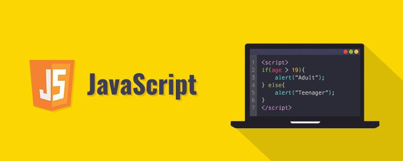

### 一、JavaScript概要

#### 1.1  为什么要学习 JavaScript?

- **HTML**是一种标记语言，用来结构化我们的网页内容并赋予内容含义。

  例如定义段落、标题，或在页面中嵌入图片和视频。

- **CSS**是一种样式规则语言，可将样式应用于 HTML 内容。

  例如设置背景颜色和字体，在多个列中布局内容。

- **JavaScript**是一种脚本语言，可以用来创建**动态更新**的内容，控制多媒体，制作图像动画等。

  这三层依次建立，秩序井然。

#### 1.2  JavaScript应用场景

- **表单验证**
- **网页动态效果（轮播，弹出的广告窗，选项卡等）**
- 记住用户名字和密码
- 游戏开发-经典案例俄罗斯方块
- ........

#### 1.3  什么是JavaScript?

官方解释：JavaScript 是一种**跨平台**的**脚本语言**。

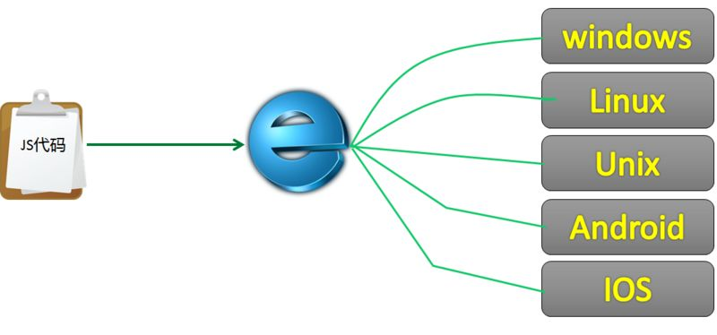

- 平台：一般指的是运行环境，这里指的是操作系统
- 跨平台：就是在很多种操作系统中都可以运行
- 脚本语言：特点是不能独立运行，需要依赖于网页。

> JavaScript程序的运行离不开HTML，HTML的运行离不开浏览器，浏览器又被称作HTML的解析器
>

JavaScript是一种属于网络的脚本语言，已经被广泛用于Web应用开发，常用来为网页添加各式各样的动态功能，

为用户提供更流畅美观的浏览效果，作为一个Web开发师，如果你想提供漂亮的网页、令用户满意的上网体验，

JavaScript是必不可少的工具。

#### 1.4 JavaScript发展历史

- 1995 年 2 月，Netscape 公司发布 Netscape Navigator 2 浏览器，并在这个浏览器中免费提供了

  一个开发工具——LiveScript，由于当时 Java 比较流行，Netscape 便把 LiveScript 改名为 JavaScript，

  这也是最初的 JavaScript 1.0 版本。

- 由于 JavaScript 1.0 很受欢迎，Netscape 在 Netscape Navigator 3 中又发布了 JavaScript 1.1 版

  本，不久，微软在 Internet Explorer 3 中也加入了脚本编程功能。

  为了避免与 Netscape 的 JavaScript 产生纠纷，微软特意将其命名为 JScript。

- 1997 年，欧洲计算机制造商协会（**ECMA**）以 JavaScript 1.1 为基础制订了脚本语言标准——

  ECMA-262，并命名为 ECMAScript。

- 1998 年，国际标准化组织和国际电工委员会（ISO/IEC）采用了 ECMAScript 标准（即 ISO/IEC-

  16262）。自此，浏览器厂商就以 ECMAScript 作为各自 JavaScript 实现的规范标准。

  JavaScript 正式从各自为政走向了规范统一。

#### 1.5 ECMAScript起源

1997 年，ECMA 发布 262 号标准文件（ECMA-262）的第一版，规定了脚本语言的实现标准，

并将这种语言命名为 ECMAScript。这个版本就是 ECMAScript 1.0 版。

之所以不叫 JavaScript，主要有以下两个原因：

- 商标限制。Java 是 Sun 公司的商标，根据授权协议，只有 Netscape 公司可以合法使用 

  JavaScript 这个名字，而且 JavaScript 己经被 Netscape 公司注册为商标。

- 体现公益性。该标准的制订者是 ECMA 组织，而不是 Netscape 公司，这样有利于确保规范的开

  放性和中立性。

简单概括，**ECMAScript 是 JavaScript 语言的规范标准**，**JavaScript 是 ECMAScript 的一种实现。**

注意，这两个词在一般语境中是可以互换的。

#### 1.6 ECMAScript版本

- 1998 年 6 月，ECMAScript 2.0 版发布。

- 1999 年 12 月，ECMAScript 3.0 版发布，并成为 JavaScript 的通用标准，获得广泛支持。

- 2007 年 10 月，ECMAScript 4.0 版草案发布，对 3.0 版做了大幅升级。

  由于 4.0 版的目标过于激进，各方对于是否通过这个标准产生了严重分歧。

- 2008 年 7月，ECMA 中止 ECMAScript 4.0 的开发，将其中涉及现有功能改善的一小部分发布为 

  ECMAScript 3.1。不久，ECMAScript 3.1 改名为 ECMAScript 5。

- 2009 年 12 月，ECMAScript 5.0 版正式发布。

- 2011 年 6 月，ECMAScript 5.1 版发布，并且成为 ISO 国际标准（ISO/IEC 16262:2011）。

- 2013 年 12 月，ECMAScript 6 版草案发布。

- 2015 年 6 月，ECMAScript 6 发布正式版本，并更名为 ECMAScript 2015 。

  Mozilla 在这个标准的基础上推出了 JavaScript 2.0。

- 从此以后，JavaScript 开始以年份命名，新版本将按照 “ECMAScript+年份” 的形式发布。

  目前最新 版本为 ECMAScript 2018，于 2018 年 7 月正式发布。

#### 1.7 浏览器支持

目前 5 大主流浏览器都支持 ECMAScript 5，具体说明如下：

- IE 9+
- Chrome 13+
- Firefox 4+
- Safari 5.1+
- Opera 11.60+


#### 1.8 JavaScript的构成

ECMAScript 是 JavaScript 的标准，但它并不等同于 JavaScript，也不是唯一被标准化的规范。

实际上，一个完整的 JavaScript 实现由以下 3 个不同部分组成：

- 核心（ECMAScript）：语言核心部分。

  主要关心：函数、数组、对象

- 文档对象模型（Document Object Model，DOM）：网页文档操作标准。

- 浏览器对象模型（BOM）：客户端和浏览器窗口操作基础。

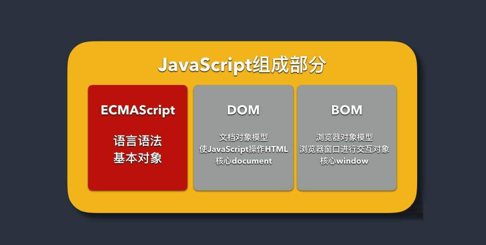


#### 1.9 进制

    进制分为二进制、八进制、十进制、十六进制
    二进制：0,1   以0b开头
    八进制：0,1,2,3,4,5,6,7  以0o开头
    十进制：0,1,2,3,4,5,6,7,8,9
    十六进制：0,1,2,3,4,5,6,7,8,9,A,B,C,D,E,F   以0x开头
    
    输出的结果都是按照十进制
    其他进制转换成十进制：按权展开
转换成十进制案例：

```js
        //二进制
        var num = 0b1101;
        console.log(num); // 13

        /*
         * 1        1      0       1
         * 2^3     2^2    2^1     2^0
         * 8       4       2       1
         * 1*8  + 1*4  + 0*2 + 1*1 = 8 + 4 + 0 + 1 = 13
        */
```


### 二、JavaScript基本使用

#### 2.1 JavaScript 初体验

- 在 HTML 中，JavaScript 代码必须位于` <script> `与 `</script>` 标签之间。

~~~js
<script>
	alert('这是我们的第一个js代码');
</script>
~~~

​	JavaScript 还可以使用 type 属性：`<script type="text/javascript"></script>`。

在script标签中默认代码语法是js，当如果写的并不是纯js语法的话，那么就需要写type属性具体的属性值.

但type 属性不是必需的，因为JavaScript 是 HTML 中默认的脚本语言。

- ` <script> `与 `</script>`标签书写的位置

  脚本可以在 HTML 页面的` <body>` 或 `<head> `标签中，或同时存在均可。

  - `<head>`中的JavaScript

    ~~~html
    <!DOCTYPE html>
    <html>
        <head>
          	<title>head中的JavaScript</title>
            <script>
                   alert('head中的JavaScript');
            </script>
      	</head>
        <body> 
        </body>
    </html>
    ~~~

  - `<body>`中的JavaScript

    ~~~html
    <!DOCTYPE html>
    <html>
        <head>
          	<title>body中的JavaScript</title>
      	</head>
        <body> 
             <script>
                   alert('body中的JavaScript');
            </script>
        </body>
    </html>
    ~~~
  
  - body 和 head 部分可同时有脚本:文件中可以在body和head部分同时存在脚本
  
    ~~~js
    <head>
          	<title>JavaScript</title>
    		 <script>
                alert('<head>中的JavaScript');
    		</script>
    </head>
    <body> 
            <script>
                   alert('body中的JavaScript');
            </script>
    </body>
    ~~~
  
     **回答：head和body中同时存在script文件会执行哪个？**
    
    答：先执行head,后执行body，因为代码的执行顺序是==自上而下，逐行执行==；
    
  - 引入外部脚本文件
  
    - JS程序不仅可以直接写在HTML文档中，也可以放在JavaScript文件中。后缀名是.js。
  
      使用任何文本编辑器都可以编辑。
  
    - JS文件不能够单独运行，需要使用 `<script>`标签导入到网页中。
  
    - 定义src属性的`<script>`标签**不应该再含有JavaScript代码**，否则只会下载并执行外部
  
      JavaScript文件，嵌入代码被忽略。
  
    ~~~html
    <html>
            <head>
              <title></title>
          </head>
          <body>
            <!--
    		创建一个js文件，名称为first.js  引入js文件
    		  -->
            <script src='first.js'></script>
            </body>
    </html>
    ~~~
  
  注意：在外部文件中放置脚本有如下优势：
  
  - 分离了 HTML 和js代码
  
      - 使 HTML 和 JavaScript 更易于阅读和维护
      - 已缓存的 JavaScript 文件可加速页面加载
  
  **思考：内部JS和外部JS哪一个的执行优先级最高?**
  
  具体还是要看代码的书写位置，谁在前，那么就先执行谁

总结：js文件放到哪里更好？

- 浏览器对html页面内容的加载是**顺序加载**，也就是在html页面中前面先加载。

  当浏览器加载html文件并解析到`<head>`时,`<body>`**并没有被解析,**

  浏览器会等到`<head>`中的js部分执行完再加载页面。

- 如果把javascript放在head里的话，则**先被解析**；

  但这时候body**还没有解析**（常规html结构都是head在前，body在后）

  如果head的js代码里面想要操作body中的内容的话，**就没有办法正常操作**

- 从JavaScript对页面下载性能方向考虑：

  由于脚本会阻塞其他资源的下载（如图片等）和页面渲染，直到脚本全部下载并执行完成后，

  页面的渲染才会继续，因此推荐将所有的`<script>`标签尽可能放到`<body>`**标签的底部**，

  以尽量减少对整个页面下载的影响。无论外部js是否和元素相关，还考虑到了下载页面的性能问题
  一般情况下都==放在了body的最后面==

#### 2.2 JavaScript 输出

JavaScript 能够以不同方式“显示”数据：

- 使用 alert() 警告框（直接弹出框）
- 使用 document.write() 写入 HTML 输出,可以在内容前后添加标签；
- 使用 console.log() 写入浏览器控制台
- 使用 prompt() 输入框
- 使用 confirm() 判断框

1. alert

   您能够使用警告框来显示数据：

   ```html
   <!DOCTYPE html>
   <html>
     <body>
         <script>
         		alert('JS是一个让你又爱又恨的语言');
         </script>
     </body>
   </html> 
   ```

2. document.write

   执行性，无返回结果；

   如果要用的话，也都是在页面中的某一个标签中写入内容，而不会直接在页面中输入；

   ```html
   <!DOCTYPE html>
   <html>
     <body>
         <script>
         		document.write('JS是一个让你又爱又恨的语言');
         </script>
     </body>
   </html> 
   ```

3. console.log

   在浏览器中，您可使用 console.log() 方法来显示数据。

   请通过 F12或者ctrl+shift+i 来激活浏览器控制台，并在菜单中选择“控制台”。

   ```html
   <!DOCTYPE html>
   <html>
   	<body>
   		<script>
   			console.log('敢于直面面对自己写的BUG');
   		</script>
   	</body>
   </html> 
   ```

4. prompt(text,value)

   value是弹出时文本框中的默认值，**返回的是字符串**

   **确定**按钮返回的是**文本框中输入的值**；

   **取消**按钮返回的是**null**

   ~~~js
   <!DOCTYPE html>
   <html>
   	<body>
   		<script>
   			console.log(prompt("请输入你的年龄",0));
   		</script>
   	</body>
   </html> 
   ~~~

5. confirm()

   一般用于判断一件事(要不要执行)，多用于**表单**、**数据**等相关时；

   例如：要删除时，弹出是否删除；带有毁灭性质的操作

   **确定**按钮返回的是**true**，

   **取消**按钮返回的是**false**

   ~~~js
   <!DOCTYPE html>
   <html>
   	<body>
   		<script>
   			console.log(confirm("确定要执行该程序吗?"));
   		</script>
   	</body>
   </html> 
   ~~~

#### 2.3. JavaScript 语句

1. JavaScript 语句

   JavaScript 语句由以下构成：值、运算符、表达式、关键词和注释。

   ~~~js
   var a = 1; // 1就是值
   var b = a + 1; //+就是运算符之一
   a+1  //表达式
   
   var  //关键字
   a   // var 后面的值叫做变量
   
   //单行注释
   ~~~

   ```js
   //我是一个注释，我属于js语句的一部分，我也是狠重要的
   var age = 1 + 17；
   ```

2. 分号;  (每写完一句话，可以添加分号，也可以不添加)

   ```js
   a = 1;
   b = 2;
   c = a + b;
   ```

   如果有分号分隔，允许在同一行写多条语句：

   ```js
   a = 1; b = 2; c = a + b;
   ```

3. js的代码的行长度和折行

   为了达到最佳的可读性，程序员们常常喜欢把代码行控制在 80 个字符以内。

   如果一个字符串里面想要换行显示的话，则需要在每一句话想要换行的位置添加一个\，表示多行显示，但是只是在写代码的期间，并不能真正的表示换行;

   如果想要在运行结果的时候表示换行的话，则需要添加字符串中表示换行的字符;**\n**表示在字符串中的换行，类似于标签中的\<br/>,然后每一句话的最后都要添加一个\，表示多行显示,即\\n\

   ```html
   <!DOCTYPE html>
   <html>
   	<body>
   		<script>
               //这种写法只能是在JS的编译期进行换行，实际输出时仍在一行，且在换行之后有空格
               console.log("生活就像是一盘巧克力，\
                           你永远不知道会碰到什么味道");
               //如果想要在控制台中输入时就会体现换行效果，需要在换行的位置写\n\
               //当然，换行之后的字符串仍然有空格，后续会有相应的方法去掉空格
               //\n：表示在显示结果的时候会换行
               console.log("生活就像是一盘巧克力，\n\
                           你永远不知道会碰到什么味道")
   			document.write('生活就像是一盘巧克力，<br/>
               你永远不知道会碰到什么味道');
   		</script>
   	</body>
   </html> 
   ```

   不能像这样折行，一定是和字符串相关的。

   ```html
   <!DOCTYPE html>
   <html>
   	<body>
   		<script>
   			document.write \ 
   			("生活就像是一盘巧克力，你永远不知道会碰到什么味道");
   		</script>
   	</body>
   </html> 
   ```

4. js空白字符

   js会忽略多个空格。您可以向脚本添加空格，以增强可读性

   这两行是相等的：

   ```js
   var name = "emo";
   var name="emo"; 
   ```

   在运算符旁边（ = + - * / ）添加空格是个好习惯：

   ```js
   var x = y + z ;
   ```

5. js代码块：为了帮助咱们解决一些重复代码的功能

   JavaScript 可以分批地组合起来。**代码块以左花括号开始，以右花括号结束。**

   代码块的作用是一并地执行语句序列。

   ```js
   function myFirst() {
       alert('人生就像一杯茶，不会苦一辈子，但总会苦一阵子。');
       alert('你坚持下来了，而别人坚持不下来，这就是你的资本。');
   }
   myFirst();
   ```

#### 2.4. JavaScript 注释

+ 单行注释

  单行注释以 // 开头。

  任何位于 // 与行末之间的文本都会被 JavaScript 忽略（不会执行）。

  快捷键：ctrl + /

  ~~~html
  <!DOCTYPE html>
  <html>
  	<body>
  		<script>
  			// 我是一个注释
  			document.write("乘着风游荡在蓝天边");
  		</script>
  	</body>
  </html> 
  ~~~

+ 多行注释

  多行注释以 /* 开始，以 */ 结尾。

  快捷键：alt + shift + a

  ```html
  <!DOCTYPE html>
  <html>
  	<body>
  		<script>
  			/* 
  			多数的错失，是因为不坚持，不努力，不挽留，然后催眠自己说一切都是命运。，
  			世界上最远的距离，不是爱，不是恨，而是熟悉的人，渐渐变得陌生。
  			真正的坚韧，应该是哭的时候要彻底，笑的时候要开怀，
  			说的时候要淋漓尽致，做的时候要毫不犹豫。
  			能救你脱出苦海的只有你自己。让自己变得更好，才是唯一的出路。
  			*/
  			document.write("身健如山，心静似水，淡泊名利,这是人生的最高境界");
              document.write("谁能活得如此境界，谁的一生就活得自在。");
  		</script>
  	</body>
  </html> 
  ```

+ 在行末使用注释

  ```html
  <!DOCTYPE html>
  <html>
  	<body>
  		<script>
  			document.write("茶不过两种姿态，浮、沉；饮茶人不过两种姿势，拿起、放下。人生如茶，沉时坦然，浮时淡然，拿得起也需要放得下。"); //这是行末注释的写法
  		</script>
  	</body>
  </html> 
  ```

#### 2.5. JavaScript 断点调试

调试的作用就是为了要知道程序的运行走向，以及值的变化，起到辅助的作用

方式1：

1） 找到浏览器中的Sources选项卡

2） 找到左侧想要调试的页面名称，点进去

3） 找到想要调试的语句，左键单击出现了一个蓝色的箭头框，在右侧的Breakpoints断点中也会显示调试信息

4)   页面刷新，页面暂停在了调试模式下(Paused in debugger)

5） 找到右侧有一个向下的箭头，点一下执行一句...

6） 如果想要跳出调试模式，恢复正常的开发模式

​	   6-1 取消所有的断点

​	   6-2 页面刷新

方法2：在任意的代码中手动添加一句调试debugger;

从这句话以后直接调试，刷新界面就会进入到调试模式，想要跳出调试模式，需要将debugger;这句话注释掉；

~~~js
<script>
         var a = 10;
         var b = 20;
         console.log(a);
         //如果在代码中想要从某一句话开始向后来测试（调试）的话，那么可以写debugger;
         debugger;
         console.log(b);
         console.log(a+b);
</script>
~~~

### 三、JavaScript变量

作用：为了方便程序的使用，存储数据的，存储什么数据根据需求来定。

#### 3.1 定义变量

var  x = 1；x 叫做变量名，1 叫做字面量（直接量）

说明：

- 变量相当于容器，值相当于容器内装的东西，而变量名就是容器上贴着的标签，

  通过标签可以找到变量，以便读、写它存储的值

- ECMAScript 的变量是松散类型（弱类型，动态类型）

  所谓松散类型就是可以用来保存任何类型的数据

#### 3.2 声明变量

在 js中，声明变量使用 **var** 语句，

在一个 var 语句中，可以声明一个或多个变量，也可以为变量赋值，

注：

* 当定义了变量，变量没有给值的时候，得到的结果就是**undefined**，undefined(表示这个变量是刚刚初始化，还没有任何具体的值) 咱们也叫作缺省值

* 当声明多个变量时，应使用逗号运算符分隔。
* 控制台输出的时候，也可以一次性输出多个值，之间仍然使用逗号间隔

~~~js
<body>
		<script>
			var a;  //声明一个变量
			var a,b,c;  //声明多个变量
			var b = 1; //声明并赋值
			console.log(a);  //返回 undefined
			console.log(b);  //返回 1
		</script>
</body>
~~~


在ES5版本的时候，利用var声明的变量允许定义同名的变量

~~~html
<body>
		<script>
			var a = 1;
			var a = 2;
			var a = 3;
			console.log(a); // 3
		</script>
</body>
~~~


当多个变量的值是一样的时候，也可以使用连等定义,==连等不赋值，直接输出会报错==

```js
var e = f = g;
console.log(e,f,g);
```


~~~js
var a = b = 1,c = 2;
console.log(a);   // 1
console.log(b);   // 1
console.log(c);   // 2
~~~

JavaScript代码分为严格模式和非严格模式两种

- 非严格模式

  JavaScript 允许**不声明变量**就直接赋值，这是因为 JavaScript 解释器能够自动隐式声明变量，

  隐式声明的变量总是作为全局变量使用。

  ~~~js
  //var x;
  x = 3.14;
  console.log(x); //3.14
  ~~~

- 严格模式

  变量必须先声明，然后才能使用。

  注意：
  
  * 一定是置顶第一句（script标签后的第一句话）
  * 记住，"use strict"==要是字符串==！！！
  
  ~~~js
  "use strict";
  x = 3.14;// 报错 Uncaught ReferenceError: x is not defined
  ~~~

#### 3.3 变量的命名规范

- 名称可包含字母、数字、下划线和美元符号($)

- 名称**必须以字母开头**

- 名称也可以 $ 和 _ 开头，下划线尽量放在中间；

- 名称对大小写敏感（Animal和 animal 是不同的变量）

- 保留字（比如 JavaScript 的关键词）无法用作变量名称

提示：JavaScript 标识符对大小写敏感。

标识符：系统征用的有特殊功能的单词；指的是变量、函数、属性的名字，或者函数的参数。

**标识符命名规范**：

- 第一个字符必须是一个字母、下划线（_）或一个美元符号（$）

  其他字符可以是字母、下划线、美元符号或数字

- 不能含有空格 不能以关键字或保留字命名

- 保留字

  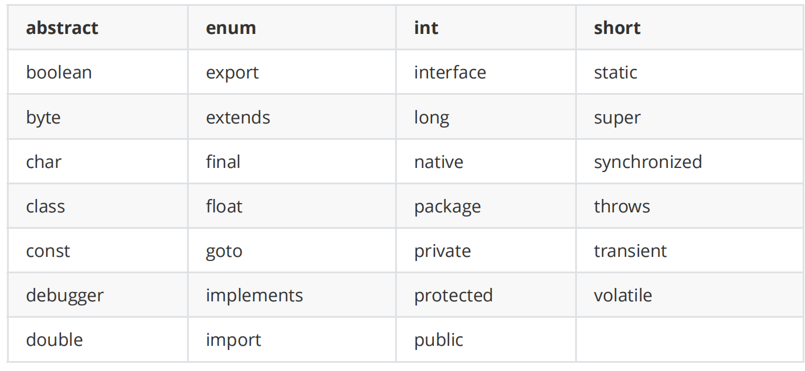

  

- 关键字

  

- 不能使用JS内置的事件作为变量的名称，例如：

  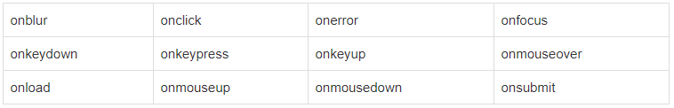

- 标识符命名要做到顾名思义。

  起一个有意义的名字，尽量做到看一眼就知道是什么意思(提高代码可读性) 

  比如: 名字就定义为 name，学生定义用 student

  ~~~js
  a = "zhangsan"  # bad
  name = "zhangsan"  # good
  b = 23   # bad
  age = 23 # good
  ~~~

  遵守一定的命名规范：驼峰命名法，又分为大驼峰命名法和小驼峰命名法

  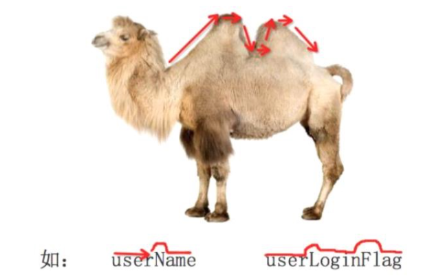

  - 小驼峰式命名法（lower camel case）：

    第一个单词以小写字母开始；第二个单词的首字母大写，例如：myName、aDog

  - 大驼峰式命名法（upper camel case）： 

    每一个单词的首字母都采用大写字母。例如：FirstName、LastName.

  - 下划线  user_name

#### 3.4 赋值变量

使用等号`=`运算符可以为变量赋值，等号左侧为变量，右侧为被赋的值

~~~js
    <script>
        //先声明变量
        var user;
        //在给变量初始值
        user = '刚果红';
        console.log(user);//"刚果红"

        //或者也可以在声明变量的时候一次性的赋一个初始值
        //赋值变量的时候，就是要靠等号来赋值(一个等号在js中咱们叫赋值(赋值号)运算符)
        var pass = 123456;
        console.log(pass); //123456
    </script>
~~~

#### 3.5 变量提升

声明变量放在最后，赋值操作放在前面，JavaScript 在预编译期会先预处理声明的变量

**==目的==**：在整个程序运行前需要预解析，需要将要定义的变量提前声明出来，把所有要创建的变量都在内存里面都创建完毕了

~~~js
<script>
    console.log(a_name); //undefined
    a_name = '张三'
    console.log(a_name); //张三
    var a_name;
//程序中只要是有var，则这个变量就会发生变量提升，这是在ＥＳ５版本中才会出现的
//变量提升只提升定义语句，不提升赋值语句
//变量提升到了当前script标签的最顶端（第一行）
//变量提升的设计初心其实就是为了在程序一开始在执行之前把所有要创建的变量都在内存里面都创建完毕了
</script>
~~~

由于 JavaScript 在预编译期对变量声明语句进行了预解析，所以第一行代码读取变量值时不会抛出异常，

而是返回未初始化的值 undefined，第三行代码是在赋值操作之后读取，故显示为张三。

JavaScript 引擎的解析方式是：**先解析代码，获取所有被声明的变量，然后再一行一行地运行，**这样所有声明的变量都会被提升到代码的头部，这就叫作变量提升。

==总结==：变量定义只有带有var标识的，变量才会发生提升，没有var的，则在变量之前输出就是报错

练习1：看看结果是什么？

```js
<script>
    console.log(a); //undefined
    var a = 100; 
    console.log(a); //a = 100
</script>
```

练习2：将两个变量a,b的值交换，var a = 1; var b = 2;

方案1：利用第三个变量

~~~js
    <script>
        var a = 1;
        var b = 2;
        //要求：a的值变成2；b的值要变成1；
        //两个变量之间将值相互交互，可以使用第三个变量
        var c;
   //1.先找a变量也行，b变量也行，其中一个变量的值交给c
        //虽然这个值赋值给了c，相当于是复制粘贴的作用，可不是剪切
        c = a; //被赋值的变量写等号左侧；给值的变量写等号右侧
   //2.将b的值赋值给a变量（相当于b的值复制粘贴给了a变量，b还有值）
        a = b;
   //3.将原来备份的c变量的值赋值给b（相当于c的值复制粘贴给了b变量，c还有值）
        b = c;
        console.log(a); // 2
        console.log(b); // 1
    </script>
//记忆方法：第二行的前面的变量，是第一行的后面的变量；
~~~

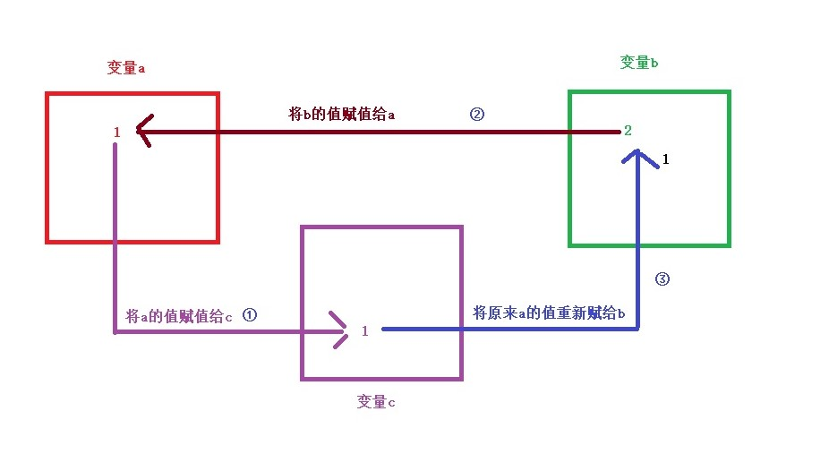

方案2：不利用第三个变量，先相加，后两次相减

~~~js
var a = 1;
var b = 2;

a = a + b;
console.log(a,b); // 3 2

b = a - b;
console.log(a,b); // 3 1

a = a - b;
console.log(a,b); // 2 1
~~~

### 四、JavaScript数据类型

JavaScript的数据类型在ES5版本中分为两种：值类型（基本数据类型）、址类型（引用数据类型）

| 基本数据类型     |                      |
| ---------------- | -------------------- |
|                  | 字符串类型（String） |
|                  | 数字(Number)         |
|                  | 布尔(Boolean)        |
|                  | 未定义（Undefined）  |
|                  | 空（Null）           |
| **引用数据类型** |                      |
|                  | 数组(Array)          |
|                  | 函数(Function)       |
|                  | 对象(Object)         |

#### 4.1 字符串（String）

字符串可以是**引号中的任意文本**，引号可以使用单引号或双引号。

技巧：用于分辨数据类型，简单来说，看颜色，只要是**纯黑色**的，无论写的是什么内容，都是字符串类型；

(1) 常规写法：

~~~js
var name = "张三";
var sname = '李四';
~~~

(2) **<span style='color:green'>特殊写法：单引号和双引号之间的相互嵌套  【尤其注意】</span>**

~~~js
var name = '王二"麻子"';   //单引号里面包裹双引号
var sname = "你是'小淘气'" //双引号里面包裹单引号
~~~

**<span style='color:red'>错误写法1：两侧引号写法必须对称</span>**

~~~js
var name = '李大瘸子"; //左侧单引号，右侧也必须是单引号
var sname = "田七';    //左侧双引号，右侧也必须是双引号
~~~

**<span style='color:red'>错误写法2：双引号包括单引号，单引号包裹双引号，顺序不能乱</span>**

~~~js
var name = ""赵"六"   //双引号中不能包裹双引号
var sname = ''王'五'  //单引号中不能包括单引号
~~~

如果一定要想双包裹双，单包裹单，必须使用转义字符

**转义字符**：将带有特殊含义的字符转化成普通字符，因为在特定环境下是无法使用的

使用方式：想要转义哪一个字符，就在这个**字符的前面**添加一个\

~~~js
var name = '张\'三\'';
var name1 = "张\"三\"";
console.log(name); //张三
console.log(name1); // 张三
console.log ("子曰："学而时习之，不亦乐乎"");
//添加转义字符
console.log ("子曰：\"学而时习之，不亦乐乎\"");
~~~

思考：两次结果一致吗？

~~~js
var name = "admin"；
alert(name)；//admin
alert('name')； //name
~~~

**结论：无论引号中包裹是什么，纯字符串也好，变量也罢，只要直接写在引号中，一律按照字符串处理。**

#### 4.2 数字（Number）

JavaScript 只有一种数字类型。数字可以带小数点，也可以不带，控制台显示**蓝色**

1. 整数

~~~js
var num = 10;
console.log(num); //10
~~~

2. 浮点数

~~~js
var num = 45.67;
console.log(num); //45.67
~~~

3. 科学计数法

~~~js
var num = 123e5;
var num1 = 123e-5;
console.log(num); //12300000
console.log(num1);//0.00123
~~~

4. 最大值和最小值

~~~js
var num2 = Number.MAX_VALUE;
var num3 = Number.MIN_VALUE;
console.log(num2); //1.7976931348623157e+308
console.log(num3); //5e-324
~~~

#### 4.3 布尔（Boolean）

布尔（逻辑）只能有两个值：true 或 false。控制台显示**蓝色**

以后开发的时候，如果咱们要针对于某一件事的判断，就可以建立变量的初始值为布尔值；

定义变量的时候习惯于叫tag或者是flag;  --->表示某种状态

~~~js
var bool = true;
var bool1 = false;
console.log(bool); //true
console.log(bool1); //false
//但是一定要注意，无论字符串中写的是什么，哪怕是true或者是false，只要外侧有引号，都是字符串
var bool2 = "true";
console.log(bool2); //true==》string
~~~

#### 4.4 未定义（Undefined）

定义了变量，但是没有对其赋值 ；	**灰色**

~~~js
var num;
console.log(num); //undefined
~~~

#### 4.5 空对象（Null）

这个变量里面不应该有任何的值，就是一个空	**灰色**

~~~js
var n = null;
console.log(n); //null
~~~


### 五、JavaScript数据类型高级

#### 5.1  字符串

JavaScript字符串(String)就是由零个或多个**Unicode字符**组成的字符序列。零个字符表示空字符串。

- 字符串字面量/字符串直接量;
  - 字符串必须包含在单引号或双引号中

  - 如果字符串包含在双引号中,则字符串内可以包含单引号;反之,也可以在单引号中包含双引号

  - 在ECMAScript 3中,字符串必须在一行内表示,换行表示是不允许的，

    - 如果要换行显示字符串,可以在字符串中添加换行符(\n)

  - 在ECMAScript 5中,字符串允许多行表示。

    - 实现方法:在换行结尾处添加反斜杠(\\).
  - 【反斜杠和换行符不作为字符串直接量的内容】
  
- 在字符串中插入特殊字符,需要使用转义字符\,如单引号,双引号等
  
- 字符串中每个字符都有固定的位置.第1个字符的下标位置为0,第2个字符的下标位置为1...
  
    ···以此类推,**==最后一个字符==**的下标位置是字符串长度减1

(**字面量/直接量**：等号右侧直接书写数据的类型值)

==**注：**==**在字符串里包含变量的写法**

```js
    <script>
        var money = 10;
        console.log('我有'+money+'块钱');//我有10块钱
    </script>
```

> 写法：
>
> 1. 先看字符串用的什么引号(单引 or 双引)，外面写的什么，用什么包裹变量
> 2. 将变量写在引号里，添加+，即 引引加加 
> 3. 两侧字符串的引号要对称


##### 5.1.1 转义字符

转义字符是字符的一种间接表示方式。在特殊语境中,无法直接使用字符自身

~~~js
var str = "请看\"这个是一个双引号";
console.log(str); //请看"这是一个双引号
~~~

如果在一个正常字符前添加反斜杠,JavaScript会忽略该反斜杠

~~~js
<script>
    var str = "小明妈妈说:\"今天天气真好\"";
    console.log(str); //小明妈妈说:"今天天气真好"
    var str2 = "小明妈妈说:\"\今\天\天\气\真\好\"";
    console.log(str2);//小明妈妈说:"今天天气真好"
    var str3 = "看我斜杠：\\"
    console.log(str3);//看我斜杠\
</script>
~~~

##### 5.1.2 字符串操作

+ 借助String类型的原型方法,可以灵活操作字符串（后面各章节中详细介绍）

+ 在JavaScript中,可以使用加号(+)运算符连接两个字符串

  + 注：==+ 左右只要有一个字符串，就是字符串拼接；==

+ 使用字符串的length属性获取字符串的字符个数(长度）

+ 在ES5中，**字符串可以作为只读数组使用**，可以通过中括号运算符(索引值)添加下标访问某一个值。

  下标从0开始，最大位置的下标是length-1

~~~js
<script>
    var str = "老师说";
    var say = "你好啊";
    console.log(str+say); //老师说你好啊
    console.log(str + 666); //老师说666
    console.log(str + 888); //老师说888
    console.log(1 + 1); // 2
    console.log("1" + 1); // 11
    console.log(1 + "1"); // 11
    var str1 = "今天是个好天气12345";
    console.log(str1.length); //12
    console.log(str1[0]); //今
    //获取最后一个字符
    console.log(str1[str1.length-1]); //5
</script>
~~~

##### 5.1.3 String()方法

前提：String()这类的方法是全局方法，只要是这个方法前面没有任何的值来点，则这样的方法都叫做全局方法,如果有一些方法是需要被点出来的，则这个方法是需要依附于前面的值

总结：String()方法是可以将==所有的数据类型==都转换成字符串类型

情况1：针对于null和undefined类型

​			 转换成对应的null和undefined字符串

情况2：针对于number类型

​		     普通数字直接转换成字符串

情况3：针对于boolean类型

​		     都转换成对应的true和false字符串

~~~js
<script>
    //1.null类型的转换
    console.log(String(null));//字符串的 'null'

    //2.undefined转换
    console.log(String(undefined));//字符串的'undefined'

    //3.number类型的转换
    //转换规则：普通数字直接变成字符串 
    console.log(String(123));//'123'
    console.log(String(-123));//'-123'
    console.log(String(Infinity));//'Infinity'
    console.log(String(-Infinity));//'-Infinity'
    console.log(String(12.3));//'12.3'
    console.log(String(NaN));//'NaN'

    //4.布尔值的转换
    console.log(String(true));//'true'
    console.log(String(false));//'false'
</script>
~~~

##### 5.1.4 toString()方法

- toString()方法前面是对象可以调用出来的,toString方法不能直接拿来使用
- 除了null和undefined之外，其他的类型(数值、布尔、字符串)都有toString()方法，它返回相应值的字符串(并不修改原变量)。

- 当该对象被表示为一个文本值时，或者一个对象以预期的字符串方式引用时自动调用。

~~~js
<script>
    console.log((1).toString());     // "1"
    console.log(true.toString());    // "true"
    console.log(null.toString());   
// Uncaught TypeError: Cannot read property 'toString' of null(不能读取null的toString属性)

    console.log(undefined.toString());
// Uncaught TypeError: Cannot read property 'toString' of undefined
</script>
~~~


**String()方法和toString()方法的区别：主要针对于null和undefined类型**

String()方法可以转换null和undefined，转换成对应的字符串；

toString()方法不可以转换null和undefined，会报错，一般开发时习惯使用toString()


#### 5.2  数字

数字（Number）也称为数值或者数，当数字直接出现在程序中时，被称为数值直接量（字面量）。

JavaScript中的所有数字都是以64位浮点数形式存储的，包括整数。例如：2与2.0是同一个数

在 JavaScript程序中，直接输入的任何数字都被视为数值直接量。

##### 5.2.1 浮点数溢出

执行数值计算时，要防止浮点数溢出。

例如，0.1+0.2 并不等于 0.3。

`num = 0.1+0.2;   //0.30000000000000004`

这是因为 JavaScript 遵循二进制浮点数算术标准（IEEE 754）而导致的问题。

这个标准适合很多应用，但它违背了数字基本常识。

解决方法：

浮点数中的整数运算是精确的，所以小数表现出来的问题可以通过指定精度来避免。

例如，针对上面的相加可以这样进行处理。	

`a = (1+2)/10;   //0.3`

##### 5.2.2 .toFixed()

==.toFixed()== :四舍五入，保留小数点后两位，成一个字符串括号里是保留的位数；

```js
.toFixed(2)	//toFixed()方法：四舍五入，保留小数点后两位，成一个字符串
```


##### 5.2.3 Infinity


- Infinity

  - 计算超出范围会得到无穷大(infinity)或者无穷小(-infinity)

  - 分母为0会构成无穷大Infinity 或负无穷大-Infinity

  - 关于Infinity的运算，加减乘除一个**数字(乘法时除了0)**都是Infinity，

    Infinity和Infinity计算，加法乘法为Infinity，其他为NaN

  - Infinity和自身相等 其他比较正常

~~~js
// 分母为0会构成无穷大Infinity 或负无穷大-Infinity
var num6 = 5/0;
console.log(num6);//Infinity

var num7 = -5/0;
console.log(num7);//-Infinity

console.log(typeof (Infinity));//无穷大和无穷小都是属于number类型
~~~

关于Infinity的运算是无法计算的，

- 加减乘除一个数字 (乘法时除了0) 都是Infinity；

~~~js
console.log(Infinity + 100); //Infinity
console.log(Infinity - 100); //Infinity
console.log(Infinity * 100); //Infinity
console.log(Infinity / 100); //Infinity
console.log(Infinity * 0);  //NaN
~~~

Infinity和Infinity计算；

- 加和乘为Infinity

~~~js
console.log(Infinity + Infinity); //Infinity
console.log(Infinity * Infinity); //Infinity
~~~

- 减和除为NaN

~~~js
console.log(Infinity - Infinity); //NaN
console.log(Infinity / Infinity); //NaN
~~~

**Infinity和自身相等  其他比较正常**

单等赋值，双等等于；做判断的；

~~~js
console.log(Infinity > 1);//true
console.log(Infinity < 1);//false
console.log(Infinity == 1);//false

console.log(Infinity > Infinity);//false
console.log(Infinity < Infinity);//false
console.log(Infinity == Infinity);//true
console.log(Infinity > -Infinity);//true
~~~

##### 5.2.4 NaN

- NaN,即不是一个数字(Not a Number)是一个特殊的数值
- 当无法做正常运算的时候，咱们会得到一个NaN(这样就不会抛出错误了)
- **NaN特点：无论和谁比较都是false 无论和谁计算都是NaN，除了字符串是拼接**
- 数值和非数值的字符串做减、乘、除等运算的时候是NaN;
- 数值和数值字符串做减、乘、除等运算的时候是正常运算(减法有隐式转换)

~~~js
<script>
    var num8 = "小岳岳"-1;
    console.log(num8)//NaN

    // NaN特点：无论和谁比较都是false  无论和谁计算都是NaN(除了字符串的加法)
    console.log(NaN+1);//NaN
    console.log(NaN>1);//false
    console.log(NaN==1);//false
    console.log(NaN<1);//false
</script>
~~~

##### 5.2.5 isNaN

isNaN方法检测一个值是不是非纯数字 , 如果非纯数字就返回true 如果是**纯数字就返回false**

注：一般用于判断一定都得是数字的情况，如：电话号码、qq号、银行卡号、年龄、邮编……

~~~js
<script>
    document.write(isNaN(123)); //false
    document.write(isNaN(-1.23)); //false
    document.write(isNaN(5-2)); //false
    document.write(isNaN(0)); //false
    document.write(isNaN("Hello")); //true
    document.write(isNaN("2005/12/12"));//true
</script>
~~~

- 最大值和最小值

在js中数字也是有最大值和最小值的支持的，如果超过最大值或最小值，就可能计算有误

~~~js
console.log(Number.MIN_VALUE);//5e-324  支持数字的最小值
console.log(Number.MAX_VALUE);//1.7976931348623157e+308 支持数字的最大值
~~~

- 正无穷和负无穷

~~~js
console.log(Number.POSITIVE_INFINITY); //Infinity
console.log(Number.NEGATIVE_INFINITY); //-Infinity
~~~


#### 5.3  布尔

布尔类型仅包含两个固定的值：`true`和`false`。其中`true`代表真，`false`代表假。

在一些判断等操作中，需要使用布尔值

语法：Boolean(值)

使用Boolean(value)方法可以强制转换任意值为boolean类型 

 除了以下六个值，其他都是自动转为true 

- undefined    `console.log(!undefined); --> true`
- null                `console.log(!null); --> true`
- -0              `console.log(!0);  -->  true`
- +0
- NaN          `console.log(!NaN);  --> true`
- ‘’（空字符串）`console.log(!'');  -->  true`

情况1：如果遇见的是数字，则非0为true  0为false  NaN为false

~~~js
console.log(Boolean(123));//true
console.log(Boolean(-123));//true
console.log(Boolean(0));//false
console.log(Boolean(1.23));//true
console.log(Boolean(NaN));//false
console.log(Boolean(Infinity));//true
~~~

情况2：如果遇见的是字符串，空为false  非空为true

~~~js
console.log(Boolean("123"));//true
console.log(Boolean(""));//false
console.log(Boolean("    "));//true
~~~

情况3：如果遇见的是null或undefined，返回的都是false

~~~js
console.log(Boolean(null));//false
console.log(Boolean(undefined));//false
~~~


#### 5.4  undefined

变量被声明了，但没有赋值时，就等于undefined

总结：

* 只要是undefined和数值之间做运算，则为NaN；

* undefined和字符串之间做加法，则为拼接；
* undefined和字符串之间做减、乘、除，为NaN；

~~~js
    <script>
        //变量声明了，但是没有给值
        var a;
        console.log(a); //undefined

        //变量没有声明，则程序报错
        console.log(b); //Uncaught ReferenceError: b is not defined

        //总结：只要是undefined和数值之间做运算，则为NaN
        console.log(a + 100); //NaN
        console.log(a - 100); //NaN
        console.log(a * 100); //NaN
        console.log(a / 100); //NaN

        //undefined和字符串之间做加法则为拼接
        console.log(a + '100'); //undefined100
        console.log(a - '100'); //NaN
        console.log(a * '100'); //NaN
        console.log(a / '100'); //NaN
    </script>
~~~


#### 5.5  null

null 类型是第二个只有一个值的数据类型，这个特殊的值是 null。

从逻辑角度来看，null 值表示一个空对象指针，而这也正是使用 typeof 操作符检测null时会返回"object"的原因

~~~js
var n = null;
console.log(n); //null
~~~

* null相当于0，和数字类型做+ - * / 相当于和0进行计算；
* null和字符串做加法计算，则为拼接
* null和非数字类字符串做- * /，均为NaN
* null和数字类字符串做减法，正常计算；
* null和undefined计算，均为NaN；

> 注：null和"" 在内存占用上是不一样的：
>
>  - null是不会开辟内存空间的
>  - “” 是会开辟内存空间的；
>
> null使用场景：
>
> - 所以一般情况下咱们想要定义一个对象，但是对象的值还不确定时，则需要定义为null比较好
> - 释放内存时使用，让null指向的对象成为垃圾对象，被垃圾回收器回收；

扩展：null和undefined基本是同义的，只有一些细微的差别。 

* **undefined派生自null**，两者都是表示空缺值，转换成布尔值都是假值，**可以相等**

**但是并不是同一个数据类型**

```js
console.log(undefined == null);  //true
console.log(undefined === null);  //false
```

* **null表示"没有对象"，即该处不应该有值** 

* **undefined表示"缺少值"，就是此处应该有一个值，但是还没有定义。** 

* **而设置一个变量、参数为空的时候，建议使用null而不是undefined**


### 六、JavaScript数据类型判断

#### 6.1 typeof

* typeof可以识别出基本类型String，、Number、Boolean、Undefined；

* 但是不能识别null以及引用数据类型，**会把null、array、object统一归为object类型**；

* **但是可以识别出function，所以typeof适用于用来识别一些基本类型**

~~~js
<script>
        var bool = true;
        var num = 1;
        var str = 'abc';
        var und= undefined;
        var nul = null;
		var arr = [];
        var fun = function(){}

        console.log(typeof bool); //boolean

        console.log(typeof num);//number 松散写法
		console.log(typeof(num));//number 严格写法

        console.log(typeof str);//string
        console.log(typeof und);//undefined
        console.log(typeof nul);//object
		console.log(typeof arr);//object
        console.log(typeof fun);//function

        //如果想要确定一个变量的数据类型是否为某一个类型的话
        //则需要判断(==)
        console.log(typeof bool == "boolean"); //true
</script>
~~~

#### 6.2  instanceof

instanceof**<span style='color:red'>不能识别</span>**出基本的数据类型 String、Number、Boolean、Undefined、Null

但是可以检测引用类型，如array、object、function;

语法：

```js
变量 instanceof 类型
```

* 如果这个变量属于这个类型，则返回的为true；
* 如果这个变量不属于这个类型，则返回的为false；

~~~js
<script>
                var bool = true;
                var num = 1;
                var str = 'abc';
                var und= undefined;
                var nul = null;

                console.log(bool instanceof Boolean);// false
                console.log(num instanceof Number);// false
                console.log(str instanceof String);// false
                console.log(und instanceof Object);// false
                console.log(nul instanceof Object);// false

				console.log([] instanceof Array); //true
        		console.log({} instanceof Object);//true
       			function fun(){}
        		console.log(fun instanceof Function); //true
</script>
~~~

总结：在项目中使用哪个判断，还是要看使用场景，具体的选择，

* 今后常用的判断基本类型的(string、boolean、number)：typeof
* 引用数据类型（array、object）：intanceof

### 七、JavaScript数据类型转换

为什么要进行数据类型转换?

案例：简易计算器


在JS中，数据类型转换分为两种：强制转换，自动转换(隐式转换)

#### 7.1 强制类型转换

##### 7.1.1 Number()方法

Number()方法是一种严格的数据类型转换方法；

功能：将**==其他类型==**转换成number类型，会返回一个转换后的值

> 语法：Number(值)

情况1：字符串转数字(看的是字符串里的内容)

- 如果遇见的是**<span style='color:red'>空字符</span>**串或**<span style='color:red'>空格字符串</span>**，则都会转换成**<span style='color:red'>0</span>**
- 如果遇见的是**<span style='color:red'>纯数字字符串</span>**，则会转换成**<span style='color:red'>对应的数字</span>**
- 如果遇见的是**<span style='color:red'>非纯数字字符串</span>**，则会转换成**<span style='color:red'>NaN</span>**

~~~js
console.log(Number(""));//0 空字符串-->0
console.log(Number("   "));//0 都是空格的字符串-->0
console.log(Number(null) == ''); //true
console.log(Number("123"));//0 纯数字的字符串-->相对应的数字
console.log(Number("1a23"));//0 非纯数字的字符串-->NaN
~~~

情况2：布尔值转数字

- 如果遇见的是**<span style='color:red'>true</span>**，则转换成**<span style='color:red'>1</span>**；
- 如果遇见的是**<span style='color:red'>false</span>**，则转换成**<span style='color:red'>0</span>**；

~~~js
console.log(Number(true));//1  true-->1
console.log(Number(false));//0  false-->0
~~~

情况3：undefined转数字

- **<span style='color:red'>undefined</span>**无法转换成对应的值，为==**NaN**==
  - undefined只要是不和字符串作拼接，以外的减、乘、除等运算都是NaN，包括强转；

~~~js
console.log(Number(undefined));//NaN  undefined-->NaN
~~~

情况4：null转数字

- **<span style='color:red'>null</span>**可以转换成数字**<span style='color:red'>0</span>**

~~~js
console.log(Number(null)); // 0   null--->0
~~~

##### 7.1.2 parseInt()方法

parseInt是可以把值转换为整数，**==只接收字符串==类型，对其余类型返回的都是NaN**，放数字类型可以，但是没有意义

语法：parseInt(值)

> 情况1：parseInt如果遇到了非纯数字字符串，会尽可能的保留数字部分，前提==字符串开头是数字==

~~~js
console.log(Number("1a23"));//NaN 非纯数字的字符串-->NaN
console.log(parseInt("1a23"));//开头为数字-->1
~~~

> 情况2：针对于null类型,无法转换，为NaN,因为需要传入的内容必须是一个字符串

~~~js
console.log(Number(null)); // 0   null--->0
console.log(parseInt(null));//无法转换 NaN
~~~

> 情况3：针对于布尔值类型,无法转换，为NaN,因为需要传入的内容必须是一个字符串

~~~js
console.log(Number(true));//1  true-->1
console.log(parseInt(true));//无法转换 NaN
~~~

解析原理：==一位一位的解析==

> * 先从第0位开始解析，看是否是正常的数字，如果不是则直接返回NaN,即使后面有数字也不解析了
> * 如果开头是数字的话，则保留开头的部分，直到解析到不是数字的停止


##### 7.1.3 parseFloat()方法

parseFloat()也是可以把值转换成**浮点数**，**只针对String类型调用才有效果， 对其余类型返回的都是NaN**

语法：parseFloat(值)

即它能够识别第一个出现的小数点，而第二个小数点视为非法，解析过程和parseInt相同。

~~~js
console.log(parseFloat(123));//123
console.log(parseFloat(12.3));//12.3
console.log(parseFloat("12.3.3"));//12.3
console.log(parseFloat("a12.1"));//NaN
~~~

**总结**：parseFloat既可以是整数字符串；也可以是小数的字符串

**共同点**：都没有办法接收非字符串以外的任意类型

##### 7.1.4 总结

==强制类型转换成number：Number()、parseInt()、parseFloat()总结：==

>  注意：parse系列的两个方法需要接收的是字符串类型
>  - 针对于字符串：
>      - 空字符串和空格字符串：Number()方法是可以的
>      - 开头是数字+字母：parse系列的两个方法是可以的
>      - 纯字母字符串：都不能转
>      - 纯数字(整数、小数)字符串：都可以转
>  - 针对于布尔值：
>      - Number方法可以转(true=>1,false=>0)，parse系列的两个方法不能转；
> - 针对于undefined：
>     - 都无法转换，为NaN
> - 针对于null：
>     - Number方法可以转，转成0

#### 7.2 隐式类型转换

发生的场景在于四则运算上（加、减、乘、除、取余(求模)）

> 内部的转换机制：尽量将所有的类型都转换成number，然后再做运算

情况1：当使用加法运算时

- string+number = string
- number+number = number
- undefined+number = NaN
- undefined+string = string
- boolean+number = number
- null+number = number

> 针对于null会隐式转换成0
>
> 针对于布尔值来说，true会转换成1，false会转换成0
>
> 针对于undefined来说，运算只要不和字符串，那么都是NaN，如果和字符串就是拼接

~~~js
console.log("45"+23); //4523--->string
console.log(23+45); //68--->number
console.log(undefined+34); //NaN--->number
console.log(undefined+"45"); //undefined45--->string
console.log(true+34); //35-->number
console.log(null+45); //45--->number
~~~

情况2：当使用减法运算时,数字和纯数字字符串是可以做正常运算的

- string-number = number  这里指的是纯数字字符串；非纯数字字符串为NaN
- number-number = number
- undefined-number = NaN
- undefined-string = NaN  这里的string无论是否是纯数字字符串，运算都为NaN
- boolean-number = number
- null-number = number

~~~js
console.log("45"-23); //22--->number
console.log(45-23); //22--->number
console.log(undefined-34); //NaN--->number
console.log(undefined-"45"); //NaN--->number
console.log(true-34); //-33-->number
console.log(null-45); //-45--->number
~~~

情况3：当使用乘法运算时

- string*number = number  这里指的是纯数字字符串；非纯数字字符串为NaN
- number*number = number
- undefined*number = NaN
- undefined*string = NaN  这里的string无论是否是纯数字字符串，运算都为NaN
- boolean*number = number
- null*number = number

~~~js
console.log("2"*1); //2--->number
console.log(2*1); //2--->number
console.log(undefined*2); //NaN--->number
console.log(undefined*"2"); //NaN--->number
console.log(true*34); //34-->number
console.log(null*45); //0--->number
~~~

情况4：当使用除法运算时

- string/number = number  这里指的是纯数字字符串；非纯数字字符串为NaN
- number/number = number
- undefined/number = NaN
- undefined/string = NaN  这里的string无论是否是纯数字字符串，运算都为NaN
- boolean/number = number
- null/number = number
- **<span style='color:red'>number/null = infinity</span>**

~~~js
console.log("2"/1); //2--->number
console.log(2/1); //2--->number
console.log(undefined/2); //NaN--->number
console.log(undefined/"2"); //NaN--->number
console.log(true/2); //0.5-->number
console.log(null/45); //0--->number
console.log(45/null); //infinity  无穷大
console.log(10 % null);//NaN
console.log(10 % 20);	//10
~~~

情况5：取余，第一个数小于第二个数，取余是第一个数本身；

```js
var num = 30;
var n = null;

console.log(num % n); //number % null = NaN
console.log(10 % 20); //10
```


##### 隐式转换总结：

* undefined:变量声明了但未赋值,参与运算时(不出现字符串)，得到NaN,比较时被转换成NaN

* NaN:不是一个数字的数值型数据,参与运算时(不出现字符串)，得到NaN,NaN和任何数值都不相等，包括他自己

* null:空对象，参与==运算(+ - * / > <  <= < =)==时被转成  ==0==，
  
    ​    ==等于比较时==被转换成==NaN==，

    ​	==null == undefined==
    
    ​    定义的时候不占空间,null只有一个值就是null,
    ​    在隐式和Number()方法强制转换的时候才会变成0
    
* "":空字符串，定义的时候占空间

* ==将纯数字的字符串转换为数值型；在字符串前面添加 + 即可==


### 八、运算符

运算符用于执行程序代码运算，会针对一个以上操作数项目来进行运算；

举例：1*2 ， + 就是**运算符**，1,2就是**操作数**

表达式由一个或多个操作数通过运算符连接起来的式子。

例如 a = 10，b++ ，c = 10 + 20


==运算符的优先级== 

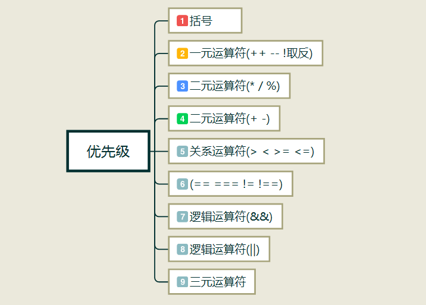


#### 8.1 算术运算符

| 运算符 |     描述     |
| :----: | :----------: |
|   +    |     加法     |
|   -    |     减法     |
|   *    |     乘法     |
|   /    |     除法     |
|   %    | 取余（求模） |
|   ++   |     递增     |
|   --   |     递减     |

> ==\+  可以将所有的数据类型转化为Number== -->  +'1' => 1 (number)

其中需要格外注意的就是递增和递减两个运算符

递增(++)和递减(--)运算就是通过不断地加1或减1,然后把结果赋值给左侧,以实现改变自身结果的一种简洁方法.

递增和递减在运算之前都会试图转换值为数值类型,如果失败则返回 NaN

根据位置不同,可以分为两种运算方式：前置、后置

前置有赋值的情况：

- 递增(++n)：先加一,再赋值  (记忆方法：加号在前，先加1再赋值)
- 递减(--n)：先减一,再赋值

后置有赋值的情况：

- 递增(n++)：先赋值,再加一
- 递减(n--)：先赋值,再减一

~~~js
<script>
    // 无论是  ++a；  还是 a++；  都是让 a每次加1，如果两个代码都是独立运行，那么两个代码没有区别
    var a = 1;
    a ++;//a++是让a  每次加1
    a ++;//a++是让a  每次加1
    a ++;//a++是让a  每次加1
    console.log(a); // 4

    var b = 1;
    ++ b;//让b每次加1
    ++ b;//让b每次加1
    ++ b;//让b每次加1
    ++ b;//让b每次加1
    console.log(b); // 5

    //c++不是单独运行的时候，也就是有赋值操作的时候，那么是先执行赋值，然后再去加1
    //c++ 就是先赋值 后加1
    var c = 2
    var d = c ++;
    console.log(c); // 3
    console.log(d); // 2

    //++c  先加一 后赋值
    var c = 2;
    var d = ++ c;
    console.log(c); // 3
    console.log(d); // 3

   	var a = 10;
   	var b = a++ + a++ + a;
   	console.log(a); // 12
   	console.log(b); // 10 + 11 + 12 = 33
   	//等价于
   	//   var b = a++   b = 10
   	//   var b = a++   b = 11
   	//   var b = a     b = 12
</script>
~~~

练习题：

1. ~~~js
   var a = 1;
   var b = ++a;
   console.log(a);//2
   console.log(b);//2
   ~~~

2. ~~~js
   var a = 1;
   var b = a++;
   console.log(a);//2
   console.log(b);//1  先赋值，看这一行代码前面的a
   ~~~

3. ~~~js
   var a = 1;
   var b = ++a + a; //
   console.log(a);//2
   console.log(b);//2+2=4
   ~~~

4. ~~~js
   var a = 1;
   var b = ++a + ++a + a;
   console.log(a);//3
   console.log(b);//2+3+3=8
   ~~~

5. ~~~js
   var a = 1;
   var b = a + ++a + 1 + a + ++a;
   console.log(a); //3
   console.log(b); //1+2+1+2+3=9
   ~~~

6. ~~~js
   var a = 1;
   var b = a + a + ++a + 1 + a + ++a
   console.log(a);//3
   console.log(b);//1+1+2+1+2+3=10
   ~~~

7. ~~~js
   var a = 1;
   var b = a++ + 1 + a++;
   console.log(a);//3
   console.log(b);//1+1+2=4
   ~~~

8. ~~~js
   var a = 1;
   var b = a++ + a++ + a + 1 + a++ + 1;
   console.log(a);//4
   console.log(b);//1+2+3+1+3+1=11
   ~~~

9. ~~~js
   var a = 1;
   var b = a++ + ++a + a + a++;
   console.log(a);//4
   console.log(b);//1+3+3+3=10
   ~~~

10. ~~~js
    var a = 1;
    var b = ++a + a++ + a++ + a + ++a + a++ + a;
    console.log(a);//6
    console.log(b);//2+2+3+4+5+5+6=27
    ~~~
    
11. ```js
    var a = 10;
    var b = a-- + a--;
    console.log(a); // 8
    console.log(b); // 10 + 9 = 19
    ```


#### 8.2 赋值运算符

> 记忆赋值运算符的规则：以=为基准，在=的基础之上添加了四则运算符

| 运算符 | 例子   | 等同于    |
| ------ | ------ | --------- |
| =      | x = y  | x = y     |
| +=     | x += y | x = x + y |
| -=     | x -= y | x = x - y |
| *=     | x *= y | x = x * y |
| /=     | x /= y | x = x / y |
| %=     | x %= y | x = x % y |

~~~js
var a = 10;
// var b = a; //将等号右侧的值(变量)赋值给左侧的变量(对象中的某个属性)
var a = b; //一定要注意右侧赋值的一定是存在的！！
console.log(a);
console.log(b); //Uncaught ReferenceError: b is not defined

var a = 10;
a+=5; //a = a + 数值;
a-=5; //a = a - 数值;
a*=10; //a = a * 10
a/=5; // a =a / 5
a%30; // a = a % 30
console.log(a); // 20
~~~

#### 8.3 比较运算符

| 运算符 | 描述                 | 注意                                       |
| ------ | -------------------- | ------------------------------------------ |
| ==     | 等于                 | 会发生隐转；只比较值，不关心数据类型       |
| ===    | 恒等于(全等于)       | 值和数据类型都必须相等，也叫严格的比较方式 |
| !=     | 不相等               | 值不相等，不关心数据类型                   |
| !==    | 不恒等于（不全等于） | 值和数据类型有一个不相等就可以             |
| >      | 大于                 | 值大于                                     |
| <      | 小于                 | 值小于                                     |
| >=     | 大于或者等于         | 大于或者等于有一方成立即可                 |
| <=     | 小于或者等于         | 小于或者等于有一方成立即可                 |


查询ASCII码的方法：

```js
.charCodeAt()
```

> 数字的ASCII码：48-57
>
> 大写字母ASCII码：65-90
>
> 小写字母ASCII码：97-122
>
> 结论：数字 < 大写字母 < 小写字母
>
> 当既有数字、大写字母、小写字母时，一位一位的比较，例如：a1，b2，先比较a和b的ASCII码，若相同，在比较下一个

~~~js
console.log(34<56); //true
console.log(3<'b'); //true    还是比较ASCII码
console.log('56'>12); //还是会发生隐式类型转换  56（number）>12  true

console.log(34<=56); //要么满足于<，要么满足于=，只要有一方满足就可以了true  true
console.log(98>='34'); //还是会发生隐式类型转换 true

console.log(34=='34'); //当发生等于运算的时候，只看值是否一致，不管类型   true
console.log(34==='34'); //严格类型的比较，既要求值相等，又要求类型也得相等  false

console.log(45!='45');  //还是只关心值是不是不相等，仍然不考虑类型  false
console.log(45!=='45'); //要么值不相等，要么类型不相等，只要有一个不相等满足就为true  true
~~~

#### 8.4 逻辑运算符

| 运算符 | 描述   | 注意                       |
| ------ | ------ | -------------------------- |
| &&     | 逻辑与 | true && true = true        |
|        |        | **true && false = false**  |
|        |        | false && true = false      |
|        |        | false && false = false     |
| \|\|   | 逻辑或 | true \|\| true = true      |
|        |        | **true \|\| false = true** |
|        |        | false \|\| true = true     |
|        |        | false \|\| false = false   |
| !      | 逻辑非 | !true = false              |
|        |        | !false = true              |

&&：有假则假，全真为真

||：“或”；有真则真，全假为假；

!：取反；非真即假，非假即真 （转成布尔值 比较）


~~~js
var a = 10;
var b = '20';
var c = '34';
var d = true;
//逻辑与运算:只要有一方为false。就为false
console.log(a<b && c>d); //true && true = true
console.log(a>b && c<d); //false && false = false
console.log(a<b && c<d); //true && false = false
console.log(a>b && c>d); //false && true = false

//逻辑或运算：只要有一方为true，就为true
console.log(a<b || c>d);  //true || true = true
console.log(a>b || c<d);  //false || false = false
console.log(a<b || c<d);  //true || false = true
console.log(a>b || c>d); //false || true = true

//逻辑非(取反)运算：
console.log(!true); //非真既假
console.log(!undefined); //true 非假既真
console.log(!3<4); //!3(true)=>false(0)<4= true
console.log(!(3<4)); //当想要优先运算哪一个运算符的时候，可以添加一个() !true=false
console.log(3>2>1); //3>2=>true>1 1>1  false
~~~

#### 8.5 三元运算符

语法：

```js
比较条件?语句1:语句2;
```

解释：满足条件，执行问号后的语句1；不满足条件，执行冒号后的语句2。

(测试时可以先写空串占位，看代码的时候，先从最里边开始看，找到最里面的那个三元表达式，然后依次向外找)

~~~js
var a = 10;
var b = 20;
console.log(a<b?a++:b++); //console.log(a++)=>间接等于var b = a++  10
console.log(a>b?++a:++b); //console.log(++b)=>间接等于var b = ++a  你变我也变
~~~

应用场景：

* 根据已有的变量类型，创建一个相同的变量类型：

```js
var obj = {name:'孙悟空'}；
var obj1 = obj instanceof Object ? {} :[];
console.log(obj1);//{}
```

* 为数字前面补0  (记得重新赋值)

```js
h = h < 10 ? '0' + h : h;
```


#### 8.6 逗号运算符

逗号运算符是二元运算符；

它能够先执行运算符左侧的操作数，然后再执行右侧的操作数，最后返回右侧操作数的值。(相互覆盖得到最后一个值)

~~~js
var a = 1,b = 2,c = 3,d = 4;
~~~

等价于

~~~js
var a = 1;
var b = 2;
var c = 3;
var d = 4;
~~~

面试题：

~~~js
var a = (b = 1,c = 2);
console.log(a);//2
console.log(b); //1
console.log(c); //2
~~~

结论：当一个变量的值包含在()中的时候，那么这个变量的值就是**最后一个数字**

#### 8.7 字符串运算符

运算符也可用于对字符串进行相加（concatenate，级联）。

~~~js
a = "hello";
b = "red romance";
c = a + " " + b; 
~~~

+= 赋值运算符也可用于相加（级联）字符串：

~~~js
a = "ok ";
a += "three man! go go go"; 
~~~

相加两个数字，将返回和，但对一个数字和一个字符串相加将返回一个字符串：

~~~js
x = 7 + 8;
y = "7" + 8;
z = "Hello" + 7;
~~~

### 九、不同数据类型的比较

当字符串和数字之间比较时，JavaScript 会把字符串转换为数值，

情况1：当比较值的两侧都是字符串时

- 字符串中都是数字，是按照位置一位一位的来比较，

  如果比较位置相等时，则继续下一位比较，直到比较字符串的末尾

- 字符串中数字和字母，是按照按位的ascii来比较,小写字母>大写字母>数字

情况2：当比较值的两侧有**纯数字字符串或纯字母字符串**和**纯数字**时

- 需要将字符串按照number的强制类型转换，如果转换不了则为NaN ，NaN比较都为假

| 案例      | 值    |
| --------- | ----- |
| 2<12      | true  |
| 2<"12"    | true  |
| 2<"admin" | false |
| 2>"admin" | false |
| 2=="admn" | false |
| "2"<"12"  | false |
| "2">"12"  | true  |
| "2"=="12" | false |

### 十、案例练习

任意数据类型和NaN做数学运算,结果都是NaN,

但是注意只要是字符串在和任意数据类型做相加+的运算,都是字符串拼接。

字符串类型的数据，在进行数学运算(- * / %)时,会先将自身隐式转换(Number)成数值类型再进行计算，

在进行+操作时,是字符串的拼接

~~~js
console.log('2' - '1');//1
console.log('2' - 1);//1
console.log('2' * 1);//2
console.log('2' / 3);//0.6666667
console.log('2' % 3);//2
console.log('2' + '1');//21
console.log('1' + 3);//13
console.log('2' - '嘿嘿');//NaN
console.log('1' - '2abc');//NaN
console.log('嘿嘿' + '1a'); //嘿嘿1a
console.log('嘿嘿' + NaN);//嘿嘿NaN
console.log('嘿嘿' + 5 * '6');  //嘿嘿30
console.log(('嘿嘿' + 5) * '6'); //NaN
~~~

布尔类型的数据:在进行数学运算(+ - * / %)时,会先将自身隐式转换(Number)成数值类型再进行计算

~~~js
console.log(true + true);//2
console.log(true + 5);//6
console.log(true + '8'); //true8
console.log(true - '8');//-7
console.log(false - 3);//-3
console.log(false - 3 * '哈哈');//NaN
~~~

未定义类型的数据:在进行数学运算(+ - * / %)时,会先将自身隐式转换(Number)成数值类型再进行计算

~~~js
console.log(undefined + undefined);//NaN
console.log(undefined + 1);//NaN
console.log(undefined + '5' + '哈哈');//undefined5哈哈
~~~

空类型的数据:在进行数学运算(+ - * / %)时,会先将自身隐式转换(Number)成数值 类型再进行计算

~~~js
console.log(null + true);//1
console.log(null + 5);//5
console.log('null' + (null - 3) + undefined);//null-3undefined
~~~

任意数据类型在进行关系运算时,会先将自身隐式转换(Number)成数值,在进行比较

字符串与字符串之间的比较< > <= >=,比较的是ascii码,一位一位的去比

null是object类型的，指代的是对象，没有任何的数据可以和null去相等

除了undefined和null比较为true，其他类型比较都是false

~~~js
console.log(5 > 3);//true
console.log(5 > '3');//true
console.log('5' < true);//false
console.log(5 > '6哈哈');//false
console.log('a' < 'ab');//true
console.log('ac' > 'ab');//true
console.log('ab' < 'bz');//true
console.log(NaN < NaN)//false
console.log('100' < 'a');//true
console.log('5' == 5);//true
console.log(1 == true);//true
console.log(1 === true);//false
console.log(0 == false);//true
console.log(null < 1);//true

//特殊的
console.log(null == 0);//false
console.log(null == ' ');//false
console.log(null == '');//false
console.log(null == false);//false
console.log(null == undefined);//true
~~~


练习题：

~~~js
console.log(undefined + null * '-10' + 100 > 90); 
console.log(null * undefined + null + '嘿嘿');
console.log(true + 'undefined' - undefined + '5');
console.log((5 + true > true) + 5 > true);
console.log(!true - '5' + 8 + parseInt('4嘿嘿'));
console.log((!false - !null) * parseInt('3.14') + '');
~~~

规则: 

- 数学运算转Number, 字符串与任意类型数据相加都是拼接
- 关系运算转Number,字符串与字符串转Ascii码
- 逻辑运算转Boolean

短路表达式：

- 逻辑与短路：(解释：当都为true是，浏览器不知道输出哪个true，就是短路)
  - 多者都为 真（true） 时，==返回最后一个表达式==
  
  `console.log(4 && 6);  => 6`
  
  - 多者有一个为 假 （false）时，返回为 第一个"假的" 表达式
  
    `console.log('' && '嘿嘿'); =>  (空字符串)`
  
- 逻辑或短路：
  - 都为 真（true） 时，返回第一次出现的true 表达式
  - 都为 假 （false）时，返回为最后一个“假的”表达式

~~~js
console.log(5 > 3 && 5 > 4);
var a = 5 > 3 && 5 > 4 && 5 > 6;
console.log(a);
console.log(5 > 3 && 5 < 4 && 5 > 6);
console.log(5 > 3 || 5 > 6);
console.log(5 < 3 || 5 < 6 || 5 < 8);
console.log(5 && 8);
console.log(Boolean(5) && Boolean(8));
console.log(null && '张三');
console.log(5 + 3 && 5 + 4);
console.log(true == 5 > 3);
console.log('' && NaN);
console.log(' ' && NaN);
console.log('张三' && 10 + false && '李四');
~~~

~~~js
console.log(' ' && 10 + '张三' && 5 > null);//true
console.log(' ' && 10 - '张三' && 1.3245644564464 + 2.14335334533553 + 32.43343353353);
console.log(5 || 3);
console.log(' ' || 10 + '张三' || 5 > null);
console.log('' || 10 - '张三' || 5 > null);
~~~

~~~js
var b;
console.log(5 - undefined || 10 + undefined * null || 5 * b);
console.log(!(5 > 3));
console.log(!5);
console.log(!'哈哈');
console.log(!undefined);
console.log(!5 > 3);
console.log(!'' + 5 + !null); 
console.log(5 || 3 && '哈哈');
console.log((5 || 3) && '哈哈');
~~~

~~~js
var f;
console.log(!'张三' + NaN || !10 + null * '5' && '8' * !f);//0
console.log(' ' + true && !('张三' - 8) || ' ' - 1 && !undefined + null); //true
console.log(!Number(' ') + true && Boolean('张三') - 8 || ' ' - 1 && !undefined+ !(5+ 3));//-7
~~~


## 流程控制语句

### 一、概念

所谓流程控制就是指“程序怎么执行”或者说“程序执行的顺序。

### 二、程序的三种基本结构

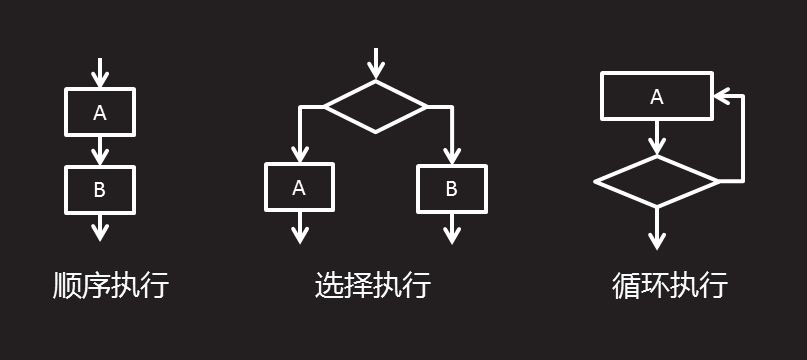

- 顺序结构

  按照顺序一条一条执行，从上至下，逐行执行

- 分支结构

  执行的时候，可以根据条件进行选择，条件越多对应的结果越多，分支也就越多 。

  其中，包括 if...else if...else...语句,switch语句 

- 循环结构

   重复的做一件事情，如果不给条件，就会无限执行， 可以限制重复的次数 。

  其中，包括 for循环，for...in循环，while循环，do while循环等； 

### 三、分支结构

#### 3.1 if语句

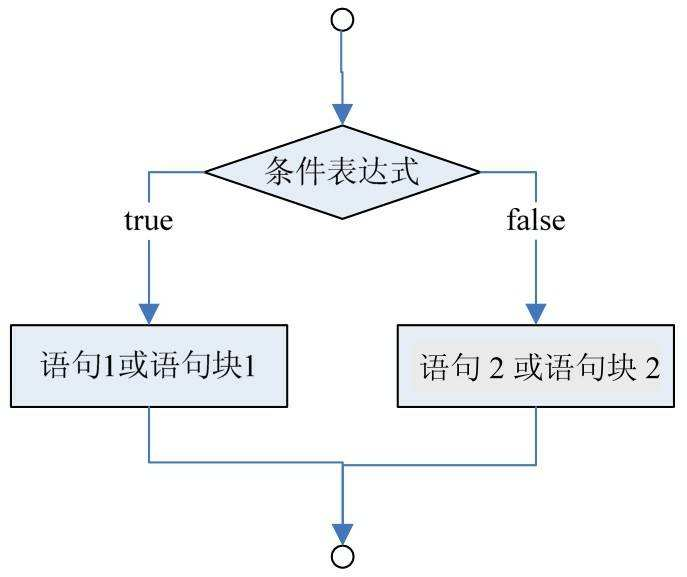

- 书写格式：`if (判断式){代码块}`

- **if 语句** - 只有当指定条件为 true 时，使用该语句来执行代码

- if (*condition*){

  ​	当条件为 true 时执行的代码
  }

  - 条件为true的写法：if(1){} 、if(true){} 、if(判断的条件 == true){}、if(function(){}){}

  - 如果条件为true的话，可以省去与true的比较，直接写

  - ==只要不是null、0、false、undefined、""等都可以认为是true满足的条件==
  - **当{}中只有一句话时候，可以省略{}，写成一行**

- 请使用小写的if，使用大写字母（IF）会生成 JavaScript 错误！

​       需要判断的条件可以是单条件，也可以是多条件（比较运算符、逻辑运算符）

案例：如果你有房，我就嫁给你，反之不需要考虑了

~~~js
<script>
        var tag = true; //利用一个布尔值来做添加的假设  有房
		if(tag==true){
            	console.log('我就嫁给你');
        }
		//或者
		if(tag){
            	console.log('我就嫁给你')
        }
</script>
~~~

#### 3.2 if...else语句

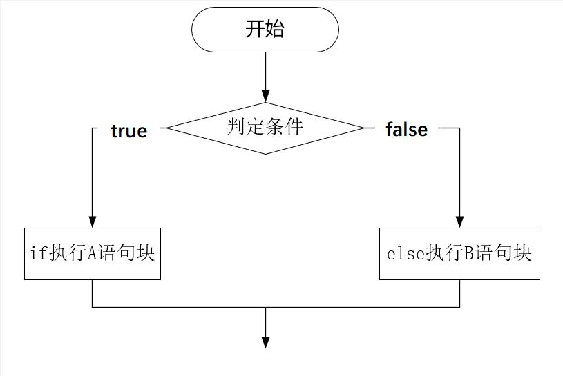

+ 条件满足：比较运算符（true）、1、变量==true、function(){}、true、逻辑运算符

+ 书写格式：`if（判断式）{代码块1}else{代码块2}`

+ 如果判断式为真，则执行语句A，否则将执行语句B

+ if (*condition*){

  ​	*当条件为 true 时执行的代码*
  }
  else{

  ​	*当条件不为 true 时执行的代码*
  }

案例：在弹框中输入您的年龄，如果年龄大于18，弹出你成年了，否则再等几年

~~~js
<script>
        var age = prompt('请输入你的年龄');
        if (age != null) {
            // 确定按钮
            if (age > 18) {
                alert('恭喜你，成年了');
            } else {
                alert('在等' + (18 - age) + '年')
            }
        } else {
            // 取消按钮
            alert('哥们，点错了吧~')
        }
</script>
~~~

#### 3.3 if...else if...else语句

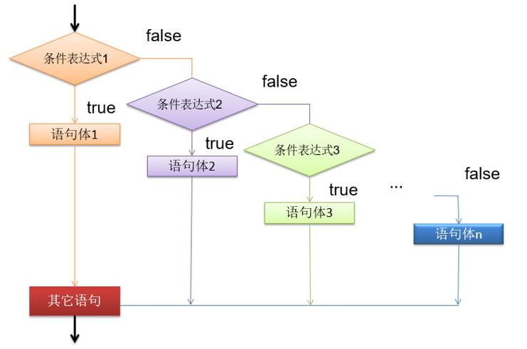

> 注 ：一定会有一个条件满足！！！一定会有一个结果输出的

案例1：小明快到期末考试了，小明爸爸对他说，会根据他不同的考试成绩送他不同的礼物

如果满分就奖励去西藏旅游；

如果在90分以上就奖励自行车一辆

如果在80分以上就奖励打扫卫生一次

否则就是四大名著的背诵

~~~js
<script>
              var score = parseInt(prompt('请输入你的成绩:'))
			  if(score>=0 && score<=100){
                  	if (score==100) {
                  		alert('可以去西藏旅游喽！！！！');
                  } else if (score>=90 && score<100) {
                      	alert('奖励自行车一辆');
                  } else if (score>=80 && score<90) {
                      	alert('奖励打扫卫生一次');
                  } 
               else {
                      	alert('四大名著的背诵');
                  } 
              }
              
</script>
~~~

案例2：弹框输入用户名和密码，根据不用身份，判断不用权限

超级管理员：admin、123456

普通管理员：张三、zhangsan；李四、lisi；

~~~js
<script>
        var userName = prompt("请输入用户名");
        var userPass = prompt("请输入密码");
        if(userName!=null && userPass!=null){
             if(userName=='admin' && userPass=='123456'){
                 alert('欢迎超级管理员登录')
             }else if((userName=='张三' && userPass=='zhangsan') || (userName=='李四' && userPass=='lisi')){
                 alert('欢迎普通管理员登录')
             }else{
                 alert('你从哪来的回哪去')
             }
        }else{
            alert('说，你是不是手哆嗦~~~')
        }
</script>
~~~

#### 3.4 switch case语句

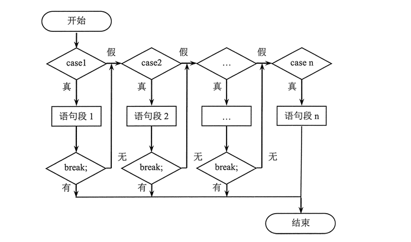

~~~js
switch(变量){
	case value1:
		console.log('执行的代码1');
	break;
	case value2:
		console.log('执行的代码2');
	break;
	case value3:
		console.log('执行的代码3');
	break;
	...
	default:
		console.log('执行的代码n');
}
~~~

注：

* case 后面用 ==**：**==，case结束后要添加break；

- 多用于case的值有几种可能的时候使用
- value是与括号里的内容作比较的且是等于的比较。
- 一旦满足case的值，就会执行后续的代码。
- default，以上条件都不满足时候，执行这里对应代码，可以放在任何位置。
- 使用 **break **是来阻止代码自动地向下一个 case 运行

**问题：**switch中的break语句是必须要添加的吗？不添加会报错吗？

> 不添加不会报错，但是一般开发的时候都会添加这句话
>
> 添加的目的是为了防止当条件满足之后，程序仍然继续向下运行（防止穿透）


练习：在输入框中输入订餐编号，

如果输入1，则弹出麻辣烫；

如果输入2，则弹出啤酒，

如果输入3，则弹出炸鸡，

如果输入4，则弹出火锅，

如果输入5，则弹出辣条，

否则弹出没有我喜欢的，趁早关门吧

~~~js
<script>
              var operation = prompt('请输入你的订餐编号:')
              switch(operation){
                  case '1':
                      console.log('麻辣烫');
                      break;
                  case '2':
                      console.log('啤酒');
                      break;
                  case '3':
                      console.log('炸鸡');
                      break;
                  case '4':
                      console.log('火锅')
                      break;
                  case '5':
                      console.console.log('辣条');
                      break;
                  default:
                      console.log('没有我喜欢的，趁早关门吧');
                      break;
              }
</script>
~~~


案例2：输入1-12，代表当前月份

其中3-5是春季；6-8是夏季；9-11是秋季；12-2是冬季

春季：春天到了，这是一个万物复苏的季节

夏季：夏天热情似火，太古里的小姐姐都很好看

秋季：树上的叶子开始泛黄，路边都是文艺小青年

冬季：冬天里寒风凛凛，小姐姐的好身材都看不到了

输入错误：亲，你在不在地球上么？

~~~js
<script>
              var month = prompt('亲,请输入当前月份哦')
              switch(month){
                  case 3:
                  case 4:
                  case 5:
                      console.log('春天到了，这是一个万物复苏的季节');
                      break;
                  case 6:
                  case 7:
                  case 8
                      console.log('夏天热情似火，太古里的小姐姐都很好看');
                      break;
                  case 9:
                  case 10:
                  case 11:
                      console.log('树上的叶子开始泛黄，路边都是文艺小青年');
                      break;
                  case 12:
                  case 1:
                  case 2:
                      console.log('冬天里寒风凛凛，小姐姐的好身材都看不到了')
                      break;
                  default:
                      console.log('亲，你在不在地球上么？');
                      break;
              }
</script>
~~~

==注：当case的值满足同一个结果时，可以简写==

##### 3.4.1 if 和switch 的区别

> if和switch中最大的不同点：
>     - if可以多个条件的判断（比较运算符、逻辑运算符）
>     - switch更偏向于某一个变量的固定出现的几个结果值的选择(优选)
>       -- 因为结构使用起来比if条件要清晰
>       -- 执行效率要高于if嵌套

##### 3.4.2 js中if和switch该如何选择？

if 和 switch 都可以设计多重分支结构，一般情况下 switch 执行效率要高于 if 语句。

但是也不能一概而论，应根据具体问题具体分析。简单比较如表所示。


相对而言，下面情况更事宜选用 switch 语句。

- 枚举表达式的值。这种枚举是可以期望的、平行的逻辑关系。
- 表达式的值具有离散性，是不具有线性的非连续的区间值。
- 表达式的值是固定的，不会动态变化。
- 表达式的值是有限的，不是无限的，一般应该比较少。
- 表达式的值一般为整数、字符串等简单的值。

下面情况更事宜用 if 语句。

- 具有复杂的逻辑关系。
- 表达式的值具有线性特征，去对连续的区间值进行判断。
- 表达式的值是动态的。
- 测试任意类型的数据。

### 四、循环结构

主要做一些重复性的功能；

利用某一个**条件**，周而复始的执行某一种**功能**，当到达设置的条件上限后**停止**循环

**==循环三要素==**：从哪开始循环；循环到哪；怎么循环；


#### 4.1  for循环

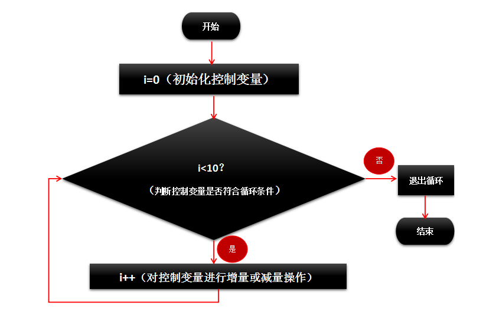

##### 4.1.1 使用场景：

- 常应用于带有预期类长度的循环；
  - 数字区间的循环
  - 字符串的循环
  - 数组的循环(length)


~~~js
for(var 循环变量 = 初始值 ; 循环上限 ; 循环变量的变化量){
    //必须要满足于循环上限，才可以进入到{}里面  循环体
	要执行的代码块
}

if(){
  //判断体   
}
~~~

##### 4.1.2 执行顺序

执行顺序：初始值 ==> 循环上限 ==> 要执行的代码 ==> 循环变量的变化量

- 其中循环的变化量，要么是自增，要么是自减
- 循环上限中只能 出现（>、<、>=、<=）这四种运算符

案例1：打印1到100的数字

~~~js
<script>
	for(var i = 1;i<=100;i++) {
		console.log(i);
	}
</script>
~~~

案例2：打印1到100的偶数

~~~js
<script>
	for(var i = 1;i<=100;i++) {
		if(i%2==0){
			console.log(i);
		}
	}
</script>
~~~

案例3：打印1到100的偶数和，==循环累加时，新声明一个变量==；

~~~js
<script>
	var sum = 0;
	for(var i = 1;i<=100;i++) {
		if(i%2==0){
			sum+=i;
		}
	}
	console.log(sum);
</script>
~~~

##### 4.1.3 双层for循环

* ==外层循环的上限是执行的次数==；(例如：1-3)
* ==内层循环是实际输出的内容==；(例如；10-15)

解释：10-15这几个数字(内容)，循环三遍(次数)


案例4：九九乘法表

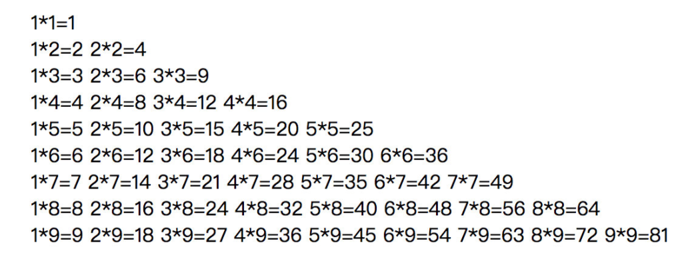

~~~js
<script>
              var str = "";
              for (var i = 1; i < 10; i++) {
                  for (var j = 1; j <= i; j++) {
                      str += j + "*" + i + "=" + j*i+" ";
                  }
                 document.write("<br/>");
              }
              document.write(str);
</script>
~~~

#### 4.2  for in循环

##### 4.2.1 使用方法

for in循环更适合于循环==对象==（object对象、数组对象）

~~~js
键名：键值（键名键值一一对应）==> key:value;
var obj = {a:1,b:2}
for(var key in 对象){
	console.log(key); //对象的键名（属性名）  a  b
	console.log(对象[key]); //对象的键值（属性值）1 2
    //console.log(对象."a"); //错误的语法
}
~~~

解释：

- for循环里的key是自己取的变量，随便起，但是一般都使用key

- 在for in 循环里求键值，只能用[] ,不能用.    ；[key]里的key 可以加引号，也可以不加，默认会转成字符串

- 当对象的键名为一个明显的字符串的时候，就需要使用[]，

- 当键名有特殊字符时，必须使用[]，==用[]保险==


##### 4.2.2 for 和 for in循环的选择

> 当循环时，既有可能是数组，也有可能是对象时，则使用for in；
>
> 单纯循环数组的话，则更多的使用for循环，
>
> 对象只能使用for in 循环，因为对象是没有length属性的，对象时无序集合；


#### 4.3  while循环

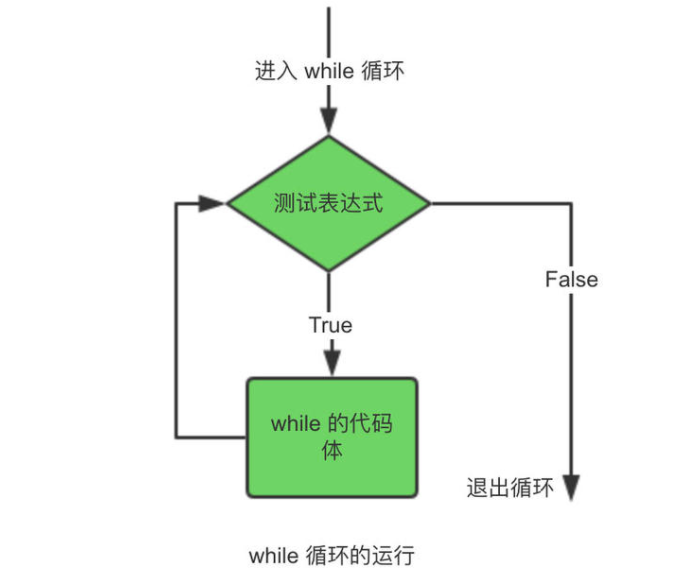

while 循环会一直循环代码块，只要指定的条件为 true。

```js
while (条件) {
				要执行的代码块
			}
```

> 注：
>
> - 先定义变量初始值
> - 在写循环上限(只要是满足条件则可以进入到 while循环里面)
> - 更新i变量，写一个表达式（一般压轴写）


案例练习：打印1到100的所有数字

~~~js
var i = 1;
while(i <= 100){
	console.log(i);
	i++;
}
~~~


#### 4.4  do while循环

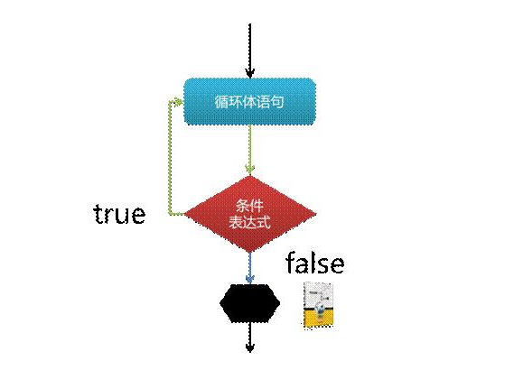

语法结构：do{

​		要执行的代码块

}while(循环条件)

~~~js
<script>
            do{
                console.log('你好'); //先执行一次do里的代码，然后再判断条件
            }while(1 > 2);
</script>
~~~

> - 在循环外面定义变量的起始值
> - 先写要执行的代码
> - 再写循环条件

区别：while循环和do while循环当循环上限不满足的时候:**则while不执行；do while至少执行一次**


### 五、break和continue关键字

#### 5.1 break

break：当满足

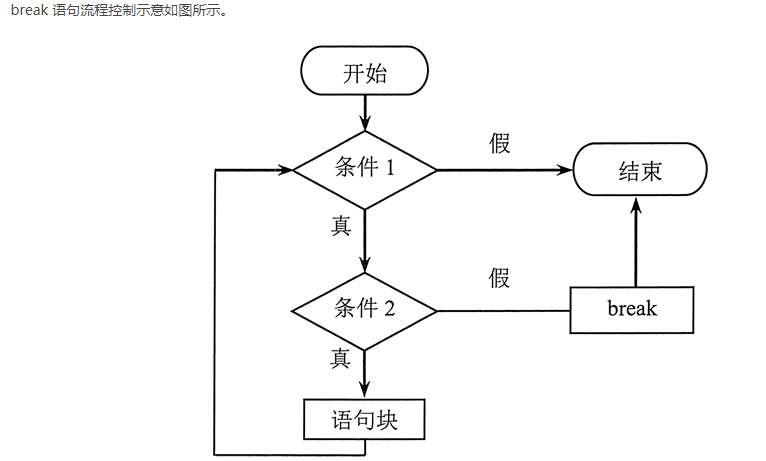

break语句能够结束当前for、for/in、while、do/while或者switch语句的执行。

* 同时break可以接受一个可选的标识名，来决定跳出的结构语句。
  * `标识名：`
* 如果没有设置标签名，则跳出当前最内层结构。

> 制作用户登录验证时：
>
> 利用假设的思路(建立变量（tag or flag）都为布尔值)，进入循环；
>
> 遍历所有数据，与用户输入数据一一比较；
>
> 如果验证成功 ==> 修改假设条件 ==> 添加break,优化性能 ==> 登录失败的结果要写在for循环之外；
>
> ```js
> 		var flag = true;//假设全部登录成功，进入循环
> 		
> 		for (var i = 0; i < arr.length; i++) {
> 		    // 判断登录是否成功
> 		    if (userName == arr[i].uname && userPass == arr[i].upass){
> 		        alert('登录成功');
> 				off = false;
> 				break;
> 		    }
> 		};
> 		
> 		//如果输入数据不在数据库里，则登录失败
> 		if (flag) {
> 		    alert('登录失败')
> 		}
> 		
> ```
>
> 
>
> 注：如果假设为false，写法不同：
>
> 验证成功==> 修改假设条件 ==> 添加break,优化性能  ==> 判断登录是否成功
>
> ```js
>         var tag = false;
>         for (var i = 0; i < arr.length; i++) {
>             if (userName == arr[i].uname && userPass == arr[i].upass) {
>                    //修改假设条件
>                    tag = true;
>                    break;
>             }
>         }
> 
>         if(tag){
>             alert('登录成功');
>         }else{
>             alert('登录失败');
>         }
> ```
>
> 


练习1：for循环遍历范围是1到10，遍历的时候只想打印到3.

~~~js
<script>
            for ( var i=0 ; i<5 ; i++ ) {
                if ( i == 3 ) {
                    break;
                }
                console.log(i);
            }
</script>
~~~

思考：break只能跳出最内层的循环，那么如果有多层的循环，怎么跳出指定哪层或者最外层的for循环？

添加一个 `标识名:`

练习2：两层for循环嵌套，每一个都打印0到9，最终打印5，5。

~~~js
<script>
    outermost://标识名，写什么都可以；但是必须要加 ：
    for(var i=0; i<10;i++){
        for(var j=0; j<10; j++){
            if(i==5 && j==5){
            	break outermost;
            }
        }
    }
    console.log(i,j);
</script>
~~~

#### 5.2 continue


continue语句用在循环结构内，==跳出本次循环==中剩余的代码，并在表达式的值为真的时候，继续执行下一次循环。

可以接受一个可选的标签名，来决定跳出的循环语句

练习1：遍历0到4的过程中，如果遇到3则跳过。

~~~js
 <script>
            for ( var i=0 ; i<5 ; i++ ) {
                if ( i == 3 ) {
                    continue;
                }
                console.log(i);
            }
</script>
~~~

练习2：两层for循环嵌套，每一个都打印0到9，当遇到5，5之后不终止当前循环执行下一次循环。

~~~js
<script>
            outermost:
            for(var i=0; i<10;i++){
                for(var j=0; j<10; j++){
                    if(i==5 && j==5){
                        continue outermost;
                    }
                    console.log(i,j);
                }
            }
</script>
~~~

综合练习题：(用continue，就是反向排除)

- 求整数1～100的累加值，但要求碰到个位为3的数则停止累加  //3

- 求整数1～100的累加值，但要求跳过所有个位为3的数  //4570

- 求1-100之间不能被7整除的整数的和（用continue，即排除能被7整除的）//4315

- 求200-300之间所有的奇数的和（用continue）

- 求200-300之间第一个能被7整数的数（break）

- 收银程序

  输入单价和数量，计算总价。如果总价大于500 则打八折。然后用户输入付钱，最终弹出找零。


```html
<script>
            //输入商品的单价和数量
            var price = prompt("请输入单价");
            var count = prompt("请输入数量");

            //计算总价
            var sumPrice = price * count;

            //判断是否打折
            if (sumPrice >= 500){
                sumPrice *= 0.8;
            }

            //给用户说需要付多少钱
            var money = prompt("您本次消费"+sumPrice+"元，请付款(输入付钱的面额即可，稍等给您找零)");

            // 判断用户缴费是否足够，并找零
            if (money > sumPrice) {
                // 计算找零
                var reduceMoney = money - sumPrice;
                alert("找零" + reduceMoney + "元，请收好")
            }else{
                alert("钱不够！！！！")
                //此时可以重新递归调用，代码省略
            }

            alert("欢迎下次光临");
</script>
```

- ATM取钱

  输入相应数字，执行相应功能

  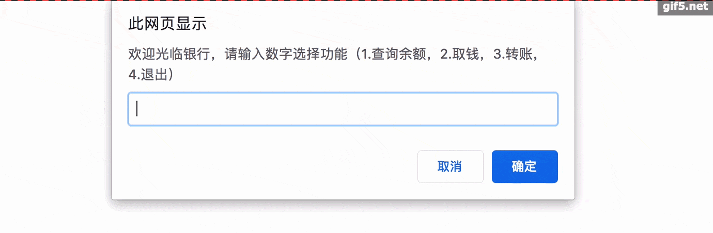

  ```html
  <script>
              var userPress = prompt("欢迎光临银行，请输入数字选择功能（1.查询余额，2.取钱，3.转账，4.退出）");
          switch (parseInt(userPress)) {
              case 1:
                  search();
                  break;
              case 2:
                  drag();
                  break;
              case 3:
                  change();
                  break;
              case 4:
                  exit();
                  break;
              default:
                  alert("你丫看不懂提示么");
          }
  
          function search() {
              alert("正在查询余额...");
          }
          function drag(){
              alert("正在取钱啊...");
          }
          function change() {
              alert("正在转账...")
          }
          function exit() {
              alert("正在退出,告辞!")
          }
  </script>
  ```

- 买保险

  公司给员工买保险（用户通过此程序查询自己是否符合条件）：

  1.只要结婚的都买;

  2.没有结婚的男人 25岁以下不买;

  3.没有结婚的姑娘 22岁以下不买.

  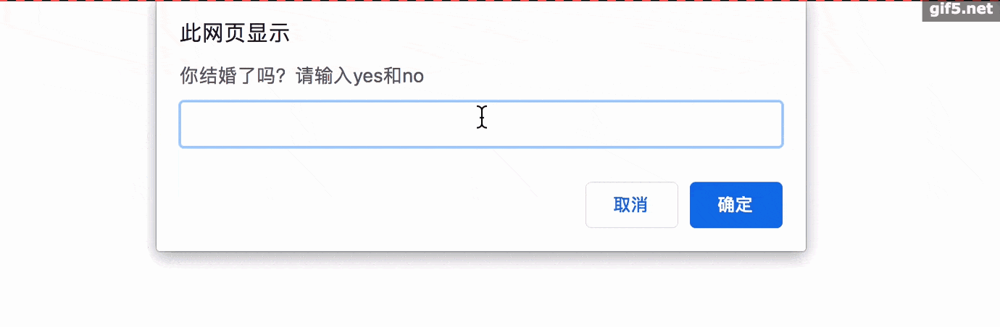

  ```html
  <script>
          /*
          * 公司给员工买保险（用户通过此程序查询自己是否符合条件）：
          * 只要结婚的都买
          * 没有结婚的男人 25岁以下不买
          * 没有结婚的姑娘 22岁以下不买
          */
          //输入是否结婚
          var isMarry = prompt("你结婚了吗？请输入yes和no");
          var age = prompt("您今年高寿啊");
          var sex = prompt("您性别是什么(man or woman)");
          if (isMarry === "yes"){
              alert("您放心做吧，公司给您提供免费的保险");
          }else if ((sex === "man" && age < 25) || (sex === "woman" && age < 22)){
              alert("自己回家买去吧");
          }else{
              alert("公司也给您买");
          }
  </script>
  ```

### 六、死循环

死循环:在循环中,没有结束条件的循环是死循环,程序中要避免的,否则会造成内存溢出

+ 第一种:while(true);
+ 第二种:for(;true;);
+ 第三种;for(;;);

### 七、知识点扩展干货

#### 7.1 js中if和switch该如何选择?

if 和 switch 都可以设计多重分支结构，一般情况下 switch 执行效率要高于 if 语句。

但是也不能一概而论，应根据具体问题具体分析


相对而言，下面情况更事宜选用 switch 语句。

- 枚举表达式的值。这种枚举是可以期望的、平行的逻辑关系。
- 表达式的值具有离散性，是不具有线性的非连续的区间值。
- 表达式的值是固定的，不会动态变化。
- 表达式的值是有限的，不是无限的，一般应该比较少。
- 表达式的值一般为整数、字符串等简单的值。

下面情况更事宜用 if 语句。

- 具有复杂的逻辑关系。
- 表达式的值具有线性特征，去对连续的区间值进行判断。
- 表达式的值是动态的。
- 测试任意类型的数据。

**案例1**：根据学生分数进行等级评定

如果分数小于 60，则不及格；

如果分数在 60 与 75 之间，则评定为合格；

如果分数在75 与 85 之间，则评定为良好；

如果分数在 85 与 100 之间，则评定为优秀。

根据上述需求描述，确定检测的分数是一个区间值，因此选用 if 语句会更合适。

~~~js
<script>
            if (score < 60) {
                console.log("不及格");
            }else if (score < 75) {
                console.log("合格");
            }else if (score <85) {
                console.log("良好");
            }else {
                console.log("优秀");
            }
</script>
~~~

如果使用 switch 结构，则需要枚举 100 种可能，如果分数值还包括小数，这种情况就更佳复杂了；

此时使用 switch 结构就不是明智之举。

**案例2** ：设计根据性别进行分类管理。这和案例属于有效枚举条件，使用 switch 会更高效。

~~~js
<script>
           switch (sex) {  //固定的几种值的判断
                case 1 :
                    console.log("女士");
                    break;
                case 2 :
                    console.log("男士");
                    break;
                default :
                    console.log("其他");
            }
</script>
~~~

#### 7.2 js中for和while如何选择?

for 和 while 语句都可以完成特定动作的重复性操作，不过，使用时不可随意替换。

- for 语句是以变量的变化来控制循环进程的，整个循环流程是计划好的；

  可以==事先知道循环的次数==、==每次循环的状态==等信息。

- while 语句是根据特定条件来决定循环进程的，这个条件时动态的，无法预知的，存在不确定性；

  每一次循环时都不知道下一次循环的状态如何，只能通过条件的动态变化来确定。

因此，for 语句常用于有规律的重复操作中，如数组、对象等迭代。

while 语句更适用于特定条件的重复操作，以及依据特定事件控制的循环操作

一般来说，在循环结构中动态改变循环变量的值时，建议使用 while 结构；

而对于静态的循环变量，则可以考虑使用 for 结构。

简单比较 while 和 for 语句，区别如表所示。

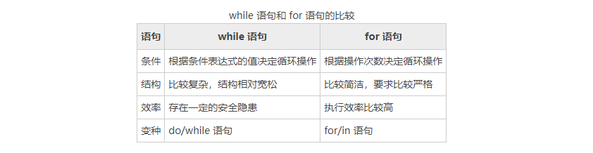

==总结==：当循环次数确定时，使用for和while的差别不大，但是当循环次数不确定时，while就比for有优势了。

案例：循环猜数游戏

固定猜谜次数

~~~js
var i = 1;
while(i<=5){
	var num = prompt("请输入谜底");
	if(num<50){
		alert('猜小了');
	}else if(num>50){
		alert('猜大了');
	}else{
		alert('猜对了')
	}
	i++;
}
~~~

不固定猜谜次数

~~~js
while(true){
            var num = prompt("请输入谜底");
            if(num<50){
                alert('猜小了');
            }else if(num>50){
                alert('猜大了');
            }else{
                alert('猜对了');
                break;
            }
}
~~~


