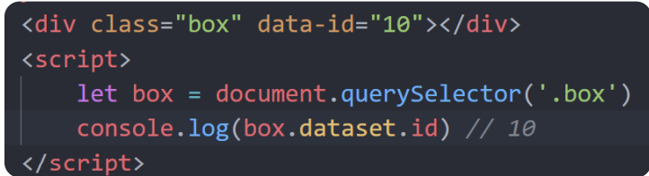
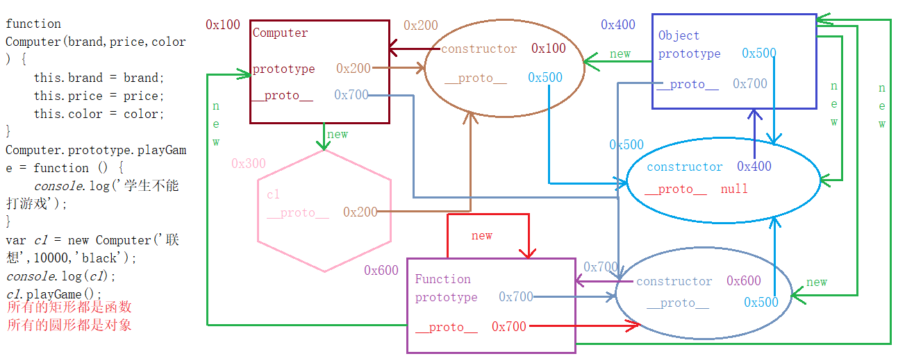
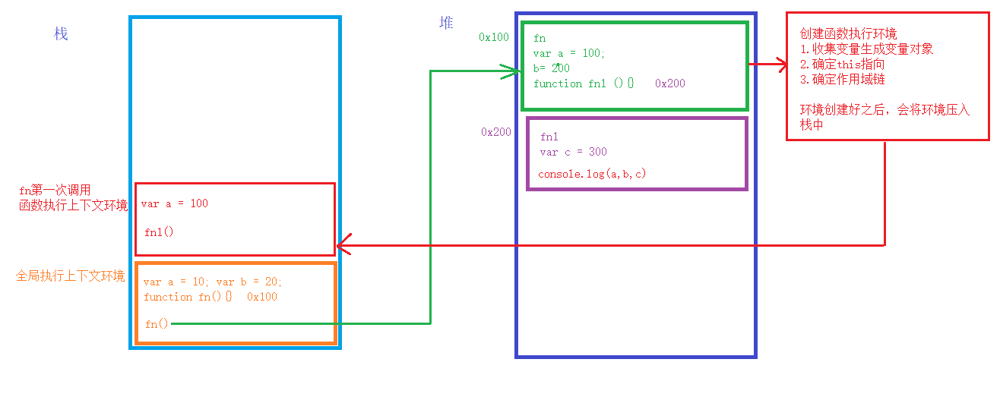

## DOM

DOM:文档对象模型(document object model)

DOM描述了处理网页内容的方法和接口，接口可以理解为就是函数（函数  方法  API  接口  本质上都是一个函数）

window是浏览器窗口对象，所有东西都被当做是window的子对象；

文档对象document是window下的一个属性，代表整个DOM文档对象

根元素(root)	html标签

文档树(dom树)：以HTML为根节点，形成的一颗倒立的树状结构，我们称作DOM树；这个树上所有的东西都叫节点，节点有很多类

元素节点 -->  标签

属性节点  -->  属性

文本节点  -->  内容

注释节点  -->  注释

这些==节点==如果我们通过==DOM方法==去获取或者其他的操作去使用的话，就叫==DOM对象==；

获取到的页面元素  在js当中都是以==对象==进行表示的

### 1、window.onload

事件的三大要素：

- 事件源 ：事件的承受方

- 事件类型：用户在事件源身上触发的行为

- 事件回调函数：事件源承受事件之后，给予的反馈
  - 回调函数：你定义的；你没调用；最终执行了

一般情况我们都是等待页面加载完成之后才去操作dom元素

如果页面没有加戢完成就去获取dom元素，有可能获取不到；

`window.onload = function(){}`	等到所有的外部资源都加载完成，且需要渲染完成之后才会执行；比如html css js图片等等，所以如果不添加这个方法，当js修改的属性css也有时，css就不会执行；系统会自动执行函数当中的代码

> 为了避免js提前去操作了还没有加载完成的页面元素导致报错,所以一般我们会将操作页面元素的逻辑写在onLoad事件回调函数中


### 2、操作元素的方式

#### 2.1 操作元素的固有属性

获取到的页面元素，在js当中都是以对象进行表示的

通常情况下,都是直接使用**点语法**或者**中括号**进行访问的

当我们想要使用一个变量的值当做属性名称来访问的时候，就必须使用中括号，这叫做动态特征

```html

<button id="btn">按钮</button>
```

```js
    <script>
        window.onload = function () {
            var btn = document.querySelector('.btn');
            var imgNode = document.querySelector('.imgNode');
            btn.onclick = function () {
                imgNode.src = './../img/2.jpg'
            }
        }
    </script>
```

#### 2.2 操作元素的特殊情况

- 操作元素的class属性的时候，需要使用`className`进行操作(class是关键字)
- 当我们使用js操作**属性名称与属性值相同**的属性时，比如 `checked  disabled  selected`  我们需要转换成布尔值进行操作,如果设置的不是布尔值  则会隐式类型转成布尔值
  - 设置为true，则为设置了该属性；设置为false，则为取消该属性


注：反选的逻辑：==就是设置成 当前相反的状态  即为反选==

**一个按钮，切换两种状态；**

> ==**先假设为真；进入判断，改变属性，并修改假设为假；否则属性不变，属性为真；**==

```html
<body>
    <form>
        请输入密码：<input type="password" class="pwd">
        <span class="iconfont icon-xiaoyanjing"></span>
    </form>
    <script>
        var pwd = document.querySelector('.pwd');
        var icon = document.querySelector('.icon-xiaoyanjing');
        //假设为真；
        var flag = true;
        icon.onclick = function () {
           if (flag){
               //改变属性，并修改假设为假
               pwd.type = 'text';
               flag = false;
           }else {
               pwd.type = 'password';
               flag = true;
           }
        }
    </script>
</body>
```


#### 2.3 操作元素的自定义属性

其实元素身上，我们是可以随意设置属性的，只要满足`属性名称 = ‘属性值’  `的语法就行

`getAttribute()` 和 `setAttribute()`  这两个==方法==就是用来操作自定义属性的

##### 2.3.1 getAttribute()

getAttribute 读取自定义属性，可传递一个参数，

参数类型：==字符串==；内容为：要读取的属性名称

返回值 就是我们需要的属性值  ==但是从标签上读取出来的内容 都是字符串==

```js
box.getAttribute('aa');//读取box身上的aa属性
```


##### 2.3.2 setAttribute()

setAttribute  设置自定义属性，可传递两个参数  

参数1：要设置的属性名称；参数2：要设置的属性值

```js
box.setAttribute('aa', '哈哈哈')//设置box身上的aa属性的值为'哈哈哈'

inputNode.setAttribute('type','checkbox')//也可以设置固有属性；
```


##### 2.3.3 data-

在html5中推出来了专门的data-自定义属性 在 标签上一律以==data-==开头

在DOM对象上一律以dataset对象方式获取




#### 2.4 操作元素的文本

`innerHTML` 和 `innerText`

区别：

- 读取元素
  - innerHTML  在读取元素文本的时候  会将其内部的标签 一并读取出来
  - innerText  在读取元素文本的时候 会忽略标签  只读取纯文本
- 设置属性
  - 当设置innerHTML属性的时候  标签会正常渲染到浏览器
    - 所以innerHTML  也是向页面当中  新增元素的方式之一
  - 设置innerText属性的时候 如果设置的内容带有标签  则标签依旧会被当做文本 渲染进页面

如果操作的内容为纯文本 则innerHTML和innerText 无论是读取还是设置  都是没有任何区别的


#### 2.5 通过类名修改css

```js
元素.className = '新类名'  //新类名不需要加.
```

注：

* 因为class是关键字，所以用className代替
* 这是一个属性，通过等号赋值；
* className是使用新值**==换==**旧值，如果需要添加一个类，需要保留之前的类名

#### 2.6 通过classList操作类修改css

解决了className容易覆盖以前的类名的问题，不影响之前添加的类；

* **追加**一个类

```js
元素.classList.add('类名') //不会影响之前添加的类，不加.
```

* 删除一个类

```js
元素.classList.remove('类名')
```

* 切换一个类

```js
元素.classList.toggle('类名')
```

注：toggle，如果有这个类，则删除这个类，如果没有这个类，则添加这个类；


### 3、获取元素的方式

当我们使用==document== 调用查询方法时  相当于==全局搜索==;

其实==任意一个dom对象== 都可以调用所有的查询方法  相当于在该dom对象内部 进行==局部查询==

#### 3.1 通过id获取元素

```js
document.getElementById('id名')
```

参数类型字符串  

内容就是id名称 ==**不需要带#**==   

返回的结果为dom对象

#### 3.2 通过类名获取元素集合

```js
document.getElementsByClassName('类名')
```

返回的结果是伪数组，内部存的是匹配的dom对象集合  

> 注：
>
> - 不论查询结果是几个元素 都是返回伪数组
>
> - 我们所学的所有dom的属性及方法  都是dom对象的  是不能直接通过集合来操作的
>   - 我们操作集合 就是两种方式  1：索引访问某一个  2：遍历访问每一个

#### 3.3 通过标签名称获取元素集合

```js
document.getElementsByTagName('标签名称')
```

参数就是标签名称 不需要带符号

#### 3.4 选择匹配的第一个元素

```js
document.querySelector('css选择器')
```

获取单个元素  返回的结果直接为dom对象  

如果有多个元素满足查询条件是 只返回第一个 后续的不管

#### 3.5 选择匹配的所有的元素

```js
document.querySelectorAll('css选择器')
```

返回结果伪数组对象，即使只有一个元素，也是返回的伪数组

### 4、事件

#### this指向

> 1. 一般函数调用  this指向window
> 2. 构造函数调用  this指向 当前实例化对象
> 3. 对象.方法名调用  方法内部的this指向当前调用方法的对象本身
> 4. 事件回调函数当中  this指向当前==事件源==（绑定事件的那个元素）

#### 4.1 鼠标移入和移出

```js
//移入
box.onmouseover = function (){} 
box.onmouseenter = function (){}   有子元素时没有冒泡效果(推荐) 

//移出
box.onmouseout = function (){}
box.onmouseleave = function () {}	有子元素时没有冒泡效果(推荐) 
```

> 在触发的逻辑上  这两组事件都是移入和移出的事件监听  没有区别
> 区别在于  当事件源内部存在子元素的时候
> onmouseover：当鼠标移入子元素的时候，会先触发事件源本身的离开事件（onmouseout）
>       					   然后在触发子元素的移入   子元素会将这个移入事件  冒泡给事件源  触发事件源的移入事件（onmouseover）
> onmouseout：当鼠标从子元素移出到事件源的时候  会先触发子元素的离开 然后将这个离开事件冒泡给事件源
>                 		   然后在触发事件源的移出事件
> onmouseenter 和 onmouseleave  当事件目标切换的时候  不会冒泡  也就相当于  不会再其内部的子元素身上触发事件

css当中 hover 本质是选择器 当鼠标悬浮于元素的时候 会被这个伪类选中 然后让对应的样式生效

而在js当中  用户将鼠标移入到事件源当中  执行一个函数  离开的时候 也可以执行一个函数；其实就是对元素做了修改  状态自然也可以保留

##### 4.1.1 其余鼠标事件

> click						单击
> dblclick				  双击
> contextmenu		右击
> mousedown		鼠标按键按下
> mouseup			鼠标按键抬起
> mousemove		鼠标移动
> mouseenter		鼠标进入元素	用来代替 mouseover
> mouseleave		鼠标离开元素  用来代替 mouseout


#### 4.2 键盘事件

`onkeydown`  键盘按下 

`onkeyup` 键盘抬起

在实际开发当中  相对而言键盘抬起用的多一些   因为为了防止用户的多余操作  会重复触发相同的逻辑增加服务器的负担

所以对于我们来说  键盘按下事件  应用在可持续触发的逻辑上   键盘抬起事件应用在  不需要持续触发的逻辑上

那么我们如何来判断用户的按键呢？   需要通过 **事件对象**
事件对象上存储的是  当次事件触发时  所有和这次事件相关的信息
事件对象在高级浏览器当中  会作为事件回调函数的第一个形参  给我们使用
通常我们使用的名字有  event ev e
键盘上每一个按键 都会有一个对应的键码（`keyCode`）

```js
inputNode.onkeyup = function (event) {
    //  当用户按下会出之后   提示搜索成功
    if (event.keyCode == 13) {
        alert('搜索成功');
        //  清空输入框,此处我们真正要清空的是输入框中的内容,也就是value
        this.value = '';
    }
    console.log(event.keyCode);
}
```

通常我们操作键盘事件的逻辑
1.先区分是否为持续触发的功能   选择对应的事件
2.在事件回调函数当中   先通过事件对象上的 keyCode属性 判断具体按键
3.然后处理对应按键的逻辑


### 5、节点

> 为什么要获取节点？为什么不直接用标签呢获取元素呢？

==因为有时候我们不知道我们要获取的元素是什么，无法设置标签名；只能通过节点获取元素；==

常用的节点有：元素节点、属性节点、文本节点、注释节点

|          | nodeType |   nodeName   | nodeValue |
| :------: | :------: | :----------: | :-------: |
| 元素节点 |    1     | 全大写标签名 |   null    |
| 文本节点 |    3     |    \#text    | 文本内容  |
| 注释节点 |    8     |  \#comment   | 注释内容  |

#### 5.1 获取子节点

```js
元素.childNodes
```

获取子节点：该属性获取的是 子节点的集合,不区分类型包含元素节点、文本节点、注释节点

```js
元素.children
//例如：
 console.log(box.children);
```


#### 5.2 获取节点的其余方法：

```js
//  获取第一个子节点
    console.log(box.firstChild);
//  获取第一个子元素节点
    console.log(box.firstElementChild);
//  获取最后一个子节点
    console.log(box.lastChild);
//  获取最后一个子元素节点
    console.log(box.lastElementChild);
    
//  获取前一个兄弟节点
    console.log(test.previousSibling);
//  获取前一个兄弟元素节点
    console.log(test.previousElementSibling);
//  获取后一个兄弟节点
    console.log(test.nextSibling);
//  获取后一个兄弟元素节点
    console.log(test.nextElementSibling);
    
//  获取父节点
    console.log(box.parentNode);
//  获取父元素节点
    console.log(box.parentElement);
//  只有元素才会存在包含关系  所以说父节点和父元素节点   返回的都是父元素
```

所有查询节点的属性  都是不区分类型的  都是高级浏览器和低级浏览器通用

所有查询元素节点的属性  都是返回对应的元素，都是只能在高级浏览器生效


#### 5.3 创建节点

> dom当中  以下三个元素不用获取直接可以进行访问

| document.documentElement | html |
| :----------------------- | :--: |
| document.body            | body |
| document.head            | head |


##### 5.3.1 document.write

已经被淘汰的一种方式   会覆盖页面原有的内容;

将要创建的标签体结构  作为参数  传递给 write方法就可以了

```js
document.write('<h1>我是新增的内容</h1>');
```


##### 5.3.2 innerHTML

多用于==不可循环渲染==的逻辑;如果直接赋值,就是覆盖操作;

```js
document.body.innerHTML = '<h1>今天天气真不错</h1>'
```

**如果想要追加,那就使用+=;**

```js
document.body.innerHTML += '<h1>今天天气真不错</h1>'
```

##### 5.3.3 createElement

多用于可循环渲染的逻辑；真正意义上的创建元素节点  

可以接收一个参数  类型为==字符串== 内容为**标签名称** 

> 使用这种方式创建元素  需要**三个步骤**

```js
//1.创建节点   该方法会返回一个  和你传入的标签名称一样的元素（dom对象）
var hNode = document.createElement('h1');

//2.操作节点  我们所有学过的能够对dom对象进行的操作方式 都可以  比如  操作文本、样式、属性、绑定事件等
hNode.innerHTML = '我是创建出来的元素';

//3.追加节点   我们需要将创建出来 并且 操作完成的元素   添加到页面当中
document.body.appendChild(hNode);
```

##### 5.3.4 快速创建option元素

```js
new Option(文本内容，value值);
```

##### 5.3.5 快速创建 img 元素

```js
new Image();
```

> 注意： 只有 option 元素和 img 元素可以通过实例化的方式创建！


#### 5.4 追加节点

##### 5.4.1 appendChild

在父元素的内部结尾追加一个子元素；可传递一个参数：参数为要添加的dom对象

```js
父元素.appendChild(子元素)
```


##### 5.4.2 insertBefore

在某一个元素的前边添加一个兄弟节点；该方法由父元素调用 

可传递两个参数  参数1：新增的那个元素  参数2：参照物（已有的页面元素）

该方法的第二个参数  可以为空 但是不能不写

> 如果第二个参数 传参为null  则等同于appendChild,在父元素末尾插入；

```js
父元素.insertBefore(新增元素，参照物)
```


#### 5.5 替换节点

##### 5.5.1 replaceChild

该方法由父元素调用 ，

可以传递两个参数  参数1：要去替换的元素（新的）   参数2：要被替换的元素（旧的）

```js
父元素.replaceChild(新元素,旧元素)；
```

#### 5.6 删除节点

##### 5.6.1 removeChild

该方法由父元素调用  可传递一个参数  参数为  要删除的子元素

```js
父元素.removeChild(子元素);
```

##### 5.6.2 remove

**谁调用，就删除谁**；==低级浏览器不认识==

```js
元素.remove()
```

总结：

> 原生js文档增删改的方法 都是由**父元素调用**  
>
> 如果传递两个参数的话  参数1：都是新的元素 参数2：都是旧的元素


### 6、事件对象

#### 6.1 L0级事件对象

```js
元素.on+事件 = function(){}
```

优点：1、语法简单  2、没有兼容问题

弊端：1、同一事件类型 只能指定一个回调函数

​			2、并不是所有的事件都能够使用dom0级的方式去绑定

 dom0级事件的==本质==：其实就对dom对象上的事件属性进行赋值(赋的是事件回调**==函数的地址==**)

解绑：其实就是断开事件属性和事件回调函数的连接

```js
box.onclick = null;
```

#### 6.2 L2级事件对象

##### 6.2.1 高级浏览器

**dom2级事件的绑定**  `addEventListener`

可以接收三个参数  

参数1：事件类型（不带on），字符串类型； 

参数2：事件回调函数；传递的是地址值；

参数3：是否为捕获事件流  默认是false

同一个事件类型可以指定多个回调函数 ；在高级浏览器当中是由上至下依次执行的

dom2级事件可以绑定目前已知的所有事件类型   比如transitionend  DOMMouseScroll

```js
元素.addEventListener(事件类型，事件处理函数，是否使用捕获机制)
```


**dom2级事件的解绑** `removeEventListener`

解绑时传递的参数必须和绑定时一模一样 、完全一致才可以

如果需要**解绑**，则在绑定时事件回调函数必须定义成**具名函数**；

```js
元素.removeEventListener('click', fn)
```


##### 6.2.1 低级浏览器

**dom2级事件的绑定** `attachEvent` 

可以接收两个参数  

参数1：事件类型(带on)  

参数2：回调函数

低级浏览器当中同一类型依旧可以指定多个回调函数；但是触发的顺序和高级相反；由下至上

```js
元素.attachEvent('onclick',function () {}
```


**dom2级事件的解绑** `detachEvent` 

解绑的情况 和高级相同  依旧要和绑定时传递的参数一模一样

```js
元素.detachEvent('onclick', fn2);
```

##### 6.2.3 兼容性绑定dom2级事件

```js
function addEvent(node,eventName,callBack) {
//  判断浏览器
//  当你需要根据浏览器的高级与低级,分别去使用不同的方法的时候
//  通过这个方法 是否存在 来进行判断;只写访问而不写调用,因为写调用报错
    if(node.addEventListener){
    //  只要能够进入这个if当中 则说明当前浏览器的dom对象是存在addEventListener这个方法的 是高级浏览器
        node.addEventListener(eventName,callBack)
    }else{
        //不存在即是undefined，会隐转为false;
        node.attachEvent('on'+eventName,callBack)
    }
}
```

解释：if的判断，==只要不是null、0、false、undefined、""等都可以认为是true满足的条件==

当不存在这个属性时，就会返回undefined，


#### 6.3 事件对象

事件对象上边存储着事件被触发时当次的相关信息；比如**事件的坐标**、**用户按键的键码**

事件对象在高级浏览器当中，会作为**事件回调函数的第一个形参**，传递给我们使用;这个形参一般定义为e  event ev

但是在低级浏览器当中  会作为**window**上的一个叫做**event的属性** 供给我们使用，即`window.event`

#### 6.4 事件坐标：

- clientX / clientY
  - 获取光标相对于==浏览器可见窗口==左上角的位置
- offsetX/offsetY
  - 获取光标相对于==当前DOM元素==(盒子)左上角的位置
- pageX / pageY
  - 获取光标相对于==整个页面==窗口左上角的位置

> 注：
>
> 事件源(this)  是绑定事件的元素
>
> 事件目标  是在事件触发的时候 真真实实被我们操作的那个元素 ,你也可以理解成 真正触发事件的那个元素
>
>  this 一定是绑定事件的元素；而事件目标可能是绑定事件的元素，也可能是其内部的任意后代元素

#### 6.5 事件目标

被存储在事件对象上

**高级**浏览器当中我们可以通过`target`这个属性进行访问

**低级**浏览器当中我们需要通过`srcElement`这个属性进行访问

> 事件对象、事件目标的在高、低级浏览器兼容方法

```js
var box = document.getElementById('box');
box.onclick = function (event) {
	//  事件对象兼容
	event = event || window.event;
	//  事件目标兼容,要重新声明一个变量，不要改变元素自身属性
	var target = event.target || event.srcElement;	
}
```


### 7、事件流

事件流：指的是事件完整执行过程中的流动路径

说明：当触发事件时，会经历三个阶段，分别是捕获阶段、目标阶段、冒泡阶段

简单来说：捕获阶段是 从父到子；目标阶段  确定事件目标； 冒泡阶段是从子到父

> 其实我们所谓的绑定事件  本质就是给事件属性设置回调函数;所以说是否绑定事件  只是当触发这个行为时是否有反馈

#### 7.2.1 事件冒泡

> 当一个元素的事件被触发时，**同样的事件**将会在该元素的所有祖先元素中依次被触发。这一过程被称为事件冒泡

简单理解：当一个元素触发事件后，会依次向上调用所有父级元素的==同名事件==

事件冒泡是**默认存在**的

#### 7.2.3 事件捕获

> 从DOM的根元素开始去执行对应的事件 (从外到里)

代码：

```js
DOM.addEventListener(事件类型，事件处理函数，是否使用捕获机制)
```

说明：

- addEventListener第三个参数传入true代表是捕获阶段触发（很少使用）
- 若传入false代表冒泡阶段触发，默认就是false
- 若是用 L0 事件监听，则只有冒泡阶段，没有捕获 
  - L0事件监听：`div.onclick = function(){}`

#### 7.2.4 阻止事件流动

默认就有冒泡模式的存在，所以容易导致事件影响到父级元素，若想把事件就限制在当前元素内，就需要阻止事件流动

语法：

```js
事件对象.stopPropagation()
```

此方法可以阻断事件流动传播，不光在冒泡阶段有效，捕获阶段也有效;

事件流是客观存在的，不论中间层级是否有对应的事件响应，都不会影响后续的传递

* 鼠标经过事件：

mouseover 和 mouseout 会有冒泡效果

`mouseenter` 和 `mouseleave` 没有冒泡效果(推荐) 

* 阻止默认行为，比如链接点击不跳转，表单域的不提交

```js
e.preventDefault()
```


#### 7.2.5  事件委托

 事件委托是利用事件流的特征解决一些开发需求的知识技巧；例如：**新增元素是不会有已经绑定过的事件响应的；** 

做法：给==父级元素加事件==（可以提高性能） 

原理：事件委托其实是利用事件冒泡的特点 

实现：`事件对象.target` 可以获得真正触发事件的元素

优点： 

- 新增元素也可以有已经绑定过的事件响应  

- 减少事件绑定数量

注：

所谓的父元素其实可以是任意祖先层级，只是一般我们都会选择使用比较近的那一个；

但是需要保证这个元素的事件一定是可以正常绑定的，一般是固定不动的；

但是当我们 想要实现委托的时候  实际的功能 只能有某个后代元素触发；所以我们要进行限制实际的功能


### 8、定时器

#### 8.1 延迟定时器

##### 8.1.1 设置延迟定时器

```js
setTimeout(function () {},延迟时间)
```

延迟定时器也叫单次定时器，效果非常像闹钟，到时间自动触发；

参数：可以接受两个参数

参数1：回调函数  

参数2：延迟时间  单位为毫秒ms

##### 8.1.2 清除延迟定时器

setTimeout 这个方法的执行是有一个返回值的，返回的内容我们称作定时器ID，它就是我们操作定时器的标识

`clearTimeout`  需要接收一个参数 就是定时器的ID  就能够将对应的定时器清除了

```js
var timer = setTimeout(function () {},延迟时间);
clearTimeout(timer)
```


#### 8.2 循环定时器

##### 8.2.1 设置循环定时器

```
setInterval (function () {},延迟时间)
```

循环定时器也叫多次定时器，类似于定时炸弹、秒杀活动

参数：可以接受两个参数

参数1：回调函数  

参数2：延迟时间  单位为毫秒ms

##### 8.2.2 清除循环定时器

通常情况下，**循环定时器的清除 都是在其回调函数内部  通过某一个条件的判断 然后自己清除自己**

清除循环定时器的逻辑 是阻止下一次回调函数的执行  不会影响当前的


### 9、滚动条位置

`scrollLeft`和`scrollTop`

这两个属性==**返回的是数值**==，没有单位！！！

这两个属性是==**可以修改**==的

元素的滚动条位置：`元素.scrollTop`

检测页面滚动的头部距离（距离**页面顶端**的距离）

`document.documentElement.scrollTop` 

注：在获取浏览器滚动条位置的时候  有的浏览器（绝大多数）是使用HTML获取  有的浏览器是使用body获取；

但是这两种获取的方式  是互斥的  只要你能使用html获取到值  那么通过body获取就一定为0  反之一样

解决兼容的方案有两个：

- 不论是使用html还是body获取到值 另一个一定为0  所以我们可以让这两个结果相加

```js
document.documentElement.scrollTop + document.body.scrollTop
```

- 0隐式类型转换为 false  所以可以使用或运算

```js
document.documentElement.scrollTop || document.body.scrollTop
```

设置的时候和获取相同  你能使用html和body哪个获取到值  那么就是通过哪个设置；但是另外一个如果同时也设置了  也没有影响  只是没有任何效果；所以如果为了兼容 同时设置即可

```js
document.body.scrollTop = 100;
document.documentElement.scrollTop = 100;
```

### 10、获取元素的宽高和位置

#### 10.1 元素的宽高

- `offsetWidth`和`offsetHeight`
  - 获取元素的自身宽高、包含元素自身设置的宽高、padding、border
  - 只显示元素自身宽高，不显示超出部分
- `clientWidth`和`clientHeight`
  - 获取**元素内部**宽高（包含padding，不包含边框，滚动条等）
- 获取**视口的宽度与高度**;直接输出html的内容区域的宽度与高度即可(不包含滚动条的)
  - `document.documentElement.clientWidth`
  - `document.documentElement.clientHeight`


#### 10.2 元素的位置

- `clientLeft` 和 `clientTop`
  - 获取左**边框**和上**边框**宽度
- `offsetLeft` 和 `offsetTop`
  - 其实本质就是获取元素的偏移；我们使用这一组多一些
  - 获取元素距离自己==定位父级==元素的左、上距离(如果没有定位，则如果都没有则以 文档左上角 为准)

> 总结：
>
> 所有x,y  都是鼠标的位置
>
> 元素的位置  在js当中  我们都是使用left和top表示的
>
> 鼠标不可能需要获取宽度与高度的 所以widht和height相关的属性  都是用来获取元素的


#### 10.3 getBoundingClientRect()

有些情况下我们不方便使用offsetgLeft和offsetTop去获取元素的位置，比如说结构比较复杂；我们就需要使用另外一个方法了；我们称作获取元素相对于视口位置 **最干净的获取方式**；这个方法不会受到任何的嵌套非关系的影响  就是返回元素相对于视口的位置

返回值：为一个对象 内部包含八个属性 width height x y left top right bottom

left值  返回的值 元素的左边界到视口左边界的值

right值 返回的值 元素的右边界到视口左边界的值

垂直方向同理；

```js
console.log(box.getBoundingClientRect());
```

注：此方法的参照物都是视口的左上角；


#### 10.4 阻止事件的默认行为

浏览器都是存在默认行为的，比如文字的拖拽、图片的拖拽、链接的拖拽等等，目的是为了方便我们使用；可是对于开发人员来说，有的时候可能会和我们自己写的功能出现冲突，我们就需要阻止；

##### 10.4.1高级浏览器

**dom0级**事件阻止默认行为 就是在事件回调函数的结尾`return false`即可

**dom2级**事件  需要调用事件对象身上的一个方法`event.preventDefault`


##### 10.4.2低级浏览器

在低版本浏览器当中 以上两种阻止默认行为的方式 都不能用  这个时候我们只能选择**开启全局捕获**，将后续的所有事件 都强制的聚焦在咱们目标元素的身上；==全局捕获有开启 就一定要有释放==  (低级浏览器能用，高级浏览器不能用)；

**开启全局捕获**

```js
DOM元素.setCapture()
```

**关闭全局捕获**

```
DOM元素.releaseCapture()
```

(如果忘记关闭全局捕获，可以切换到任一别的软件，然后返回关闭浏览器)

注：只要是一个方法，在高级不需要但是低级需要调用的情况，我们直接使用&&即可。其实就是 只要存在该方法 就执行  不存在就不管

```js
box.setCapture && box.setCapture();
```

高级一个方法，低级一个方法 ==> 用或；

只有高级有或者低级有 ==>  用与


### 11、拖拽相关

#### 11.1 鼠标事件

- 鼠标按下

  - ```js
    box.onmousedown = function () {}
    ```

- 鼠标移动

  - ```js
    box.onmousemove = function () {}
    ```

  - 鼠标移动事件触发的频率非常的快,我们只是需要使用这个事件来检测是否正在移动

- 鼠标抬起

  - ```js
    box.onmouseup = function () {}
    ```

注：点击事件 是需要一次按下和一次抬起  才能触发的；

#### 11.2 拖拽的问题

- **给元素开启定位；**

- 浏览器图形的渲染需要一个时间  如果我们鼠标移动的非常快  元素就会有可能跟不上鼠标的速度  鼠标就会从元素上脱离；鼠标不在事件源上之后  移动的事件和抬起的事件 自然也就失效了 回调函数不能正常的执行；

  解决办法：

  只要是我们想要让某个事件能够在页面的任意位置都生效，则**直接绑定给document**即可

  需要注意的是，起始的触发事件只能绑定在元素身上！！！

- 如果想要增加范围限定的功能  计算和赋值必须拆开 

  - 范围限定逻辑：大于最大值时，令其等于最大值；小于最小值等于最小值


### 12、自定义滚动条

去除页面默认的滚动条：给body 和 html 设置`overflow:hidden;`

滚动条计算公式(2已知，可求出其余值):

> 滑块的高度 / 滑槽的高度 = 视口的高度 / 内容的高度 = 滑块的移动距离 / 内容的滚动距离

#### 12.1 滚轮事件

`mousewheel`  是**ie和chrome**使用的滚轮事件  可以dom0可以dom2

判断方向的属性：`wheelDelta`； 储存在事件对象身上；==负值向下  正值向上==

 

`DOMMouseScroll`  是**火狐**使用的滚轮事件  这个事件只能使用dom2来绑定

判断方向的属性：`detail` ;   储存在事件对象身上；==负值向上  正值向下==

**滚轮事件的封装**

```js
var box = document.querySelector('.box');
box.addEventListener('mousewheel', fn)
box.addEventListener('DOMMouseScroll', fn)
var flag = true; //  true 向上  false 为向下
//  不管在哪个浏览器当中 执行了哪个事件  对于我们来说   最终触发的逻辑肯定是相同的 所以封装一个公用的回调函数
function fn(event) {
    //  判断浏览器
    if (event.wheelDelta) {
        //    chrome / ie
        if (event.wheelDelta < 0) {
            //  向下
            flag = false;
        } else {
            flag = true;
        }
    } else if (event.detail) {
        //    火狐
        if (event.detail > 0) {
            //  向下
            flag = false;
        } else {
            flag = true;
        }
    }
    //  代码执行到此处  上边究竟是通过什么事件触发的  到底是通过判断哪个属性知道的方向 对于我们来说就不重要了
    //  只需要根据flag判断方向就行了

//简化写法
if (event.wheelDelta) {
    flag = event.wheelDelta > 0 ? true : false;
}else if(event.detail){
    flag = event.detail > 0 ? false : true;
}
```


### 13、轮播图

轮播图的本质：就是通过操作图片容器的left值实现移动的；

注意：left值永远为负，最大为0；如果为正，则第一张图片会产生留白；


## js高级

### 1、防抖(debounce)

> this的指向    每一个函数都是存在this关键字的
>   1.一般函数调用 this指向window
>   2.对象.方法名调用方法  this指向调用该方法的对象,实例化对象调用时也符合此规则；
>   3.构造函数内部的this   指向当前实例化对象
>   4.事件回调函数的this  指向事件源  绑定事件的元素

#### 1.1 定义

- 当事件触发时，相应的函数并不会立即触发，而是会等待一定的时间
- 如果上一次事件的调用执行之前，又触发了事件，就重新开始延时
- 只有等待了一段时间也没有事件触发，才会真正的执行响应函数；

所以：在防抖的情况下，只会执行一次我们想要执行的逻辑，且一定是最后一次

> 核心的逻辑：  就是是用你当前的操作  去阻止你上一次的操作

```js
<script type="text/javascript">

    var inputNode = document.querySelector('input');
    var timer = null
    inputNode.addEventListener('keyup', function () {        
        clearTimeout(timer)
        timer = setTimeout(function () {
            console.log('向服务器发起请求');
        }, 200);//时间自定义

    })
</script>
```

#### 1.2 应用场景

- 输入框中频繁的输入内容，搜索或 者提交信息；
- 频繁的点击按钮，触发某个事件
- 监听浏览器滚动事件，完成某些特 定操作；
- 用户缩放浏览器的resize事件

#### 1.3 封装函数防抖功能

函数防抖封装的目的 就是为了可以给任意一个函数  直接增加防抖功能

所以我们封装的目的 就是为了操作其他的函数 => 我们一定是将要操作的函数 作为参数传递过来

注意：

我们在绑定事件的时候  ==需要的是函数地址==，不是调用后的结果，因为事件响应函数是自调用函数；

我们将实际的功能函数 传递给debounce  经过debounce处理之后  我们依旧需要返回一个增加了防抖的函数地址

```js
var inputNode = document.querySelector('input');

function debounce(fun) {
    var _this = this;
    var timer = null;
    return function () {
        clearTimeout(timer);
        timer = setTimeout(function () {
            fun.call(_this);
        }, time)
    }
}
//  将实际的功能函数进行封装
function fn() {
    console.log('向服务器发起请求');
};
//绑定事件响应函数
inputNode.addEventListener('keyup', debounce(fn,500));
//回调函数是经过防抖处理过后的函数地址；
```

> 注：回调函数是debounce返回的函数地址；如果不修改this，此时的this指向window；

1.如何修改fun（fn）函数的this指向   修改为真正的事件源
2.每个作用于都是由this关键字的   当前作用域的this指向window  因为这个函数是定时器的回调函数
如果你访问一个变量（关键字）的时候   当前作用域存在的话   就直接使用了
如果想要访问外部作用域的同名变量   我们就需要将外部的变量或者关键字  换个名字
==call方法  是用来修改前边调用函数的this指向的==
第一个参数就是要作为this指向的目标  从第二个参数开始   和调用函数的形参一一对应


### 2、节流(throttle)

> 是指一定时间内 js方法 只能执行一次

通过一个标识变量  来实时的记录当前函数执行的状态  如果没到能够触发的事件  直接return；

节流函数封装：

```js
var inputNode = document.querySelector('input');
function throttle(fun, time) {
    //  默认为true   我们只要执行了throttle函数  就是为了增加节流
    var flag = true;
    return function () {
        var _this = this
        if (flag) {
            //  只能能够进入这个if当中 就说明已经触发了节流机制
            //  接下来让我们实际的功能函数执行,然后就需要修改flag
            flag = false;
            setTimeout(function () {
                //  只要能够进入这个定时器的回调函数  说明之前被
                //  我们需要将标识变量（flag）的值 进行修改（true
                flag = true;
                fun.call(_this);
            }, time)
        }
    }
}
inputNode.addEventListener('keyup', throttle(fn, 500))
function fn() {
    console.log('向服务器发起请求');
}
```


### 3、继承

面向对象语言的三大基本特征    封装   继承   多态；es5当中 是没有类的概念的   但是我们可以将   构造函数可以当做类来使用；到了es6当中就有了类的关键字  class，但是其实es6当中的class   底层也是通过构造函数来实现的

构造函数当中的this  指向的是当前的实例化对象

**属性**添加给**实例化对象**  ==方法==添加给构造函数的==原型对象==

> 所以我们所谓的继承,其实目的就是,不想将父类身上已经存在的方法（行为）和属性（特征）  在子类上重复写一遍

#### 3.1 原型继承

==专门用来让子类继承父类的方法（行为）==；做法如下：

- 让子类的原型 等于 父类的一个实例  这个操作的本质  相当于  用一个新的对象地址  替换了子类原本的原型对象
- 手动修改构造器指向

```js
function Dog(color,age) {
    this.color = color;
    this.age = age;
}
Dog.prototype.eat = function () {
    console.log('吃东西');
}
function Corgi(color,age,name) {
    this.color = color;
    this.age = age;
    this.name = name;
}
//  1.让子类的原型 等于 父类的一个实例
Corgi.prototype = new Dog();
//  2.手动修改构造器指向
Corgi.prototype.constructor = Corgi;
 var d1 = new Dog('black',1);
 d1.eat();
 var c1 = new Corgi('black',4,'大屁')
 c1.eat();
 console.log(c1);
```

> 解释：子类可以调用父类的方法

#### 3.2 借助构造函数继承

==专门让子类继承父类的属性==;做法如下；

- 用父类的语句  子类的数据  去执行一遍

```js
function Dog(color,age) {
    this.color = color;
    this.age = age;
}
Dog.prototype.eat = function () {
    console.log('吃东西');
}
function Corgi(color,age,name) {
    //  借助构造函数继承   专门让子类继承父类的属性
    Dog.call(this,color,age)
    //this.color = color;
    //this.age = age;
    this.name = name;
}
//  1.让子类的原型 等于 父类的一个实例
Corgi.prototype = new Dog();
//  2.手动修改构造器指向
Corgi.prototype.constructor = Corgi;
 var d1 = new Dog('black',1);
 d1.eat();
 var c1 = new Corgi('black',4,'大屁')
 c1.eat();
 console.log(c1);
```


### 4、终极原型链



> 注：
>
> - 所有的原型对象都是Object通过new关键字的实例化出来的；
> - 所有的构造函数都是Function实例化出来的(最右边的new)；Function自己实例化了自己
>
> ```js
> Function.prototype === Function.__proto__ 
> ```
>
> - Object的原型对象的`__proto__` 是null ;


### 5、事件循环机制

js为什么要设计成单线程呢？  

> 因为使用场景,js的使用场景就是负责与用户的交互及操作页面元素
>
> 如果设计成多线程  会有非常多的同步顺序问题 不好解决  因为浏览器是一对一的

但是如果js设计成单线程的话  就会有一个问题  一旦出现一个比较复杂的逻辑  需要运算很久  或者需要等待一段时间；那么整个js就会卡住  等待这个区域执行完  然后才能继续向下执行

所以js就出现了异步任务，如果所有的内容都是同步的话  js会出现非常严重的卡顿与延迟，非常影响用户体验

在我们学习的过程当中 我们能够接触到的异步任务一共分为四类：(回调函数)

- 定时器回调函数
- 事件回调函数
- 通信回调函数
- 生命周期回调函数

事件循环机制(event loop)的**规则**是：

- 先执行同步代码  遇到异步的任务执行的指令  就交由计算机的管理模块进行处理

- 处理好的异步任务  就会进入回调队列等待  等到执行栈当中所有的同步代码都执行完了之后  会将回调队列的内容

- 拿到执行栈当中执行   都执行了完了  再去回调队列里边询问  然后在执行

### 6、选择排序

**原理**：选择排序的比对方式  是使用索引0的内容  依次和后续的元素进行比较  如果前者>后者  进行互换；

并且和冒泡排序一样   到了最后一圈的时候  只剩最后一个值了  是不需要进行对比的

**动图分析**：


```js
var arr = [9,4,1,8,6]
//  外层循环-1的原因   是因为最后一圈不用比  因为只剩一个值了
for (var i = 0; i < arr.length - 1; i++) {
    for (var j = i + 1; j < arr.length; j++) {
        // i  0   0   0
        // j  1   2   3
        if(arr[i] > arr[j]){
            var temp = arr[i];
            arr[i] = arr[j];
            arr[j] = temp;
        }
    }
    //console.log(arr);//可以查看每次比较结果
}
console.log(arr);
```

### 7、递归

函数的递归调用  其实本质就是函数在内部自己调用自己

递归其实分为两个部分   **递推**  **回归**

函数的递归调用是一把双刃剑，如果设计的好  可以帮我们减少代码  如果设计的不好 那就是灾难（堆栈溢出）

递归想要设计好  必须满足**两个条件**

- 必须有一个明显的结束条件，不能一直递归

- 每一次调用  都要有一个趋近结束条件的趋势

案例：实现阶乘的输出；

```js
function fun(num){
    if (num == 1){
        return num;
    }
	return num * fun(num - 1)
}
console.log(fun(5))
// 第一次(全局)        num = 5   5 * 4的阶乘  在fun(4) 没算完成之前  当前函数是不会向下执行的
// 第二次（计算4的阶乘） num = 4   4 * 3的阶乘  在fun(3) 没算完成之前  当前函数是不会向下执行的
// 第三次（计算3的阶乘） num = 3   3 * 2的阶乘  在fun(2) 没算完成之前  当前函数是不会向下执行的
// 第四次（计算2的阶乘） num = 2   2 * 1的阶乘  在fun(1) 没算完成之前  当前函数是不会向下执行的
// 第五次（计算1的阶乘） num = 1   进入到if当中   return  1
```


### 8、快速排序

排序详解：https://www.cnblogs.com/onepixel/articles/7674659.html

原理：

- 从数列中挑出一个元素，称为 “基准”（pivot）：数组的长度 / 2 如果不能整除  就向上取整
- 重新排序数列，所有元素比基准值小的摆放在基准前面，所有元素比基准值大的摆在基准的后面（相同的数可以到任一边）。在这个分区退出之后，该基准就处于数列的中间位置。这个称为分区（partition）操作；
- 递归地（recursive）把小于基准值元素的子数列和大于基准值元素的子数列排序。

==注：是根据索引来找的，不是中间数；==

动图演示：


代码实现：

```js
var arr = [85, 24, 63, 45, 47, 31, 96, 50];
function quickSort(data) {
    if (data.length <= 1) {
        //  想要通过递归实现我们的逻辑   就要先去想停止条件
        //  如果数组的长度<=1  就不需要排序了 直接返回即可
         return data
    };
    //  先从数组当中 找到基准值   数组的长度 / 2 如果不能整除  就向上取整
    var index = Math.ceil(data.length / 2);
    //  按照基准值索引将对应的基准值元素获取出来 并且删除  因为基准值不需要参与比较
    var middle = data.splice(index, 1);
    //  准备左右分割的两个容器
	var leftArr = [];
	var rightArr = [];
    //遍历数组，用数组的每一个元素 和基准值进行比较 比基准值小放入leftArr  比基准值大 放入rightArr(等于也放在右边)
    for (var i = 0; i < data.length; i++) {
    if (data[i] < middle) {
        leftArr.push(data[i])
    } else if (data[i] >= middle) {
        rightArr.push(data[i])
    };
        //使用递归，将leftArr和rightArr  继续进行快速排序
        return quickSort(leftArr).concat(middle, quickSort(rightArr))
}
    console.log(quickSort(arr));
```


### 9、webworker

> 模拟多线程   是H5新增的一个特性  但是并不是真正意义上的多线程；

webworker  只能在**服务器协议上运行**  如果在文件协议上运行  会报错;

webworker 也是**异步任务**

#### 9.1 实现过程：

==**主线程**==

Worker 是一个构造函数  可以传递一个参数  参数类型为字符串 内容为js文件的路径；

**返回的实例化对象** 就可以当做是那个**子线程**进行操作  通常情况下 我们会将数据计算的逻辑放到子线程当中处理

- 我们需要将使用的数据  传递给子线程，用子线程的那个实例化对象 调用`postMessage`方法  就是向该实例化对象对应的子线程 传递数据
- 我们需要给子线程的实例化对象 绑定`onmessage`的事件监听  只要子线程有数据回传  则该事件的回调函数  自动执行


==**子线程**==

在子线程文件当中 有一个关键字  叫做self  代表自身  其实也就是相当于当前子线程自己，类似于全局作用于的window

- 如果 想在子线程  获取主线程传递过来的数据的话  需要给子线程绑定一个事件  叫做`onmessage`，这个事件  就是用于监听  主线程是否向子线程 传递数据的  只要传递了  该事件的回调函数 就会执行，然后通过事件对象上一个叫做`data`的属性  可以获取到数据的具体内容
- 最后我们要将子线程 计算好的数据  回传给主线程，因为子线程之间是不能通信的 子线程只能和主线程通信 所以使用`self`调用`postMessage`  就是回传;


#### 9.2 代码实现：

**主线程：**

```js
var myWorker = new Worker('worker.js');//js文件的路径
//  1.我们需要将使用的数据  传递给子线程
//  用子线程的那个实例化对象 调用postMessage方法  就是向该实例化对象对应的子线程 传递数据
myWorker.postMessage(50000);
//  2.我们需要给子线程的实例化对象 绑定onmessage的事件监听  只要子线程有数据回传  则该事件的回调函数  自动执行
myWorker.onmessage = function (event) {
    console.log(event.data);
}

```

**子线程** （worker.js）

```js
//需要处理的函数；
function fn(num) {
    var a = 0;
    for (var i = 0; i < num; i++) {
        for (var j = 0; j < num; j++) {
            a++;
        }
    }
    return a;
}

//  在子线程文件当中 有一个关键字  叫做self  代表自身  其实也就是相当于当前子线程自己
//  类似于全局作用于的window
//  如果 想在子线程  获取主线程传递过来的数据的话  需要给子线程绑定一个事件 叫做onmessage
//  用于监听主线程是否向子线程 传递数据的 只要传递了 该事件的回调函数 就会执行
//  然后通过事件对象上一个叫做data的属性  可以获取到数据的具体内容
self.onmessage = function (event) {
    var result = fn(event.data);
//  最后我们要将子线程 计算好的数据  回传给主线程
//  因为子线程之间是不能通信的 子线程只能和主线程通信 所以使用self调用postMessage  就是回传
    self.postMessage(result)
}
```

#### 9.3 弊端

- 兼容性不好
- 不能操作页面元素（dom）
- 不能跨域加载js 


### 10、less

less是一种动态样式语言，属于css预处理器的范畴，它扩展了CSS语言，增加了变量、Mixin、函数等特性，使CSS更易维护和扩展
LESS既可以在客户端上运行，也可以借Node.js在服务端运行。
        
less的中文官网：http://Lesscss.cn/

#### 10.1 Less初次使用

- 定义变量(@zer0:0)并运用，凡是页面中使0，都用zero 0代替；
- 子元素需要放在父元素中，此时子元素可以放心使用class,因为他已经有前提条件是父元素不用再继续担心对同名class值样式的影响
- \<style type="text/Less"> style标签的类型需要改成less
- 根据官网我们需要一个less编译的 less.js文件，并在最下方引入，因为需要读取页面中所有less相关的文件，才可以进行编译

less---支持原生js,node 

sass --ruby环境

stylus --- node -- 开发项目中我们使用stylus

#### 10.2 Less编译工具

```less
Easy Less  ==> 插件 编译成less
配置：
"compress": false,
"sourceMap": true,
"out": "../css/" 
```

#### 10.3 less注释

以//开头的注释，不会被编译到css文件中
以/**/包裹的注释会被编译到css文件中

#### 10.4 less变量

在less当做是允许声明变量的，

##### 10.4.1 声明的语法

```less
@变量名称：变量的值；
1、作为普通属性值来使用：@变量名称
	@bg: pink;
	background: @bg;
2、变量作为属性名使用：@{变量名称}
	@w: width;
	@{w}: 400px;
3、变量作为选择器使用：
	3.1 变量本身带选择器符号  @{变量名称}:选择器名称；
		<div class="box1"></div>
		@b: .box1;  //需要加上选择器符号
		@{b} {}

	3.2 变量本身不带选择器符号	 选择器符号@{变量名称}：选择器名称；
		<div id="box1"></div>
		@b1:box;
		#@{b2};  //使用时需要加上选择器的符号；
```

注：

- ==声明变量后，需要以 ；结尾==

- 变量使用时，除了当属性值时，直接使用@变量名称，其余情况都需要@{变量名称}，配合{}使用；
- 特殊情况  变量当做选择器使用  是允许使用多个选择器的  但是有的编辑器会报错  只要编译没问题  就不会影响结果

##### 10.4.2 变量的延迟加载

- 在less当中，也是存在类似于js作用域的概念的；当前{}有对应变量则直接使用，如果没有则是向上一层的大括号寻找；
- 在当前大括号内，如果存在多个同名变量，不论远近先后，只看最后一个；
- 如果当前大括号没有，则是向上以及大括号寻找，不论远近先后，==只看最后一个== 

```less
@var: 0;

.wrap {
  @var: 1;

  .inner {
    width: @var;   //7
  }

  width: @var;	   //7
  @var: 3;
  @var: 4;
  @var: 5;
  @var: 6;
  @var: 7;
}
```


#### 10.5 less嵌套

##### 10.5.1 基本嵌套

子元素直接写在父元素的大括号里；直接子元素 需要加 > ;

##### 10.5.2 &的使用

伪类选择器，伪元素等需要使用：时，使用&，&表示当前大括号的元素；

```less
li {
    height: 30px;
    line-height: 30px;
    &:hover {
        background-color: pink;
    }
}
```

#### 10.6 less中的混合

混合就是将一系列属性从一个规则集引入到另一个规则集的方式

##### 10.6.1 语法

```
.混合名称(){}
```

在less的混合当中 也是允许传递参数的  那么定义形参的语法 就是在混合的小括号内 声明变量;

在传递实参的时候  其实就是使用变量赋值的语句  @形参名称：值

```less
//定义混合  居中
.allCenter(@w, @h, @bg) {
    width: @w;
    height: @h;
    background: @bg;
    position: absolute;
    left: 0;
    top: 0;
    right: 0;
    bottom: 0;
    margin: auto;
}

.box1 {
    .allCenter(@w: 400px, @h: 400px, @bg: pink);
}
```

注：混合定义了形参  且**没有给形参设置默认值**的情况下 **调用时传递的实参个数 必须和形参个数一致**

##### 10.6.2 设置默认值

```less
.allCenter(@w:50px, @h:50px, @bg:red) {}
```

注：

在调用时如果不传实参，则默认使用设置的默认值；

传入的参数没有顺序，但是一般情况都是按照定义好的顺序写的；

##### 10.6.3 less依赖

需要在用来编写页面样式的文档当中(在less中引入)，将公共的混合样式文件引入，我们称之为**依赖**；

语法：

```js
@import 'minxins/mixin';     
```

关键字`@import`,''里写路径，引用less文件时，后缀名.less可以省略；

一般会在样式(style)文件夹里创建mixins文件夹，用来编写公共样式；


### 11、执行上下文



### 12、PC项目总结

- 用padding，可适当增加点击区域
- 行内元素有4px留白的问题(由换行符导致)，解决方法：
  - 设置浮动
  - 转化为块元素，
  - 文本不多时，可将父元素字号设置为0，再重新设置子元素字号
- 在less中，由于嵌套关系，所以使用标签选择器时，加上 > ;
- 动态渲染；可多次追加元素，先追加的在前面，后追加的在后面；
- DOM元素在被创建后，如果有被引用，即使移除(remove)，也不会被真的删除，其依然存在于堆内存中，彻底删除的办法，令其为null;
- ==放大镜的逻辑==：
  - 鼠标移入放大镜区域，创建蒙版和大图 
  - 鼠标移入事件绑定给父元素，**鼠标离开事件必须绑定给小图容器**；
  - 计算蒙版位置 = 鼠标坐标 - 父容器相对于视口的位置 - 蒙版自身宽高的一半
  - 计算移动比 = 蒙版的可移动空间(小图容器内容宽度 - 蒙版外边界宽度) / 大图的可移动空间（大图外边界宽度 - 大图容器内容宽度）
  - 大图的动态更新：
    - 获取后台数据，大图、小图必须要在一个对象中 => 给小图添加索引 => 将被点击的小图的索引赋值给大图；
  - 防止重复创建的逻辑：(例如：定义一个标识变量用于判断当前浏览器中是否存在蒙版元素)
    - 定义一个表示变量，可令其为null


## BOM

### 1、加载事件

```js
window.onload = function () {}
```

等到所有的外部资源都**加载完成**，且需要**渲染完成**之后才会执行；比如html css js图片等等，所以如果不添加这个方法，当js修改的属性css也有时，css就不会执行；系统会自动执行函数当中的代码。


### 2、resize事件

当窗口大小发生改变时触发

```js
window.onresize = function () {}
```


### 3、scroll事件

```js
window.onscroll = function () {}
```

注：不管修改滚动条的方式是什么  只要滚动条的位置发生改变  就执行

**案例**：电商的顶部搜索框；需求：滚动条移动距离超过300px，搜索框出现

**html+css**

```html
<style>
    .header{
    width: 100%;
    height: 40px;
    background: pink;
}
</style>
<div class="header"></div>
```

**js** 

```js
window.onscroll = function () {
//  获取滚动条位置
    var scrollT = document.documentElement.scrollTop + document.body.scrollTop;
    if(scrollT > 300){
        header.style.position = 'fixed'
    }else{
        header.style.position = 'static'
    }
}
```


### 4、页面重定向

`window.location.href`  

符合条件，自动跳转；（现在基本上都用前端路由实现）

```js
//需求：5秒后自动跳转百度页面
var num = 5;
setInterval(function () {
    num--;
    pNode.innerHTML = num + '秒之后跳转到百度';
    if(num == 0){
        window.location.href = 'https://www.baidu.com'
    }
},1000)
```


### 5、历史对象

`history.back();`  			返回

`history.forward();`		前进

`history.go();`					负值向后  正值向前   数字代表层数；例如：-2，代表返回两层


### 6、分辨率

`window.screen.width`		分辨率宽度

`window.screen.height`		分辨率高度


### 7、navigator

储存了浏览器的相关信息  (基本上不用了)

`navigator.appName`		浏览器名称(所有浏览器都是输出Netscape)

`navigator.appVersion`	浏览器版本


## JQuery

jQuery   在查询方面有自己的独到之处；主要的两大利器    核心函数与核心对象

使用jQuery最主要的原因 就是 它可以让操作dom变得非常简单  主要基于 链式调用  读写合一  内置隐式遍历

轻量级的框架    压缩版本92k

### 1、核心函数

\$()  和 jQuery()  是完全等价的 写谁都一样   所以我们实际使用的时候都是使用$

参数的种类：

#### 1.1 参数为函数

就是jquery的加载事件  约等于window.onload

```js
$(function () {})
jQuery(function () {})
```

#### 1.2 参数为选择器字符串

返回得是  匹配的dom元素的**伪数组集合**   是jquery对象，jQuery对象不能调用任何DOM对象的方法

```js
$('.btn').click(function () {}
```

注意：

- 传入的是==字符串== 

- 就算是使用jquery的语法进行事件绑定  但是事件回调函数内部的 `this`  依旧**还是dom对象**，因为底层  依旧还是使用dom的事件绑定方式解决的

#### 1.3 参数为dom对象

将传入的dom对象  转换成jquery对象

```js
alert($(this).html())		//.html()是jQuery中读取文本内容的方法
alert(this.innerHTML) 		//这是原生js写法；
```

#### 1.4 参数为html标签字符串

创建对应的元素 且直接为jquery对象

```js
$('<input type="text"><br>').appendTo('.box')
```

解释：创建一个input标签，并且追加到.box里面；


### 2、核心对象

jquery对象： 内部包含一个或多个匹配的dom元素对象集合的伪数组对象

-  jquery  =>  dom   索引访问某一个  遍历访问每一个
   dom   => jquery   将dom对象作为参数传递给jquery核心函数

```js
console.log($('button')[1].innerHTML);//第二个button的文本
//后面加上了索引，jQuery对象就变成了DOM对象；
```

- jquery内置隐式遍历  但是  **读只读第一个 写是写所有**，当使用集合调用一个可读取可设置的方法的时候   读取操作只能读取jquery对象中第一个dom对象的内容，如果是设置操作的话  则会直接全部设置

```js
console.log($('button').html());//只会读取第一个button的文本
$('button').html('hahaha')		//将所有的button文本设置为hahaha
```

`each()`：jquery提供这个方法 专门用来遍历jquery对象的  语法的forEach非常像

参数1：索引；

参数2：每一个元素；

```js
$('button').each(function (index, item) {
   // console.log(item.innerHTML);
   // 在这个回调函数当中 其实this就是指向当前遍历的每一个元素的 相当于我们原来的item  可以直接使用
   console.log(this.innerHTML);
})
```

`.length` ：获取jQuery对象的长度；

`.index()` ：获取兄弟元素的索引；

> 命名规范：我们在使用变量存储jquery对象的时候  会在变量名字的前边增加一个$用于区分

### 3、选择器

#### 3.1 基本选择器

`$("选择器").css('属性名称','要修改的值')`

```js
//选择所有class属性为box的div元素,修改背景色为粉色；
$('div.box').css('background', 'pink')
```

#### 3.2 层次选择器

和css类似；查找子元素, 后代元素, 兄弟元素的选择器

1. ancestor descendant
  在给定的祖先元素下匹配所有的后代元素
2. parent>child
  在给定的父元素下匹配所有的子元素
3. prev+next
  匹配所有紧接在 prev 元素后的 next 元素
4. prev~siblings
  匹配 prev 元素之后的所有 siblings 元素

```js
//选中ul下的class为box的元素后面的所有兄弟元素,修改背景色为粉色；
$('ul .box ~').css('background', 'pink')
```

#### 3.3 过滤选择器

> 方法：先找大集合，再找小集合；

##### 3.3.1 选择第一个

`:first` 

```js
$('div:first').css('background','pink') //选择第一个div
```

##### 3.3.2 选择最后一个

`:last` 

```js
$('.box:last').css('background','pink') //选择最后一个class为box的元素
```

##### 3.3.3 不选择

`:not` 

```js
$('div:not(.box)').css('background','pink')//选择所有class属性不为box的div
```

##### 3.3.4 选择第几个

`eq()` ：和nth-child类似  但是传入的值是索引  **从0开始记**

```js
$('ul li:eq(1)').css('background','pink')//选择第二个li
```

##### 3.3.5 区间选择

`:gt()`：大于给定索引值

`lt()` ：小于给定索引值

```js
//选择第二个和第三个li元素
$('ul li:lt(3):gt(0)').css('background','pink');
```

注：

- 这两个选择器都是**不包含边界**的

- 如果不希望索引发生改变，可以从后往前操作索引；
- jquery 当中的选择器  都是从左向右依次执行的  用上一个选择器的执行结果 去执行下一个选择器

##### 3.3.6 根据内容选择

`:contains()` ：包含即可

```js
$('ul li:contains(B)').css('background','pink') //li里的内容包含B都会被选中
//例如：
//<li>AAAAAB</li>
//<li title="two">BBBBB</li> 都会被选中；
```

##### 3.3.7 选择隐藏的

`:hidden` 

```js
$('ul li:hidden').show() //让隐藏的li显示出来；
```

##### 3.3.8 属性选择器

属性要用[]包裹；

```js
//选择有title属性的li元素
$('ul li[title]').css('background','pink')

//选择所有属性title为hello的li元素
$('ul li[title=hello]').css('background','pink')

//选择所有有title属性 且title属性不为hello的li元素
$('ul li[title][title!=hello]').css('background', 'pink');或者
$('ul li[title]:not([title=hello])').css('background','pink')
```


