懒人之家：https://www.lanrenzhijia.com/jquery/

站长素材：https://sc.chinaz.com/tag_jiaoben/jquery_7.html

## Javascript数组


### 一、什么是数组

- 数组是值的有序集合，每个值叫做一个元素
- 每个元素在数组中有一个位置，以数字表示，称为索引/下标，用来标注元素的位置，靠位置找元素
- js的数组是无类型的，数组元素可以是8，同一个数组中的不同元素可能是对象或数组（所有数据类型）
- 每个数组都具有一个length属性，目前位置字符串和数组有length；**对象是无length属性的**

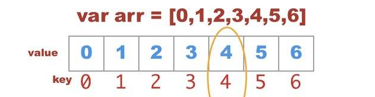

当想要给一个变量存储多个值的时候，那么就必须给这个变量定义一个数组类型。

###  二、创建数组

创建一个数组，有以下的三种方法：

#### 2.1  字面量方式（优选）

~~~js
var arr = []
~~~

赋值方式分为两种：

- 直接在[]内赋值

~~~js
var arr = ['赵丽颖','杨颖','杨幂','迪丽热巴']
~~~

- 根据下标的方式赋值

~~~js
arr[0] = '杨洋';
arr[1] = '汪苏泷';
arr[2] = '赵本山';
~~~

注意：

数组元素的索引不一定要连续，元素之间可以有空隙，叫做稀疏数组 

~~~js
arr[0] = '杨洋';
arr[2] = '汪苏泷';
arr[4] = '赵本山'
~~~

- 针对非稀疏数组，length属性就是数组元素的个数
- 针对稀疏数组，元素的length属性比所有元素的索引要大，**实际长度需要把空隙位置也算上**
- **空隙位置**是undefined (本来应该有，但是没有，null是本来就没有！)

#### 2.2  构造函数方式

##### 2.2.1  语法1

~~~js
var arr = new Array();
~~~

赋值方式：通过下标

~~~js
arr[0] = '杨洋';
arr[1] = '汪苏泷';
arr[2] = '赵本山'
~~~

##### 2.2.1  语法2

~~~js
var arr = new Array(数字);
~~~

赋值方式：通过下标

~~~js
arr[0] = '杨洋';
arr[1] = '汪苏泷';
arr[2] = '赵本山'
~~~

注意：

数字的含义表示预先在数组中定义几个元素，

- 当实际填充内容的数量>预先数量：按照实际数组长度计算
- 当实际填充内容的数量<预先数量：按照预先定义的数量计算

##### 2.2.3 语法3

~~~js
var myCars=new Array("杨洋","汪苏泷","赵本山");
~~~

### 三、数组的访问

通过指定数组名以及对应的索引，就可以访问数组中的某个特定的元素。

~~~js
var one = arr[0];
console.log(one); //杨洋
~~~

还可以根据对应的下标修改元素的值

~~~js
arr[0] = '岳云鹏';
~~~

### 四、遍历数组

#### 4.1 for 循环遍历数组

正向遍历数组：利用循环获取数组中每个元素的值;for循环

~~~js
//1、定义一个数组
var arr = ['赵丽颖','杨幂','杨洋','迪丽热巴','佟丽娅'];
//2、利用循环遍历数组中的每一个数组
for(var i = 0 ; i < arr.length;i++){
	console.log(arr[i]);
}
~~~

反向遍历数组：for循环

```js
        for (j = arr.length-1 ; j >= 0; j--){
            console.log(arr[j]);
        }
```

> 注：起始值为.length - 1;

#### 4.2 for in 循环遍历数组；

```js
         for(var key in arr){
             console.log(arr[key]);
         }
```


#### 4.3 数组.forEach() 遍历数组；

解释：单纯的循环，==**没有返回值**==     (详见后面数组的迭代)


### 五、数组的增删改查

#### 5.1 <span style="color:red">新增元素</span>

##### 5.1.1 数组末尾添加

~~~js
//1、定义一个数组
var arr = ['赵丽颖','杨幂','杨洋','迪丽热巴','佟丽娅'];
console.log("原数组结构:",arr);
//2、根据观察得知，数组的长度永远比数组的下标大1个，所以可以利用数组的length属性来新增元素
arr[arr.length] = '孙越';
//3、打印查看新增后的数组结构
console.log("新数组结构:",arr);
~~~

运行 :

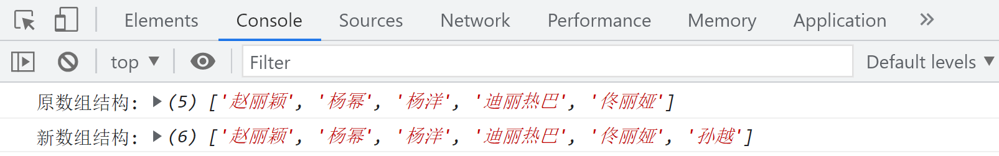

##### 5.1.2 数组开头添加

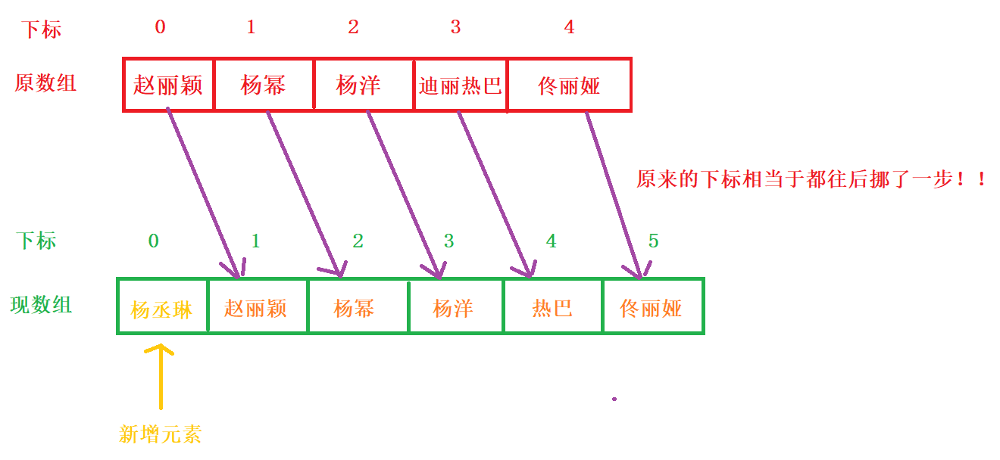

~~~js
//1、定义一个数组
var arr = ['赵丽颖','杨幂','杨洋','迪丽热巴','佟丽娅'];
console.log("原数组结构:",arr);
//2、想要在数组的开头第一位，添加新元素，那么原先每一个元素的下标都会往后挪一位
/*
        * arr[5] = arr[4]
        * arr[4] = arr[3]
        * arr[3] = arr[2]
        * arr[2] = arr[1]
        * arr[1] = arr[0]

        * 真正arr[0] 是新增的那个元素
        * 结论：
        * arr[i+1] = arr[i]
*/

for(var i = arr.length-1;i>=0;i--){
	arr[i+1] = arr[i]
}
//3、给数组的开头位置新增一个新的元素
arr[0] = "杨丞琳"
//4、打印查看现数组结构
console.log("现数组结构:",arr);
~~~

运行：

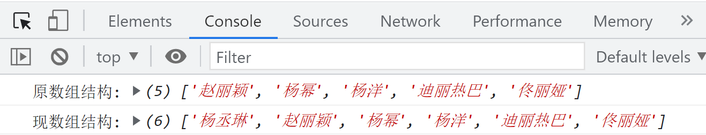

##### 5.1.3 数组中间（某位置）添加

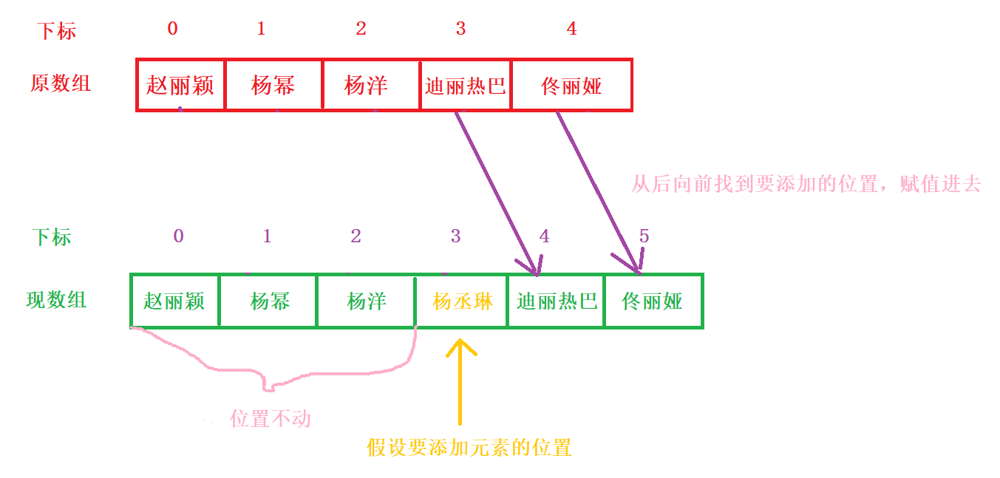

~~~js
//1、定义一个数组
var arr = ['赵丽颖','杨幂','杨洋','迪丽热巴','佟丽娅'];
console.log("原数组结构:",arr);
for(var i = arr.length-1;i>=3;i--){
	arr[i+1] = arr[i];
}
//2、给数组的开头位置新增一个新的元素
arr[3] = "杨丞琳"
//3、打印查看现数组结构
console.log("现数组结构:",arr);
~~~

运行：

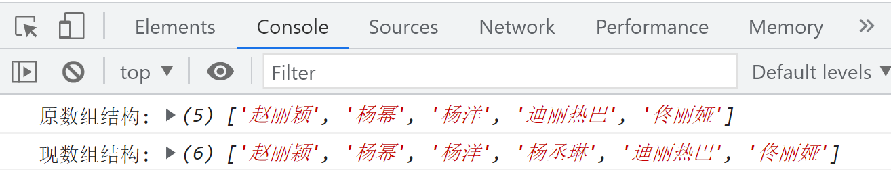

##### 5.2.4 总结

> 1. 无论是开头添加还是任意位置添加，都是从那个下标位置后面的元素往后挪一位;(反向遍历数组)
>
> 2. 然后再调整对应下标的值


#### 5.2 <span style="color:red">删除元素</span>

##### 5.2.1 数组末尾删除

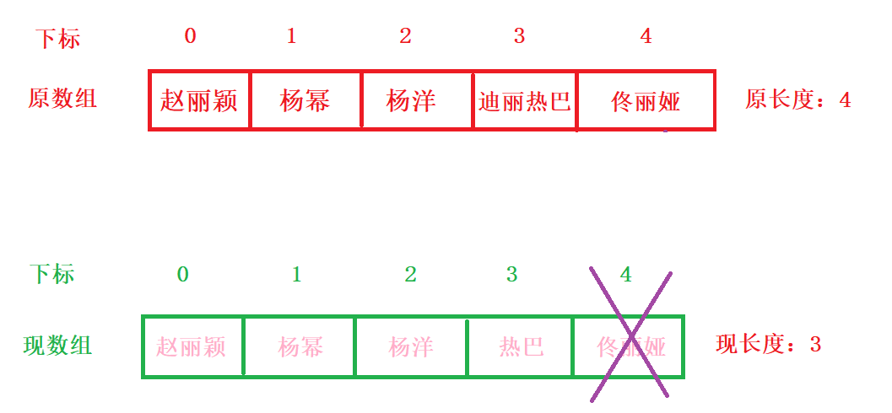

~~~js
//1、定义一个数组
var arr = ['赵丽颖','杨幂','杨洋','迪丽热巴','佟丽娅'];
console.log('原数组结构',arr);
console.log('原数组长度',arr.length);
//2、数组的长度减去一个
arr.length--;
//或者
// arr.length-=1;
console.log('现数组结构',arr);
console.log('现数组长度',arr.length);
~~~

##### 5.2.2 数组开头删除

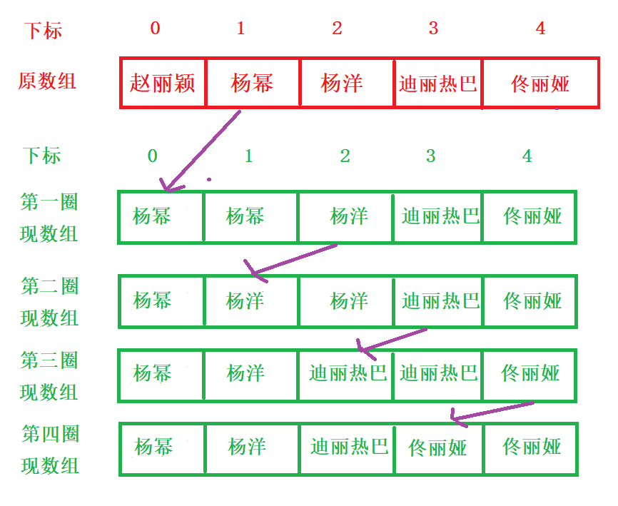

~~~js
//1、定义一个数组
var arr = ['赵丽颖', '杨幂', '杨洋', '迪丽热巴', '佟丽娅'];
console.log('原数组结构', arr);
console.log('原数组长度', arr.length);
//2、循环数组，把当前索引中的值复制给上一个索引
//想法：利用后者的下标向前压进
/**
  * arr[0] = arr[1]
  * arr[1] = arr[2]
  * arr[2] = arr[3]
  * arr[3] = arr[4]
  *循环：i :0 --> 3
*/   
for(var i = 0;i<arr.length-1;i++){
      arr[i] = arr[i+1];
}
//3、在将最后一个多余的值删除掉
arr.length--;
console.log('现数组结构', arr);
console.log('现数组长度', arr.length);
~~~

运行：

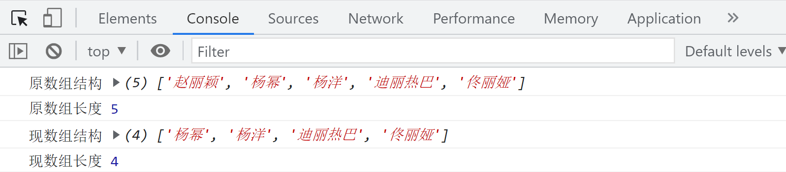

##### 5.2.3 数组中间（某位置）删除


~~~js
var arr = ['赵丽颖', '杨幂', '杨洋', '迪丽热巴', '佟丽娅'];
/*
 * 赵丽颖    arr[0]  不动
 * 杨幂      arr[1]  被   杨洋       arr[2] 替换
 * 杨洋      arr[2]  被   迪丽热巴    arr[3] 替换
 * 迪丽热巴   arr[3]  被   佟丽娅     arr[4] 替换
*/

//1. 循环初始位置从想要替换值的位置起始
for(var i = 1;i<=3;i++){
	//2. 使用后者下标的值替换前者下标的值
	arr[i] = arr[i+1];
}
//3. 最后在让数组的最后一个值消失
arr.length--;
console.log(arr);
~~~

运行：


添加元素与删除元素总结：

> 添加元素：
> 末尾：数组[长度] = 值
> 开头：从0下标后面的每一个元素的下标向后挪一位 （倒着循环）
> 中间：从想要添加的那个下标开始的，后面的每一个元素的下标向后挪一位（倒着循环）
>
> 删除元素：
> 末尾：数组长度-- / 数组长度 -= 数
> 开头：所有的元素向前挪一位（正向循环）
> 中间：从想要添加的那个下标开始的，后面的每一个元素的下标向前挪一位（正向循环）


#### 5.3  修改元素

主要还是通过下标来修改

~~~js
var arr = ['赵丽颖', '杨幂', '杨洋', '迪丽热巴', '佟丽娅'];
arr[2] = '杨丞琳';
console.log(arr);
~~~

#### 5.4  查询元素

~~~js
var arr = ['赵丽颖', '杨幂', '杨洋', '迪丽热巴', '佟丽娅'];
console.log(arr[0]); //赵丽颖
~~~

### 六、数组的相关案例

#### 6.1  求数组中的所有值的总和

例如：var arr = [6, 7, 8, 9,10]；

~~~js
//1、定义一个数组
var arr = [6,7,8,9,10];
//2、定义一个计算总和的变量
var sum = 0;
//2、循环数组，把当前索引中的值复制给上一个索引
for (var i = 0; i < arr.length; i++) {
	sum+=arr[i]
}
console.log('总和',sum);
~~~

#### 6.2  求数组中的最大值

~~~js
//1、定义一个数组
var arr = [6,7,8,9,10];
//2、假设数组中的第一个值是最大值
var max = arr[0];
//3、让max变量和剩余的所有值挨个进行比较
//选班长：先随意选出来一个人，然后大伙一致同意，就是这个人，如果不同意，就他来当
/*for(var i = 0; i < arr.length;i++){
	//这么写虽然没有毛病，但是有点啰嗦
    if(arr[i] < max){
        max = max
    }else{
        max = arr[i];
    }
}
console.log(max);*/
//换种写法
for(var i = 1;i<arr.length;i++){
	if(arr[i]>max){
		max = arr[i];
	}
}
console.log('最大值：',max);
~~~

小伙伴们，可以自己尝试完成求最小值和平均值

#### 6.3 利用"|"拼接数组元素

~~~js
//1、定义一个数组
var arr = ['赵丽颖', '杨幂', '杨洋', '迪丽热巴', '佟丽娅'];
//2、定义一个字符串变量
var str = "";
//3、循环数组中的每一个
for(var i = 0 ;i < arr.length-1;i++){
	str+=arr[i]+'|'
}
//4、和之前的字符串拼接数组中的最后一个值
str+=arr[arr.length-1];
console.log(str); //赵丽颖|杨幂|杨洋|迪丽热巴|佟丽娅
~~~

#### 6.4 反向遍历数组

~~~js
//1、定义一个数组
var arr = ['赵丽颖', '杨幂', '杨洋', '迪丽热巴', '佟丽娅'];
//2、反向循环数组
for(var i = arr.length-1;i>=0;i--){
    //3、循环输出数组中的每一个
	console.log(arr[i]);
}
~~~

#### 6.5 动态按序从尾部插入数组元素

~~~js
//1、定义一个数组
var arr = ['赵丽颖', '杨幂', '杨洋', '迪丽热巴', '佟丽娅'];
//2、动态按序从尾部插入数组元素,在数组结构的末尾中添加新元素
arr[arr.length] = "杨丞琳";
//3、输出数组结构
console.log(arr); //['赵丽颖', '杨幂', '杨洋', '迪丽热巴', '佟丽娅', '杨丞琳']
~~~

#### 6.6 过滤为0的元素

~~~js
//1、定义一个数组
var arr = [5,0,4,2,0,8,0,9];
//4、创建一个新数组
var newArr = [];
//2、循环数组中的每一个
for(var i = 0; i< arr.length;i++){
	//3、判断数组中的每一个值是否为0；
	if(arr[i]!=0){
		//newArr[newArr.length] = arr[i]
        newArr.push(arr[i]);
	}
}
//5、输出新数组结构
console.log(newArr); //[5,4,2,8,9]
~~~

#### 6.7 数组去重

~~~js
var arr = [1,4,5,6,7,3,4,5,6,7,8,3,2,1];
//1、从数组的第一个值开始,循环数组的每一个值
for(var i = 0;i<arr.length;i++){
    //2、从数组的第二个值开始，循环数组的每一个值
	for(var j = i+1;j<arr.length;j++){
        //3、当数组的相邻的两个值相等时
		if(arr[i] == arr[j]){
            //4、数组删除后者元素
			arr.splice(j,1);
            //5、调整下标
			j--;
		}
	}
}
//j--的含义：当删除了当前j所在的元素以后，后边的元素会自动补位，此时将不会在比较这个元素吧，我需要在比较一次j所在位置的元素，所以使j自减,要注意的是j--是在删除了之后再自减一个，要写在if 循环里面；
~~~

#### 6.8  翻转数组

在新数组当中翻转

~~~js
var arr = [1,2,3,4,5,6];
var newArr = [];
//思路：在原数组上将下标进行倒序输出，把每一个值填入一个新的数组里面
for(var i = arr.length - 1; i >= 0; i--){
		newArr[newArr.length] = arr[i];
//在新数组的最后一位添加
	}
console.log(newArr);//[6, 5, 4, 3, 2, 1]
~~~

在原数组上进行翻转---》**==非常重要==**

~~~js
var arr = [1,2,3,4,5,6];
for(var i = 0; i < arr.length/2; i++){
    	//先将前面的数保存一份
		var temp = arr[i];
    	//让后者下标的值站到前面对应下标上
		arr[i] = arr[arr.length - 1 - i];
    	//把后者的下标值替换成原来保存的值
		arr[arr.length - 1 - i] = temp;
	}
console.log(arr);
~~~

思考：如果arr.length没有除以2那么会发生什么情况？？？

#### 6.9 合并数组

原生实现方式

- 合并在新数组当中

~~~js
var arr1 = [1,3,5,7,9];
var arr2 = [2,4,6,8,10];
//1、合并在新数组当中
var newArr = [];
for(var i = 0; i < arr1.length; i++){
	//在把arr1内部的数据添加到newArr当中
  		newArr[newArr.length] = arr1[i];
	}
			
for(var i = 0; i < arr2.length; i++){
	//在把arr1内部的数据添加到newArr当中
		newArr[newArr.length] = arr2[i];
	}
console.log(newArr);
~~~

- 在原数组上进行合并

~~~js
for(var i = 0; i < arr1.length; i++){
		arr2[arr2.length] = arr1[i];
}
console.log(arr2);
~~~

### 七、冒泡排序

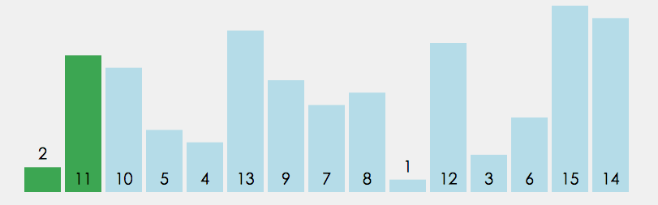

> ==**原理：**==
>
> 数组从第一开始的第一个元素以及相邻的元素进行两两比较；如果前者>后者，则交换位置
>
> 在每一轮循环的时候，则最后一位一定是本轮的最大值，不参与下一轮的比较


~~~js
//1、定义一个数组
var arr = [2,11,10,5,4,13,9,7,8,1,12,3,6,15,14];
console.log('原数组结构:',arr);
//2、循环两层
for(var i = 0;i<arr.length-1;i++){
	for(var j = 0;j<arr.length-i-1;j++){
		if(arr[j]>arr[j+1]){
			var temp = arr[j];
			arr[j] = arr[j+1];
			arr[j+1] = temp;
		}
	}
}
//3、输出数组结构
console.log('现数组结构:',arr);
~~~

运行：

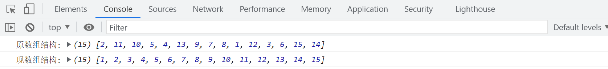

### 八、多维数组

#### 8.1 一维数组

~~~js
var arr = [1,2,3,4,5];
console.log(arr[2]);
~~~

#### 8.2 二维数组

一维数组当中的元素，又是一个一维数组

~~~js
var arrTwo = [[1,2],[3,4],[5,6]];
console.log(arrTwo[1][1]);//4
~~~

#### 8.3 三维数组

~~~js
var arrThree = [
				[[1,2],[3,4]],
				[[5,6],[7,8]],
				[[9,10],[11,12]]
			]
console.log(arrThree[2][0][1]);
~~~

### 九、数组方法

#### 9.1 新增元素

- 末尾添加   数组.push(值1,值2)

  返回值：返回加入元素后数组的总长度

  **该方法可以影响原数组结构**

  ~~~js
  var arr = [1,2,3,4,5];
  //单元素
  arr.push(6);
  //多元素
  arr.push(7,8,9);
  console.log(arr);//[1, 2, 3, 4, 5, 6, 7, 8, 9]
  ~~~

- 开头添加  数组.unshift(值1,值2)

  返回值：返回加入元素后数组的新长度

  **该方法可以影响原数组结构**

  ~~~js
  var arr = [1,2,3,4,5];
  //单元素
  arr.unshift(6);
  //多元素
  arr.push(7,8,9);
  console.log(arr);//[6, 1, 2, 3, 4, 5, 7, 8, 9]
  ~~~

- 某位置添加   数组.splice(下标，0，新值1，新值2……)

  第一个值代表从哪开始，第二个值代表删除0个，后面的代表新增的元素

  返回值：返回删除的元素组成的新数组，针对添加来说返回的是空数组，因为删除了0个；

  **该方法可以影响原数组结构**

  ~~~js
  var arr = [1,2,3,4,5];
  //单元素
  arr.splice(3,0,6);
  console.log(arr);//[1, 2, 3, 6, 4, 5]
  //多元素
  arr.splice(3,0,7,8,9);
  console.log(arr);//[1, 2, 3, 7, 8, 9, 6, 4, 5]
  ~~~

#### 9.2 删除元素

==**[要关注删除元素的返回值]**==

- 末尾删除	数组.pop()

  返回值：返回删除的那一个==元素==,括号里没有值；

  **该方法可以影响原数组结构**

  ~~~js
  var arr = [1,2,3,4,5];
  arr.pop();
  console.log(arr);
  ~~~

- 开头删除     数组.shift()

  返回值：返回删除的那一个==元素==

  **该方法可以影响原数组结构**

  ~~~js
  var arr = [1,2,3,4,5];
  arr.shift();
  console.log(arr);
  ~~~

- 某位置删除    数组.splice()

  返回值：返回删除的那一个元素，==**类型是数组**==，删除一个数，返回的也是数组

  一个值：从这个位置一直删除到数组末尾
  
  ~~~js
  var arr = [1,2,3,4,5];
  arr.splice(0);
console.log(arr); //[]
  ~~~

  两个值：从第一个值位置开始，删除几个元素 (**==包括开头，包括结尾==**)
  
  ~~~js
  var arr = [1,2,3,4,5];
  arr.splice(0,3);
  console.log(arr); //[4,5]
  ~~~

#### 9.3 修改元素

数组.splice(开始值，删除几个，新增的值)

三个值：从第几个值位置开始，删除几个元素，后面的代表新增的元素

~~~js
var arr = [1,2,3,4,5];
arr.splice(0,3,10,20);
console.log(arr); //[10,20,4,5]
~~~

#### 9.4 翻转数组

数组.reverse()

~~~js
var arr = [1,2,3,4,5];
arr.reverse();
console.log(arr); //[5,4,3,2,1];
~~~

#### 9.5 合并数组

数组.concat()

==不会影响原数组的结构，而是创建了一个新的数组(在新数组上进行合并)==

如果想合并的是一个数组 ==> `arr.concat([['d']])` 需要写成二维数组；

concat() 会将数组的【】去掉，然后追加进去；

~~~js
var arr = [1,2,3,4,5];
arr.concat([6,7,8,9]);
console.log(arr); //[1,2,3,4,5];
console.log(arr.concat([6, 7, 8, 9]));//[1, 2, 3, 4, 5, 6, 7, 8, 9]
~~~

> 比较concat和push
>
> 区别一：
>
> 如果追加的是数组，push直接把**数组添加进去**
>
> concat追加的是数组元素，则自动的将**数组的元素**添加到原数组
>
> 区别二：
>
> push追加的无论什么值都会影响原数组结构
>
> concat不会影响原数组结构


#### 9.6 截取数组

数组.slice()   ==**不会影响原数组结构，形成的是一个新的数组**==

一个值：从这个下标一直截取到数组末尾

两个值：从第一个值的下标到第二个下标 -1 的位置，(**==包含开头，不包含结尾==**)

返回值：返回截取的元素形成的新数组

~~~js
var arr = [1,2,3,4,5];
arr.slice(1,3);
console.log(arr); //[1, 2, 3, 4, 5]
console.log(arr.slice(1, 3));//[2, 3]
~~~

#### 9.7 sort排序方法

数组.sort()

> 原理：
>
> 先将每一个数字隐式调用toString()方法转化为字符串然后在逐位比较，
>
> 默认是升序排列，(字符串和字符串之间的比较：ASCII码)
>

~~~js
var arr = [18,2,10,9,88,66,22];
arr.sort(function(a,b){
    //第一个a：非第一个元素的剩余所有数	2,10,9,88，66,22
    //第二个b：非最后一个元素的剩余所有数18,2,10,9,88,66
	//降序
	return b-a;
	//升序
	//return a-b;
})
console.log(arr); //[88,66,22,18,10,9,2]
//记忆方法：a-b --> a 到 b,由小到大即升序排列
~~~

#### 9.8 valueOf方法

用来获取数组对象的基本值

数组.valueOf()

返回值：返回原数组，因为数组是非包装对象，所以它是没有基本值

> 基值：
>
> null和undefined里面都有基准值，就是这个值本身；
>
> 数组没有基准值，所以调用valueOf()只能得到结构本身；
>
> 比较：
>
> 如果想要比较对象也好，基本数据类型值也好，都可以使用==来进行比较
>
> 数组之间比较的其实是地址值
>
> 数据类型：基本数据类型（值传递）、引用数据类型(址传递)  

~~~js
var arr = [18,2,10,9,88,66,22];
var result = arr.valueOf()
console.log(result);
console.log(arr);
console.log(result === arr);
~~~

#### 9.9 强转为字符串

用来将数组对象转化为字符串 `String()` ; `toString()`

返回值：把数组的中括号去掉，其余加引号形成字符串返回


#### 9.10 join方法

==**不会修改原数组**== 

把数组再转化为字符串  和字符串方法 split是一个逆运算

用来以指定的字符串为连接符，将数组元素连接成一个字符串

如果不传参数，默认以逗号为连接符，将元素连接成字符串

如果传的是正常字符串，那么以这个字符串为连接符将元素连接成字符串

如果传的是空串，那么直接将字符串连接成字符串，中间没有任何连接

返回值：==返回连接好的字符串==

**该方法不会影响原数组结构**

~~~js
var arr = [18,2,10,9,88,66,22];
var result = arr.join('');
console.log(arr);
console.log(result);
~~~

#### 9.11 indexOf方法

数组.indexOf();  根据搜索值，返回这个元素第一次出现的下标;

第一个值：被搜索的元素;

第两个值：从该下标开始搜索；默认为0；

返回值：如果搜索的这个元素存在的话，indexOf返回的是这个元素第一次出现的下标，

如果不存在，返回 - 1；

```js
var arr1 = [10, 20, 30, 40, 30, 30, 30, 30, 20, 10];
console.log(arr1.indexOf(40));//3
console.log(arr1.indexOf(30, 3));//4
//从3下标开始向后搜索，找30的这个值第一次出现的位置
```

应用：利用indexof来完成对arr1数组的排重，将排重后的结果重新保存到新数组里面

```js
//思路：遍历arr1中的每一个元素，然后在newArr数组的下标中进行查找
//     如果不存在这个元素的下标，则这个元素一定没有，只要是没有就添加
var newArr = [];
for(var i = 0 ; i < arr1.length;i++){
     if(newArr.indexOf(arr1[i]) == -1){
         newArr.push(arr1[i]); 
     }
}
console.log(newArr); //[10, 20, 30, 40]
```

#### 9.12 lastIndexOf

数组.lastIndexOf();  从0下标一直到数组最后一位来搜索某个值最后一次出现的下标

第一个值：被搜索的元素;

第二个值：从此位置开始向后查找。默认整个数组都被查找；

返回值：数组中该元素最后一次出现的索引，如未找到返回-1。

#### 9.13 fill

想要在数组中填充一样的值,前提要知道填充多少个，值是什么

注：一般用构造函数方法创建数组；

```js
var arr3 = new Array(10);
arr3.fill(1);
console.log(arr3); //[1, 1, 1, 1, 1, 1, 1, 1, 1, 1]
```


> ==不会修改原数组的方法：==
>
> 数组.concat()  --合并数组；返回新数组
>
> 数组.slice()	-- 截取数组；返回新数组
>
> 数组.join()  --重组数组；返回的是字符串
>
> 数组.indexOf  --

### 十、数组迭代方法

==**所有的数组迭代方法都不会影响原数组结构**==

#### 10.1  every

`数组.every(function(当前的值,当前的下标,原数组){})`

数组中的每个元素都会执行这个函数

解释：数组中的==每一个值都满足==于设定的条件，整体结果才为true,否则false;

只要有一个不满足条件，后续迭代将不继续，不会影响原数组结构

返回值：==布尔值==，

基本上在开发的时候也就使用值这个参数，后面两个基本不用

~~~js
var arr = [4,5,6,7,1,2];
var result = arr.every(function(value,index,array){
	/* console.log(value); //数组的值
 	   console.log(index); //数组的下标
       console.log(array); //原数组结构 */

   //设定条件
   if(value>1){
	     return value;
    }
});

console.log(result); //false
~~~

#### 10.2  some

`数组.some(function(当前的值,当前的下标,原数组){})`

根据条件来检查数组里面是否有满足条件的值，只要有满足条件的，返回true，否则false，不会影响原数组结构

解释：数组中的有值**只要**满足条件，哪怕只有一个，整体结果也为true

返回值：==布尔值==

~~~js
var result1 = arr.some(function(value){
             //设定条件
            if(value>1){
                return value;
            }
})
~~~

#### 10.3  filter

`数组.filter(function(值,下标){})`

解释：根据条件进行数组元素的筛选，将筛选后的结果存入一个新的数组里面，不会影响原数组结构；

返回值：==新的数组==

~~~js
var result2 = arr.filter(function(value){
             //设定条件
            if(value>1){
                return value;
            }
})

//需求：将arr1中num值过滤出来大于50的值
var result3 = arr1.filter(function(value){
    if(value.num>50){
        return value;
    }
})

console.log(result3);
~~~

#### 10.4  map

`数组.map(function(值,下标){})`

解释：根据设定的条件，修改符合条件中数组的值，并且返回一个新的数组

返回值：修改结果后的==新数组==

~~~js
var arr1 = [
            {
                num:12
            },
            {
                num:76
            },
            {
                num:98
            }
]
//需求：将arr1的num值每一个都+10
var result4 = arr1.map(function(value){

	return value.num+10;

})
console.log(result4)
~~~

#### 10.5  forEach

`数组.forEach(function(值,下标,原数组结构){})`

解释：单纯的循环，==**没有返回值**==

> 当一个函数没有返回值时，用一个变量来接收，就会得到undefined；

~~~js
var data = [];
arr1.forEach(function(value){
	//要求这些值必须>=70
	if(value.num>=70){
        //return value.num;  --> //undefined
		data.push(value);
	}
})
console.log(data);
~~~

#### 10.6  find

> find:查找数组中满足条件的==第一个元素==，后面再有满足的也不找了； 

 find方法对数组中存在的每个元素执行一次函数

- 如果找到函数返回 true 值的数组元素，则 find() 返回该数组元素的值（并且不检查剩余值）
- 否则返回 undefined

 注意：find() 不对空数组执行该函数， 不会改变原始数组 

~~~js
var ages = [23,78,95,12,46];
var result = ages.find(function(value){
     if(value>18){
          return value;
     }
});
console.log(result); // 23
~~~

#### 10.7  reduce

 reduce方法将数组的元素浓缩成一个值（算总价）， 为数组的每个值（从左到右）执行提供的函数；

 函数的返回值存储在累加器中（结果/总计）。 

注意： 

- 对没有值的数组元素，不执行 reduce() 方法。 
-  reduce() 方法不会改变原始数组。 

~~~js
var price = [34.5,89.86,9.9,15.68];
var result = price.reduce(function(a,b){
       return a + b;
})
console.log(result); //149.94
~~~


### 十一、出现undefined情况

> - 声明变量，没有赋值，返回undefined
>- 当一个函数没有结果返回的时候，用一个变量来接收此时就会得到undefiend
> - 当形参没有对应实参的时候，形参值也是undefined;


## JavaScript函数

要求：实现一个功能，需要循环1-5区间的所有数字

~~~js
for(var i = 1;i<=5;i++){
	console.log(i);
}
~~~

这难不倒各位小伙伴，但是大家想一个问题，如果这样的功能需要重复使用，难道我们要书写很多遍？

### 一、概念

把一段需要**重复使用**的代码，用function语法包起来，方便重复调用；

分块和简化代码，复杂一点的也会加入封装、抽象、分类等思想；

### 二、声明

~~~js
function 函数的名字(){
     //要执行的代码
}
函数的名字：动作+模块/模块+动作    costList    listCost
~~~

#### 2.1 规则

- 不能使用关键字以及保留字

- 不能是纯数字或者是数字开头  

- 可以出现英文+数字+下划线，一般下划线在中间位置  

- 建议使用驼峰命名法，见名知意   

- 方法名字与变量名一样都必须是JavaScript合法的标识符。

- 在函数体中，大括号是必不可少的,缺少大括号, JavaScript将会抛出语法错误

### 三、函数调用

 调用方式：名字(); 函数可以多次调用 

~~~js
//函数声明
function fn(){
	console.log(1);
}
//函数的调用
fn(); //1
~~~

思考：调用方法名字不加（）会返回什么？

> 不加(),即为变量，会返回整个函数

### 四、函数参数

#### 4.1  什么时候使用参数

> 总结：**当函数中的有一些代码的值不能完全确定的时候，那么这些值就可以被当做参数值。** 


#### 4.2  参数的分类

-  形式参数（形参）——可以表示**任何类型的数据**,多个形参之间逗号间隔；在函数==定义==时候小括号中的参数

~~~js
function 函数名(形式参数1,形式参数2...形式参数n){}
~~~

-  实际参数（实参）——在函数调用时给形参赋的值 ；在==调用==函数的时候小括号中的参数(任何数据类型)

~~~js
函数名(实际参数1,实际参数2...实际参数n)
~~~

~~~js
function func(形参1,形参2){
    //函数执行代码
}
 
func(实参1,实参2);//调用时传参
~~~

#### 4.3  参数的关系

默认情况下，形参与实参是**一一对应关系**，也就是说函数的实参和形参的数量应该相同，

但JS并没有严格要求，也就是说，可以在数量上不相等

- 正常传递对应参数

~~~js
function func(a,b){
	console.log(a); //10
	console.log(b); //20
}
func(10,20)
~~~

- 形参数量>实参数量

> 多出来的最后的形参会默认会**undefined** 

~~~js
function fun1(a,b,c){
    //var a=1,b=2,c;
	console.log(a); // 1
	console.log(b); // 2
	console.log(c); //undefined
}
fun1(1,2)
~~~

- 实参数量>形参数量

~~~
那么多出来的实参没有对应的形参访问。函数忽略掉多余的实参
~~~

~~~js
var a = 2;
function fun2(x){
  var a = 1; //fun2这个{}里面 局部作用域 只能在局部使用
  console.log(a); // 1  就近原则
  console.log(x); // 10
}
fun2(10,20)
console.log(a); // 2 先从当前自身作用域（全局）开始查找
~~~

案例：解决之前循环任意数字区间的问题

~~~js
//1、声明一个函数
function fun(num1,num2){
    //var num1 = 10;
    //var num2 = 20;
	//2、在需要灵活变动的位置，添加上形式参数
	for(var i = num1;i<=num2;i++){
		console.log(i);
	}
}
//3、调用函数
func(10,20);
func(1,10);
~~~

### 五、函数返回值

#### 5.1 使用场景

> 当在函数的外部想要获取到函数内部的**运行结果**(或者是**某一个数据**)的时候就必须使用函数的返回值，

函数的return后面的值被当做了返回值， 返回到函数调用的位置

**哪里调用函数，哪里接收返回值**

==return 后面写什么，调用时就会接收到什么！！！==

> return 要拿变量接收 
> - 利用变量,好处就是后面在想使用这个值则直接找变量
>
>   ```js
>           var result = f2();
>           console.log(result);
>   ```
>
> - 直接输出,一般情况下用作测试，看函数的返回值是否拿到了，可以直接console.log()

#### 5.2 语法设置

- 函数式声明

~~~js
function 函数名(){
   return 值;
}
~~~

- 表达式声明

~~~js
var 函数名 = function(){
	return 值;
}
~~~

~~~js
function 函数名(){
	return function(){
		
	}
}
~~~

#### 5.3 注意事项

- **如果函数中没有return关键字，那么函数有默认的返回值undefined**

~~~js
function func2(){   
	console.log(1111) //111
} 
console.log(func2());  //undefined

~~~

注：这么写不能得到想要的结果

> 修改方法如下
>
> * 函数里面有console.log();函数调用时不要用console.log()
> * 函数里面有return，需要拿变量接收
>
> ```js
> function f2(){
>   return '我是f2';
> }
> console.log(f2()); //我是f2
> ```
>
> 或者：
>
> ```js
> function f2(){
>  console.log('我是f2');
> }
> f2();//我是f2
> ```

- **return后面的代码不执行,但是不包含带有预解析的内容，例如如果后面是函数的话，则还是会进行提升的**

~~~js
function f1(){
    console.log(a); //a(){}
    return 100;
    function a(){}  //=> var a = function(){}
}
f1();

function f1(){
    console.log(a);//undefined
    return 100;
    var a = 10;
}
f1();
~~~

- **如果函数中有return关键字，这个关键字后面没有值，那么这个函数有返回值是undefined**

~~~js
function func2(){
    return;
} 
console.log(func2());//undefined
~~~

- **如果函数中有return关键字，这个关键字后面有值，那么这个值就是这个函数的返回值**

~~~js
function func2(){
     return '知行合一';
} 
console.log(func2());//知行合一
~~~

- **默认情况下函数中只允许出现一个return关键字，多个使用分支语句**

  无论二选一还是多选一，都是只运行满足条件的一个return语句


~~~js
function fun(a,b){
     if(a>b){
          return a;
      }
      else{
          return b;
      } 
}
console.log(fun(10,20));//20
~~~

- **return后面默认只能返回一个值,如果想要返回多个值，可以选择数组、对象**

~~~js
 function f6() {
     var a = 1;
     var b = 2;
     return a, b;  //逗号运算符，返回最后一个数
 }
console.log(f6()) //2
~~~


~~~js
function fun(){
	//return 1,2,3,4,5
    return {a:1,b:2}
}
console.log(fun()) // {a:1,b:2}
console.log(fun().a) // 1
console.log(fun().b) // 2
~~~

#### 5.4 函数返回值的数据类型

> return 后面的值也是可以返回所有的数据类型
>
> 有效值：number、string、boolean、array、object、function

```js
        //function类型
        function f6() {
            //var f7 = function(){}
            function f7() {
                console.log('我是f7函数');
            }
            //由于f7是在f6函数内部声明的
            //所以调用必须在f6里面调用
            // f7();
            //如果需要函数的结构，则执行函数f7
            //如果需要函数的运行结果，则执行函数f7()
            return f7;
        }
        console.log(f6()); //f7函数结构
        f6()(); //我是f7函数
```

案例练习：

1. 计算2和3的和
2. 输入两个数，返回两个数字的和
3. 返回n到m之间所有数字的和
4. 输入两个数,返回两个数中的最大值
5. 输入三个数,返回三个数中的最大值
6. 输入一个数组,返回数组中所有元素的和

### 六、作用域（scope）

#### 6.1  概念

通常来说一段程序代码中使用的**变量**和**函数**并不总是可用的，限定其可用性的范围，

作用域的使用提高了程序逻辑的局部性，增强程序的可靠性，减少名字冲突。 

- 作用：无论是变量还是函数在代码中的某一个区域中的**有效生命周期范围**

- 域：区域，位置


- 作用域：  指的就是变量/函数在一个区域中的有效生命周期范围 

#### 6.2  分类

**全局作用域**：在script标签的任意位置都可以进行访问变量/函数

>通过var或function声明在全局（声明在任意函数之外和代码块之外）中的数据，在全局的任意地方都可以调用或修改（即全局变量）和在window下的属性
>
>注：
>
>- 全局函数内部可以访问全局变量
>- ==变量只有是声明了(var)，没有值则是undefiend；否则没有声明(var)就是报错==


**函数作用域**（局部作用域）：变量仅能在声明的函数内部可见，函数外是不允许访问的

声明在函数内部的某个数据（var，function，参数）,只能在函数内部使用（函数的局部作用域）

~~~js
function fun(){
 	//局部作用域下的变量：局部变量
 	var b = 2; //生命周期只能在这个fun函数的内部
 	console.log(b); // 2

	//局部作用域下的函数：局部函数
	function fun1(){
		console.log(b); //2  b默认和fun1都是同作用域，可以之间相互访问
	}
	fun1(); //局部函数的自身调用
}
fun();
~~~

> 注：
>
> - 变量输出永远都是当前作用域下声明；当前作用域下输出
>
> - 如果局部变量/函数想要在全局作用域下使用的话，那么可以使用return

#### 6.3  作用域变量

- 局部变量：在函数内部定义的变量是局部变量

- 全局变量：在函数之外定义的变量是全局变量

  特别需要注意：==如果变量在函数内没有声明（没有使用 var 关键字），该变量为全局变量。==

  ~~~js
  var b = 100; //全局作用域下声明的变量 周期范围是在整个script标签的任意位置
  //先在全局变量声明了a变量 但是没有值
  //var a;
  function fun(){
      var c = 80;  //局部作用域下声明的变量  周期范围只能在当前fun函数的内部的任意位置
      a = 100; //全局变量
      //在函数内部访问
      console.log(a); //100
  }
fun();
  //在函数外部访问
console.log(a);//100
  ~~~

  运行：

  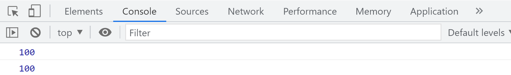
  
  但是如果该变量出现在形式参数中，则为局部变量。
  
  ~~~js
  function fun(a){
       //在调用函数进来解析这个函数体的时候，发现了形式参数
       //然后再函数体内部创建了一个与形参同名的局部变量
     //var a = 10; //作用域：属于fun函数的局部
       console.log(a); //此时的a为局部变量  10
}
  fun(10);
//在函数外部无法直接访问，报错
  console.log(a); // 报错
  ~~~


  运行：

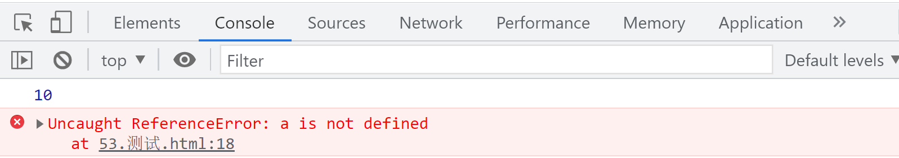


#### 6.4 特殊情况

>   总结以下函数**内部写变量中不带var**的情况：
>
>   - 首先找形参
>   - 如果形参有，当做是局部变量对待，不会对全局作用域上的变量的值的修改
>
>   ```txt
>   基本类型是值传递；
>   引用类型是址传递；
>   注意：
>   - 只要是在形参中引用进来的变量是number、string、boolean，等在函数内修改的值与外面全局变量值无关
>   - 只要是在形参中引用进来的变量是array、object、function，等在函数内修改的值与外面的全局变量值有关
>   ```
>
>   - 如果形参没有，就去找外部全局看有没有，有就是函数内部在操作全局变量
>   - 如果全局变量中也没有，那么此时这个变量相当于在全局定义了一个变量；
>   - 如果全局变量中有明显的变量创建，则是进行值的修改，而不再创建了

```js
var a = 10;
function f7(){
    console.log(a);//10
    a = 20;
    console.log(a);//20
}
console.log(a);//10 
f7();
console.log(a);//20  函数内部的变量没有var关键字，且没有形参，所以当成了全局变量
```

```js
var a = 3;
function f7(a){
    console.log(a); // 3
    var a = 10;
    a = 20;
    console.log(a); // 20
}
f7(a);
console.log(a);//3   函数内部的变量没有var关键字,但是有形参和局部变量，所以修改了局部变量
```


### 七、window对象

- 在JS中，默认情况下 var声明的全局变量和function声明的全局函数会挂载在window上(所以要避免声明全局变量和全局函数)

- 在JS中，默认全局数据都会保存在window下（ES6之前）

- 另外window是JS在浏览器里的顶层对象，所以window的属性和方法也都是全局的

- 在JS中，调用window下的属性和方法，默认可以不写window

  所以如果在函数里面声明变量没有写var，会把其当做window的一个属性；
  
  （不规范写法，要避免）

~~~js
//var声明的全局变量和function声明的全局函数，都默认挂载在window上
var a = 10;
console.log(window);
console.log(window.a); // 10

function fn(){
	b = 100;
	console.log('函数内访问:'+b); //函数内访问：100
}
fn(); 
window.fn(); 
//此处b没有写声明的var，所以b变量既window.b = 10，相当于挂载在window上的全局变量
console.log('函数外访问:'+b);  //函数外访问:100

//在JS中，默认全局数据都会保存在window下
//window是浏览器的最顶层对象，所以默认window下的属性和方法都是全局的
//所以window下的方法和属性，默认可以省略window
~~~

运行：

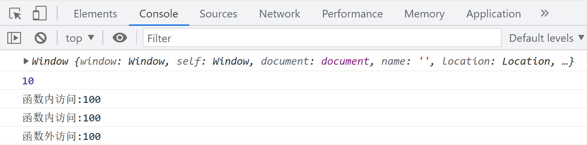

### 八、作用域链（scope chain）

#### 8.1 概念

作用域链：核心其实就是变量的一种查找机制 （==向上查找，遵循就近原则==）

作用域链决定了哪些数据能被函数访问。 

#### 8.2  查找规则

在JS中我们查找一个变量时，会先在当前作用域进行查找，如果能找到，就直接使用这个变量，如果找不到，就从向上找父作用域的数据，还找不到就接着向上，一直找到全局作用域（window对象），window都找不到就报错。 

> 每次输出变量的时候，程序内部有一个查找机制，查找的原则：**==就近原则==**
>
> 先从函数内部开始找起,如果有则使用函数内部；否则查找到全局作用域下
>
> - 有同名函数，用同名函数  
> - 没有的 ，看是否有形参(形参是否传值)；有形参先解析形参，后解析变量，变量有值就会覆盖形参的值；
> - 没有的看函数内部变量是否有var的作用域提升；
> - 父级作用域 ===> 全局变量
> - 都没有 ，报错


~~~js
var a = 2;
function test(){
	var a = 1;
	console.log('结果：',a); //1
}
test();
~~~

运行：

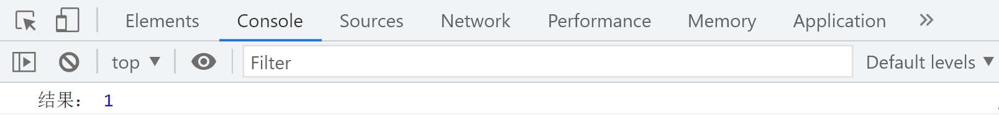

~~~js
//调用fn()时，在其子函数fn2被调用时，首先会在fn2()自己的作用域内查找变量a
//找不到就在其父级作用域即fn()作用域中查找，即a=10，然后打印a=10
function fn(){
	var a = 10;
	function fn2(){
		console.log('结果:',a); //结果：10
	}
	fn2()
}
fn();
~~~

运行：

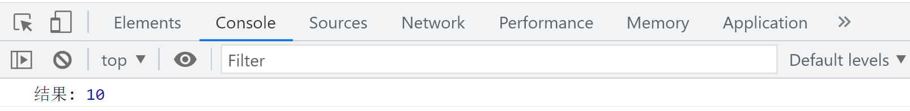

经典案例：

~~~js
var a = 10;
function f1(){
	var a = 20; 
	console.log(a); //20
	function f2(a){ 
        //有形参，且传了实参，相当于var a = 40;
		var a = 30; 
		console.log(a); //30
		function f3(){ 
			console.log(a);//30
		}
		f3(a)
	}
	f2(40);
}
f1(a);//没有形参，实参没用 
~~~

总结：作用域不是在函数调用的时候确定的，而是在函数定义的时候就确定好了。

### 九、闭包

闭包是对作用域链的一种表现和使用，一般在开发中很少用，但是面试里面特别爱问。

函数对象可以通过作用域链相互关联起来，函数体内的数据(变量和函数声明)都可以保存在函数作用域内， 这种特性在计算机科学文献中被称为“闭包”。 

既函数体内的数据被隐藏于作用于链内，看起来像是函数将数据“包裹”了起来。 

从技术角度来说，js的函数都是闭包：函数都是对象，都关联到作用域链，函数内数据都被保存在函数作用域内。 

要理解闭包，首先必须理解Javascript特殊的变量作用域。

变量的作用域无非就是两种：全局变量和局部变量。

- JavaScript语言的特殊之处，就在于函数内部可以直接读取全局变量。

```js
var n=999;
function f1(){
　　　　alert(n);
　　}
f1();
```

- 在函数外部自然无法读取函数内的局部变量

```js
function f1(){
　　　　var n=999;
　　}
alert(n);
```

- 函数内部声明变量的时候，一定要使用var命令。如果不用的话，你实际上声明了一个全局变量

```js
function f1(){
　　　　n=999;
　　}
f1();
alert(n);
```

- **如何从外部读取局部变量？**

  出于种种原因，我们有时候需要得到函数内的局部变量。但是，前面已经说过了，正常情况下，这是办不到的，只有通过变通方法才能实现。那就是在函数的内部，再定义一个函数。


```js
function f1(){
      var n=999;
      function f2(){
          alert(n); // 999
       }
　　}
```

在上面的代码中，函数f2就被包括在函数f1内部，这时f1内部的所有局部变量，对f2都是可见的。但是反过来就不行，f2内部的局部变量，对f1就是不可见的。这就是Javascript语言特有的"链式作用域"结构（chain scope），子对象会一级一级地向上寻找所有父对象的变量。所以，父对象的所有变量，对子对象都是可见的，反之则不成立。

既然f2可以读取f1中的局部变量，那么只要把f2作为返回值，我们不就可以在f1外部读取它的内部变量了吗！

~~~js
function f1(){
　　　　var n=999;
　　　　function f2(){
　　　　　　alert(n);
　　　　}
 //返回一个f2的方法体 
　　　　return f2;
　　}

var result=f1();
result(); // 999
~~~

#### 9.1 闭包的概念

代码中的f2函数，就是闭包，闭包"（closure）定义非常抽象，很难看懂。

闭包其实就是==能够读取其他函数内部变量的函数==，由于在Javascript语言中，只有函数内部的子函数才能读取局部变量，因此可以把闭包简单理解成"定义在一个函数内部的函数"。所以，在本质上，闭包就是将函数内部和函数外部连接起来的一座桥梁。

#### 9.2 如何产生闭包(条件)?

- 外部函数必须调用

- 外部函数和内部函数嵌套

- 内部函数需要引用外部函数的变量

- 内部函数需要作为外部函数的返回值


#### 9.3 闭包的理解

- 理解一: 闭包是嵌套的内部函数

- 理解二: 包含被引用(外部函数)变量的对象

- 理解三： 所谓的闭包是一个引用关系，该引用关系存在于内部函数中，引用的是外部函数的变量的对象


##### 9.3.1 常见的闭包

> 将函数作为另一个函数的返回值

#### 9.4 闭包的作用

- 延长外部函数变量的生命周期  (因为被内部函数引用，所以不会被回收)

- 让函数外部可以操作(读写)到函数内部的数据(变量/函数)/函数外部可以引用函数内部的变量

  注意： 浏览器为了性能后期将外部函数中不被内部函数使用的变量清除了

```js
function fn(){
		var a = 0;
        var b = 1; 
		function fn1(){
			a++;
			console.log(a);
		}
		return fn1;
}
var f =  fn();
f();
f();
```


#### 9.5 闭包的缺点和解决

内存泄漏和内存溢出:

- 内存泄漏 ： 内存无法释放；
- 内存溢出 ： 内存被撑爆；
- f = null;  解决方式；

~~~js
function fn(){
		var a = 0;
		function fn1(){
			a++;
			console.log(a);
		}
		return fn1;
}
var f =  fn();
f();
f();
f = null;//释放闭包
~~~

- **使用闭包的注意点**

> 由于闭包会使得函数中的变量都被保存在内存中，内存消耗很大，所以**不能滥用闭包**，否则会造成网页的性能问题，在IE中可能导致内存泄露。解决方法是，在退出函数之前，将不使用的局部变量全部删除。
>
> 虽然我们可以获取内部变量 但是**不要轻易修改这个内部变量**。

- **必会**

  - 闭包是什么
  
  - ==判断闭包的条件==
  - 手写闭包
  - 闭包的作用
  - 闭包的缺点

### 十、函数预解析

JS在读取到一个==script标签（或者一个函数作用域）==时，会先进行一个预解析的过程，在这个过程中，==会把var声明的变量和function声明的函数体，提升到整个script标签（或者一个函数作用域）最前边去。==在预解析完之后，JS才会从上到下一行一行解析代码并执行。

程序在解析的时候就找两个关键字,一个是var；一个是function,都默认提升到自身作用域的最顶端

#### 10.1  分类

- 变量预解析（变量提升）
- 函数预解析（函数提升）

#### 10.2  说明

+ 解析的时候分为两步，**先去解析声明定义的函数，再去解析所有的带var变量**
  + 函数提升一定在变量提升之前的
  + 变量只有带有var标识的才有提升
+ **程序**在开始执行之前会做**全局**代码预解析
+ **函数**在开始执行之前也会做**局部**代码预解析
+ 预解析会解析带var的变量和函数声明定义的函数function，解析函数优先级比解析变量要高：

~~~js
console.log(a);
var a = 10;
function a(){
	console.log('函数',a);
}

/*
 function a(){
	console.log('函数',a);
 }
 console.log(a); //function(){}  保函数 弃变量
 var a = 10;
 console.log(a); //在当前这行a就是前面的function(){} 所以利用10覆盖function(){}  10
*/
~~~

运行：

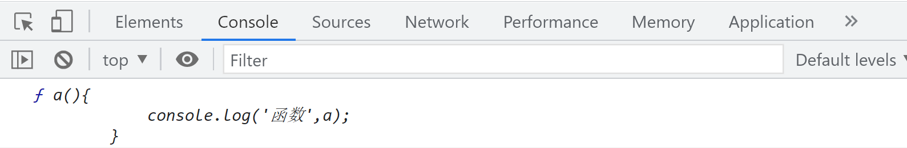

#### 10.3  特点

##### 10.3.1 变量解析时

~~~
变量在预解析时，会把声明语句提升到最前边（赋值前打印返回undefined）。
~~~

注意：

**变量如果不带var，变量是不会进行预解析的；**

只有带var的变量才会进行预解析，只提升声明，不会把赋值过程进行提升

表达式定义的函数也是当做变量去解析。

##### 10.3.2 函数解析时

解析函数的时候，函数定义方式不同，解析过程也不大一样：

- 函数式声明

~~~
function的函数体在预解析时，会把整个函数体提升至最前边，整个函数都要被提升：
func();
function func(){};
func();
~~~

- 表达式函数(当成变量去解析)

~~~
只会提升函数表达式的声明，不会执行(真正执行函数表达式前调用会返回undefined)，只会提升变量 
var func = function(){};
func();
~~~

解析过程中：

- 如果函数与函数重名，会覆盖（后面的函数会把前面的覆盖掉）
- 如果函数与变量重名，且变量没有值的时候；会忽略变量； ==保函数，去变量==
- 如果函数与变量重名，变量赋值了，变量的值会覆盖函数；(后面的会覆盖前面的)
- 记住：函数有形参有局部变量，优先解析形参


练习题：

~~~js
console.log(a); //undefined   
var a = 0;
console.log(a); //0
~~~

~~~js
console.log(a);//函数结构    
var a = '我是变量';
function a(){ 
	console.log('我是函数');
}
console.log(a);//我是变量  
~~~

~~~js
console.log(a); //函数结构
a++;
console.log(a);//NaN    
var a = '我是变量';
function a(){
  console.log('我是函数') 
}
console.log(a);//我是变量
a();//Uncaught TypeError: a is not a function
~~~

~~~js
console.log(a);//undefined   
var a = 0;
console.log(a);//0   
function fn(){
 	console.log(a);//undefined    
 	var a = 1;
 	console.log(a);//1    
}
fn()
console.log(a);//0   
~~~

~~~js
console.log(a);//undefined    
var a = 0;
console.log(a);//0    
function fn(){
   	console.log(a);//0    
   	a = 1;
   	console.log(a);//1   
}
fn()
console.log(a);//1  
~~~

~~~js
console.log(a);//函数1结构
var a = 10;
console.log(a);//10
function a(){
	console.log(1);
}
console.log(a);//10
var a = function(){
	console.log(2);
}
console.log(a);//函数2结构
~~~

~~~js
function fn(a){ 
	console.log(a);//undefined --> 多出来的形参，
	var a = 3; 
	console.log(a);//3
}
fn();
//记住：函数有形参有局部变量，优先解析形参
~~~

~~~js
function fn(a){
	console.log(a);//2 
	var a = 3;
	console.log(a);//3
}
fn(2);
~~~

~~~js
function fn(b){
	console.log(a);//undefined 
	var a = 3;
	console.log(a);//3
}
a = 4;
fn();
console.log(a);//4 
~~~

~~~js
var n = 1;
fn(n);
function fn(n) {
	console.log(n);//函数主体 
	function n() {
		console.log(666);
	}
	var n = 2;
	n();//报错 
}
~~~

```js
var num = function(){};
function f4(num){
    console.log(111);//111
    function num(){
        console.log(222);
    }
    console.log(num);//函数结构
}
f4(num);
```


### 十一、函数类型

#### 11.1 具名函数

~~~js
function fn(){
    console.log("I am 普通函数");
}
~~~

#### 11.2  匿名函数

 顾名思义，就没有名字的函数，在实际开发中使用的频率非常高！也是学好JS的重点。

匿名函数默认情况下不能直接书写，会报语法错误，可以写在以下情况里：

- 对象的键值里；

  获取对象的键值:

  - 一个是通过对象.键名
  - 一个是通过对象['键名'] 引号单引可以；双引也可以
  - 对象的键名默认都是按照字符串的方式解析的

- 方法的实际参数里；`arr.push(function(){})`

- 表达式函数;  `var f1 = function(){}` ==要在声明之后调用==；

- 作为函数的返回值 `return function(){}` 

~~~js
var obj = {
	a:1,
	b:function(){}//匿名函数
}
~~~

#### 11.3 立即执行函数 IIFE

> 立即执行函数也叫做匿名函数自调用  (Immediately Invoked Function Expression)

~~~js
function (){
    console.log("i am IIFE");
}//Uncaught SyntaxError: Function statements require a function name
~~~

发现报错啦！！！

- 解决方法只需要给匿名函数包裹一个括号即可：（用的比较多）

```js
(function (){
    //由于没有执行该匿名函数，所以不会执行匿名函数体内的语句。
    console.log("匿名函数不会报错了");
})
```

+ 匿名函数后面加上一个括号即可立即执行！

```js
(function (){
        console.log("运行匿名函数");
    })()
```

+ 在函数前添加 ！~ + - 一元运算符

```js
!function (){
        alert("heng");
    }()  
```

+ 倘若需要传值，直接将参数写到括号内即可：

```js
(function (str){
    console.log("Hello   "+str);
    return str;
})("World")
```

- 如果需要接收返回值，需要定义一个变量

```js
var result = (function(){
	var a = 10;
	var b = 20;
	var sum = a + b;
	return sum;
})();
console.log(result);
```

##### 11.3.1 IIFE特点

- 匿名函数自调用是在定义的同时执行函数，所以一般外部引用的文件，开头都会写一个立即执行函数，然后将其余代码写在立即执行函数中；
- 匿名函数自调用==只能执行一次==
  - 如果需要一个函数可以执行多次，这个函数必须是有名函数
  - 如果函数没有名字要想执行必须是自调用，但是只能执行一次
- 匿名函数自调用，函数整体不会发生预解析，但是函数内部执行代码是要去预解析

~~~js
(function(){
	var a = 1;
	function fun(){
		console.log(a);
	}
	fun();
    
    /*
    function fun(){
		console.log(a); // 1
	}
    var a = 1;
	fun();*/
})()
~~~

##### 11.3.2 IIFE作用（背）

+ 防止外部命名空间污染

  当如果在一个script标签中出现两个或两个以上的立即执行函数，那么必须在每一个立即里执行函数的后面==添加一个分号==；

  例如：两个同名变量，为了防止前面的变量被覆盖，可以将两个变量放在IIFE里；

  ~~~js
  (function(){
  	var name = '张三';
  	function f1(){
  		console.log(name); //张三
  	}
  	f1();
  })();
  
  (function(){
  	var name = '李四';
  	function f1(){
  		console.log(name); //李四
  	}
  	f1();
  })();
  ~~~
  
+ 隐藏内部代码暴露接口

  ~~~
  后期开发都使用的是一个外部的js链接，但是实际的代码看不到
  ~~~

+ 对项目的初始化,只执行一次  (引入文件时)

##### 11.3.3 全局污染

> 由于在全局环境中发生了重名的变量或者是重名的函数，都会是后者覆盖前者针对于前者的变量值/函数结构都覆盖不见了，这种现象就叫做全局污染

大家都在全局中写代码，很容易造成命名冲突，导致代码冲突。

ES6中代码冲突会直接报错。所以要养成好的习惯不要在全局去声明变量。

~~~js
var age = 12;
var age = 21;
function fun2() {
    var name = 'zhangsan';
    var name = 'lisi';
    console.log('姓名:',name);
}
console.log('年龄:',age);
fun2();
~~~

运行：


解决策略：不要声明全局变量

~~~js
(function(){
	var name = 'wangwu';
	console.log(name);
})();

(function(){
	var name = 'zhaoliu';
	console.log(name);
})();
~~~

立即执行函数本身就是为了避免在全局写代码，避免冲突的。

立即执行函数自执行也叫开启一个新的命名空间。即开启新的作用域，此作用域和其他的不会冲突。

### 十二、函数参数的高级

#### 12.1 获取函数参数个数

- 使用**arguments对象的length属性**可以获取函数的==实参个数==。

- arguments对象==只能在函数内可见==，因此arguments.length也只能在函数体内使用。

- 使用**函数对象的length属性**可以获取函数的==形参个数==,

  该属性为只读属性,在函数体内和函数体外都可以使用

~~~js
function add(a,b,c) {
    console.log(add.length)//函数形参的个数
    console.log(arguments.length)//获取实参的个数
    //arguments：实参集合列表对象 也是伪数组 但是可以按照数组的简单操作(for、[下标]、length) object类型
    return a+b+c;
}
console.log(add.length)//函数形参的个数
console.log(add(1, 2));
~~~

如果想要知道对象内部的一些属性数据的话，需要使用`console.dir()`


#### 12.2 使用arguments对象

- arguments对象表示函数的实参集合 (伪数组) ,仅能够在函数体内可见,并可以直接访间。

- 参数对象是一个伪类数组,不能够继承Array的原型方法。

  可以使用数组下标的形式访问每个实参,例如参数[0]表示第一个实参

- 通过修改length属性值，可以改变函数的实参个数。

#### 12.3 使用场景

- 通过arguments伪数组中的length属性来进行统计实际每一次调用函数的时候，到底给了多少实参

- arguments帮助咱们解决了当无法确定形参个数的时候，可以通过arguments来操作实参


其实函数定义的形参可写可不写（ES5当中）,但是虽然可以不写，建议以后写上形参


案例1：输入一组数字，求平均值的函数

```js
//var sum = 0;  //全局变量  易受污染
function f() {
    //先获取到所有的实参 使用arguments
    var sum = 0;
    for (var i = 0; i < arguments.length; i++) {
        sum += arguments[i];
    }
    return sum / arguments.length;
}
console.log(f(12, 34, 54, 32, 100, 98, 45, 34, 120));  
```


案例2：arguments.length，拿得是实参的个数  可以让我们一个函数具有多种功能

```js
<script>
	function addOrSub(a, b, c) {
		if (arguments.length == 2) {
			return a - b;
		} else if (arguments.length == 3) {
			return a + b + c;
		}
	}
	console.log(addOrSub(10, 20)); //传递两个实参就做减法
	console.log(addOrSub(10, 20, 30)); //传递的是三个实参就做加法
</script>
```


#### 12.4 函数形参默认值

```js
function add(a,b,c=0) {//es6的语法，可以直接在形参后面赋值；
    return a+b+c;
}
console.log(add(1, 2));//3 不加默认值，就会返回NaN
```

注：

- 当如果有一些形参没有实参的时候，则需要给形参赋予初始值,如果没有实参，则按默认值来
- 当形参有默认值也有具体的实参，按照实参算
- 咱们给参数添加默认值的话，一般都写在最后一个形参的身上


案例1：es5中给形参添加默认值

```js
function add(a,b,c) {
    c == undefined ? 0 : c;  //根据值的判断
    //根据类型的判断
    c = typeof c === "undefined" ? 0 : c;
    //typeof c === "undefined" ? c = 0 : c;
    return a+b+c;
}
console.log(add(1, 2));
```

案例2：当点击不同的按钮的时候 让页面加载相应的颜色

~~~html
<button id="red">红色</button>
<button id="green">绿色</button>
<button id="blue">蓝色</button>
<button id="pink">粉色</button>
~~~

~~~js
var oRed = document.getElementById("red");
var oGreen = document.getElementById("green");
var oBlue = document.getElementById("blue");
var oPink = document.getElementById("pink");

function changeColor(col){
	document.body.style.backgroundColor = col;
}
oRed.onclick=function () {
	changeColor("red");
}
oGreen.onclick=function () {
	changeColor("green");
}
oBlue.onclick=function () {
	changeColor("blue");
}
oPink.onclick=function () {
	changeColor("pink");
}
~~~


## JavaScript对象


### 一、 JavaScript前言

#### 1.1 对象的组成

属性：属性名（==字符串==）和属性值（任意类型）组成；(一些不会经常发生变化的数据记录在属性里面)

方法：一种特别的属性(属性值是函数);   (这类对象可以做的事情)

#### 1.2 引用变量的赋值

**默认情况下**对象和对象之间比较的是内存地址，所以都是为false的

**特例1：**一个对象将自己的地址值传递 (赋值) 给了另一个对象，覆盖了人家的地址，则两个对象公用了一个地址值；则两个变量哪一个修改都会影响到另一个

**特例2：**特例情况2：等号右侧的值为基本数据类型的时候，则一个修改(看哪一个变量被重新赋值了)，另一个不会影响

```js
//默认情况：
var obj2 = {a:1}; // 0x19
var obj3 = {a:1}; // 0x20
console.log(obj2 == obj3); //false

//特例情况1：
var obj4 = {a:1};
var obj5 = obj4; //将obj4对象的内存地址值赋值给了左侧的obj5变量
obj5.b = 2;
console.log(obj4); //{a:1,b:2}
console.log(obj5); //{a:1,b:2}
console.log(obj4 == obj5); //true

//特例情况2：等号右侧的值为基本数据类型的时候
var a = 10;
var b = a;
b = 20;
console.log(a); // 10
console.log(b); // 20
```


### 二、JavaScript对象定义

在 JavaScript 中，几乎“所有事物”都是对象。

- 布尔是对象（如果用 new关键词定义）var bool = true;
- 数字是对象（如果用new关键词定义）var num = 100;
- 字符串是对象（如果用new关键词定义）var str = "111"
- 日期永远都是对象  `var now = new Date();`
- 正则表达式永远都是对象  `var pattern = //`     new RegExp()
- 数组永远都是对象  var arr = []
- 函数永远都是对象  var f1 = function(){}
- 对象永远都是对象  var obj = {}

所有 JavaScript 值，除了原始值，都是对象。

#### 2.0 对象的几种创建的区别：

> 字面量、使用new关键字创建对象  ==> 适用于少量对象创建
>
> 使用工厂函数来创建：不带有任何的感情色彩，就是一个纯空的对象 {}
>
> 使用构造函数来创建：带有感情色彩的，关于某一类对象的创建

#### 2.1 字面量方式创建对象

情况1：在声明的期间知道应该存放哪一些属性和方法

~~~js
var person = {
    		//属性
    		  name:"小储", 
              age:18,
    		//方法
              eat:function(){
                console.log('喜欢吃饭'); 
             }};
~~~

情况2：有可能在开发时候不确定应该存入什么属性和方法，都是根据实际程序的需要来存入

~~~js
var obj = {};
obj.name = '小储';
obj.study = function(address,who){
    return '酷爱在'+address+'和'+who+'学习';
}
//调用方法
console.log(obj.study('教室里','同学们'));
~~~


#### 2.2 使用new关键字创建对象

~~~js
var obj = new Object();
~~~

给对象添加属性

~~~js
obj.name = '小储';
obj.age = 18;
obj.gender = "男";
~~~

给对象添加方法

~~~js
obj.buy = function(){
	console.log('小储爱吃饭~~~');
}
~~~

调用方法

~~~js
obj.buy()
~~~

#### 2.3 使用工厂类创建对象

之前的两种创建对象方式，大家不难发现，我们只能一个对象一个对象的创建，当想要批量创建多个对象的时候，代码量就会很多，所以我们需要一个可以重复做创建对象的一个函数，辅助我们批量创建对象，那么工厂类的核心其实就是利用函数达到功能复用的效果，当然函数名要根据实际功能来命名。

~~~js
function createPerson(name,age,sex){
	  //1.利用new关键字来创建空对象
      var obj = new Object(); //{}
      //2.给这个对象添加属性和方法
      obj.name = name; //具体哪一个对象，实际的值来自于函数的实际参数
      obj.age = age;
      obj.sex = sex;
      obj.study = function(){
          console.log('学习');
      }
      //3.返回创建好的对象
      return obj;
}
~~~

调用函数，可以创建多个对象

~~~js
var p1 = createPerson('晓沫',18,'女');
var p2 = createPerson('小储',18,'男');
~~~

#### 2.4 使用构造函数创建对象

使用new运算符调用构造函数,可以构造一个实例对象，只要是函数名前出现了new关键字，就会在堆内存中创建了一个空对象，**只要函数前面加new，就是创建这类对象**

构造函数说明：

- 构造函数里面的this指向当前调用函数时候所创建的那个新对象的地址(new 后面的函数)

- 函数名首字母大写，并不是强制规定，只是一种约定

##### 2.4.0 new关键字具体做了什么

+ 在堆内存中开辟了一个空间,分配唯一的地址值，堆内存中存储该对象

* 函数内部的this指向的是当前的实例对象（等号左侧的变量）
  * 在任何一个函数的前面都可以添加new关键字
  *  一旦加了，你的目的一定是为了创建一个这类的对象，目的是为了得到一个新对象，然后有对象，才会有地址值
* this.属性的方式给当前这个内存地址值添加属性或者方法
* ==不需要return==,直接将对象返回
* 构造函数会直接将对象给变量，而不是通过return返回的

> 注：
>
> 在基本数据类型前面添加new,不管是什么函数，只要是函数的前面添加new，都是在创建这类对象;这个新对象会被执行prototype连接；这个新对象会绑定到函数调用的this上（this的绑定在这个步骤完成）；
>
> ```js
> console.log(new String("hello"));
> ```
>
> 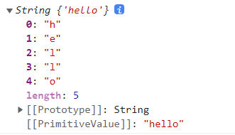

##### 2.4.1 创建构造器

~~~js
function Person(name, age, sex) {
    this.name = name;
    this.age = age;
    this.sex = sex;
    this.eat = function(address){
        console.log(this.name+'在'+address+'吃饭')
    };
}
~~~

##### 2.4.2 调用构造器

通过 *new* 关键词调用构造器函数可以创建相同类型的对象：

~~~js
var p1 = new Person("小储"， 18， "男");
p1.eat('北京');//小储在北京吃饭
~~~

##### 2.4.3 为对象添加属性

~~~js
为已有的对象添加新属性:
p1.hobby = "eat";
//新属性被添加到 p1,不是任何其他 person 对象
~~~

##### 2.4.4 为对象添加方法

~~~js
为已有的对象添加新方法:
p1.hobby = function () {
    return "drink";
};
//新方法被添加到 p1，不是任何其他 person 对象。
~~~

##### 2.4.5 内建JavaScript构造器

JavaScript 提供用于原始对象的构造器：

~~~js
var x1 = new Object();    // 一个新的 Object 对象
var x2 = new String();    // 一个新的 String 对象
var x3 = new Number();    // 一个新的 Number 对象
var x4 = new Boolean();   // 一个新的 Boolean 对象
var x5 = new Array();     // 一个新的 Array 对象
var x6 = new RegExp();    // 一个新的 RegExp 对象
var x7 = new Function();  // 一个新的 Function 对象
var x8 = new Date();      // 一个新的 Date 对象
~~~

Math() 对象不再此列。Math 是全局对象。new 关键词不可用于 Math。

~~~js
function Person(name,age,gender){
				this.name = name;
				this.age = age;
				this.gender = gender;
				this.eat = function(){
					console.log(this.name+'吃卤煮~~');
				}
			}
			
var person = new Person('大沫沫',18,'女');
~~~

思考：

如果在构造函数中return了一个基本数据类型和一个引用类型对象，那么构造方法返回的是什么？

结论：

> return后面无论返回哪一个基本数据类型数据，都是新创建的新的对象，与返回值无关,return写在顶部，也是返回的对象，只不过是空对象；
>
> return后面如果返回引用数据类型，则得到就是return后面的数据，与创建的新对象就无关了

### 三、JavaScript对象属性

属性指的是与 JavaScript 对象相关的值，通常可以被修改、添加和删除，

JavaScript 对象是无序属性的集合。

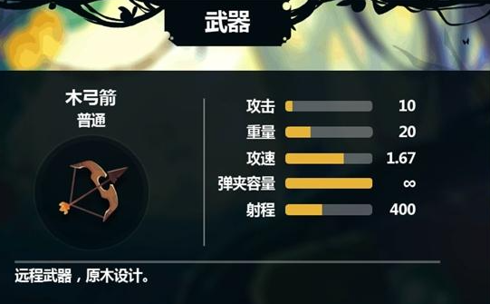

#### 3.1 定义JavaScript的属性

- 对象的属性是由**键值对**组成的

- 每个键值对，键和值之间用  ：分隔       例如：name：'zs'

- 所有的键都被称作是这个对象的**属性名**，值叫做属性值

- **对象的属性，本质上都是字符串**，只不过大部分属性是可以省略引号不写的；

  少数情况会出现不符合命名规范的,就必须带引号

  例如：'man-type':'渣男'   这个属性名必须使用引号；属性名不符合命名规范就得带引号

~~~js
var obj = {
        name:'小明',
        'age':18,
        gender:'female',
        play:function(){
            console.log('爱玩~');
        },
		'character-type':'渣男'//这个属性名必须使用引号；属性名不符合命名规范就得带引号
};
~~~

#### 3.2 属性的增和改

通过简单的赋值，向已存在的对象添加新属性,只要是操作属性，之前不存在的则是添加；否则是替换

- 属性的添加的点语法

  点语法，写起来简单，但是某些场合无法使用.去操作

  ~~~js
  obj.weight = 90;         有则更改，无则添加
  ~~~

  下面两种情况必须使用[]，其余的都可以使用.语法

  ~~~js
  obj.character-type = '嘿嘿';   改成=> obj[character-type] = '嘿嘿';
  ~~~

  无法操作，因为.后面的属性名不合法，只能使用[]去操作

  ~~~js
  var a = 'aaa';   obj.a = 'bbb'; ==>  {a:'bbb'}
  //但是如果obj[a] = 'bbb' [a]就会被等价替换成'aaa'   {'aaa'：'bbb'}
  ~~~

  如果是要使用变量当中的值为属性，那么.语法也没办法操作；

- 中括号语法
  + `obj['weight'] = 100; `  有则更改，无则添加；
    + 对象[a] ：这个是按照a变量的值来定义对象的属性名
    + 对象['a'] : 这个是按照a字符串来定义对象的属性名；
  + `obj['character-type'] = '嘿嘿'; `   当对象的属性名有特殊字符，必须使用[]
  + `var a = true;   obj[a] = 'bbb'; ` 如果我们需要以变量当中的值为属性去操作对象的话，必须使用[]

#### 3.3 属性的删除

delete 关键词从对象中删除属性：

+ `delete obj.age;`
+ `delete obj['character-type'];`
+ `delete obj[a];`

- delete 关键词会同时删除属性的值和属性本身。
- 删除完成后，属性在被添加回来之前是无法使用的。
- delete 操作符被设计用于对象属性。它对变量或函数没有影响。

#### 3.4 属性的查询

~~~js
var person = {name:"red romance", age:18, color:"yellow"};
~~~

~~~js
1. objectName.property             eg:	  person.age
2. objectName["property"]          eg:    person["age"]
3. objectName[expression]          eg:    x = "age"; person[x]
~~~

#### 3.5 for..in语句遍历对象属性

for...in 循环中的代码块会为每个属性执行一次。

==如果要拿到键值，必须要用[],因为循环的键名都是字符串==

~~~js
var person = {name:"Barry", age:18}; 
for(var key in person) {
	console.log(key,person[key]);
}
~~~

### 四、JavaScript对象方法

#### 4.1 创建对象方法

~~~js
study:function(){
	//写具体的业务逻辑代码
}
~~~

#### 4.2 访问对象方法

~~~js
objectName.study()；
~~~

~~~js
var person = {
                  name : "Barry",
                  age  : 18,
                  getname : function() {
                      return "诸葛钢铁";
                  }
                  };
console.log(person.getname());
~~~

思考：如果调用方法的时候没有添加圆括号，会发生什么？

> 答：会得到这个对象键名对应的键值function(){}结构，并不会得到函数体中的内容

#### 4.3 this关键字 [非常重要]

this是一个内置的**对象**，存储的是对象的地址值。

this经常在**函数内部**去使用，在函数外部**统统代表的是**window对象。

this这个变量当中存储的是**一个对象的地址**，this主要代表的是这个函数的执行者或者调用者是谁。

要知道，**函数中this的指向在函数定义时是决定不了的**，只有在**函数执行时**才能决定指向谁。

实际上，**==this主要代表的是这个函数的执行者或者调用者==**，也就是说，==**谁调用函数，this就指向谁**==。

##### 4.3.1 this的使用场景

- 当函数中有this，但是函数没有被上一级对象调用时

~~~js
function fn1() {
		console.log(this); //window
			}
fn1();
window.fn1();
~~~

~~~js
function f() {
            var a = "hello";
            console.log(this.a);//undefined
            console.log(this);//window
}
f();
//只要是一个对象输出属性值，管这个属性名是否真实存在，要是有这个属性名则正常得出结果；没有这个属性名则得到一个undefined
~~~

思考：

~~~js
function fn2() {
				console.log(this); //window
				function fn3() {
					console.log(this);
				}
				fn3();//window
			}
fn2();
~~~

- 当函数中有this，并且被上一级对象调用时，函数中的this指向的就是调用该函数的对象。 

~~~js
var one = {
            a: "hello",
            fn: function() {
                console.log(this);  //one
                console.log(this.a);//hello
            }
}
one.fn();
~~~

- 当函数中有this，且函数中包含多个对象时，==找离函数最近的那一个对象==

~~~js
var one = {
            a: "hello",
            b: {
                a: "world",
                fn: function() {
                    console.log(this.a); //world
                    console.log(this); //{a: "world", fn: ƒ}
                }
            }
        }
one.b.fn();
~~~

有个特殊的例子需要注意一下

~~~js
var one = {
            a: "hello",
            b: {
                a: "world",
                fn: function() {
                    console.log(this.a); //undefined
                    console.log(this); //window
                }
            }
        }
var j = one.b.fn;
j();
~~~

这里可能会比较迷惑，为什么这里的this又指向了window呢？

其实道理也很简单，因为这里只是把one.b.fn的值赋值给了j，并没有调用函数。

后面执行到 j() 才调用了函数，而此时没有任何对象调用 j ，所以函数内部的this就会指向window。

- 构造函数内部有this，这个 this一般代表的是**准备实例化出来的那个新的对象**

构造函数当函数用又分为多种情况：

当普通函数用和当构造函数用

**任何的函数都可以当普通函数用也可以当构造函数用**，**就看你调用函数的时候有没有加new** 

**加了就是把函数当构造函数用，没加new还是当普通函数用**；

**函数是普通函数还是构造函数并不是定义说了算，而是调用说了算**；

~~~js
function Car(name,color,price){
    this.name = name;
    this.color = color;
    this.price = price;
    this.run = function(){
        console.log('5个油。。。');
    }
}
~~~

调用函数时，没有添加new

~~~js
//此时就说这个函数是当普通函数用的
var result = Car('奔驰','black',200000);
console.log(result);
//此时这个函数内部的this 是window
//函数的返回值看的就是return,没有return就是undefined;
console.log(color);
//普通函数调用，本质是在window对象上增加了name color price run属性和值
//在外部，我们就可以通过这个window的属性拿到函数内部的局部变量的值；
~~~

调用函数时，添加new

~~~js
var c1 = new Car('红旗','black',10000000);
console.log(c1);
c1.run();
//此时就说这个函数是当构造函数用的
//此时这个函数内部的this 是准备实例化出来的对象，因为构造函数本身就是实例化对象用的；
//返回值：如果没写return或者return后面是基本值，那么返回的就是实例化出来的对象本身，和return没关系
//如果return后面是对象类型的数据，那么返回的就是对象数据，和实例化出来的对象没关系
~~~

#### 4.4 字符串内建方法

使用 String 对象的 toUpperCase() 方法，把文本转换为大写：

~~~js
<script>
     var test = "Hello World";
     var test1 = test.toUpperCase();
     console.log(test1);
</script>
~~~

##### 4.4.1 charAt

`字符串.charAt() `：根据下标来获取字符

参数：一个索引值

返回值：返回找到的对应字符

==注：==字符串[下标]获取字符的方式在IE7以下的浏览器无法正常使用 undefined

##### 4.4.2 charCodeAt

`字符串.charCodeAt()`:根据传入的下标返回对应的字符的ASCII码

参数：一个索引值

返回值：返回找到的对应字符的Unicode码

##### 4.4.3 concat

`字符串.concat()`:字符串的合并,合并的时候不一定非要和字符串合并，**任何类型都可以**

工作原理：如果concat合并的是其他的非字符串类型，则程序会隐式的调用toString方法，转换成字符串然后再和原字符串合并

返回值：返回拼接好的字符串,不改变原来的；需要拿新变量接收；

##### 4.4.4 fromCharCode

`String.fromCharCode()`：把unicode码转化为对应的字符

参数为ASCII码，返回值为对应的字符

##### 4.4.5 indexOf

`字符串.indexOf()`：从字符串当中查找第一个参数出现的首次位置的下标，默认查找整个字符串

第一个参数：要查找的元素；

第两个参数：为搜索的**起点**下标

返回值：如果有返回对应的下标，如果没有找到返回-1

##### 4.4.6 lastIndexOf

`字符串.lastIndexOf()`：从字符串当中查找第一个参数出现的末次位置的下标，默认查找整个字符串

第一个参数：要查找的元素；

第两个参数：搜索的**终点**下标

##### 4.4.7 localeCompare

`字符串1.localeCompare(字符串2)`：比较字符串1和字符串2的大小

返回值：如果前者大返回1 如果前者小返回-1 如果相等返回0

注：比较的是ASCII码值

##### 4.4.8 字符串的截取

`字符串.slice()`

1个参数：起始下标（默认到字符串末尾）

2个参数：slice(起始下标，终点下标-1)；==包含起始位置的但是不包含结束位置==;

支持负值，负值表示从后往前的个数；(-2表示从开始值到倒数第二个字符串)

返回值：返回截取的字符串

`字符串.substr()` 用的较多

第1个参数：起始下标（默认到字符串末尾）

第2个参数：截取的长度

支持负值，负值表示从后往前的个数；

返回值：返回截取的字符串

`字符串.substring()`

第1个参数：起始下标（默认到字符串末尾）

2个参数：slice(起始下标，终点下标-1)；==包含起始位置的但是不包含结束位置==;

倒着截取：字符串长度来减一个数（例如：str.length - 3）

> 总结:
>
> slice倒着截取可以直接写成一个负数参数;也可以使用字符串的总长度来减一个数,一般情况下咱们选择直接写一个负数
>
> substring必须是使用长度来减一个数

##### 4.4.9 split

`字符串.split()`：以指定字符为间隔（切割点）将字符串==转化为数组==，

字符串有特定规律是使用；例如（"2022-5-14"）

返回值：返回生成的数组

> split中的参数是字符串中必须存在的；(必须根据这个字符串来分割)
> join中的参数是可以自定义的

~~~js
var str = "2022-5-14";
var arr = str.split('-');
console.log(arr);// ['2022', '5', '14']
~~~

##### 4.4.10 大小写的转换

`字符串.toLowerCase`、`字符串.toUpperCase`

返回值:返回转化后的字符串,也是新串

应用场景：验证码

~~~js
var code = "tYhM";  //网站模拟验证码
var num = prompt('请输入你的验证码');
console.log(num); //tyhm
//然后咱们转换形式，要求统一，无论用户输入什么，只要比较值，不要求大小写
TYHM == TYHM
console.log(code.toUpperCase() == num.toUpperCase()); 
~~~

##### 4.4.11 替换

`replace:字符串的替换` ;只能替换第一个元素；全部替换需要搭配正则使用；

第一个参数：需要替换元素；

第二个参数：目标元素；

`str.match(/需要替换元素/g)` 搭配正则使用；找到匹配项返回数组

`search()` 搜素字符首次出现的下标位置

返回值：有则返回数值，无则返回-1；

~~~js
//str.replace('1','**');//替换字串
//console.log(str.match(/1/g));//找到匹配项返回数组
//console.log(str.search());
~~~

##### 4.4.12 trim()

`字符串.trim()` ；去除开头和结尾的空格；

##### 4.4.13 ES6方法

~~~js
//includes(str) : 判断是否包含指定的字符串 返回值为布尔值
	var str = 'ajshdhak123eiuf';
	console.log(str.includes('1235'));
//startsWith(str) : 判断是否以指定字符串开头  返回值为布尔值
	console.log(str.startsWith('aa'));
//endsWith(str) : 判断是否以指定字符串结尾   返回值为布尔值
	console.log(str.endsWith('ff'));
//repeat(count) : 重复指定次数
	console.log(str.repeat(2))
~~~

#### 4.5 getter方法和setter方法

getter和setter是针对于**对象的键值**的一种动态设置

> 注：
>
> 使用该方法前面需要添加 `get` 或者是 `set`
>
> 必须是es6的语法，使用简写方式：省略`：`和 `function`
>
> ==setter==这个方法，要求==必须要有形参==
>
> `set`一般用于判断用户输入的字符串是否合法，通过外部设置为对象添加方法；必须是==赋值==的方式，不能是调用！！！只有符合条件的输入才有效；
>
> `get` 用于动态获取对象的键值

~~~js
<script>
        var obj = {
            name:'张三',
            sex:"男",
            set setAge(value){//必须传形参
                if(value>=1 && value<=120){
                    this.age = value;
                }               
            },
            get getAge(){  
                return this.age;
            }
        }
	obj.setAge = 105;//必须是赋值的方法，满足条件，age修改为105
	console.log(obj.getAge); // 105  
</script>
~~~


### 五、堆栈的区别

- **栈(stack)**：栈会自动分配内存空间，会自动释放，存放**==基本类型和引用数据类型的变量==**

  栈中保存的是==基本数据类型==以及引用数据类型的变量（==地址值==）

  优点：存取速度比堆快

  缺点：存在栈中的数据大小与生存期必须是确定的，缺乏灵活性。

  **在栈中有两个执行环境：**

  **1）全局执行环境（全局执行上下文）：存储的是基本数据类型和引用数据类型变量**

  **2）函数执行环境（函数执行上下文）：执行的是函数体内部的数据**

  **栈内存：全局执行环境和函数执行环境存在 ==先进后出，后进先出==的特点**，相比较堆来说，内存较小。

  **整体程序执行完毕之后全局执行环境会自动销毁**

  

- **堆(heap)**:动态分配的内存，大小不定也不会自动释放，存放**<span style="color:red">引用类型的对象</span>**

  引用类型数据的变量是通过内存的地址值到堆内存中进行查找相应的数据

  **注意：堆内存中存储数据是无序的，相比较栈来说，内存较大**

  指那些可能由多个值构成的对象，保存在堆内存中。
  
  堆内存中的对象不会随方法的结束而销毁，即使方法结束后，这个对象还可能被另一个引用变量所引用(参数传递)，创建对象是为了反复利用。（闭包）
  

#### 5.1 基本数据类型使用

下图演示了这种基本数据类型赋值的过程：

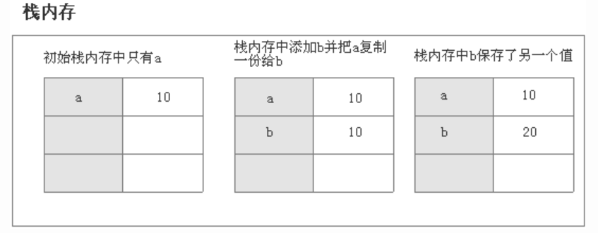

b获取的是a值得一份拷贝，虽然，两个变量的值相等，但是两个变量保存了两个不同的基本数据类型值。

b只是保存了a复制的一个副本。所以，b的改变，对a没有影响。

~~~js
var a = 10;
var b = a;  //a将自己的值赋值给了b变量  值传递
b = 20;     //b将自己的值修改成了20
//基本数据类型是你改了，与我无关
console.log(a); //10
console.log(b); //20
~~~


#### 5.2 引用数据类型使用

引用类型是存放在堆内存中的对象，变量其实是保存的在栈内存中的一个指针（保存的是堆内存中的引用地址），这个指针指向堆内存。

引用类型数据在栈内存中保存的实际上是对象在堆内存中的引用地址。

通过这个引用地址可以快速查找到保存中堆内存中的对象

~~~js
var obj1 = new Object();
var obj2 = obj1;
obj2.name = "我有名字了";
console.log(obj1.name); // 我有名字了
~~~

说明这两个引用数据类型指向了同一个堆内存对象。

obj1赋值给obj2，实际上这个堆内存对象在栈内存的引用地址复制了一份给了obj2，

但是实际上他们共同指向了同一个堆内存对象，

所以修改obj2其实就是修改那个对象，通过obj1访问也能访问的到。

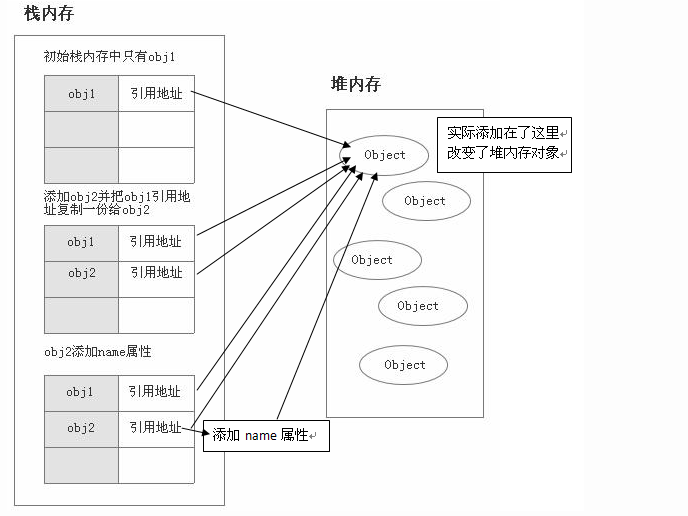


#### 5.3 案例练习

如果是基本数据类型，赋值的时候直接赋的就是基本的数据值，而且是直接存储在栈里

如果是对象数据类型，把它赋值给变量的时候，赋值的是这个对象数据的地址


~~~js
var arr = [1,2,3];
var arr1 = arr; //将arr的内存地址值赋值给arr1
arr[1] = 22;
console.log(arr); //[1,22,3]
console.log(arr1);//[1,22,3]
~~~


~~~js
var arr = [1,2,3];
var arr1 = arr;
arr = [1,22,3];
console.log(arr1);
~~~

基本数据传参和对象数据传参区别

- 基本数据传参

  function add(){} 等价于 var add = function(){}

  在执行函数之前，先判断栈的引用是否在堆中存在，当调用函数的时候，就会产生一个函数执行环境

  

~~~js
var a = 10;
var b = 20;
function add(a,b){
		a = 40;
		return a + b;
}
console.log(add(a,b));
console.log(a,b);
~~~

- 对象数据类型传参


~~~js
var arr = [1,2,3];
function fn(arr){
		for(var i = 0; i < arr.length; i++){
			arr[i] += 2;
		}
}
fn(arr);
console.log(arr);
~~~

总结：

1、程序一开始执行，碰见了全局环境，首先会创建全局环境并且进行压栈，全局代码执行的时候依赖的就是全局环境当中的东西；比如 全局变量（全局变量如果存的是基本数据类型，那么这个值是直接存在栈当中的，如果这个变量存的是对象类型（函数、数组），那么数据是要在堆结构当中开辟自己的空间专门存储的。然后把堆里面这块空间的地址存给栈当中的对应变量）；

2、当程序执行碰到了函数调用；函数是比较特殊，因为它也可以执行；函数执行的时候也要有自己的环境去依赖。因此函数执行也是创建自己的函数环境进行压栈（函数执行环境一定是压在全局执行环境之上的），局部变量，是在函数环境当中存在的，只有函数执行，局部变量才会出现。函数执行完成以后，函数环境要弹出栈（销毁归还内存）,局部变量也就不复存在了。

3、当函数调用完成以后，会继续执行全局代码，一直到所有的代码都执行完成，代表程序执行结束，程序结束的时候，我们的全局环境最后出栈。

#### 5.4 new关键字的作用


构造函数当做普通函数来使用的时候，函数内有方法

```js
function fn(a, b) {
    this.a = a;
    this.b = b;
    this.c = function () {
        console.log(111);
    }
}
var result = fn(10, 20);//fn()没有返回值
console.log(result);//undefined
```


使用new关键字创建对象


```js
function Person(name,age,sex){
		this.name = name;
		this.age = age;
		this.sex = sex;
		this.play = function(){
			console.log('好玩~~');
		}
}
var d1 = new Person('韩梅梅',12,'女');
console.log(d1); //Person {name: '韩梅梅', age: 12, sex: '女', play: ƒ}
```

==new关键字的作用==

1、开辟内存空间(堆)

2、this指向该内存（让函数内部的this）

3、执行函数代码

4、生成对象实例返回（把空间的地址返回）

### 六、JavaScript原型对象

思考：下列代码有什么弊端？

~~~js
function Villa(size,styleType,price){
				this.size = size;
				this.styleType = styleType;
				this.price = price;
 			    this.live = function(){
				    console.log('住的很舒服');
		}
}		

var v1 = new Villa(1000,'新中式',700);
v1.live();
console.log(v1.styleType);
			
var v2 = new Villa(2000,'简欧',1000);
v2.live();
console.log(v2.styleType);
~~~

这个live是个方法， 每个实例化对象内部都会有单独的自己的这个方法

如果每个对象去调用自己的这个方法， 最终实现的功能是一样的，那么就会造成内存浪费很厉害。所以我们得想办法让所有的实例化对象去调用同一个方法。 以达到资源共享， 节省内存的目的；

#### 6.1 什么是原型对象


所有 JavaScript 对象都从**原型**继承属性和方法。

日期对象继承自 Date.prototype。

数组对象继承自 Array.prototype。

Person 对象继承自 Person.prototype。

Object.prototype 位于原型继承链的顶端：

结论：所有的函数对象中都有一个prototype

日期对象、数组对象和 Person 对象都继承自 Object.prototype。

#### 6.2 原型对象的分类

- 显式原型对象

原型对象就是==函数对象==下的一个==属性==(prototype)

- 隐式原型对象

由这个函数**实例化**出来的对象身上的一个属性叫`__proto__`,==只有实例化对象==才会有`__proto__`属性；

> - `__proto__`和 `prototype` 都是存储的为Object对象的地址值;且先有`prototype`，然后才有`__proto__`
>
> - 多个实例对象针对于==同名==方法的比较结果为==true==
>
> - 多个实例对象针对于==不同名==的方法的比较结果为==false==，因为每个函数的地址是不相同的

**显式原型对象和隐式原型对象的地址引用**

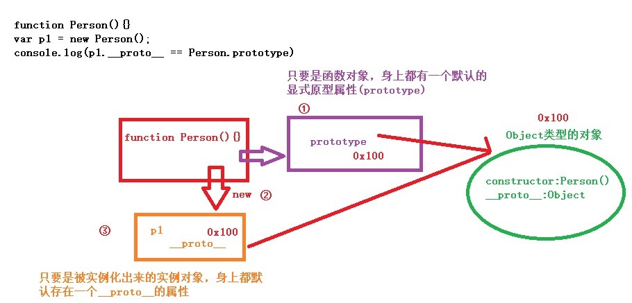


~~~js
function Person(){}
var p1 = new Person(); //实例化一个新对象
console.log(p1);//Person {}
//输出实例对象下的隐式原型属性
console.log(p1.__proto__); //{constructor: ƒ}

//输出Person函数对象的显示原型属性
console.log(Person.prototype); //{constructor: ƒ}

//__proto__和prototype都是存储的为Object对象的地址值
console.log(p1.__proto__ == Person.prototype); //true
~~~

#### 6.3 原型链

**描述的是对象在查找属性或者方法的过程**

实例化对象在找属性或者方法的时候，先从自身\__proto__去找看有没有这个属性或者方法；

如果有，直接使用这个属性的值，如果没有，会继续顺着这个对象的隐式原型对象（\__proto__）找到这个对象的原型对象（和它的构造函数的显式原型对象是同一个），看看原型对象是否存在这个属性，如果有就使用原型对象当中的这个属性值；

如果还没有，再去找原型对象的隐式原型对象（默认就是Object显式原型对象），找到以后去看看有没有这个属性，如果有就使用这个属性值；如果没有就返回undefined(代表已经找到顶了)；

> 注：
>
> - 所有的实例对象都和自己的构造函数的prototype的地址指向一致
> - 所有函数的prototype都指向的是一个Object类型的对象(每一个函数的prototype指向的Object对象不是同一个)
> - prototype指向的这个Object类型的对象里面默认有两个属性：
>   - constructor:当前函数对象
>   - `__proto__`：另一个Object对象；
> - 所有函数对象的.prototype里面的constructor默认都指向当前函数对象本身
> - `Object.prototype.__proto__`默认的值为`null`因为默认情况下实例对象的`__proto__`和构造函数的prototype地址指向是一致的，那么这种就会形成自己地址的反复引用，在程序上人家就给咱们手动终结了，设置为null;

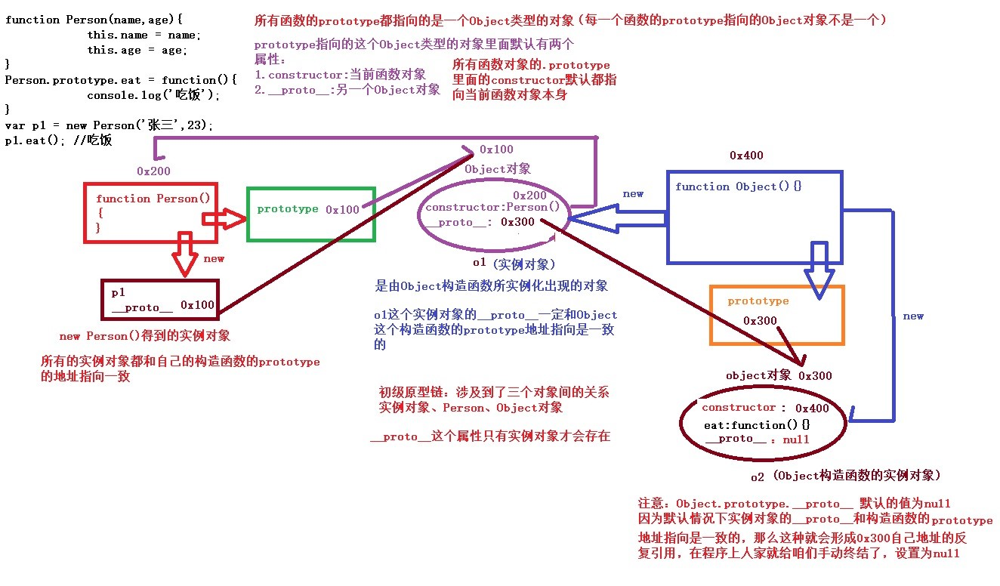

~~~js
function Person(name, age) {
    this.name = name;
    this.age = age;
}
/* Person.prototype.eat = function(){
    console.log('吃饭1');
} */
var p1 = new Person('张三', 23);
console.log(p1.__proto__ == Person.prototype); //true
console.log(Person.prototype.__proto__ == Object.prototype); //true
console.log(p1.eat); //undefined
console.log(Object.prototype.__proto__); //null
~~~

总结： 

**那什么是原型链呢？**

简单理解就是原型组成的链，对象的`__proto__`它的是原型，而原型也是一个对象，也有`__proto__`属性，原型的` __proto__`又是原型的原型，就这样可以一直通过`__proto__`想上找，这就是原型链，当向上找找到Object的原型的时候，这条原型链就算到头了。

**原型对象和实例之间有什么关系呢？**

通过一个构造函数创建出来的多个实例，如果都要添加一个方法，给每个实例去添加并不是一个明智的选择。这时就该用上原型了，在函数的原型上添加一个方法，这个原型的所有实例便都有了这个方法。

**原型链和作用域链:都是进行查找**

原型链查找的是对象下的属性/方法  -- 和(显式原型)对象有关

- 如果查找对象的属性，求值，如果这个属性存在则正常获取值;
- 如果查找对象的属性，求值，如果这个属性不存在则返回==undefined==；

作用域链查找的是变量       -- 和变量有关

先以自身的作用域开始查找；然后如果没有该变量的声明；则向其父作用域进行查找，如果有则引用的是该作用域下的变量;反之，如果没有则继续向上查找，一直查找到全局作用域;还没有，则==报错==

#### 6.4 constructor

constructor(构造器): 在函数的prototype属性中任何函数的prototype下的构造器默认都指向当前函数本身

设计初心：为了能够给属性的值进行初始化(ES6)；如果想要修改构造器默认地址指向，则重新赋值成另一个函数即可

null、undefined没有construstor方法，因此constructor不能判断undefined和null。

~~~js
function f1(){}
console.log(f1.prototype); //{constructor: ƒ}
console.log(f1.prototype.constructor); //ƒ f1(){}
console.log(f1.prototype.constructor == f1); //true

var arr = new Array();
console.log(Array.prototype.constructor = f1);//修改构造器默认地址指向
console.log(Array.prototype);//[constructor: ƒ, concat: ƒ, …]
~~~


### 七、call和apply方法

#### 7.1 概念

任何函数对象都有apply和call方法

> 作用：修改函数中的this指向

#### 7.2 语法

- 函数无形参的时候
  - 函数对象.call(想要指向的那个新对象);
  - 函数对象.apply(想要指向的那个新对象);
- 函数有形参的时候：
  - 函数对象.call(想要指向的那个新对象,实参1,实参2....); 以逗号间隔
  - 函数对象.==apply==(想要指向的那个新对象,[实参1,实参2....]); 实参类型必须为==数组==

**call和apply的相同点和不同点**

相同点：都是修改函数的this指向

不同点：在传递参数的形式上不同，call是实参一个一个的传递；==apply==必须传递的是一个==数组==

#### 7.3 作用（背）

**笔试题中会容易出现**

call和apply做了两件事：

1、先帮你**修改this**指向

2、然后再去**自动执行**使用的方法

#### 7.4 案例

+ 没有参数

~~~js
var obj = {
				name:'马坚强',
				age:33
			}
function Dog(name,age){
				this.name = name;
				this.age = age;
			}
Dog.prototype.eat = function(){
				console.log('吃肉');
			}
var d1 = new Dog('旺财',3);
d1.eat();//吃肉

obj.eat();  // 思考报错原因
~~~

解决策略1：给这个对象自己添加一个吃肉的方法

~~~js
obj.eat = function(){
	console.log('吃肉');
}
obj.eat();
~~~

解决策略2：不给这个对象添加，而是使用apply或者call借用 狗的吃肉方法去实现

~~~js
d1.eat.apply(obj);
//把狗的eat方法调用时的this指向修改为obj，代表obj在执行狗的这个方法
d1.eat.call(obj);
~~~

- 有参数

~~~js
Dog.prototype.eat = function(a,b){
				console.log(this);
				console.log('吃肉');
				console.log(a,b);
			}

var d1 = new Dog('旺财',3);
d1.eat(10,20);

d1.eat.apply(obj,[100,200]);
d1.eat.call(obj,100,200)；
~~~

### 八、JSON

JSON是一种轻量级的数据交换标准，JSON是前端和后端交互的一种数据格式；

现在我们大多数都是通过JSON数据格式进行前后端数据交互的，JSON本质上是一个字符串，简称json串 ，前端往后台传数据的时候，要传json格式的数据json串

在前端json串的格式原形就是对象或者对象的数组；以对象形式显示的，但是实际就是一个字符串

所以我们要先把数据存储为对象或者对象的数组，然后转化为json串进行传递

**JSON 是 JS 对象的字符串表示法，它使用文本表示一个 JS 对象的信息，本质是一个字符串，且键名用引号包裹；**

`var json = '{"a": "Hello", "b": "World"}';`

JSON字符串转换成JSON对象：`JSON.parse(JSON字符串) ` 从接口中获取然后解析后再页面中显示

JSON对象转换成JSON字符串：`JSON.stringify(JSON对象) `将处理好的对象结构转换回字符串进行文件的保存，数据表的保存

~~~js
//模拟后端给前端的数据接口中的结果
var obj = '{"name":"于谦","age":50,"sex":"男","hobby":[{"title":"抽烟"}]}';

//如果想要使用这组数据，则需要将JSON字符串转换成相应的对象
var obj1 = JSON.parse(obj);
console.log(obj1);//{name: '于谦', age: 50, sex: '男', hobby: Array(1)}

//想要将obj1这个json对象转换回json字符串：
console.log(JSON.stringify(obj1));
~~~

### 九、内置数学对象（Math）

1. round, ==floor==,==ceil==

   ```js
   var num = 1.4;
   console.log(Math.round(num)); //四舍五入取整  1
   console.log(Math.floor(num)); //向下(小)取整  1
   console.log(Math.ceil(num)); //向上取整      2
   ```

2. max  min  PI  pow abs  sqrt 

   ```js
   console.log(Math.max(20, 10, 67, 44));
   console.log(Math.min(20, 10, 67, 44));
   console.log(Math.PI); //圆周率  是一个属性
   console.log(Math.pow(2, 5)); //幂运算
   console.log(Math.abs(-5)); //求绝对值
   console.log(Math.sqrt(9)); //开方根
   ```

3. ==random==：拿的是0 - 1之间的一个随机数，包含0但是不包含1

   ```js
   // 我想拿到0 - 84之间的随机数   
   console.log(Math.floor(Math.random()*85 + 0))
   
   //我想拿到1 - 100之间的随机数
   console.log(Math.floor(Math.random()*100 + 1));
   			
   //我想拿到5 - 66之间的随机数
   console.log(Math.floor(Math.random()*62 + 5))
   ```
   
   练习：
   
+ ==**拿到任意两个值之间的随机整数**==
  
```js
   function getRandom(min, max) {
    return Math.floor(Math.random() * (max - min + 1) + min);
   }
```

+ 随机数(验证码)
  
```js
var str = 'QWERTYUIOPASDFGHJKLZXCVBNMqwertyuiopasdfghjklzxcvbnm1234567890';

function yzm(str,len) {
    var code = "";
    for (var i = 0; i < len; i++) {
        //1.先搞出来4个随机的下标
        var index = Math.floor(Math.random() * str.length)
        //2.按照这个随机的下标获取字符
        code += str[index];
    }
    return code;
};	
```

### 十、日期（时间）对象

#### 10.1 当做普通函数使用

```js
var result = Date();
console.log(result);  //返回的是当前日期对象
console.log(Date.now()); //获取到的时候当前日期的时间戳
```

#### 10.2 当做构造器使用

```js
var date = new Date();
console.log(date);
console.log(date.getFullYear());//拿到年
console.log(date.getMonth());//拿到月   月份是 0 - 11表示的  记得后面+1
console.log(date.getDate());//拿到日

console.log(date.getHours());//小时
console.log(date.getMinutes());//分钟
console.log(date.getSeconds());//秒

console.log(date.toLocaleTimeString());//当前时间的本地格式化字符串
console.log(date.toLocaleDateString());//当前日期的本地格式化字符串

console.log(date.getTime());//1970 年 1 月 1 日到现在 之间的毫秒数
console.log(date.getDay());//拿到星期
```

#### 10.3 练习

格式化日期时间字符串   XXXX年XX月XX日 

```js
function getDateAndTimeNow(){
			var date = new Date();
			var year = date.getFullYear();
			var month = date.getMonth() + 1;
			var day = date.getDate();
			var time = date.toLocaleTimeString();
			
			return '现在是：' + year + '年' + month + '月' + day + '日 '+ time;
		}
			
var result = getDateAndTimeNow();
console.log(result);
```

### 十一 、包装类

我们都知道js分为基本数据类型和引用数据类型。

基本数据类型数据可以有属性吗？答案是没有，但是为什么基本数据类型却可以调用一些方法呢。

~~~js
 var str="hello world";
 var long=str.length;
 console.log(long);   //得出结果为11
~~~

明明没有却可以调用length的方法，就是因为**包装类**的原因，函数在执行的前一刻发现你写的代码其实是存在问题

但是因为js是解释型语言，系统会为你进行包装类的操作；

js中提供了三种特殊的引用类型（**String Number Boolean**）

每当我们给基本数据类型赋属性值时 后台都会给我们偷偷转换 调用包装类

**执行的步骤：（背）**

**1.创建出一个和基本类型值相同的对象**

**2.这个对象就可以调用包装对象下的方法/属性，将结果并且返回给一个临时的变量**

**3.然后这个临时创建的对象就被销毁了**

**面试的时候，有可能会被问到有哪些数据类型会有包装（封装）类啊？**

思考一个问题，每一次定义number、string、boolean类型的对象在内存中都会创建一个包装类对象，就会对内存造成一定的压力，那如何解决呢？？

答：变量自己使用完毕之后，就会将自己销毁了（指向为null，弹出栈）

~~~js
var str="hello world";
//var str = new String("hello world"); // 1.创建出一个和基本类型值相同的对象
//var long = str.length; // 2.这个对象就可以调用包装对象下的方法，并且返回给long变量
//str = null;  //  3.之后这个临时创建的对象就被销毁了

var long=str.length; //因为str没有length属性 所以执行这步之前后台会自动执行以上三步操作
console.log(long);   // 11
~~~

var a  = 100;

a.toString执行到这一行的时候的步骤

1、a = new Number(a);  先把数字基本值转化为包装对象

2、a.toString; 调用的其实是包装对象的原型当中的toString方法

3、调用结束后自动再让a变回基本值  a = 100;

~~~js
var a = 100;
console.log(a);
console.log(a instanceof Object);
console.log(a.toString());
console.log(a instanceof Object);
~~~

包装对象一共有三种：数字   字符串  布尔值

~~~js
var a = 100;
var b = new Number(100);//就是数字的包装对象
console.log(a);
console.log(b);
~~~

### 十二、正则表达式对象

正则表达式工具：https://c.runoob.com/front-end/854/

正则表达式(regular expression)描述了一种字符串匹配的模式，可以用来检查一个字符串是否含有某种子串、将匹配的子串做替换或者从某个字符串中取出符合某个条件的子串等。说白了正则表达式就是处理字符串的,我们可以用它来处理一些复杂的字符串。更多的时候我们使用正则的意义在于判断某字符串是否符合某个规则，这个规则就是正则表达式

核心：其实正则表达式在定义一种规则，只要符合这个规则的字符串就ok

功能：

检查字符串中是否有匹配的内容项（子串）---检查的工作

在这个符合的内容项(子串)进行替换 ---替换的工作

==正则对象无法独立使用，必须搭配方法才可以==

#### 12.1 实例化创建对象

```js
实例化的创建
var reg = new RegExp(pattern,flags);

pattern:正则表达式（定义的规则）
flags:标识(修饰符)，可以不写。
标识主要包括：
    1. i 忽略大小写匹配 (ignore)
    2. m 多行匹配，即在到达一行文本末尾时还会继续寻常下一行中是否与正则匹配的项
    3. g 全局匹配 模式应用于所有字符串，而非在找到第一个匹配项时停止
```

#### 12.2 实例化的基本使用

使用`test()`方法检测函数规则，字符串是否符合正则规则，如果符合则返回true，否则返回false；

第一个参数：需要检索的匹配项；

第二个参数：标识(i 、m、g)

+ 判断字符串中是否有a

```js
var reg = new RegExp('a');
console.log(reg.test('abc'));
console.log(reg.test('bc'));
```

+ 判断字符串中是否有ab，注意两个字符必须是连续的，不连续的返回false；

```js
var reg = new RegExp('ab');
console.log(reg.test('abc'));
console.log(reg.test('acb'));
```

+ 判断字符串中是否包含a或者b，需要忽略大小写

```js
var reg = new RegExp('a|b','i');
console.log(reg.test('azz'));
console.log(reg.test('Azz'));
```

#### 12.3 字面量创建对象（最常用的）

使用字面量来创建正则表达式

语法：`var 变量 = /正则表达式/匹配模式`

使用字面量的方式创建更加简单

使用构造函数创建更加灵活

```js
var reg = /a/i;	
console.log(typeof reg);
console.log(reg.test("abc"));
```

#### 12.4 字面量的基本使用

+ 创建一个正则表达式，检查一个字符串中是否有a或b

  使用 | 表示或者的意思

```js
var reg = /a|b|c/;
console.log(reg.test("a"));
```

+ 创建一个正则表达式检查一个字符串中是否有字母

```js
reg = /a|b|c|d|e|f|g|....../;
console.log(reg.test("a"));
```

- [abc]：查找方括号内任意一个字符。
- [^abc]：查找==不在==方括号内的字符。
- [0-9]：查找从 0 至 9 范围内的数字，即查找数字。
- [a-z]：查找从小写 a 到小写 z 范围内的字符，即查找小写字母。
- [A-Z]：查找从大写 A 到大写 Z 范围内的字符，即查找大写字母。
- [A-z]：查找从大写 A 到小写 z 范围内的字符，即所有大小写的字母。

```js
reg = /[A-z]/;
console.log(reg.test("a"));
```

+ 检查一个字符串中是否以a开头，c结尾，中间为b或d或e；

```js
reg = /a[bde]c/;
```

+ [^ ] 除了

```js
reg = /[^0-9]/;  //解释：只要字符串里有非数字的就为true
var str = '123abc';
console.log(reg.test(str));//true,
```

#### 12.5 正则相关的方法

/^abc/：必须以abc开头 

/ab$/：必须以ab结尾；

默认情况下的全局匹配只能在一行；不能是多行

如果想要多行需要搭配m使用；

+ `split`

```js
var str = "1a2b3c4d5e6f7";
/*
 * split()
 * 	- 可以将一个字符串拆分为一个数组
 * 	- 方法中可以传递一个正则表达式作为参数，这样方法将会根据正则表达式去拆分字符串
 * 	- 这个方法即使不指定全局匹配，也会全都拆分
 */

/*
 * 根据任意字母来将字符串拆分
 */
var result = str.split(/[A-z]/);
console.log(result);//[]
```

+ `search`

```js
/*
 * search()
 * 	- 可以搜索字符串中是否含有指定内容
 * 	- 如果搜索到指定内容，则会返回第一次出现的索引，如果没有搜索到返回-1
 * 	- 它可以接受一个正则表达式作为参数，然后会根据正则表达式去检索字符串
 * 	- serach()只会查找第一个，即使设置全局匹配也没用
 */
str = "hello abc hello aec afc";
/*
 * 搜索字符串中是否含有abc 或 aec 或 afc
 */
result = str.search(/a[bef]c/);

console.log(result);//6
```

+ `match`

```js
/*
 * match()
 * 	- 可以根据正则表达式，从一个字符串中将符合条件的内容提取出来
 * 	- 默认情况下我们的match只会找到第一个符合要求的内容，找到以后就停止检索
 * 		我们可以设置正则表达式为全局匹配模式，这样就会匹配到所有的内容
 * 		可以为一个正则表达式设置多个匹配模式，且顺序无所谓
 * 	- match()会将匹配到的内容封装到一个数组中返回，即使只查询到一个结果
 * 
 * 	
 */
str = "1a2a3a4a5e6f7A8B9C";

result = str.match(/[a-z]/ig);
console.log(result[2]);

//若存在换行\n并且有开始^或结束$符的情况下，和g一起使用实现全局匹配,
//因为存在换行时默认会把换行符作为一个字符任务匹配字符串是个单行，
//g只匹配第一行，添加m之后实现多行，每个换行符之后就是开始

//如果不带g，正则过程中字符串从左到右匹配，找到第一个符合条件的即匹配成功，返回
//如果带g，则字符串从左到右，找到每个符合条件的都记录下来，知道字符串结尾位置
var str = "abcggab\nabcoab";
var preg1 = /^abc/mg; 
console.log(str.match(preg1));  // 结果为：["abc", "abc"]
var preg2 = /ab$/mg; 
console.log(str.match(preg2));  // 结果为：["ab", "ab"]
```

+ `replace`

```js
/*
 * replace()
 * 	- 可以将字符串中指定内容替换为新的内容
 *  - 参数：
 * 		1.被替换的内容，可以接受一个正则表达式作为参数
 * 		2.新的内容
 *  - 默认只会替换第一个
 */
str = "1a2a3a4a5e6f7A8B9C";
//result = str.replace(/[a-z]/gi , "@_@");
result = str.replace(/[a-z]/gi , "");
console.log(result);
```

- `exec`  返回匹配模式

有则返回匹配项，没有匹配项返回null;

#### 12.6 数量修饰符

>通过量词可以设置一个内容出现的次数
>
>量词只对它前边的一个内容起作用
>
>{n} 正好出现n次，非严格模式，只要有n次就行
>
>{m,n} 出现最少m次，最多n次；
>
>{m,} m次以上
>
>\+ 至少一个，相当于{1,}  只要得有一次
>
>\* 0个或多个，相当于{0,} 要么没有，要么多次 (可以没有我，也可以有多个，但是不可以有别人)
>
>? 0个或1个，相当于{0,1} 要么没有，要么一次(可以没有我，但是只能有一个我，不能有别人)

```js
var reg = /a{3}/;
var	reg = /(ab){3}/;
var	reg = /b{3}/;
var	reg = /ab{1,3}c/;
var	reg = /ab{3,}c/;
var	reg = /ab+c/;
var	reg = /ab*c/;
var	reg = /ab?c/;
```

#### 12.7 边界修饰符

```js
	1. ^ 以...开始
	2. $ 以...结尾
	eg:
      '^abc'  匹配以abc开头
      ‘abc$'  匹配以abc结尾
```

练习：创建一个正则表达式，用来检查一个字符串是否是一个合法手机号

1. 以1开头
2. 第二位3-9任意数字
3. 三位以后任意数字9个

```js
var phoneStr = "13067890123";
var phoneReg = /^1[3-9][0-9]{9}$/;
console.log(phoneReg.test(phoneStr));		
```

#### 12.8 单字修饰符

记忆小写即可，大写的都是取反；

```js
.   匹配任意单个字符，除了换行符 一个.就是一个字符；
[]  用来表示一组字符,单独列出：[abc] 匹配 'a'或'b'或'c' /abc/：连续的abc;
\d  匹配任意数字，等价于 [0-9].
\D  匹配任意非数字，等价于 [^0-9].
\w  匹配字母数字及下划线
\W  匹配非字母数字及下划线
\s  匹配任意空白字符，等价于 [\t\n\r\f].
\S  匹配任意非空字符
```

#### 12.9 贪婪模式/非贪婪模式

```js
贪婪模式：在整个表达式匹配成功的前提下，尽可能多的匹配 ( * )；
非贪婪模式：在整个表达式匹配成功的前提下，尽可能少的匹配 ( ? )；
一般限制数量，都会使用？；+ * 都是贪婪的         
          示例一 ： 源字符串：abbbc
          使用贪婪的数量词的正则表达式 ab* ，匹配结果： abbb。 
          * 决定了尽可能多匹配 b，所以a后面所有的 b 都出现了。
          
          使用非贪婪的数量词的正则表达式ab*?，匹配结果： a。 
          即使前面有 *，但是 ? 决定了尽可能少匹配 b，所以没有 b。
          
          示例二 ： 源字符串：aa<div>test1</div>bb<div>test2</div>cc
          
          使用贪婪的数量词的正则表达式：<div>.*<\/div>
          匹配结果：<div>test1</div>bb<div>test2</div>
          这里采用的是贪婪模式。在匹配到第一个“</div>”时已经可以使整个表达
          式匹配成功，但是由于采用的是贪婪模式，所以仍然要向右尝试匹配，
          查看是否还有更长的可以成功匹配的子串。匹配到第二个“</div>”后，
          向右再没有可以成功匹配的子串，匹配结束，匹配结果为
          “<div>test1</div>bb<div>test2</div>”

          使用非贪婪的数量词的正则表达式：<div>.*?</div>
          匹配结果：<div>test1</div>
          正则表达式二采用的是非贪婪模式，在匹配到第一个“</div>”
          时使整个表达式匹配成功，由于采用的是非贪婪模式，
          所以结束匹配，不再向右尝试，匹配结果为“<div>test1</div>”。
```

#### 12.10 邮件正则

action.haha@abc.com.cn

```js
var emailReg = /^\w{3,}(\.\w+)*@[A-z0-9]+(\.[A-z]{2,5}){1,2}$/;
var reg = /^\w{5,10}@[A-z0-9]+[.]com$/;
var email = "haha.hello@163.com";
console.log(emailReg.test(email));
```

### 十三、扩展

#### 13.1 数组

+ 数组当做普通数组：

```js
var arr = [1,2,3,4];
for(var i = 0; i < arr.length; i++){
				console.log(arr[i]); //1 2 3 4
			}
```

+ 数组当做对象：

```js
var arr = [1,2,3,4];
//那么A一定是对象，B一定是对象的属性，把数组当对象用加了一个属性和值
arr.heihei = 'haha';//A.B 
arr['100'] = 5;
for(var i = 0; i < arr.length; i++){
				console.log(arr[i]);
			}
```

```js
var arr = [1,2,3,4];
//那么A一定是对象，B一定是对象的属性，把数组当对象用加了一个属性和值
arr.heihei = 'haha';//A.B 
arr['100'] = 5;
for(var key in arr){
				console.log(key,arr[key]);
}
```

#### 13.2 函数

+ 函数当作普通函数

```js
function fn(){
				console.log('i love you');
			}			
fn();
fn.length; //函数的形式参数个数
fn.prototype;//函数的显示原型对象
//当函数去用，就是调用函数实现函数表面上的功能；一个东西加括号，那么括号前面一定函数，函数是在当函数用；
```

+ 函数当作对象

```js
function fn(){
				console.log('i love you');
			}
fn.hehe = 'heihei';   //A.B  那么代表这个函数是在当对象用；
console.log(fn);
console.dir(fn);
for(var key in fn){
		console.log(key,fn[key]);
	}
```

#### 13.3 垃圾回收机制

```
堆空间的释放是靠垃圾回收机制进行的，当程序函数或者整个程序执行完成后，栈里面所有的东西都被释放销毁，堆当中的数据可能还在，只是没有任何的变量指向（引用），那么堆当中的数据就会变成垃圾对象。回收机制会在适当的时候将垃圾对象清理回收；
如果我们在程序当中需要去删除对象，那么就将这个对象的变量赋值为null，代表这个对象引用被改变，这个对象也就成了垃圾对象，其实删除对象就是让堆当中的对象数据成为垃圾对象；
var a = {};  //0x100
a里面存了  {}地址    a指向了{}这个对象  
a = null;   把a的指向断开了；

注意：给一个变量设置为null，并不是这个对象就没有了，而是将这个对象变成垃圾对象，等待内存在适当的时候来回收
```

#### 13.4 练习案例

1. ```js
   var num1 = 10;
   var num2 = num1;
   num1 = 20;
   console.log(num1); 
   console.log(num2); 
   ```

2. ```js
   var num = 50;
   function f1(num) {
   		num = 60;
   		console.log(num); 
   }
   f1(num);
   console.log(num);
   ```

3. ```js
   var num1 = 55;
   var num2 = 66; 
   function f1(num, num1) {
   		num = 100;
   		num1 = 100;
   		num2 = 100;
   		console.log(num); 
   		console.log(num1); 
   		console.log(num2); 
   	}
   f1(num1, num2);
   console.log(num1); 
   console.log(num2);
   console.log(num)；
   ```

4. ```js
   var a = 10;
   var b = 20;
   function add(a,b){
   		a = 30;
   		return a + b;
   	}
   add(a,b);
   console.log(a);
   function f1(arr){
   		for(var i = 0; i < arr.length; i++){
   			arr[i] += 2
   		}
   console.log(arr);
   }
   var arr; 
   arr = [1,2];
   f1(arr);
   console.log(arr);
   ```

5. ```js
   两个对象是同一个对象，不同的操作有什么不同
   var a = [1,2];
   var b = a;
   a[0] = 20;   // 如果a = [20,2]；
   console.log(b);
   var a = [];//new Array()
   var b = [];//new Array()
   console.log(a == b);
   ```

6. ```js
   function Person(name, age, salary) {
   		this.name = name;
   		this.age = age;
   		this.salary = salary;
   	}
   
   function f1(pp) {
   		pp.name = "ls";
   		pp = new Person("aa", 18, 10);
   }
   var p = new Person("zs", 18, 1000);
   console.log(p.name);//zs
   f1(p);
   console.log(p.name);//ls
   ```


#### 13.5 闭包高级

要理解闭包，首先必须理解Javascript特殊的变量作用域。

变量的作用域无非就是两种：全局变量和局部变量。

- JavaScript语言的特殊之处，就在于函数内部可以直接读取全局变量。

```js
var n=999;
function f1(){
　　　　alert(n); //999
　　}
f1();
```

- 在函数外部自然无法读取函数内的局部变量

```js
function f1(){
　　　　var n=999;
　　}
f1();
alert(n); //报错
```

- 函数内部声明变量的时候，一定要使用var命令。如果不用的话，你实际上声明了一个全局变量

```js
//var n;
function f1(){
　　　　n=999;
　　}
f1();
alert(n); //999
```

- **如何从外部读取局部变量？**

  出于种种原因，我们有时候需要得到函数内的局部变量。但是，前面已经说过了，正常情况下，这是办不到的，只有通过变通方法才能实现。那就是在函数的内部，再定义一个函数。


```js
function f1(){
      var n=999;
      console.log(a);  //报错
      function f2(){  //var fn2 =  //function(){}
          alert(n); // 999
          var a = 100;
          return a;//100
         
       }
       return f2;
　　}
var result = f1()
console.log(result); //function(){}
console.log(result())
```

在上面的代码中，函数f2就被包括在函数f1内部，这时f1内部的所有局部变量，对f2都是可见的。但是反过来就不

行，f2内部的局部变量，对f1就是不可见的。这就是Javascript语言特有的"链式作用域"结构（chain scope），子

对象会一级一级地向上寻找所有父对象的变量。所以，父对象的所有变量，对子对象都是可见的，反之则不成立。

既然f2可以读取f1中的局部变量，那么只要把f2作为返回值，我们不就可以在f1外部读取它的内部变量了吗！

```js
function f1(){         //f1在函数执行完毕之后，函数执行环境就销毁了
　　　　var n=999;
　　　　function f2(){  //f2一直存在堆里面
　　　　　　alert(n);
　　　　}
       function f3(){
           
       }
 //返回一个f2的方法体 
　　　　return f2;  //var f2 = function(){}
　　}
console.log(n); //报错
var result=f1();
result(); // 999
result();
```

- **闭包的概念**

  代码中的f2函数，就是闭包，闭包"（closure）定义非常抽象，很难看懂。

  闭包其实就是能够读取其他函数内部变量的函数，由于在Javascript语言中，只有函数内部的子函数才能读取

  局部变量，因此可以把闭包简单理解成"定义在一个函数内部的函数"。

  所以，在本质上，闭包就是将函数内部和函数外部连接起来的一座桥梁。

- **如何产生闭包(条件)?**

  - 函数嵌套

  - 内部函数引用外部函数的局部变量

  - 外部函数返回内部函数的**方法体**

  - 使用（调用）外部函数并且内部函数也要调用或者引用（针对谷歌）（因为部分浏览器会对内部函数做优

    化，内部函数不使用或者不引用，相当于没有）；

- **闭包到底是什么?**

  - 理解一: 闭包是嵌套的内部函数(绝大部分人)

  - 理解二: 包含被引用(外部函数)变量的对象(极少数人)

  - 理解三： 所谓的闭包是一个引用关系，该引用关系存在于内部函数中，引用的是外部函数的变量的对象

    (深入理解)

- **常见的闭包**

  - 将函数作为另一个函数的返回值

- **闭包的作用**

  ```js
  function fn(){
  		var a = 0;
          var b = 1; 
  		function fn1(){
  			a++;
  			console.log(a);
  		}
  		return fn1;
  }
  var f =  fn();
  f(); 
  f();
  ```

  - 延长外部函数变量的生命周期
  - 让函数外部可以操作(读写)到函数内部的数据(变量/函数)/函数外部可以引用函数内部的变量
  - 注意： 浏览器为了性能后期将外部函数中不被内部函数使用的变量清除了

- **闭包的缺点和解决(内存泄漏和内存溢出)**

  - 内存泄漏 ： 内存无法释放；
  - 内存溢出 ： 内存被撑爆；
  - f = null;  解决方式；

  ```js
  function fn(){
  		var a = 0;
  		function fn1(){
  			a++;
  			console.log(a);
  		}
  		return fn1;
  }
  var f =  fn();
  f();
  f();
  f = null;//释放闭包
  ```

- **使用闭包的注意点**

  - 由于闭包会使得函数中的变量都被保存在内存中，内存消耗很大，所以不能滥用闭包，否则会造成网页的

    性能问题，在IE中可能导致内存泄露。解决方法是，在退出函数之前，将不使用的局部变量全部删除。

    虽然我们可以获取内部变量 但是不要轻易修改这个内部变量。

- **必会**

  - 闭包是什么
  - 判断闭包的条件
  - 手写闭包
  - 闭包的作用
  - 闭包的缺点

- **面试题精讲**

  - 面试题1

    ```js
    var name = "The Window";
    var object = {
    		name: "My Object",
    		getNameFunc: function() {
    			return function() {
    						return this.name;
    					};
    			}
    };
    console.log(object.getNameFunc()());//The Window
    ```

  - 面试题2

    ```js
    var name2 = "The Window";
    var object2 = {
    			name2: "My Object",
    			getNameFunc: function () {
    //如果说你想在内部其它函数当中使用外部函数的this，就把外部函数this保存起来.一般使用_this、that、_self
    				var that = this;
    				return function () {
     						return that.name2;
    				};
    			}
    		};
    console.log(object2.getNameFunc()());//My Object
    ```

#### 13.6 案例

统计字符中各个元素出现的次数

```js
var str = '1a1322143234212131451111112332';
var obj = {};
for (var i = 0; i < str.length; i++) {
    //obj[str[i]]；向对象里添加属性
		obj[str[i]] ? obj[str[i]] += 1 : obj[str[i]] = 1;
	}
console.log(obj);
```


