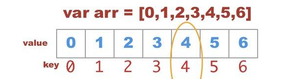
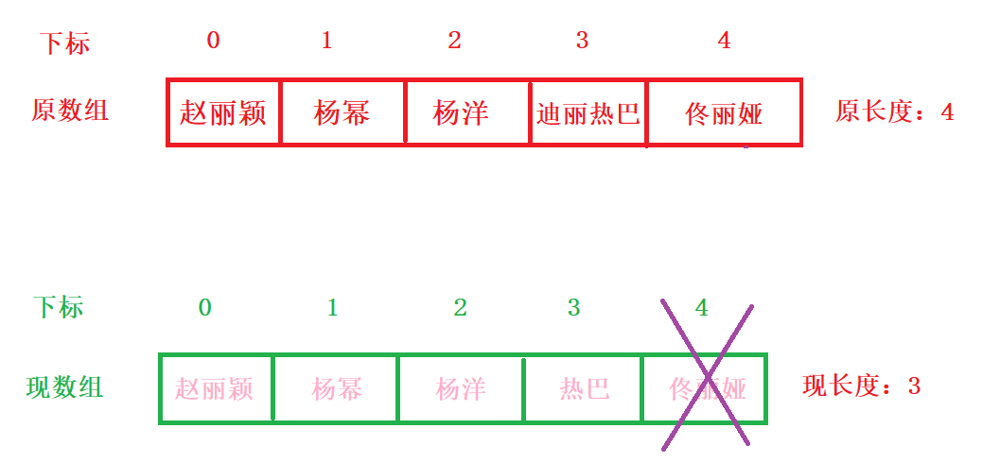
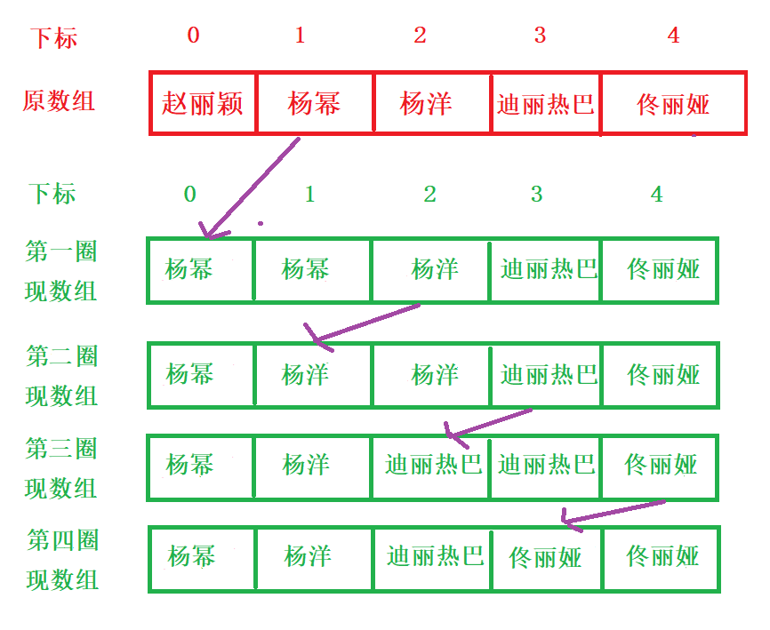
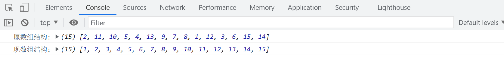
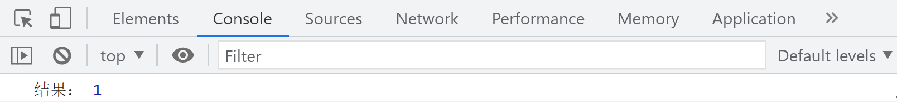
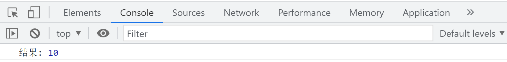
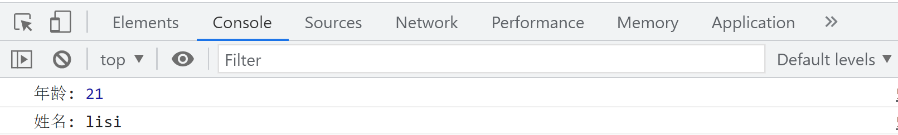

## 数组


### 一、什么是数组

- 数组是值的有序集合，每个值叫做一个元素
- 每个元素在数组中有一个位置，以数字表示，称为索引/下标，用来标注元素的位置，靠位置找元素
- js的数组是无类型的，数组元素可以是8，同一个数组中的不同元素可能是对象或数组（所有数据类型）
- 每个数组都具有一个length属性，目前位置字符串和数组有length；**对象是无length属性的**



当想要给一个变量存储多个值的时候，那么就必须给这个变量定义一个数组类型。

###  二、创建数组

创建一个数组，有以下的三种方法：

#### 2.1  字面量方式（优选）

~~~js
var arr = []
~~~

赋值方式分为两种：

- 直接在[]内赋值

~~~js
var arr = ['赵丽颖','杨颖','杨幂','迪丽热巴']
~~~

- 根据下标的方式赋值

~~~js
arr[0] = '杨洋';
arr[1] = '汪苏泷';
arr[2] = '赵本山';
~~~

注意：

数组元素的索引不一定要连续，元素之间可以有空隙，叫做稀疏数组 

~~~js
arr[0] = '杨洋';
arr[2] = '汪苏泷';
arr[4] = '赵本山'
~~~

- 针对非稀疏数组，length属性就是数组元素的个数
- 针对稀疏数组，元素的length属性比所有元素的索引要大，**实际长度需要把空隙位置也算上**
- **空隙位置**是undefined (本来应该有，但是没有，null是本来就没有！)

#### 2.2  构造函数方式

##### 2.2.1  语法1

~~~js
var arr = new Array();
~~~

赋值方式：通过下标

~~~js
arr[0] = '杨洋';
arr[1] = '汪苏泷';
arr[2] = '赵本山'
~~~

##### 2.2.1  语法2

~~~js
var arr = new Array(数字);
~~~

赋值方式：通过下标

~~~js
arr[0] = '杨洋';
arr[1] = '汪苏泷';
arr[2] = '赵本山'
~~~

注意：

数字的含义表示预先在数组中定义几个元素，

- 当实际填充内容的数量>预先数量：按照实际数组长度计算
- 当实际填充内容的数量<预先数量：按照预先定义的数量计算

##### 2.2.3 语法3

~~~js
var myCars=new Array("杨洋","汪苏泷","赵本山");
~~~

### 三、数组的访问

通过指定数组名以及对应的索引，就可以访问数组中的某个特定的元素。

~~~js
var one = arr[0];
console.log(one); //杨洋
~~~

还可以根据对应的下标修改元素的值

~~~js
arr[0] = '岳云鹏';
~~~

### 四、遍历数组

#### 4.1 for 循环遍历数组

正向遍历数组：利用循环获取数组中每个元素的值;for循环

~~~js
//1、定义一个数组
var arr = ['赵丽颖','杨幂','杨洋','迪丽热巴','佟丽娅'];
//2、利用循环遍历数组中的每一个数组
for(var i = 0 ; i < arr.length;i++){
	console.log(arr[i]);
}
~~~

反向遍历数组：for循环

```js
        for (j = arr.length-1 ; j >= 0; j--){
            console.log(arr[j]);
        }
```

> 注：起始值为.length - 1;

#### 4.2 for in 循环遍历数组；

```js
         for(var key in arr){
             console.log(arr[key]);
         }
```


#### 4.3 数组.forEach() 遍历数组；

解释：单纯的循环，==**没有返回值**==     (详见后面数组的迭代)


### 五、数组的增删改查

#### 5.1 <span style="color:red">新增元素</span>

##### 5.1.1 数组末尾添加

~~~js
//1、定义一个数组
var arr = ['赵丽颖','杨幂','杨洋','迪丽热巴','佟丽娅'];
console.log("原数组结构:",arr);
//2、根据观察得知，数组的长度永远比数组的下标大1个，所以可以利用数组的length属性来新增元素
arr[arr.length] = '孙越';
//3、打印查看新增后的数组结构
console.log("新数组结构:",arr);
~~~

运行 :


##### 5.1.2 数组开头添加


~~~js
//1、定义一个数组
var arr = ['赵丽颖','杨幂','杨洋','迪丽热巴','佟丽娅'];
console.log("原数组结构:",arr);
//2、想要在数组的开头第一位，添加新元素，那么原先每一个元素的下标都会往后挪一位
/*
        * arr[5] = arr[4]
        * arr[4] = arr[3]
        * arr[3] = arr[2]
        * arr[2] = arr[1]
        * arr[1] = arr[0]

        * 真正arr[0] 是新增的那个元素
        * 结论：
        * arr[i+1] = arr[i]
*/

for(var i = arr.length-1;i>=0;i--){
	arr[i+1] = arr[i]
}
//3、给数组的开头位置新增一个新的元素
arr[0] = "杨丞琳"
//4、打印查看现数组结构
console.log("现数组结构:",arr);
~~~

运行：


##### 5.1.3 数组中间（某位置）添加


~~~js
//1、定义一个数组
var arr = ['赵丽颖','杨幂','杨洋','迪丽热巴','佟丽娅'];
console.log("原数组结构:",arr);
for(var i = arr.length-1;i>=3;i--){
	arr[i+1] = arr[i];
}
//2、给数组的开头位置新增一个新的元素
arr[3] = "杨丞琳"
//3、打印查看现数组结构
console.log("现数组结构:",arr);
~~~

运行：


##### 5.2.4 总结

> 1. 无论是开头添加还是任意位置添加，都是从那个下标位置后面的元素往后挪一位;(反向遍历数组)
>
> 2. 然后再调整对应下标的值


#### 5.2 <span style="color:red">删除元素</span>

##### 5.2.1 数组末尾删除



~~~js
//1、定义一个数组
var arr = ['赵丽颖','杨幂','杨洋','迪丽热巴','佟丽娅'];
console.log('原数组结构',arr);
console.log('原数组长度',arr.length);
//2、数组的长度减去一个
arr.length--;
//或者
// arr.length-=1;
console.log('现数组结构',arr);
console.log('现数组长度',arr.length);
~~~

##### 5.2.2 数组开头删除



~~~js
//1、定义一个数组
var arr = ['赵丽颖', '杨幂', '杨洋', '迪丽热巴', '佟丽娅'];
console.log('原数组结构', arr);
console.log('原数组长度', arr.length);
//2、循环数组，把当前索引中的值复制给上一个索引
//想法：利用后者的下标向前压进
/**
  * arr[0] = arr[1]
  * arr[1] = arr[2]
  * arr[2] = arr[3]
  * arr[3] = arr[4]
  *循环：i :0 --> 3
*/   
for(var i = 0;i<arr.length-1;i++){
      arr[i] = arr[i+1];
}
//3、在将最后一个多余的值删除掉
arr.length--;
console.log('现数组结构', arr);
console.log('现数组长度', arr.length);
~~~

运行：


##### 5.2.3 数组中间（某位置）删除


~~~js
var arr = ['赵丽颖', '杨幂', '杨洋', '迪丽热巴', '佟丽娅'];
/*
 * 赵丽颖    arr[0]  不动
 * 杨幂      arr[1]  被   杨洋       arr[2] 替换
 * 杨洋      arr[2]  被   迪丽热巴    arr[3] 替换
 * 迪丽热巴   arr[3]  被   佟丽娅     arr[4] 替换
*/

//1. 循环初始位置从想要替换值的位置起始
for(var i = 1;i<=3;i++){
	//2. 使用后者下标的值替换前者下标的值
	arr[i] = arr[i+1];
}
//3. 最后在让数组的最后一个值消失
arr.length--;
console.log(arr);
~~~

运行：


添加元素与删除元素总结：

> 添加元素：
> 末尾：数组[长度] = 值
> 开头：从0下标后面的每一个元素的下标向后挪一位 （倒着循环）
> 中间：从想要添加的那个下标开始的，后面的每一个元素的下标向后挪一位（倒着循环）
>
> 删除元素：
> 末尾：数组长度-- / 数组长度 -= 数
> 开头：所有的元素向前挪一位（正向循环）
> 中间：从想要添加的那个下标开始的，后面的每一个元素的下标向前挪一位（正向循环）


#### 5.3  修改元素

主要还是通过下标来修改

~~~js
var arr = ['赵丽颖', '杨幂', '杨洋', '迪丽热巴', '佟丽娅'];
arr[2] = '杨丞琳';
console.log(arr);
~~~

#### 5.4  查询元素

~~~js
var arr = ['赵丽颖', '杨幂', '杨洋', '迪丽热巴', '佟丽娅'];
console.log(arr[0]); //赵丽颖
~~~

### 六、数组的相关案例

#### 6.1  求数组中的所有值的总和

例如：var arr = [6, 7, 8, 9,10]；

~~~js
//1、定义一个数组
var arr = [6,7,8,9,10];
//2、定义一个计算总和的变量
var sum = 0;
//2、循环数组，把当前索引中的值复制给上一个索引
for (var i = 0; i < arr.length; i++) {
	sum+=arr[i]
}
console.log('总和',sum);
~~~

#### 6.2  求数组中的最大值

~~~js
//1、定义一个数组
var arr = [6,7,8,9,10];
//2、假设数组中的第一个值是最大值
var max = arr[0];
//3、让max变量和剩余的所有值挨个进行比较
//选班长：先随意选出来一个人，然后大伙一致同意，就是这个人，如果不同意，就他来当
/*for(var i = 0; i < arr.length;i++){
	//这么写虽然没有毛病，但是有点啰嗦
    if(arr[i] < max){
        max = max
    }else{
        max = arr[i];
    }
}
console.log(max);*/
//换种写法
for(var i = 1;i<arr.length;i++){
	if(arr[i]>max){
		max = arr[i];
	}
}
console.log('最大值：',max);
~~~

小伙伴们，可以自己尝试完成求最小值和平均值

#### 6.3 利用"|"拼接数组元素

~~~js
//1、定义一个数组
var arr = ['赵丽颖', '杨幂', '杨洋', '迪丽热巴', '佟丽娅'];
//2、定义一个字符串变量
var str = "";
//3、循环数组中的每一个
for(var i = 0 ;i < arr.length-1;i++){
	str+=arr[i]+'|'
}
//4、和之前的字符串拼接数组中的最后一个值
str+=arr[arr.length-1];
console.log(str); //赵丽颖|杨幂|杨洋|迪丽热巴|佟丽娅
~~~

#### 6.4 反向遍历数组

~~~js
//1、定义一个数组
var arr = ['赵丽颖', '杨幂', '杨洋', '迪丽热巴', '佟丽娅'];
//2、反向循环数组
for(var i = arr.length-1;i>=0;i--){
    //3、循环输出数组中的每一个
	console.log(arr[i]);
}
~~~

#### 6.5 动态按序从尾部插入数组元素

~~~js
//1、定义一个数组
var arr = ['赵丽颖', '杨幂', '杨洋', '迪丽热巴', '佟丽娅'];
//2、动态按序从尾部插入数组元素,在数组结构的末尾中添加新元素
arr[arr.length] = "杨丞琳";
//3、输出数组结构
console.log(arr); //['赵丽颖', '杨幂', '杨洋', '迪丽热巴', '佟丽娅', '杨丞琳']
~~~

#### 6.6 过滤为0的元素

~~~js
//1、定义一个数组
var arr = [5,0,4,2,0,8,0,9];
//4、创建一个新数组
var newArr = [];
//2、循环数组中的每一个
for(var i = 0; i< arr.length;i++){
	//3、判断数组中的每一个值是否为0；
	if(arr[i]!=0){
		//newArr[newArr.length] = arr[i]
        newArr.push(arr[i]);
	}
}
//5、输出新数组结构
console.log(newArr); //[5,4,2,8,9]
~~~

#### 6.7 数组去重

~~~js
var arr = [1,4,5,6,7,3,4,5,6,7,8,3,2,1];
//1、从数组的第一个值开始,循环数组的每一个值
for(var i = 0;i<arr.length;i++){
    //2、从数组的第二个值开始，循环数组的每一个值
	for(var j = i+1;j<arr.length;j++){
        //3、当数组的相邻的两个值相等时
		if(arr[i] == arr[j]){
            //4、数组删除后者元素
			arr.splice(j,1);
            //5、调整下标
			j--;
		}
	}
}
//j--的含义：当删除了当前j所在的元素以后，后边的元素会自动补位，此时将不会在比较这个元素吧，我需要在比较一次j所在位置的元素，所以使j自减,要注意的是j--是在删除了之后再自减一个，要写在if 循环里面；
~~~

#### 6.8  翻转数组

在新数组当中翻转

~~~js
var arr = [1,2,3,4,5,6];
var newArr = [];
//思路：在原数组上将下标进行倒序输出，把每一个值填入一个新的数组里面
for(var i = arr.length - 1; i >= 0; i--){
		newArr[newArr.length] = arr[i];
//在新数组的最后一位添加
	}
console.log(newArr);//[6, 5, 4, 3, 2, 1]
~~~

在原数组上进行翻转---》**==非常重要==**

~~~js
var arr = [1,2,3,4,5,6];
for(var i = 0; i < arr.length/2; i++){
    	//先将前面的数保存一份
		var temp = arr[i];
    	//让后者下标的值站到前面对应下标上
		arr[i] = arr[arr.length - 1 - i];
    	//把后者的下标值替换成原来保存的值
		arr[arr.length - 1 - i] = temp;
	}
console.log(arr);
~~~

思考：如果arr.length没有除以2那么会发生什么情况？？？

#### 6.9 合并数组

原生实现方式

- 合并在新数组当中

~~~js
var arr1 = [1,3,5,7,9];
var arr2 = [2,4,6,8,10];
//1、合并在新数组当中
var newArr = [];
for(var i = 0; i < arr1.length; i++){
	//在把arr1内部的数据添加到newArr当中
  		newArr[newArr.length] = arr1[i];
	}
			
for(var i = 0; i < arr2.length; i++){
	//在把arr1内部的数据添加到newArr当中
		newArr[newArr.length] = arr2[i];
	}
console.log(newArr);
~~~

- 在原数组上进行合并

~~~js
for(var i = 0; i < arr1.length; i++){
		arr2[arr2.length] = arr1[i];
}
console.log(arr2);
~~~

### 七、冒泡排序


~~~js
//1、定义一个数组
var arr = [2,11,10,5,4,13,9,7,8,1,12,3,6,15,14];
console.log('原数组结构:',arr);
//2、循环两层
for(var i = 0;i<arr.length-1;i++){
	for(var j = 0;j<arr.length-i-1;j++){
		if(arr[j]>arr[j+1]){
			var temp = arr[j];
			arr[j] = arr[j+1];
			arr[j+1] = temp;
		}
	}
}
//3、输出数组结构
console.log('现数组结构:',arr);
~~~

运行：



### 八、多维数组

#### 8.1 一维数组

~~~js
var arr = [1,2,3,4,5];
console.log(arr[2]);
~~~

#### 8.2 二维数组

一维数组当中的元素，又是一个一维数组

~~~js
var arrTwo = [[1,2],[3,4],[5,6]];
console.log(arrTwo[1][1]);//4
~~~

#### 8.3 三维数组

~~~js
var arrThree = [
				[[1,2],[3,4]],
				[[5,6],[7,8]],
				[[9,10],[11,12]]
			]
console.log(arrThree[2][0][1]);
~~~

### 九、数组方法

#### 9.1 新增元素

- 末尾添加   数组.push(值1,值2)

  返回值：返回加入元素后数组的总长度

  **该方法可以影响原数组结构**

  ~~~js
  var arr = [1,2,3,4,5];
  //单元素
  arr.push(6);
  //多元素
  arr.push(7,8,9);
  console.log(arr);//[1, 2, 3, 4, 5, 6, 7, 8, 9]
  ~~~

- 开头添加  数组.unshift(值1,值2)

  返回值：返回加入元素后数组的新长度

  **该方法可以影响原数组结构**

  ~~~js
  var arr = [1,2,3,4,5];
  //单元素
  arr.unshift(6);
  //多元素
  arr.push(7,8,9);
  console.log(arr);//[6, 1, 2, 3, 4, 5, 7, 8, 9]
  ~~~

- 某位置添加   数组.splice(下标，0，新值1，新值2……)

  第一个值代表从哪开始，第二个值代表删除0个，后面的代表新增的元素

  返回值：返回删除的元素组成的新数组，针对添加来说返回的是空数组，因为删除了0个；

  **该方法可以影响原数组结构**

  ~~~js
  var arr = [1,2,3,4,5];
  //单元素
  arr.splice(3,0,6);
  console.log(arr);//[1, 2, 3, 6, 4, 5]
  //多元素
  arr.splice(3,0,7,8,9);
  console.log(arr);//[1, 2, 3, 7, 8, 9, 6, 4, 5]
  ~~~

#### 9.2 删除元素

==**[要关注删除元素的返回值]**==

- 末尾删除	数组.pop()

  返回值：返回删除的那一个==元素==,括号里没有值；

  **该方法可以影响原数组结构**

  ~~~js
  var arr = [1,2,3,4,5];
  arr.pop();
  console.log(arr);
  ~~~

- 开头删除     数组.shift()

  返回值：返回删除的那一个==元素==

  **该方法可以影响原数组结构**

  ~~~js
  var arr = [1,2,3,4,5];
  arr.shift();
  console.log(arr);
  ~~~

- 某位置删除    数组.splice()

  返回值：返回删除的那一个元素，==**类型是数组**==，删除一个数，返回的也是数组

  一个值：从这个位置一直删除到数组末尾
  
  ~~~js
  var arr = [1,2,3,4,5];
  arr.splice(0);
console.log(arr); //[]
  ~~~

  两个值：从第一个值位置开始，删除几个元素 (**==包括开头，包括结尾==**)
  
  ~~~js
  var arr = [1,2,3,4,5];
  arr.splice(0,3);
  console.log(arr); //[4,5]
  ~~~

#### 9.3 修改元素

数组.splice(开始值，删除几个，新增的值)

三个值：从第几个值位置开始，删除几个元素，后面的代表新增的元素

~~~js
var arr = [1,2,3,4,5];
arr.splice(0,3,10,20);
console.log(arr); //[10,20,4,5]
~~~

#### 9.4 翻转数组

数组.reverse()

~~~js
var arr = [1,2,3,4,5];
arr.reverse();
console.log(arr); //[5,4,3,2,1];
~~~

#### 9.5 合并数组

数组.concat()

==不会影响原数组的结构，而是创建了一个新的数组(在新数组上进行合并)==

如果想合并的是一个数组 ==> `arr.concat([['d']])` 

concat() 会将数组的【】去掉，然后追加进去；

~~~js
var arr = [1,2,3,4,5];
arr.concat([6,7,8,9]);
console.log(arr); //[1,2,3,4,5];
console.log(arr.concat([6, 7, 8, 9]));//[1, 2, 3, 4, 5, 6, 7, 8, 9]
~~~

> 比较concat和push
>
> 区别一：
>
> 如果追加的是数组，push直接把**数组添加进去**
>
> concat追加的是数组元素，则自动的将**数组的元素**添加到原数组
>
> 区别二：
>
> push追加的无论什么值都会影响原数组结构
>
> concat不会影响原数组结构


#### 9.6 截取数组

数组.slice()   ==**不会影响原数组结构，形成的是一个新的数组**==

一个值：从这个下标一直截取到数组末尾

两个值：从第一个值的下标到第二个下标 -1 的位置，(**==包含开头，不包含结尾==**)

返回值：返回截取的元素形成的新数组

~~~js
var arr = [1,2,3,4,5];
arr.slice(1,3);
console.log(arr); //[1, 2, 3, 4, 5]
console.log(arr.slice(1, 3));//[2, 3]
~~~

#### 9.7 sort排序方法

数组.sort()

> 原理：
>
> 先将每一个数字隐式调用toString()方法转化为字符串然后在逐位比较，
>
> 默认是升序排列，(字符串和字符串之间的比较：ASCII码)
>

~~~js
var arr = [18,2,10,9,88,66,22];
arr.sort(function(a,b){
    //第一个a：非第一个元素的剩余所有数	2,10,9,88，66,22
    //第二个b：非最后一个元素的剩余所有数18,2,10,9,88,66
	//降序
	return b-a;
	//升序
	//return a-b;
})
console.log(arr); //[88,66,22,18,10,9,2]
//记忆方法：a-b --> a 到 b,由小到大即升序排列
~~~

#### 9.8 valueOf方法

用来获取数组对象的基本值

数组.valueOf()

返回值：返回原数组，因为数组是非包装对象，所以它是没有基本值

> 基值：
>
> null和undefined里面都有基准值，就是这个值本身；
>
> 数组没有基准值，所以调用valueOf()只能得到结构本身；
>
> 比较：
>
> 如果想要比较对象也好，基本数据类型值也好，都可以使用==来进行比较
>
> 数组之间比较的其实是地址值
>
> 数据类型：基本数据类型（值传递）、引用数据类型(址传递)  

~~~js
var arr = [18,2,10,9,88,66,22];
var result = arr.valueOf()
console.log(result);
console.log(arr);
console.log(result === arr);
~~~

#### 9.9 强转为字符串

用来将数组对象转化为字符串 `String()` ; `toString()`

返回值：把数组的中括号去掉，其余加引号形成字符串返回

~~~js
var arr = [18,2,10,9,88,66,22];
var result = arr.toString()
console.log(result);
console.log(arr);
~~~

#### 9.10 join方法

==**不会修改原数组**== 

把数组再转化为字符串  和字符串方法 split是一个逆运算

用来以指定的字符串为连接符，将数组元素连接成一个字符串

如果不传参数，默认以逗号为连接符，将元素连接成字符串

如果传的是正常字符串，那么以这个字符串为连接符将元素连接成字符串

如果传的是空串，那么直接将字符串连接成字符串，中间没有任何连接

返回值：==返回连接好的字符串==

**该方法不会影响原数组结构**

~~~js
var arr = [18,2,10,9,88,66,22];
var result = arr.join('');
console.log(arr);
console.log(result);
~~~


> ==不会修改原数组的方法：==
>
> 数组.concat()  --合并数组；返回新数组
>
> 数组.slice()	-- 截取数组；返回新数组
>
> 数组.join()  --重组数组；返回的是字符串


### 十、数组迭代方法

==**所有的数组迭代方法都不会影响原数组结构**==

#### 10.1  every

`数组.every(function(当前的值,当前的下标,原数组){})`

数组中的每个元素都会执行这个函数

解释：数组中的==每一个值都满足==于设定的条件，整体结果才为true,否则false;

只要有一个不满足条件，后续迭代将不继续，不会影响原数组结构

返回值：==布尔值==，

基本上在开发的时候也就使用值这个参数，后面两个基本不用

~~~js
var arr = [4,5,6,7,1,2];
var result = arr.every(function(value,index,array){
	/* console.log(value); //数组的值
 	   console.log(index); //数组的下标
       console.log(array); //原数组结构 */

   //设定条件
   if(value>1){
	     return value;
    }
});

console.log(result); //false
~~~

#### 10.2  some

`数组.some(function(当前的值,当前的下标,原数组){})`

根据条件来检查数组里面是否有满足条件的值，只要有满足条件的，返回true，否则false，不会影响原数组结构

解释：数组中的有值**只要**满足条件，哪怕只有一个，整体结果也为true

返回值：==布尔值==

~~~js
var result1 = arr.some(function(value){
             //设定条件
            if(value>1){
                return value;
            }
})
~~~

#### 10.3  filter

`数组.filter(function(值,下标){})`

解释：根据条件进行数组元素的筛选，将筛选后的结果存入一个新的数组里面，不会影响原数组结构；

返回值：==新的数组==

~~~js
var result2 = arr.filter(function(value){
             //设定条件
            if(value>1){
                return value;
            }
})

//需求：将arr1中num值过滤出来大于50的值
var result3 = arr1.filter(function(value){
    if(value.num>50){
        return value;
    }
})

console.log(result3);
~~~

#### 10.4  map

`数组.map(function(值,下标){})`

解释：根据设定的条件，修改符合条件中数组的值，并且返回一个新的数组

返回值：修改结果后的==新数组==

~~~js
var arr1 = [
            {
                num:12
            },
            {
                num:76
            },
            {
                num:98
            }
]
//需求：将arr1的num值每一个都+10
var result4 = arr1.map(function(value){

	return value.num+10;

})
console.log(result4)
~~~

#### 10.5  forEach

`数组.forEach(function(值,下标,原数组结构){})`

解释：单纯的循环，==**没有返回值**==

> 当一个函数没有返回值时，用一个变量来接收，就会得到undefined；

~~~js
var data = [];
arr1.forEach(function(value){
	//要求这些值必须>=70
	if(value.num>=70){
        //return value.num;  --> //undefined
		data.push(value);
	}
})
console.log(data);
~~~

#### 10.6  find

> find:查找数组中满足条件的==第一个元素==，后面再有满足的也不找了； 

 find方法对数组中存在的每个元素执行一次函数

- 如果找到函数返回 true 值的数组元素，则 find() 返回该数组元素的值（并且不检查剩余值）
- 否则返回 undefined

 注意：find() 不对空数组执行该函数， 不会改变原始数组 

~~~js
var ages = [23,78,95,12,46];
var result = ages.find(function(value){
     if(value>18){
          return value;
     }
});
console.log(result); // 23
~~~

#### 10.7  reduce

 reduce方法将数组的元素浓缩成一个值（算总价）， 为数组的每个值（从左到右）执行提供的函数；

 函数的返回值存储在累加器中（结果/总计）。 

注意： 

- 对没有值的数组元素，不执行 reduce() 方法。 
-  reduce() 方法不会改变原始数组。 

~~~js
var numbers = [175, 50, 25];
function myFunc(total, num) {
	return total - num;
}
console.log(numbers.reduce(myFunc));
~~~


### 十一、出现undefined情况

> - 声明变量，没有赋值，返回undefined
>- 当一个函数没有结果返回的时候，用一个变量来接收此时就会得到undefiend
> - 当形参没有对应实参的时候，形参值也是undefined;


## JavaScript函数

要求：实现一个功能，需要循环1-5区间的所有数字

~~~js
for(var i = 1;i<=5;i++){
	console.log(i);
}
~~~

这难不倒各位小伙伴，但是大家想一个问题，如果这样的功能需要重复使用，难道我们要书写很多遍？

### 一、概念

把一段需要**重复使用**的代码，用function语法包起来，方便重复调用；

分块和简化代码，复杂一点的也会加入封装、抽象、分类等思想；

### 二、声明

~~~js
function 函数的名字(){
     //要执行的代码
}
函数的名字：动作+模块/模块+动作    costList    listCost
~~~

#### 2.1 规则

- 不能使用关键字以及保留字

- 不能是纯数字或者是数字开头  

- 可以出现英文+数字+下划线，一般下划线在中间位置  

- 建议使用驼峰命名法，见名知意   

- 方法名字与变量名一样都必须是JavaScript合法的标识符。

- 在函数体中，大括号是必不可少的,缺少大括号, JavaScript将会抛出语法错误

### 三、函数调用

 调用方式：名字(); 函数可以多次调用 

~~~js
//函数声明
function fn(){
	console.log(1);
}
//函数的调用
fn(); //1
~~~

思考：调用方法名字不加（）会返回什么？

> 不加(),即为变量，会返回整个函数

### 四、函数参数

#### 4.1  什么时候使用参数

> 总结：**当函数中的有一些代码的值不能完全确定的时候，那么这些值就可以被当做参数值。** 


#### 4.2  参数的分类

-  形式参数（形参）——可以表示任何类型的数据,多个形参之间逗号间隔；在函数==定义==时候小括号中的参数

~~~js
function 函数名(形式参数1,形式参数2...形式参数n){}
~~~

-  实际参数（实参）——在函数调用时给形参赋的值 ；在==调用==函数的时候小括号中的参数(所有数据类型)

~~~js
函数名(实际参数1,实际参数2...实际参数n)
~~~

~~~js
function func(形参1,形参2){
    //函数执行代码
}
 
func(实参1,实参2);//调用时传参
~~~

#### 4.3  参数的关系

默认情况下，形参与实参是**一一对应关系**，也就是说函数的实参和形参的数量应该相同，

但JS并没有严格要求，也就是说，可以在数量上不相等

- 正常传递对应参数

~~~js
function func(a,b){
	console.log(a); //10
	console.log(b); //20
}
func(10,20)
~~~

- 形参数量>实参数量

~~~
多出来的形参会默认会undefined
~~~

~~~js
function fun1(a,b,c){
    //var a=1,b=2,c;
	console.log(a); // 1
	console.log(b); // 2
	console.log(c); //undefined
}
fun1(1,2)
~~~

- 实参数量>形参数量

~~~
那么多出来的实参没有对应的形参访问。函数忽略掉多余的实参
~~~

~~~js
var a = 2;
function fun2(x){
  var a = 1; //fun2这个{}里面 局部作用域 只能在局部使用
  console.log(a); // 1  就近原则
  console.log(x); // 10
}
fun2(10,20)
console.log(a); // 2 先从当前自身作用域（全局）开始查找
~~~


案例：解决之前循环任意数字区间的问题

~~~js
//1、声明一个函数
function fun(num1,num2){
    //var num1 = 10;
    //var num2 = 20;
	//2、在需要灵活变动的位置，添加上形式参数
	for(var i = num1;i<=num2;i++){
		console.log(i);
	}
}
//3、调用函数
func(10,20);
func(1,10);
~~~

### 五、函数返回值

#### 5.1 什么情况下使用函数的返回值

当在函数的外部想要获取到函数内部的**运行结果**(或者是**某一个数据**)的时候就必须使用函数的返回值，**哪里调用函数，哪里接收返回值**

#### 5.2 如何设置

- 函数式声明

~~~js
function 函数名(){
   return 值;
}
~~~

- 表达式声明

~~~js
var 函数名 = function(){
	return 值;
}
~~~

~~~js
function 函数名(){
	return function(){
		
	}
}
~~~

#### 5.3 注意事项

- 如果函数中没有return关键字，那么函数有默认的返回值undefined

~~~js
function func2(){   
	console.log(1111)
} 
console.log(func2());  //输出fun2这个函数的执行结果
~~~

- 如果函数中有return关键字，这个关键字后面的代码是不会执行的，所以代码都需要写在return关键字之前，因为程序一旦遇到了return关键字，就将函数的返回值返回到了**调用函数的位置**

~~~js
function func2(){
   return '我被返回了';
   console.log('我是不会被执行的');
} 
console.log(func2());
~~~

- 如果函数中有return关键字，这个关键字后面没有值，那么这个函数有返回值是undefined

~~~js
function func2(){
    return;
} 
console.log(func2());
~~~

- 如果函数中有return关键字，这个关键字后面有值，那么这个值就是这个函数的返回值

~~~js
function func2(){
     return '知行合一';
} 
console.log(func2());
~~~

- 默认情况下函数中只允许出现一个return关键字，

  如果出现了多个且没有一些条件分支语句，

  那么就会找到第一个return关键字后面的值，直接返回到调用函数的位置

~~~js
function fun(a,b){
	return a;
	return b;
}
fun(10,20)
~~~

如果出现了条件分支语句，无论二选一还是多选一，都是只运行满足条件的一个return语句

~~~js
function fun(a,b){
     if(a>b){
          return a;
      }
      else{
          return b;
      } 
}
fun(10,20);
~~~

思考：如果return后返回多个值，结果是什么样的？

~~~js
function fun(){
	//return 1,2,3,4,5
    return {a:1,b:2}
}
console.log(fun()) // {a:1,b:2}
console.log(fun().a) // 1
console.log(fun().b) // 2
~~~

案例练习：

1. 计算2和3的和
2. 输入两个数，返回两个数字的和
3. 返回n到m之间所有数字的和
4. 输入两个数,返回两个数中的最大值
5. 输入三个数,返回三个数中的最大值
6. 输入一个数组,返回数组中所有元素的和

### 六、作用域（scope）

#### 6.1  概念

通常来说一段程序代码中使用的**变量**和**函数**并不总是可用的，限定其可用性的范围，

作用域的使用提高了程序逻辑的局部性，增强程序的可靠性，减少名字冲突。 

- 作用：无论是变量还是函数在代码中的某一个区域中的**有效生命周期范围**

- 域：区域，位置


- 作用域：  通俗的说，就是数据起作用的范围（某条数据可以在什么范围内使用） 

#### 6.2  分类

- 全局作用域：变量在整个页面中都是可见的，可以被自由的访问

  通过var或function声明在全局（声明在任意函数之外和代码块之外）中的数据，
  
  在全局的任意地方都可以调用或修改（即全局变量）和在window下的属性

  ~~~js
  //声明在全局中的变量
  var a  = 0;
  console.log(a); //可在全局任意地方使用
  function fn(){
  	console.log(a); //可以在函数内部中使用
  	a = 10;//可以在任意地方修改全局中的变量
  }
  //函数调用
  fn();
  console.log(a); 
  ~~~

  运行：

  

- 函数作用域（局部作用域）：变量仅能在声明的函数内部可见，函数外是不允许访问的

  声明在函数内部的某个数据（var，function，参数）,只能在函数内部使用（函数的局部作用域）
  
  ~~~js
function fun(){
   	//局部作用域下的变量：局部变量
   	var b = 2; //生命周期只能在这个fun函数的内部
   	console.log(b); // 2
  
  	//局部作用域下的函数：局部函数
  	function fun1(){
  		console.log(b); //2  b默认和fun1都是同作用域，可以之间相互访问
  	}
  	fun1(); //局部函数的自身调用
  }
  fun();
  ~~~
  
  运行：

  

#### 6.3  作用域变量

- 局部变量：在函数内部定义的变量是局部变量

- 全局变量：在函数之外定义的变量是全局变量

  特别需要注意：如果变量在函数内没有声明（没有使用 var 关键字），该变量为全局变量。

  ~~~js
  var b = 100; //全局作用域下声明的变量 周期范围是在整个script标签的任意位置
  //先在全局变量声明了a变量 但是没有值
  //var a;
  function fun(){
      var c = 80;  //局部作用域下声明的变量  周期范围只能在当前fun函数的内部的任意位置
      a = 100; //全局变量
      //在函数内部访问
      console.log(a); //100
  }
fun();
  //在函数外部访问
console.log(a);
  ~~~

  运行：

  
  
  但是如果该变量出现在形式参数中，则为局部变量。
  
  ~~~js
  function fun(a){
       //在调用函数进来解析这个函数体的时候，发现了形式参数
       //然后再函数体内部创建了一个与形参同名的局部变量
     //var a = 10; //作用域：属于fun函数的局部
       console.log(a); //此时的a为局部变量  10
}
  fun(10);
//在函数外部无法直接访问，报错
  console.log(a); // 报错
  ~~~


  运行：


  总结以下函数内部写变量中不带var的情况：

  - 首先找形参
  - 如果形参有，当做是局部变量对待。
  - 如果形参没有，就去找外部全局看有没有，有就是函数内部在操作全局变量
  - 如果全局变量中也没有，那么此时这个变量相当于在全局定义了一个变量；

### 七、window对象

- 在JS中，默认情况下 var声明的全局变量和function声明的全局函数会挂载在window上

  (所以要避免声明全局变量和全局函数)

- 在JS中，默认全局数据都会保存在window下（ES6之前）

- 另外window是JS在浏览器里的顶层对象，所以window的属性和方法也都是全局的

- 在JS中，调用window下的属性和方法，默认可以不写window

  所以如果在函数里面声明变量没有写var，会把其当做window的一个属性；
  
  （不规范写法，要避免）

~~~js
//var声明的全局变量和function声明的全局函数，都默认挂载在window上
var a = 10;
console.log(window);
console.log(window.a); // 10

function fn(){
	b = 100;
	console.log('函数内访问:'+b); //函数内访问：100
}
fn(); 
window.fn(); 
//此处b没有写声明的var，所以b变量既window.b = 10，相当于挂载在window上的全局变量
console.log('函数外访问:'+b);  //函数外访问:100

//在JS中，默认全局数据都会保存在window下
//window是浏览器的最顶层对象，所以默认window下的属性和方法都是全局的
//所以window下的方法和属性，默认可以省略window
~~~

运行：


### 八、作用域链（scope chain）

#### 8.1 概念

其实就是JS中数据的<span style="color:red">**查找规则**</span>

作用域链决定了哪些数据能被函数访问。

当一个函数**创建后**，它的作用域链会被创建此函数的作用域中可访问的数据对象填充。 

#### 8.2  查找规则

<span style="color:red">**在JS中我们查找一个变量时，会先在当前作用域进行查找，如果能找到，就直接使用这个变量，如果找不到，就从向上找父作用域的数据，还找不到就接着向上，一直找到全局作用域（window对象），window都找不到就报错。 **</span>

~~~js
var a = 2;
function test(){
	var a = 1;
	console.log('结果：',a); //1
}
test();
~~~

运行：



~~~js
//调用fn()时，在其子函数fn2被调用时，首先会在fn2()自己的作用域内查找变量a
//找不到就在其父级作用域即fn()作用域中查找，即a=10，然后打印a=10
function fn(){
	var a = 10;
	function fn2(){
		console.log('结果:',a); //10
	}
	fn2()
}
fn();
~~~

运行：



经典案例：

~~~js
var a = 10;
function f1(){
	var a = 20; 
	console.log(a); 
	function f2(a){ 
		var a = 30; 
		console.log(a); 
		function f3(){ 
			console.log(a);
		}
		f3(a)
	}
	f2(40);
}
f1(a); 
~~~

总结：作用域不是在函数调用的时候确定的，而是在函数定义的时候就确定好了。

### 九、闭包

闭包是对作用域链的一种表现和使用，一般在开发中很少用，但是面试里面特别爱问。

函数对象可以通过作用域链相互关联起来，函数体内的数据(变量和函数声明)都可以保存在函数作用域内， 这种特性在计算机科学文献中被称为“闭包”。 

既函数体内的数据被隐藏于作用于链内，看起来像是函数将数据“包裹”了起来。 

从技术角度来说，js的函数都是闭包：函数都是对象，都关联到作用域链，函数内数据都被保存在函数作用域内。 

要理解闭包，首先必须理解Javascript特殊的变量作用域。

变量的作用域无非就是两种：全局变量和局部变量。

- JavaScript语言的特殊之处，就在于函数内部可以直接读取全局变量。

```js
var n=999;
function f1(){
　　　　alert(n);
　　}
f1();
```

- 在函数外部自然无法读取函数内的局部变量

```js
function f1(){
　　　　var n=999;
　　}
alert(n);
```

- 函数内部声明变量的时候，一定要使用var命令。如果不用的话，你实际上声明了一个全局变量

```js
function f1(){
　　　　n=999;
　　}
f1();
alert(n);
```

- **如何从外部读取局部变量？**

  出于种种原因，我们有时候需要得到函数内的局部变量。但是，前面已经说过了，正常情况下，这是办不到的，只有通过变通方法才能实现。那就是在函数的内部，再定义一个函数。


```js
function f1(){
      var n=999;
      function f2(){
          alert(n); // 999
       }
　　}
```

在上面的代码中，函数f2就被包括在函数f1内部，这时f1内部的所有局部变量，对f2都是可见的。但是反过来就不行，f2内部的局部变量，对f1就是不可见的。这就是Javascript语言特有的"链式作用域"结构（chain scope），子对象会一级一级地向上寻找所有父对象的变量。所以，父对象的所有变量，对子对象都是可见的，反之则不成立。

既然f2可以读取f1中的局部变量，那么只要把f2作为返回值，我们不就可以在f1外部读取它的内部变量了吗！

~~~js
function f1(){
　　　　var n=999;
　　　　function f2(){
　　　　　　alert(n);
　　　　}
 //返回一个f2的方法体 
　　　　return f2;
　　}

var result=f1();
result(); // 999
~~~

- **闭包的概念**

  代码中的f2函数，就是闭包，闭包"（closure）定义非常抽象，很难看懂。

  闭包其实就是能够读取其他函数内部变量的函数，由于在Javascript语言中，只有函数内部的子函数才能读取局部变量，因此可以把闭包简单理解成"定义在一个函数内部的函数"。所以，在本质上，闭包就是将函数内部和函数外部连接起来的一座桥梁。

- **如何产生闭包(条件)?**

  - 函数嵌套

  - 内部函数引用外部函数的局部变量

  - 外部函数返回内部函数的方法体

  - 使用（调用）外部函数并且内部函数也要调用或者引用（针对谷歌）（因为部分浏览器会对内部函数做优

    化，内部函数不使用或者不引用，相当于没有）；

- **闭包到底是什么?**

  - 理解一: 闭包是嵌套的内部函数(绝大部分人)

  - 理解二: 包含被引用(外部函数)变量的对象(极少数人)

  - 理解三： 所谓的闭包是一个引用关系，该引用关系存在于内部函数中，引用的是外部函数的变量的对象

    (深入理解)

- **常见的闭包**

  - 将函数作为另一个函数的返回值

- **闭包的作用**

  ~~~js
  function fn(){
  		var a = 0;
          var b = 1; 
  		function fn1(){
  			a++;
  			console.log(a);
  		}
  		return fn1;
  }
  var f =  fn();
  f();
  f();
  ~~~

  - - 延长外部函数变量的生命周期
    - 让函数外部可以操作(读写)到函数内部的数据(变量/函数)/函数外部可以引用函数内部的变量
    - 注意： 浏览器为了性能后期将外部函数中不被内部函数使用的变量清除了

  - **闭包的缺点和解决(内存泄漏和内存溢出)**

    - 内存泄漏 ： 内存无法释放；
    - 内存溢出 ： 内存被撑爆；
    - f = null;  解决方式；

  ~~~js
  function fn(){
  		var a = 0;
  		function fn1(){
  			a++;
  			console.log(a);
  		}
  		return fn1;
  }
  var f =  fn();
  f();
  f();
  f = null;//释放闭包
  ~~~

  - **使用闭包的注意点**

    - 由于闭包会使得函数中的变量都被保存在内存中，内存消耗很大，所以不能滥用闭包，否则会造成网页的性能问题，在IE中可能导致内存泄露。解决方法是，在退出函数之前，将不使用的局部变量全部删除。

      虽然我们可以获取内部变量 但是不要轻易修改这个内部变量。

  - **必会**

    - 闭包是什么
  - 判断闭包的条件
    - 手写闭包
    - 闭包的作用
    - 闭包的缺点

### 十、函数预解析

JS在读取到一个<span style="color:red">script标签（或者一个函数作用域）</span>时，会先进行一个预解析的过程，在这个过程中，<span style="color:red">会把var声明的变量和function声明的函数体，提升到整个script标签（或者一个函数作用域）最前边去。</span>在预解析完之后，JS才会从上到下一行一行解析代码并执行。

#### 10.1  分类

- 变量预解析（变量提升）
- 函数预解析（函数提升）

#### 10.2  说明

+ 解析的时候分为两步，**先去解析声明定义的函数，再去解析所有的带var变量**
+ **程序**在开始执行之前会做**全局**代码预解析
+ **函数**在开始执行之前也会做**局部**代码预解析
+ 预解析会解析带var的变量和函数声明定义的函数function，解析函数优先级比解析变量要高：

~~~js
console.log(a);
var a = 10;
function a(){
	console.log('函数',a);
}

/*
 function a(){
	console.log('函数',a);
 }
 console.log(a); //function(){}
 var a = 10;
 console.log(a); //在当前这行a就是前面的function(){} 所以利用10覆盖function(){}  10
*/
~~~

运行：


#### 10.3  特点

##### 10.3.1 变量解析时

~~~
变量在预解析时，会把声明语句提升到最前边（赋值前打印返回undefined）。
~~~

注意：

**变量如果不带var，变量是不会进行预解析的；**

只有带var的变量才会进行预解析，只提升声明，不会把赋值过程进行提升

表达式定义的函数也是当做变量去解析。

##### 10.3.2 函数解析时

解析函数的时候，函数定义方式不同，解析过程也不大一样：

- 函数式声明

~~~
function的函数体在预解析时，会把整个函数体提升至最前边，整个函数都要被提升：
func();
function func(){};
func();
~~~

- 表达式函数

~~~
只会提升函数表达式的声明，不会执行（真正执行函数表达式前调用会返回undefined），只会提升变量 
var func = function(){};
func();
~~~

解析过程中：

如果函数重名，会覆盖（后面的函数会把前面的覆盖掉）

如果变量重名，会忽略；

~~~js
function a(){
   console.log(a);
}
a();
~~~


~~~js
//var变量的预解析
//var a;
console.log('var变量的预解析',a); //undefined
a = 10;

//函数体的预解析
/*
 * function fn(){
	console.log('函数');
}
*/
console.log('函数体的预解析',fn);
function fn(){
	console.log('函数');
}

//函数表达式的预解析
//var fn1
console.log('函数表达式的预解析',fn1);
fn1 = function(){
	console.log('函数表达式');
}
~~~

运行：


练习题：

~~~js
console.log(a);    
var a = 0;
console.log(a); 
~~~

~~~js
console.log(a);    
var a = '我是变量';
function a(){ 
	console.log('我是函数');
}
console.log(a);  
~~~

~~~js
console.log(a); 
a++;
console.log(a);    
var a = '我是变量';
function a(){
  console.log('我是函数') 
}
console.log(a)   
~~~

~~~js
console.log(a);   
var a = 0;
console.log(a);   
function fn(){
 	console.log(a);    
 	var a = 1;
 	console.log(a);    
}
fn()
console.log(a);   
~~~

~~~js
console.log(a);    
var a = 0;
console.log(a);    
function fn(){
   	console.log(a);    
   	a = 1;
   	console.log(a);   
}
fn()
console.log(a);  
~~~

~~~js
console.log(a);
var a = 10;
console.log(a);
function a(){
	console.log(1);
}
console.log(a);
var a = function(){
	console.log(2);
}
console.log(a);
~~~

~~~js
function fn(a){ 
	console.log(a);
	var a = 3; 
	console.log(a); 
}
fn();
~~~

~~~js
function fn(a){
	console.log(a); 
	var a = 3;
	console.log(a); 
}
fn(2);
~~~

~~~js
function fn(b){
	console.log(a); 
	var a = 3;
	console.log(a);
}
a = 4;
fn();
console.log(a); 
~~~

~~~js
var n = 1;
fn(n);
function fn(n) {
	console.log(n); 
	function n() {
		console.log(666);
	}
	var n = 2;
	n(); 
}
~~~

总结：预解析先去解析函数声明定义的函数，再去解析带var的变量；

函数重名会覆盖，变量重名会忽略；

变量如果不带var，变量是不会进行预解析的；

只有带var的变量才会进行预解析；

表达式定义的函数也是当做变量去解析

### 十一、函数类型

#### 11.1 具名函数

~~~js
function fn(){
    console.log("I am 普通函数");
}
~~~

#### 11.2  匿名函数

 顾名思义，就没有名字的函数，在实际开发中使用的频率非常高！也是学好JS的重点。

~~~js
var obj = {
	a:1,
	b:function(){}
}
~~~

~~~js
var sum = function(){
	console.log('I am 匿名函数');
}
sum();
~~~

#### 11.3 立即执行函数 IIFE

立即执行函数也叫做匿名函数自调用

~~~js
function (){
    console.log("i am IIFE");
}
~~~

发现报错啦！！！

- 解决方法只需要给匿名函数包裹一个括号即可：

```js
(function (){
    //由于没有执行该匿名函数，所以不会执行匿名函数体内的语句。
    console.log("匿名函数不会报错了");
})
```

+ 匿名函数后面加上一个括号即可立即执行！

```js
(function (){
        console.log("运行匿名函数");
    })()
```

+ 在函数前添加 ！~ + - 一元运算符

```js
!function (){
        alert("heng");
    }()  
```

+ 倘若需要传值，直接将参数写到括号内即可：

```js
(function (str){
    console.log("Hello   "+str);
    return str;
})("World")
```

##### 11.3.1 IIFE特点

- 匿名函数自调用是在定义的同时执行函数
- 匿名函数自调用只能执行一次
  - 如果需要一个函数可以执行多次，这个函数必须是有名函数
  - 如果函数没有名字要想执行必须是自调用，但是只能执行一次
- 匿名函数自调用，函数整体不会发生预解析，但是函数内部执行代码是要去预解析

~~~js
(function(){
	var a = 1;
	function fun(){
		console.log(a);
	}
	fun();
    
    /*
    function fun(){
		console.log(a); // 1
	}
    var a = 1;
	fun();*/
})()
~~~

##### 11.3.2 IIFE作用（背）

+ 防止外部命名空间污染

  当如果在一个script标签中出现两个或两个以上的立即执行函数，那么必须在每一个立即里执行函数的后面添加一个分号；

  ~~~js
(function(){
  	var name = '张三';
  	function f1(){
  		console.log(name); //张三
  	}
  	f1();
  })();
  
  (function(){
  	var name = '李四';
  	function f1(){
  		console.log(name); //李四
  	}
  	f1();
  })();
  ~~~
  
+ 隐藏内部代码暴露接口

  ~~~
  后期开发都使用的是一个外部的js链接，但是实际的代码看不到
  ~~~

+ 对项目的初始化,只执行一次

##### 11.3.3 全局污染

全局变量污染：

大家都在全局中写代码，很容易造成命名冲突，导致代码冲突。

ES6中代码冲突会直接报错。所以要养成好的习惯不要在全局去声明变量。

~~~js
var age = 12;
var age = 21;
function fun2() {
    var name = 'zhangsan';
    var name = 'lisi';
    console.log('姓名:',name);
}
console.log('年龄:',age);
fun2();
~~~

运行：



解决策略：不要声明全局变量

~~~js
(function(){
	var name = 'wangwu';
	console.log(name);
})();

(function(){
	var name = 'zhaoliu';
	console.log(name);
})();
~~~

立即执行函数本身就是为了避免在全局写代码，避免冲突的。

立即执行函数自执行也叫开启一个新的命名空间。即开启新的作用域，此作用域和其他的不会冲突。

### 十二、函数参数的高级

#### 12.1 获取函数参数个数

- 使用arguments对象的length属性可以获取函数的实参个数。

- arguments对象只能在函数内可见，因此arguments.length也只能在函数体内使用。

- 使用函数对象的length属性可以获取函数的形参个数,

  该属性为只读属性,在函数体内和函数体外都可以使用

~~~js
function add(a,b,c) {
    console.log(add.length)//函数形参的个数
    console.log(arguments.length)//获取实参的个数
    //arguments：实参集合列表对象 也是伪数组 但是可以按照数组的简单操作(for、[下标]、length) object类型
    return a+b+c;
}
console.log(add.length)//函数形参的个数
console.log(add(1, 2));
~~~

#### 12.2 使用arguments对象

- arguments对象表示函数的实参集合,仅能够在函数体内可见,并可以直接访间。

- 参数对象是一个伪类数组,不能够继承Array的原型方法。

  可以使用数组下标的形式访问每个实参

  例如参数[0]表示第一个实参

- 通过修改length属性值，可以改变函数的实参个数。

案例1：其实函数定义的形参可写可不写（ES5当中）,但是虽然可以不写，建议以后写上形参

```js
<script>
			function add() {
				console.log(arguments);
				return arguments[0] + arguments[1];
			}
			console.log(add(10, 20));
</script>
```

案例2：获取实参的个数

```js
function fn1(a,b,c) {
    console.log(arguments.length);//获取实参的个数
}
fn1(1,2,3,4)
```

案例3：输入一组数字，求平均值的函数

```js
//var sum = 0;  //全局变量  易受污染
function f() {
    //先获取到所有的实参 使用arguments
    var sum = 0;
    for (var i = 0; i < arguments.length; i++) {
        sum += arguments[i];
    }
    return sum / arguments.length;
}
console.log(f(12, 34, 54, 32, 100, 98, 45, 34, 120));  
console.log(f(12, 34, 54));
console.log(f(12, 34, 54, 32, 100, 98, 45));
```

案例4：直接使用函数对象的length属性，就可以获取到函数的形参个数

```js
function f3(a,b,c) {
    console.log(f3.length);//3
}
f3(1,2,3,4,5,6);
```

案例5：arguments.length，拿得是实参的个数  可以让我们一个函数具有多种功能

```js
<script>
			function addOrSub(a, b, c) {
				if (arguments.length == 2) {
					return a - b;
				} else if (arguments.length == 3) {
					return a + b + c;
				}
			}
			console.log(addOrSub(10, 20)); //传递两个实参就做减法
			console.log(addOrSub(10, 20, 30)); //传递的是三个实参就做加法
</script>
```

案例6：书写一个函数 计算 三个值的和

```js
function add(a,b,c) {
    return a+b+c;
}
console.log(add(1, 2));//NaN
```

案例7：函数形参默认值

```js
function add(a,b,c=0) {
    return a+b+c;
}
console.log(add(1, 2));
```

案例8：判断参数是否存在，否则给出默认值

```js
function add(a,b,c) {
    c == undefined ? 0 : c;  //根据值的判断
    //根据类型的判断
    c = typeof c === "undefined" ? 0 : c;
    //typeof c === "undefined" ? c = 0 : c;
    return a+b+c;
}
console.log(add(1, 2));
```

案例9：当点击不同的按钮的时候 让页面加载相应的颜色

~~~html
<button id="red">红色</button>
<button id="green">绿色</button>
<button id="blue">蓝色</button>
<button id="pink">粉色</button>
~~~

~~~js
var oBody=document.getElementsByTagName("body")[0];
var oRed = document.getElementById("red");
var oGreen = document.getElementById("green");
var oBlue = document.getElementById("blue");
var oPink = document.getElementById("pink");

function changeColor(col){
	oBody.style.backgroundColor = col;
}
oRed.onclick=function () {
	changeColor("red");
}
oGreen.onclick=function () {
	changeColor("green");
}
oBlue.onclick=function () {
	changeColor("blue");
}
oPink.onclick=function () {
	changeColor("pink");
}
~~~


